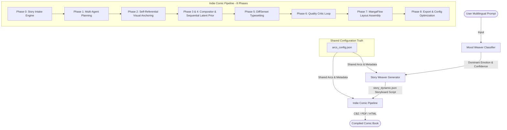

# Unified Backend Architecture Reference

> **Mood Weaver + Story Weaver + Indie Comic Pipeline Integration**

This document provides a comprehensive technical overview of the unified backend architecture combining the three primary subsystems into a seamless end-to-end comic generation pipeline:
1. **Mood Weaver**: Multilingual emotion classification (XLM-RoBERTa).
2. **Story Weaver**: Fine-tuned structured narrative script generation (Qwen/Mistral QLoRA).
3. **Indie Comic Pipeline**: Multi-phase visual rendering, attention routing, consistency anchoring, and publishing engine.

---

## 1. System Topology & Architecture

The following diagram illustrates the unified pipeline, mapping the flow from the user's initial prompt down to the compiled publication-ready comic book:



---

## 2. Component Reference

### A. Mood Weaver (Multilingual Emotion Classifier)
* **Model Foundation**: `XLM-RoBERTa-Base` fine-tuned for multilingual emotion classification.
* **Target Categories (8 Emotions)**: `sadness` (maps to `sad`), `joy` (maps to `happy`), `anger` (maps to `angry`), `fear` (maps to `anxious`), `love`, `grief`, `surprise`, and `tired`.
* **Accuracy/Performance**: ~76% evaluation accuracy across multi-lingual benchmark sets.
* **Function**: Accepts input text in multiple languages and outputs a normalized confidence array of primary and secondary emotions, somatic markers, and raw classifications.

### B. Story Weaver (Structured Script Generator)
* **Model Foundation**: Model-merged `Qwen2.5-1.5B-Instruct` + `Mistral-7B-Instruct-v0.2` utilizing QLoRA adapters fine-tuned with Unsloth.
* **Operational Modes**:
  * `generate`: Runs inference with the fine-tuned merged model to output the storyboard JSON script based on input emotion and panel count.
  * `train`: Executes Unsloth-based fine-tuning on base models with customized narrative datasets.
  * `dataset`: Assembles and saves JSONL training files from local narratives.
* **Dynamic Arc Pacing**: Translates the active emotion into a pacing layout based on 8 distinct narrative arcs (`sad`, `angry`, `tired`, `happy`, `anxious`, `grief`, `determined`, and `love`).

### C. Indie Comic Pipeline (Visual Panel Renderer & Publisher)
* **Operational Flow**: Reads a structured `story_dynamic.json` output by Story Weaver or uses its internal LLM intake to construct panel instructions.
* **Director Swarm**: Evaluates and schedules panel-by-panel generation requirements using dedicated agents (Story, Action, Dialogue, Pose, Emotion, Camera Directors).
* **Self-Referential Visual Anchoring**: Generates Panel 1 first, extracts multi-scale visual identity features (HSV color profiles, edge densities, Gram matrices, DINOv2/CLIP semantics), and caches them in the memory blackboard.
* **Denoising & Consistency**: Blends custom LoRA scaling weights dynamically per frame (`CharCom`) and routes cross-panel latent alignment priors (Gaussian Latent Smoothing and Sequential Latent Prior) across denoising steps to lock identity details.
* **Layout Engine (MangaFlow)**: Generates high-impact pane structures and typesetting bubble placements based on script dialogue and action levels.

---

## 3. Shared Configuration: `arcs_config.json`

To prevent duplication and guarantee identical narrative structures, `indie_comic_pipeline/config/arcs_config.json` acts as the shared single source of truth across all three subsystems. 

### Configuration Schema Reference
```json
{
  "version": "2.0.0",
  "mood_to_arc": {
    "sadness": {
      "arc_key": "sad",
      "journey": "uplifting",
      "description": "From heaviness toward genuine small warmth",
      "arc_beats": ["heaviness", "stillness", "faint_warmth", "tentative_light", "soft_openness", "quiet_hope"],
      "motif_hint": "something small that holds warmth (a cup, a candle, a patch of sunlight)",
      "end_note": "End with something small but genuinely warm. Not fixed. But lighter.",
      "character_archetype": "The Melancholic Poet",
      "character_traits": ["introspective", "sensitive", "observant"],
      "default_character": "Wanderer",
      "default_world": "The Abstract",
      "visual_prompt": "from heaviness toward quiet hope"
    }
    // Other emotions: joy, anger, fear, love, grief, surprise, determined
  },
  "tired": {
    "arc_key": "tired",
    "journey": "relaxing",
    "description": "From bone-deep drag toward rest",
    "arc_beats": ["drag", "surrender", "softness", "drift", "quiet_rest", "renewal"],
    "motif_hint": "something soft and horizontal (a pillow, blanket fold, evening light)",
    "end_note": "End with genuine rest. Tomorrow is not in this panel."
  },
  "character_profiles": {
    "Wanderer": {
      "description": "a young figure with hollow eyes and tired expression, wearing a worn grey coat",
      "traits": ["introspective", "sensitive", "anxious"],
      "visual_style": "muted colors, soft edges, melancholic atmosphere"
    }
  },
  "secondary_emotion_defaults": {
    "sadness":    [{"emotion": "exhaustion", "score": 0.15}, {"emotion": "longing", "score": 0.08}]
    // Defaults for anger, fear, joy, grief, love, determined, surprise
  },
  "timing_phases": {
    "4":  ["validation", "validation", "complication", "openness"]
    // Layout timing structures for panels 4 through 10
  }
}
```

### Loading Implementation
The configuration loader utilizes `utf-8-sig` encoding to handle UTF-8 Byte Order Mark (BOM) files safely across different operating systems.
```python
# python
import json
from pathlib import Path

def _load_arcs_config() -> dict:
    candidates = [
        Path("indie_comic_pipeline/config/arcs_config.json"),
        Path("Story-Weaver/arcs_config.json"),
    ]
    for p in candidates:
        if p.exists():
            with open(p, "r", encoding="utf-8-sig") as f:
                return json.load(f)
    return {}
```

---

## 4. Subsystem Data Flows

### Phase A: Input & Classification Flow
```
User Prompt (Text) 
  --> [Mood Weaver Classifier (XLM-RoBERTa)] 
  --> Primary Label ("sadness") & Confidence (0.85)
```

### Phase B: Script Generation Flow
```
Primary Label ("sadness") + Panel Count (6) 
  --> [Story Weaver Model (Qwen/Mistral SFT)]
  --> Loads "sad" Arc Beats & Motifs from arcs_config.json
  --> Generates story_dynamic.json (Story Bible, recurring_motif, panels[])
```

### Phase C: Rendering & Assembly Flow
```
story_dynamic.json
  --> [StoryIntakeEngine]
  --> [AgentCoordinator Swarm Planning] -> populates StorySectionMemory
  --> [PanelEngine Denoising Stack]
        |--> Panel 1 Base -> self-referential identity descriptors extracted
        |--> Panels 2-N -> blend descriptors + CharCom LoRA scales + latent smoothing & sequential priors
  --> [QualityCritic Check] (Retries if composite score < threshold)
  --> [MangaFlow Assembly & typesetting]
  --> Output (CBZ, HTML, PDF)
```

---

## 5. Setup & Training Guide

### fine-tuning Story Weaver
To launch PEFT/QLoRA training on your local base models:
1. Navigate to the `Story-Weaver` directory.
2. Initialize dataset construction:
   ```bash
   python stage2_story_generation.py --mode dataset
   ```
3. Run the trainer (requires `unsloth`, `trl`, and `datasets` packages):
   ```bash
   python stage2_story_generation.py --mode train --epochs 5 --model llama
   ```

### Running the Integrated Pipeline
To run the full dry-run integration:
```bash
python indie_comic_pipeline/integrated_pipeline.py --dry-run
```
To run the pipeline verification test suite:
```bash
python indie_comic_pipeline/scratch/run_unit_tests.py
```
