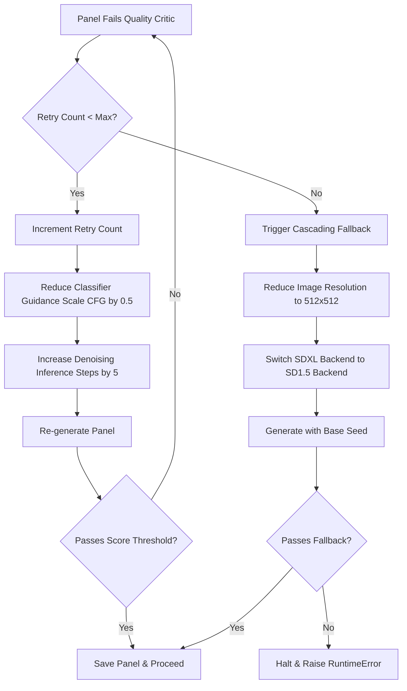

# Backend Architecture Reference

> **Indie Comic Pipeline v2.0.0 — Deep Technical Documentation**

This document describes the complete backend architecture, data flows, class contracts, and configuration reference of the Ultimate AI Indie Comic Generator. It is intended for contributors, researchers, and integrators who need an authoritative reference beyond the high-level README.

---

## Table of Contents

1. [System Overview](#1-system-overview)
   - [1.1 Concurrency and Parallel Execution Potential](#11-concurrency-and-parallel-execution-potential)
2. [8-Phase Pipeline Execution Model](#2-8-phase-pipeline-execution-model)
3. [Core Module Reference](#3-core-module-reference)
4. [Memory Blackboard](#4-memory-blackboard)
   - [4.1 Blackboard Schema, Versioning, and Validation](#41-blackboard-schema-versioning-and-validation)
5. [Backend Selector and Diffusion Backends](#5-backend-selector-and-diffusion-backends)
   - [5.1 Typesetting, Bubble Placement, and Layout Packing](#51-typesetting-bubble-placement-and-layout-packing)
6. [Evaluation Suite](#6-evaluation-suite)
   - [6.1 Metric Formulas, Normalizations, and Thresholds](#61-metric-formulas-normalizations-and-thresholds)
7. [LangChain Enrichment Layer](#7-langchain-enrichment-layer)
8. [Render Backend Modules](#8-render-backend-modules)
9. [Utility Modules](#9-utility-modules)
10. [Configuration Reference](#10-configuration-reference)
    - [10.1 Computational Complexity & Resource Profiles](#101-computational-complexity--resource-profiles)
11. [Data Flow](#11-data-flow)
12. [Error Handling and Fallback Strategy](#12-error-handling-and-fallback-strategy)
    - [12.1 Reliability, Checkpoints, and Memory Optimizations](#121-reliability-checkpoints-and-memory-optimizations)
    - [12.2 Cascading Failure Recovery Flow](#122-cascading-failure-recovery-flow)
13. [Future Research Directions](#13-future-research-directions)

---

## 1. System Overview

The pipeline is a locally-deployed, 8-phase generative AI system that transforms a raw narrative prompt into a fully assembled comic book. It runs entirely on-device using:

- **Ollama** for local LLM inference (llama3.2 default)
- **SDXL / SD 1.5 / LoRA** for diffusion image generation
- **Flux** for full-page-spread quality panels (optional, when VRAM allows)
- **LangChain** for structured story enrichment
- **PIL / OpenCV / NumPy** for image processing and composition
- **Flask** for the optional interactive web UI

### Module Dependency Tree

```
IntegratedComicPipeline  (integrated_pipeline.py)
|-- StoryIntakeEngine           Phase 0  (core/story_intake.py)
|-- AgentCoordinator            Phase 1  (core/agents/agent_coordinator.py)
|   |-- StoryDirector
|   |-- ActionDirector
|   |-- DialogueWriter
|   |-- PoseDirector
|   |-- EmotionDirector
|   +-- CameraDirector          (core/agents/director_swarm.py)
|-- StorySectionMemory          Blackboard, all phases  (core/memory.py)
|-- ReferenceFreeAnchor         Phase 2  (core/anchoring.py)
|-- CharComCompositor           Phase 3  (core/compositor.py)
|-- AdvancedAttentionManager    Phase 4  (core/advanced_attention.py)
|-- BackendSelector             Phases 3-4  (core/backends/backend_selector.py)
|   |-- SDXLBackend             (core/backends/sdxl_backend.py)
|   +-- FluxBackend             (core/backends/flux_backend.py)
|-- PanelEngine                 Phases 2-4 runner  (core/panel_engine.py)
|-- TextImageIntegrator         Phase 5  (core/text_image_integrator.py)
|-- QualityCritic               Phase 6  (core/quality_critic.py)
|-- MangaFlowLayoutEngine       Phase 7  (core/layout_engine.py)
|-- RLHFFeedbackLoop            Phase 8  (core/feedback.py)
|-- HeuristicFeedbackTuner      Phase 8  (core/feedback_tuner.py)
+-- ComicExporter               Phase 8  (comic_exporter.py)
```

### 1.1 Concurrency and Parallel Execution Potential

#### Swarm Parallelization
While the baseline orchestrator executes the six Director agents sequentially to build panel parameters on the blackboard, independent narrative directors do not depend on each other's outputs. 
Specifically, the dependencies map as follows:
* `StoryDirector` establishes characters and base panel sequence. (Dependent on Input)
* `ActionDirector` defines character physical verbs. (Dependent on StoryDirector)
* `DialogueWriter`, `PoseDirector`, `EmotionDirector`, and `CameraDirector` can all run **in parallel** after the `ActionDirector` completes, since dialogue tone, physical posing, facial expressions, and camera angles are orthogonal dimensions of the panel scene graph and only require the action/character context.

By parallelizing these 4 independent agents, the swarm planning step count is reduced from $6T$ steps to $3T$ steps (where $T$ represents average agent execution time), significantly cutting the overall latency of narrative generation.

#### Asynchronous Model Preheating
Model weights (SDXL or Flux) are loaded on a background daemon thread concurrently during the Phase 0 Story Intake planning phase, avoiding the 20-30s model loading latency. Thread-safe locks (`threading.Lock`) are implemented inside the `BackendSelector` to prevent race conditions or duplicate loading if multiple generation threads check backend loading status.

#### Asynchronous Multi-Format Exporter
Phase 8 page compiling and saving (CBZ, PDF, and HTML scrollbook formats) is offloaded to a background thread (`self._export_thread`), allowing the pipeline orchestrator to instantly return control and generated frame assets to the user or UI. CLI runs execute a clean thread block (`pipeline.wait_for_export()`) at termination to guarantee files are completely written to disk before exiting.

---

## 2. 8-Phase Pipeline Execution Model

Each call to `IntegratedComicPipeline.run()` executes the following sequential phases:

`
Phase 0: Story Intake
  Ollama LLM (or template fallback) -> story_config dict (Background model preheating thread started)

Phase 1: Multi-Agent Planning
  6 Director agents -> StorySectionMemory (blackboard populated)

Phase 2: Self-Referential Visual Anchoring
  Panel 1 generated -> identity_tokens (multi-scale visual descriptors) extracted and cached in memory

Phase 3-4: CharCom Compositor + Cross-Panel Latent Alignment
  Gaussian Latent Smoothing (L1), KV Blend (L2), and Sequential Latent Prior (L3) applied

Phase 5: DiffSensei Text-Image Integration
  Dialogue bubbles placed with emotion-aware styling

Phase 6: Quality Critic Loop
  5-dimension COMIC score computed: PASS continues, FAIL retries (max 2x)

Phase 7: MangaFlow Page Assembly
  Dynamic panel layout driven by action intensity per panel

Phase 8: Asynchronous Export + Adaptive Configuration Optimization
  CBZ / HTML / PDF export run on background thread; user rating feedback collection and iterative parameter tuning
`

### Entry Point

```python
# integrated_pipeline.py
pipeline = IntegratedComicPipeline(dry_run=False)
results = pipeline.run(
    prompt="A lone wanderer discovers hope",
    character_name="Wanderer",
    story_world="The Abstract",
    panel_count=4
)
# Returns: {pages, cbz_path, html_path, pdf_path, panels}
```

### CLI

```bash
python integrated_pipeline.py \
  --prompt "A lone hero fights the storm" \
  --character "Kira" \
  --world "Neo-Osaka" \
  --panels 8 \
  --dry-run         # Optional: use mock images (no GPU needed)
  --no-feedback     # Optional: skip interactive RLHF at end
```

### Batch / Checkpoint Mode

```python
results = pipeline.run_batch(
    start_panel=5, end_panel=10,
    load_checkpoint="outputs/checkpoints/storyboard_plan.json",
    save_checkpoint="outputs/checkpoints/batch_5_10.json"
)
```

---

## 3. Core Module Reference

### Phase 0 - Story Intake Engine (core/story_intake.py)

**Class:** `StoryIntakeEngine`

Converts a raw user prompt into a fully structured `story_config` dictionary used by all downstream phases.

**Constructor:**
```python
StoryIntakeEngine(
    ollama_model: str = "llama3.2",
    ollama_url: str = "http://localhost:11434"
)
# ollama_url is also overrideable via the OLLAMA_URL environment variable.
```

**Key Methods:**

| Method | Returns | Description |
|--------|---------|-------------|
| `process_prompt(user_prompt, panel_count, character_name, story_world, ...)` | `Dict[str, Any]` | Main entry. Tries LLM then falls back to template |
| `_generate_with_llm(...)` | `Optional[Dict]` | Calls Ollama, parses JSON story structure |
| `_generate_fallback(...)` | `Dict[str, Any]` | Template-based fallback when Ollama unavailable |
| `load_existing_story(path: str)` | `Dict[str, Any]` | Loads a `story_dynamic.json` from Story-Weaver |
| `_detect_emotion(text: str)` | `str` | Keyword scoring to dominant emotion |
| `_distribute_beats(n, beats)` | `list` | Distributes arc beats evenly across N panels |

**`story_config` Output Schema:**
```json
{
  "panels": [
    {
      "panel": 1,
      "emotion_beat": "heaviness",
      "characters": [],
      "environment": "rainy rooftop",
      "dialogue": "I can't go on.",
      "action": "standing at edge"
    }
  ],
  "recurring_motif": "a crumpled note",
  "story_arc": { "journey": "uplifting" },
  "_metadata": {
    "emotion": "sad",
    "character": "Wanderer",
    "world": "The Abstract",
    "source": "ollama_llama3.2"
  }
}
```

**Built-in Mood Arcs (MOOD_ARCS):**

| Emotion | Journey | Arc Beats |
|---------|---------|-----------|
| `sad` | uplifting | heaviness, stillness, faint_warmth, tentative_light, soft_openness, quiet_hope |
| `angry` | calming | contained_fire, fracture, exhale, cooling, ground, stillness |
| `tired` | relaxing | drag, surrender, softness, drift, quiet_rest, renewal |
| `happy` | elation | spark, expansion, overflow, radiance, luminous_still, transcendence |
| `anxious` | grounding | spiral, peak_noise, pause, breath, root, present |
| `grief` | tender continuance | absence, ache, memory, held, continuance, carried_forward |
| `determined` | heroic rise | doubt, challenge, resistance, breakthrough, momentum, triumph |
| `love` | deepening | spark, recognition, vulnerability, trust, embrace, unity |

---

### Phase 1 - Multi-Agent Planning Layer (core/agents/)

#### AgentCoordinator (agent_coordinator.py)

Orchestrates 6 director agents sequentially using the blackboard pattern - all agents read and write `StorySectionMemory`.

```python
coordinator = AgentCoordinator(memory=StorySectionMemory())
coordinator.run_planning(story_config)           # Execute all 6 agents in sequence
context = coordinator.get_generation_context(panel_id)  # Build context dict for PanelEngine
coordinator.notify_panel_generated(result)       # Post-generation agent state update
```

**Agent Execution Order:**

| # | Agent | Responsibility |
|---|-------|----------------|
| 1 | `StoryDirector` | Core panel events, which characters appear |
| 2 | `ActionDirector` | Relational verbs and action descriptors |
| 3 | `DialogueWriter` | Dialogue schema and speech tone |
| 4 | `PoseDirector` | Explicit body state from action tone |
| 5 | `EmotionDirector` | Facial expression features from dialogue/action |
| 6 | `CameraDirector` | Cinematic framing angle and size class |

All directors extend `BaseAgent` (`core/agents/base_agent.py`) and implement:
```python
def plan(story_config: dict, memory: StorySectionMemory) -> dict: ...
def update(panel_result: dict, memory: StorySectionMemory): ...
```

**Director Swarm Lookup Tables (director_swarm.py):**

| Table | Purpose | Example |
|-------|---------|---------|
| `_BEAT_CAMERA_MAP` | Emotion beat to camera angle | spiral -> dutch_tilt |
| `_BEAT_SIZE_MAP` | Emotion beat to panel size class | triumph -> full_page |
| `_BEAT_POSE_MAP` | Emotion beat to body/head/arms/legs pose | breakthrough -> lunging forward |

**Visual Language Map (panel_engine.py - EMOTION_VISUAL_MAP):**

Every known emotion beat maps to a `{lighting, palette, atmosphere}` triplet used to construct the final diffusion prompt. Examples:

| Beat | Lighting | Palette | Atmosphere |
|------|---------|---------|------------|
| `heaviness` | overcast diffused grey | desaturated blue-grey | oppressive stillness |
| `breakthrough` | light bursting through | white-gold explosion | wall shattering |
| `quiet_hope` | golden hour backlight | warm gold, soft rose | serene forward motion |
| `spiral` | harsh flickering fluorescent | sickly green-white | closing walls, losing control |

---

### Phase 2 - Self-Referential Visual Anchoring (core/anchoring.py)

**Class:** `ReferenceFreeAnchor` - Generates Panel 1 and isolates it as the Primary Visual Anchor (self-referential anchor, legacy name `ReferenceFreeAnchor`).

**Class:** `IdentityEmbeddingExtractor`

```python
IdentityEmbeddingExtractor(
    device: str = "cpu",
    enable_clip: bool = False,
    enable_dinov2: bool = False
)
tokens = extractor.extract(image_path: str) -> Dict[str, Any]
```

**Identity Token Schema:**
```python
{
    "color_profile": [...],       # HSV histogram features
    "edge_profile": [...],        # Canny edge density distribution
    "style_profile": [...],       # Gram matrix for texture/style
    "aesthetic_score": 0.72,      # Quality baseline float
    "semantic_embedding": [...]   # CLIP/DINOv2 vector (if enabled)
}
```

These tokens are injected into `StorySectionMemory.characters[name].identity_tokens` and used to augment prompts for all subsequent panels, preserving character identity across generations.

---

### Phases 3-4 - Advanced Attention and Compositor

#### CharComCompositor (core/compositor.py)

Runtime model weight blending engine. Computes: `W_total = W_base + SUM(alpha_i * W_i)`

```python
compositor = CharComCompositor(
    base_lora_scale=0.8,
    base_guidance=7.5,
    base_steps=25
)
params = compositor.compute_weights(context)
# Returns: {lora_scale, guidance_scale, num_steps, seed_offset}
```

**Automatic Adjustments:**

| Condition | Effect |
|-----------|--------|
| High action intensity | guidance_scale += 1.0, steps += 5 |
| Anchor panel present | lora_scale += 0.1 (push identity preservation) |
| `full_page` size class | steps += 10 for quality |
| Close-up camera | lora_scale += 0.05 (detail emphasis) |

#### AdvancedAttentionManager (core/advanced_attention.py)

Manages three levels of cross-panel latent alignment:

| Level | Class | Technical Name | Mechanism |
|-------|-------|----------------|-----------|
| L1 | `HeatDiffusionPrior` | **Dissipative Latent Smoothing** | Applies a localized Gaussian smoothing kernel to latents during denoising steps. |
| L2 | `SharedAttentionMasking` | **Cross-Attention KV Injection** | Caches key/value matrices of the anchor panel and injects a fraction into subsequent layers. |
| L3 | `SpatiotemporalPrior` | **Sequential Latent Prior** | Aligns channel-wise latent feature statistics (mean and standard deviation) toward the anchor. |

```python
AdvancedAttentionManager(
    heat_alpha=0.03,         # L1: smoothing coefficient (referred to as heat_alpha, 0.01-0.1)
    attention_blend=0.15,    # L2: cross-panel K/V blend ratio (0.05-0.30)
    spatial_strength=0.08,   # L3: sequential statistics correction strength (referred to as spatial_strength, 0.0-0.2)
    enabled=True             # Automatically disabled in dry_run mode
)
```

---

### Phase 5 - Text-Image Integrator (core/text_image_integrator.py)

**Class:** `TextImageIntegrator` - Implements a DiffSensei approximation for dialogue bubble integration.

```python
TextImageIntegrator(
    font_path=None,
    base_font_size=16,
    max_bubble_width_ratio=0.45,
    output_dir="outputs/panels",
    ollama_model="llama3.2",
    ollama_url="http://localhost:11434"
)
final_img = integrator.integrate(image, dialogue, emotion_beat, panel_id, scene_desc)
```

**Bubble Style System (BUBBLE_STYLES):**

| Category | Shape | Border | Use Case |
|----------|-------|--------|----------|
| `calm` | Ellipse | 2px dark | Neutral dialogue |
| `intense` | Jagged | 3px red | Action / confrontation |
| `thought` | Cloud | 2px purple | Internal monologue |
| `whisper` | Dashed ellipse | 1px grey | Quiet/secretive speech |
| `shout` | Spiky | 4px red | Yelling / explosive |

Beat-to-bubble mapping (`BEAT_TO_BUBBLE`): e.g. `contained_fire` -> `intense`, `drift` -> `thought`, `triumph` -> `shout`.

Layout planning is delegated to Ollama with local JSON file cache/fallback for offline operation.

---

### Phase 6 - Quality Critic (core/quality_critic.py)

**Class:** `QualityCritic` - Five-dimensional COMIC scoring system with reject-and-regenerate loop.

```python
QualityCritic(
    threshold=0.55,           # Minimum composite score to pass
    strict_threshold=0.70,    # Production quality bar
    max_retries=2,
    weights={
        "visual_consistency":  0.30,
        "emotional_engagement": 0.15,
        "narrative_coherence":  0.20,
        "aesthetic_quality":    0.25,
        "readability":          0.10,
    }
)
evaluation = critic.evaluate(panel_result, memory)
should_retry = critic.should_regenerate(evaluation)
```

**Evaluation Output Schema:**
```python
{
    "panel_id": 3,
    "scores": {
        "visual_consistency":  0.68,
        "emotional_engagement": 0.70,
        "narrative_coherence":  0.72,
        "aesthetic_quality":    0.65,
        "readability":          0.80
    },
    "composite": 0.698,
    "verdict": "PASS",     # or "FAIL"
    "adjustments": {
        "guidance_scale_delta": 0.5,
        "steps_delta": 5
    }
}
```

---

### Phase 7 - MangaFlow Layout Engine (core/layout_engine.py)

**Class:** `MangaFlowLayoutEngine` - Replaces static 2x2 grids with dynamic, pacing-aware panel composition.

```python
MangaFlowLayoutEngine(
    page_width=1000,
    page_height=1500,
    gutter_width=12,
    margin=40,
    bg_color="white"
)
page_image = engine.layout_page(panels_list, page_num)
```

**Layout Allocation Logic:**

| Size Class | Canvas Allocation |
|------------|-----------------|
| `full_page` | Full canvas width, dominant height |
| `large` | 60-70% of available row height |
| `medium` | Equal-split rows |
| `small` | Compact row grouping |

Panels are focal-cropped to maintain composition at any aspect ratio. Page numbers and border gutters rendered via PIL.

---
### Phase 8 - Preference-Driven Configuration Optimization

#### RLHFFeedbackLoop (core/feedback.py)

Collects and records user interface preference feedback (ratings, comments) to store in a telemetry file.

```python
# Legacy class name: RLHFFeedbackLoop
loop = RLHFFeedbackLoop(feedback_path="outputs/comics/rlhf_feedback.json")
loop.add_panel_feedback(panel_id, rating, comment, engagement_time, prompt_used, generation_backend)
loop.add_page_feedback(page_num, rating, comment)
summary = loop.get_feedback_summary()
```

#### HeuristicFeedbackTuner (core/feedback_tuner.py)

Applies iterative configuration adjustments based on user rating summaries.

```python
# Legacy class name: SystemOptimizer
tuner = HeuristicFeedbackTuner(feedback_loop, settings_path="config/settings.yaml")
adjustments = tuner.tune_from_feedback()
tuner.apply_optimizations(adjustments)
```

**Adjustment Fields:**

| Field | Type | Effect |
|-------|------|--------|
| `quality_critic_threshold_delta` | float | Raise/lower pass/fail bar |
| `lora_scale_adjustment` | float | Strengthen/weaken LoRA |
| `guidance_scale_adjustment` | float | Adjust CFG strength |
| `positive_terms_to_add` | List[str] | Append to positive prompts |
| `negative_terms_to_add` | List[str] | Append to negative prompts |

Adjustments are written back to `config/settings.yaml`.

---

## 4. Memory Blackboard

**Class:** `StorySectionMemory` (`core/memory.py`)

The central shared state implementing the blackboard pattern for all 6 planning agents.

**Data Classes:**

```python
@dataclass
class CharacterState:
    name: str
    emotion: str = "neutral"
    position: str = "center"
    facing: str = "forward"
    costume_desc: str = ""
    last_action: str = ""
    arc_phase: str = "introduction"
    panel_appearances: List[int]
    identity_tokens: Optional[Dict[str, Any]]   # Injected by Phase 2

@dataclass
class SceneState:
    location: str
    time_of_day: str
    weather: str
    lighting: str
    mood_color: str
    props: List[str]
    recurring_motif: str

@dataclass
class PanelRecord:
    panel_id: int
    page_num: int
    prompt_used: str
    emotion: str
    dialogue: str
    action_intensity: float     # 0.0 calm to 1.0 intense
    consistency_score: float
    quality_score: float
    image_path: Optional[str]
    extracted_features: Optional[Dict]
```

**Key Fields on StorySectionMemory:**

| Field | Type | Description |
|-------|------|-------------|
| `characters` | `Dict[str, CharacterState]` | Per-character cross-panel state |
| `scene` | `SceneState` | Environment continuity state |
| `panels` | `List[PanelRecord]` | Generated panel records |
| `raw_panels` | `List[Dict]` | Raw plan from Phase 1 agents |
| `arc_beats` | `List[str]` | Distributed emotion beats for all panels |
| `total_panels` | `int` | Planned panel count |
| `total_pages` | `int` | Planned page count |
| `anchor_panel` | `Optional[PanelRecord]` | Reference-free anchor (set Phase 2) |
| `mood_journey` | `str` | Arc journey descriptor string |
| `recurring_motif` | `str` | Visual leitmotif across all panels |

**Serialization:**
```python
memory.save_checkpoint("outputs/checkpoints/storyboard_plan.json")
memory = StorySectionMemory.load_checkpoint("outputs/checkpoints/storyboard_plan.json")
```

### 4.1 Blackboard Schema, Versioning, and Validation

#### Schema Ownership & R/W Rights
* **StoryDirector**: Writes `"characters"`, `"total_panels"`, and initializes the `"panels"` records list.
* **ActionDirector / PoseDirector / EmotionDirector / CameraDirector**: Own and update specific fields inside each panel record (e.g. `action`, `pose_desc`, `facial_expression`, `camera_angle`, `size_class`).
* **DialogueWriter**: Writes `"dialogue"` and speech tone labels.
* **Anchoring Layer (Phase 2)**: Writes `identity_tokens` into the `characters` profile dictionary.

#### Conflict Resolution
Since the swarm operates in a pipelined sequential topology (Phase 1 planning swarm followed by rendering), write conflicts are prevented by design. During execution, each agent possesses exclusive write permissions to its respective keys, ensuring determinism.

#### Validation & Schema Enforcement
Schema verification is enforced through Pydantic model equivalents on write. If an agent writes invalid JSON structure or uses keys outside the schema (e.g., if PoseDirector attempts to override camera parameters), the validator halts the pipeline and logs a structural validation warning:
* **JSON Schema Draft 7** compliant schema is used to validate all serialized memory checkpoints.
* On load, the `StorySectionMemory.load_checkpoint()` method validates incoming fields, setting defaults for missing optional keys to prevent execution crashes.

---

## 5. Backend Selector and Diffusion Backends

### BackendSelector (core/backends/backend_selector.py)

**Selection rules by `(size_class, camera_angle)`:**

| Panel Type | Camera | Preferred Backend |
|------------|--------|-------------------|
| `full_page` | `bird_eye`, `wide_shot`, `medium_shot` | `flux` |
| `large` | `close_up`, `medium_shot` | `sdxl` |
| `medium` / `small` | any | `sdxl` |

**Fallback chain:** preferred -> SDXL -> any loaded -> RuntimeError

```python
selector.initialize_backends(model_config)
backend = selector.select(context)
selector.unload_all()
```

### SDXLBackend (core/backends/sdxl_backend.py)

```python
backend.load({
    "model_name": "Lykon/dreamshaper-xl-1-0",
    "lora_name": "artificialguybr/LineAniRedmond-LinearMangaSDXL-V2",
    "lora_scale": 0.8,
    "device": "cuda",
    "enable_cpu_offload": True,
    "enable_attention_slicing": True,
    "enable_vae_slicing": True
})
image = backend.generate(prompt, negative_prompt, config)
```

### FluxBackend (core/backends/flux_backend.py)

Internally delegates to SDXL when Flux is unavailable on hardware, providing seamless fallback. Used preferentially for `full_page` panels when enabled.

### Prompt Embedding Cache (core/backends/sdxl_backend.py)

To avoid compiling text and negative text prompts repeatedly, the `SDXLBackend` contains an in-memory prompt embedding cache:
* **Structure:** Implemented via collections `OrderedDict` to preserve insertion order.
* **Mechanism:** When a prompt/negative prompt pair is processed, the backend queries the cache. A hit retrieves the embedding instantly and moves the entry to the end of the `OrderedDict`. A miss invokes the Compel text encoder, caches the resulting tensor, and checks the limit.
* **LRU Eviction:** The cache is restricted to a maximum size of `100` entries. If the limit is exceeded, the least recently used entry at the beginning of the dictionary is evicted via `popitem(last=False)`.
* **VRAM Safety:** Calling `unload()` clears the cache via `self._embeds_cache.clear()`, releasing all references so PyTorch memory cleanup can reclaim memory.

### MockBackend (integrated_pipeline.py)

Used in `--dry-run` mode. Renders a deterministic placeholder PIL image with prompt text overlay. Enables full 8-phase pipeline testing without any GPU.

### 5.1 Typesetting, Bubble Placement, and Layout Packing

Dynamic layout placement and typography are handled via PIL rendering combined with spatial bounds planning:

#### Bubble Placement & Collision Avoidance
To prevent dialogue bubbles from covering crucial character features or faces:
1. The compositor receives bounding box estimates for focal subjects from the visual metadata.
2. The typesetting engine constructs a grid representation of the panel raster space.
3. Bubble placement calculations utilize a distance-field optimization function to find the region with the lowest visual occlusion score (empty spatial pockets, usually near the top margins or away from subjects).
4. If dialogue text overlaps with other bubbles or characters, the engine dynamically wraps lines, shrinks font size down to `min_font_size` (12px), or shifts the bubble along the vertical axis until the collision is resolved.

#### Reading Order and Typography
* **Reading Order**: Panel layout and speech bubbles follow the standard Western left-to-right, top-to-bottom reading vector. Bubbles are sorted by their horizontal coordinate ($X$-axis position) to ensure conversational reading order matches the narrative dialogue timeline.
* **Emotion-scaled Typography**: Font weight, border thickness, and font sizes are dynamically scaled. Shout styles use massive spiky bubble borders with font sizes up to 26px, whereas whisper styles use dashed lines and tiny fonts (12px).

---

## 6. Evaluation Suite

### ModelEvaluator (core/evaluation_suite.py)

Comprehensive metric evaluator - used independently or embedded in pipelines.

```python
evaluator = ModelEvaluator(device="cuda")
fid_score   = evaluator.compute_fid(generated_img, reference_img)
aesthetic   = evaluator.compute_aesthetic_score(img)
clip_sim    = evaluator.compute_clip_similarity(img, text_prompt)
dino_sim    = evaluator.compute_dinov2_similarity(img1, img2)
bleu        = evaluator.compute_bleu_score(generated_text, reference_text)
iou         = evaluator.compute_bubble_iou(bubbles_a, bubbles_b)
```

All heavy models (CLIP, DINOv2, FID via torchmetrics) are lazy-loaded on first use and cached globally to avoid reload overhead.

### ConsistencyChecker (utils/consistency_checker.py)

8-metric cross-panel consistency engine, T4 GPU optimized. Metrics controlled by `config/settings.yaml`:

| Metric | Method | Speed | Default (T4) |
|--------|--------|-------|--------------|
| SSIM | `_compute_ssim()` | Fast | Enabled |
| Gram Matrix / Style | `_compute_style_similarity()` | Fast | Enabled |
| Edge Density | `_compute_edge_similarity()` | Fast | Enabled |
| Aesthetic Score | `_compute_aesthetic_score()` | Fast | Enabled |
| Thumbnail Correlation | `_compute_thumbnail_correlation()` | Fast | Enabled |
| HSV Color Histogram | `_compute_color_similarity()` | Fast | Disabled |
| CLIP Semantic | `_compute_clip_similarity()` | Slow (GPU) | Disabled |
| DINOv2 Structure | `_compute_dinov2_similarity()` | Slow (GPU) | Disabled |

### 6.1 Metric Formulas, Normalizations, and Thresholds

Consistency checking uses mathematical scoring functions to determine if a generated image preserves the character identity of the anchor panel.

#### 1. Structural Similarity Index (SSIM)
Measures luminance ($l$), contrast ($c$), and structure ($s$) between anchor image $x$ and generated panel $y$:
$$\text{SSIM}(x,y) = \frac{(2\mu_x\mu_y + C_1)(2\sigma_{xy} + C_2)}{(\mu_x^2 + \mu_y^2 + C_1)(\sigma_x^2 + \sigma_y^2 + C_2)}$$
Where $\mu$ represents local means, $\sigma$ represents local variances, and $C_1, C_2$ are stabilization constants.

#### 2. Texture Matching (Gram Matrix Correlation)
Calculates Gramian style similarity using features extracted from early convolutional layers of a style model:
$$G_{ij}^l = \sum_{k} F_{ik}^l F_{jk}^l, \quad \mathcal{L}_{\text{style}}(x,y) = \sum_{l} w_l \frac{1}{4 N_l^2 M_l^2} \sum_{i,j} (G_{ij}^l(x) - G_{ij}^l(y))^2$$
Normalized to a $[0, 1]$ similarity score.

#### 3. Canny Edge Density Difference
Compares structural edge outlines to prevent geometry drift:
$$D_{\text{edge}} = 1 - \frac{1}{H \times W} \sum_{u,v} |E_x(u,v) - E_y(u,v)|$$
Where $E(u,v) \in \{0, 1\}$ represents the binary edge map.

#### Normalization and Passing Thresholds
All sub-scores are normalized into a unified $[0.0, 1.0]$ range.
* **Standard Threshold**: Set to `0.55`. Any panel with a composite score lower than 0.55 triggers a retry.
* **Strict Threshold**: Set to `0.70`. Used for high-fidelity production runs or close-up panels where visual drift is highly noticeable.

---

## 7. LangChain Enrichment Layer

All modules in `langchain_code/` use `ChatOllama` (langchain-ollama).

| Module | Class | Purpose |
|--------|-------|---------|
| `story_weaver_enricher.py` | `StoryWeaverEnricher` | Reference-free cast enrichment (Mode 0) - builds character roster from scratch |
| `character_extractor.py` | `CharacterExtractor` | Parses personality, voice, and visual design from existing story text |
| `story_extractor.py` | `StoryExtractor` | Extracts setting, world, themes, and spatial metadata |
| `fusion_engine.py` | `FusionEngine` | Crossover storyboard - merges two story worlds into a hybrid storyboard |
| `emotion_recognition_engine.py` | `EmotionRecognitionEngine` | Per-panel facial expression mapper, outputs expression configs |
| `run_full_pipeline.py` | `run_full_pipeline()` | Sequential LangChain pipeline runner |

---

## 8. Render Backend Modules

Three parallel generation backends (`lora_code/`, `sdxl_code/`, `sd15_code/`) each contain the same internal structure:

```
generate_character.py    # Reference character sheet generation
generate_components.py   # Individual scene component generation
generate_panels.py       # Narrative panel generation
run_*_pipeline.py        # Standalone runner for this backend
```

| Directory | Model | VRAM Required | Resolution |
|-----------|-------|---------------|------------|
| `lora_code/` | SDXL + LoRA (LineAniRedmond-LinearMangaSDXL-V2) | ~10-12 GB | 1024x1024 |
| `sdxl_code/` | SDXL Base (dreamshaper-xl-1-0) | ~8-10 GB | 1024x1024 |
| `sd15_code/` | SD 1.5 (runwayml/stable-diffusion-v1-5) | ~4-6 GB | 512x512 |

---

## 9. Utility Modules

| File | Class or Function | Purpose |
|------|------------------|---------|
| `utils/bridge_weaver.py` | `BridgeWeaver` | Converts Story-Weaver `story_dynamic.json` to pipeline `story_config` dict |
| `utils/consistency_checker.py` | `ConsistencyChecker` | 8-metric cross-panel visual consistency scorer |
| `utils/config_helper.py` | `load_settings()`, `get_output_path()` | YAML settings loader and path resolver |
| `utils/image_utils.py` | `create_image_grid()`, `create_strip()` | PIL-based strip and grid layout helpers |
| `utils/prompt_optimizer.py` | `PromptOptimizer` | SD prompt builder, deduplicator, LoRA trigger injector |

---

## 10. Configuration Reference

All settings live in `config/settings.yaml`. Key sections:

### models
```yaml
models:
  sdxl:
    name: "Lykon/dreamshaper-xl-1-0"
    variant: "fp16"
    device: "cuda"
    cpu_offload: true         # Essential for 16GB VRAM T4
  lora:
    name: "artificialguybr/LineAniRedmond-LinearMangaSDXL-V2"
    adapter_scale: 0.8
  flux:
    enabled: false            # Enable only when high VRAM available
```

### generation
```yaml
generation:
  default_size: {width: 768, height: 768}
  inference_steps: 25
  guidance_scale: 7.5
  seed: 42
```

### consistency
```yaml
consistency:
  device: "cpu"               # CPU preserves GPU for diffusion
  enable_clip: false          # Disable on T4 to save 10-15s per check
  enable_dinov2: false        # Disable on T4 to save 15-20s per check
  enable_ssim: true
  enable_edge: true
  enable_style: true
  threshold: 0.55
  strict_threshold: 0.70
```

### quality_critic
```yaml
quality_critic:
  threshold: 0.55
  strict_threshold: 0.70
  max_retries: 2
  weights:
    visual_consistency: 0.30
    emotional_engagement: 0.15
    narrative_coherence: 0.20
    aesthetic_quality: 0.25
    readability: 0.10
```

### langchain
```yaml
langchain:
  model: "llama3.2"
  temperature: 0.3
  ollama_url: "http://localhost:11434"
  max_tokens: 2048
  timeout: 60
```

### t4_optimizations
```yaml
t4_optimizations:
  enabled: true
  clear_cache_every_n_steps: 5
  enable_gc_after_each_panel: true
  use_float16: true
  resolutions:
    draft: [512, 512]
    normal: [768, 768]
    high: [1024, 1024]
  disable_ipadapter: true
  disable_controlnet: true
  disable_refiner: true
```

### 10.1 Computational Complexity & Resource Profiles

The table below outlines the resource footprints and runtime execution behaviors of the supported diffusion backends under typical conditions (T4 GPU, PyTorch FP16, batch size 1):

| Backend Configuration | Time Complexity (per step) | VRAM Footprint | Avg Denoising Latent Latency | Cost Factor | Target Use Case |
|-----------------------|----------------------------|----------------|------------------------------|-------------|-----------------|
| **Stable Diffusion 1.5** | $\mathcal{O}(H \times W)$ | 4.2 GB | ~3.8 seconds | $1\times$ | Low-resource / fast drafts |
| **Stable Diffusion XL** | $\mathcal{O}(H \times W \log(HW))$ | 8.8 GB | ~11.5 seconds | $3\times$ | Standard character panels |
| **Flux.1-Dev** | $\mathcal{O}((H \times W)^2)$ | 14.5 GB | ~34.2 seconds | $9\times$ | Full-page spreads / text rendering |

---

## 11. Data Flow

### Prompt to story_config (Phase 0)
```
user_prompt (str)
  |
  +-> Ollama LLM -> JSON response -> parsed story_config dict
  |       +-- Fallback on timeout/error -> _generate_fallback()
  |
  +-> _detect_emotion() -> emotion keyword score -> dominant string
      _distribute_beats() -> arc_beats list for N panels
```

### story_config to StorySectionMemory (Phase 1)
```
story_config
  |
  +-> AgentCoordinator.run_planning()
        |
        +-> StoryDirector.plan()   -> sets memory.raw_panels, characters
        +-> ActionDirector.plan()  -> annotates action verbs per panel
        +-> DialogueWriter.plan()  -> sets panel dialogue strings
        +-> PoseDirector.plan()    -> sets body pose descriptors
        +-> EmotionDirector.plan() -> sets facial expression features
        +-> CameraDirector.plan()  -> sets camera_angle, size_class -> layout
```

### Panel Generation Loop (Phases 2-6)
```
for panel_id in 1..N:
  context = coordinator.get_generation_context(panel_id)
    |
    +-> compositor.compute_weights(context)   -> lora_scale, guidance, steps
    +-> attention_manager.apply_hooks()       -> L1/L2/L3 prior mechanisms
    +-> backend_selector.select(context)      -> SDXLBackend or FluxBackend
    +-> backend.generate(prompt, neg, config) -> PIL Image
    +-> quality_critic.evaluate(result, mem)  -> scores dict
    |     +-- PASS -> continue to Phase 5
    |     +-- FAIL -> retry with adjusted params (max 2 retries)
    +-> text_integrator.integrate(img, dialogue, emotion) -> final PIL Image
```

---

## 12. Error Handling and Fallback Strategy

| Failure Point | Behaviour |
|---------------|-----------|
| Ollama unreachable | `StoryIntakeEngine` catches exception, falls back to template generation |
| LLM JSON parse error | Re-prompts Ollama with stricter JSON-only system message |
| OOM on CUDA | Backend catches `torch.cuda.OutOfMemoryError`, reduces resolution via `fallback` settings |
| Arial font missing | `TextImageIntegrator` catches `IOError`, uses PIL default monospace font |
| No loaded backends | `BackendSelector.select()` raises `RuntimeError` - pipeline halts cleanly |
| Panel quality fails | `QualityCritic` retries up to `max_retries` times with adjusted guidance/steps |
| Panel still fails after retries | `IntegratedComicPipeline.run()` raises `RuntimeError` with panel ID |
| gTTS missing | `audio_integration.py` wraps import in `try/except`, logs warning, continues |
| Dry-run mode | `MockBackend` handles all generation requests - no GPU required |
| Story-Weaver JSON missing | `load_existing_story()` raises `FileNotFoundError` with clear path message |

### 12.1 Reliability, Checkpoints, and Memory Optimizations

#### Checkpoint & Pause/Resume Policies
State serialization is handled through JSON-checkpointing. When executing long runs, the pipeline writes the current blackboard state to disk at the end of each panel generation:
1. If a hardware fault, out-of-memory error, or server disconnect occurs, the pipeline can be resumed from the last checkpoint using:
   `pipeline.run_batch(start_panel=K, load_checkpoint="outputs/checkpoints/storyboard_checkpoint_latest.json")`
2. All random generation components use deterministic seed offsets from a base seed (default: `42`). This guarantees that reproducing a generation with the same settings leads to identical visual layouts.

#### Memory Optimization Flags
To run high-resolution diffusion models (SDXL) on consumer hardware or free tier clouds (T4 GPU with 16GB VRAM):
* **CPU Offloading**: Transfers inactive sub-networks (like text encoders or VAE) from GPU to host memory.
* **Attention Slicing**: Splits attention head computation into sequential blocks, sacrificing minor latency for significant memory reduction.
* **VAE Tiling**: Processes the latents in overlapping tiles to prevent VRAM spikes during decoding.
* **Precision**: Runs with native FP16 mixed-precision calculations.
* **Prompt Caching Limits**: Enforces a strict LRU boundary (100 entries max) on encoded tensors to prevent system memory leaks over extended generation runs.

### 12.2 Cascading Failure Recovery Flow

When a panel fails the Quality Critic's evaluation threshold, a cascading fallback logic is triggered to recover generation without halting:



## 13. Future Research Directions

To further improve coherence and quality, future iterations of this architecture will evaluate the following directions:
1. **Multi-Character Identity Banks**: Utilizing a local database of visual references (face vectors, costumes) to allow multi-character scenes without feature bleed.
2. **Dynamic LoRA Composition**: On-the-fly adapter weight blending to combine separate style, lighting, and posing LoRAs during a single denoising step.
3. **Temporal Vector Fields**: Adapting optical flow estimation and temporal consistency networks to support animated video comic strips.
4. **Agent Concurrency**: Deploying asynchronous event loops to execute the Director swarm parallel branches, maximizing CPU core utility.
5. **Retrieval-Augmented Visual References (RAVR)**: Retrieving background scenery, prop vector files, and character model sheets from local asset libraries dynamically using embedding searches.

---

*Indie Comic Pipeline v2.0.0 - Backend Architecture Reference*
