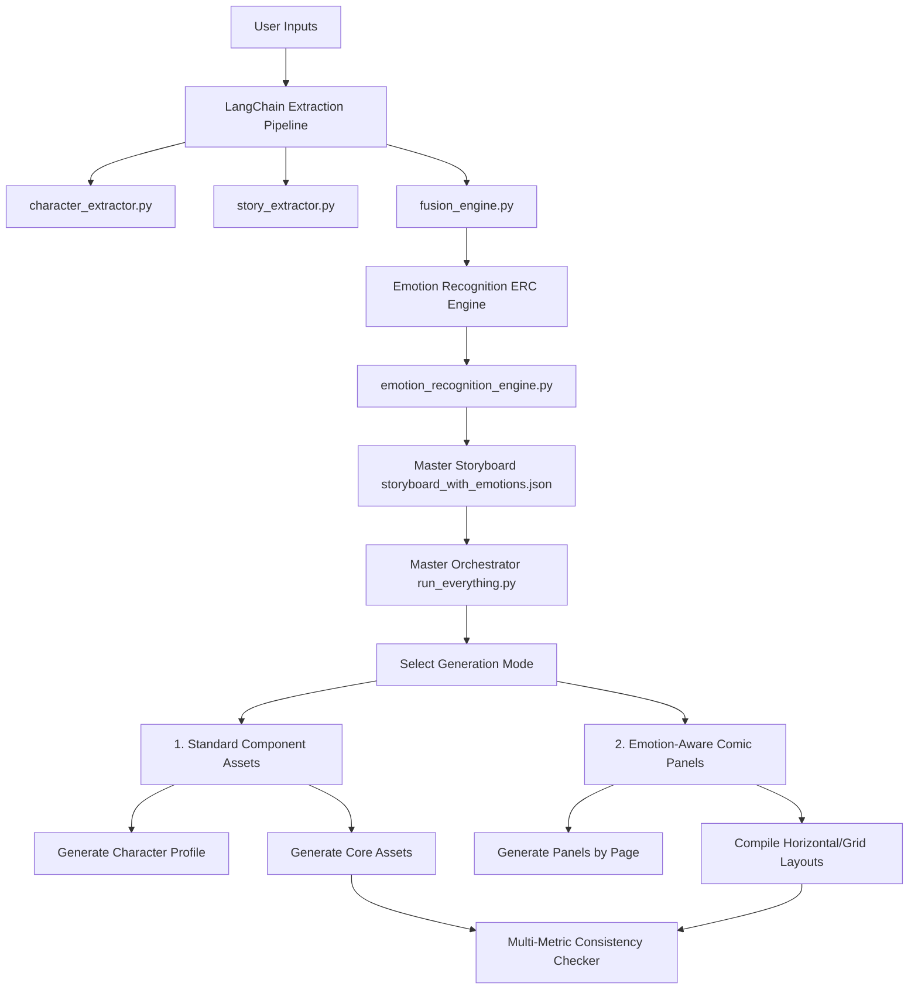
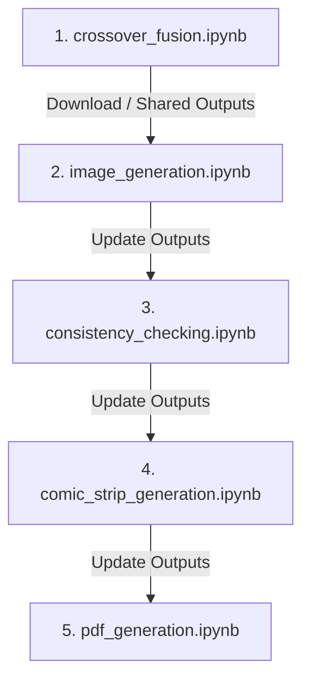

# Local AI Indie Comic Generator Pipeline with Emotion Recognition

A local, multi-modal generative AI pipeline that takes a character name and a setting name, extracts character personality and story parameters using a local LLM, maps dialogue emotions to visual expressions, and renders consistent indie-comic-style panel layouts using Stable Diffusion XL (SDXL) and Stable Diffusion v1.5.

---

## 🎨 System Architecture



---

## 📘 Comprehensive Architecture Breakdown

This pipeline is split into distinct functional phases. Below is a detailed breakdown of each script/module, explaining **why** it was utilized, **how** it operates, and the mathematical or system design principles backing it.

---

### 1. LangChain Extraction Phase
Located in the [langchain_code](file:///c:/Users/Dell/Downloads/drid/indie_comic_pipeline/langchain_code/) folder:

#### A. Character Personality Extractor (`character_extractor.py`)
* **Why Utilized:** Zero-shot Stable Diffusion runs often result in generic characters without unique behaviors, traits, or emotional cues. To fix this, we need structured character data (e.g. traits, values, catchphrases) to guide the story setting and subsequent panel details.
* **How It Is Used:** Uses ChatOllama loaded with `llama3.2` to prompt the local LLM. It forces the output into a strict JSON schema (representing traits, values, motivations, flaws) using Regex parsing to find the JSON block. This outputs a structured `character_personality.json` file.

#### B. Story Setting Extractor (`story_extractor.py`)
* **Why Utilized:** Visual consistency in comics requires matching backgrounds, specific lighting setups, and consistent color palettes (e.g. neon shades for cyberpunk or sepia for noir).
* **How It Is Used:** Queries Llama 3.2 to extract the environment settings (lighting, era, weather, mood, signature colors). The output is structured and saved in `story_setting.json`.

#### C. Crossover Fusion & Storyboarder (`fusion_engine.py`)
* **Why Utilized:** This is the visual director of the pipeline. It merges the character's core personality with the story setting, designs the character's clothing adaptively (e.g. Spider-Man wearing a high-collar neon-accented coat in a cyberpunk world), and drafts a detailed 10-page storyboard script.
* **How It Is Used:** The LLM receives the outputs from the previous two steps and drafts:
  1. The character's adjusted visual look matching the world style.
  2. A 10-page storyboard containing the locations, active character states, dialogues, and panel breakdowns.
  3. Four core story components/assets (main character pose, extra character, empty environment, and key prop) with specific SDXL-optimized prompts.
  Outputs are saved to `fusion_complete.json` and `sdxl_prompt.json`.

---

### 2. Dialogue Emotion Recognition (ERC) Engine
Script: [emotion_recognition_engine.py](file:///c:/Users/Dell/Downloads/drid/indie_comic_pipeline/langchain_code/emotion_recognition_engine.py)

* **Why Utilized:** Without this engine, generating comic panels directly from the storyboard script results in characters with static, blank expressions. To make the comic highly dramatic and aligned with its genre (e.g. funny, gothic, tragic, heroic), we must analyze the emotional progression of all characters and translate their dynamic states into physical, drawable facial descriptions (e.g., "brows deeply furrowed, teeth gritted in determination").
* **How It Is Used:**
  * It loads the completed storyboard script (`fusion_complete.json`).
  * **Chronological Scene Emotion Tracking (Temporal Coherence):** Loops through every panel of each page and maintains a chronological running history of the characters' previous emotional states. This history context is fed back into the prompt template (`{history_context}`), ensuring that the LLM tracks progressive shifts and escalations in emotion intensity (e.g. dialogue moving from low sadness to intense grief).
  * **Multi-Character Analysis:** Analyzes the tone, mood, and expressions of **all active characters** present in the panel (not just the protagonist), capturing their individual expression shifts.
  * **Robust JSON Auto-Closing & Repair Engine:** Local LLMs like Llama 3.2 often output truncated or trailing-comma-corrupted JSON payloads due to token limit constraints. To guarantee a **100% parse success rate**, the engine parses the response starting from the first `{`, walks the characters, manages open braces/brackets/quotes, strips dangling key-values/commas, and closes unclosed strings/structures automatically. It also runs Python's `ast.literal_eval` as a fallback if standard `json.loads` fails.
  * **Expression Mapping:** Generates expression trigger phrases and appends them to core visual prompt templates, saving the final layout directives to `storyboard_with_emotions.json`.

---

### 3. Model Generation Configurations
Comic frames can be rendered using five distinct configurations, located across three script zones:
1. **Stable Diffusion v1.5 Base (`sd15_code`):** Running runwayml Stable Diffusion v1.5 to output 512x512 grids. Used for lightweight, high-speed drafts.
2. **SD 1.5 + LoRA (`sd15_code`):** Loads SD 1.5 and tries to load LoRA styling weights. A custom error handling fallback ensures that if SDXL-specific LoRAs are passed, the pipeline falls back gracefully to base generation using prompt-based trigger keywords (`LineAniAF, lineart`).
3. **Stable Diffusion XL Base (`sdxl_code`):** Generates high-resolution 1024x1024 frames. Utilizes SDXL's larger CLIP encoder structures (CLIP ViT-L + openCLIP ViT-bigG) for better text-to-image prompt adherence.
4. **Only LoRA (SDXL + LoRA, trigger words only):** Evaluates how much the LoRA adapter changes the style without positive style descriptors, using only the core subject prompt + trigger words (`LineAniAF, lineart`).
5. **SDXL + LoRA with Style Prompts (`lora_code`):** The recommended high-end configuration. It combines the style-anchoring Lineart LoRA (`LineAniRedmond-LinearMangaSDXL-V2`) with target positive comic prompts to generate flat-colored, cel-shaded line art, completely avoiding photorealistic depth or gradients.

#### Folder Mapping:
* **[sdxl_code/](file:///c:/Users/Dell/Downloads/drid/indie_comic_pipeline/sdxl_code/):** Scripts for base SDXL model generation.
* **[sd15_code/](file:///c:/Users/Dell/Downloads/drid/indie_comic_pipeline/sd15_code/):** Scripts for base Stable Diffusion 1.5 and SD 1.5 + LoRA model generation.
* **[lora_code/](file:///c:/Users/Dell/Downloads/drid/indie_comic_pipeline/lora_code/):** Scripts for SDXL + LoRA manga styling model generation.
* **[matrix_evaluation_zone/](file:///c:/Users/Dell/Downloads/drid/indie_comic_pipeline/matrix_evaluation_zone/):** Comparison benchmark script evaluating all 5 configurations.

Each generation directory contains:
* `generate_character.py`: Renders the high-quality character reference sheet (anchor).
* `generate_components.py`: Renders visual assets (secondary character, empty scene, key prop).
* `generate_panels.py`: Renders individual panels for a selected page (1-10) using emotion prompts, compiling horizontal layouts and dynamic grid sheets.

---

### 4. Advanced Multi-Metric Consistency Suite
Module: [consistency_checker.py](file:///c:/Users/Dell/Downloads/drid/indie_comic_pipeline/utils/consistency_checker.py)

* **Why Utilized:** Standard pixel-by-pixel comparisons (MSE) fail when a character changes poses or angles. We need a holistic suite of metrics assessing color, structure, style, and semantic meaning.
* **How It Is Used:** It compares generated panels against a reference character profile using eight specific mathematical and neural techniques:

1. **Color Consistency (HSV correlation - Optional, Disabled by Default):** 
   * **Formula/Code:** Converts images to HSV space, calculates a 2D color histogram on Hue and Saturation (`cv2.calcHist([hsv], [0, 1]...)`), and computes correlation distance.
   * **Utility:** Verifies color stability (can be toggled in settings, but is bypassed by default to prioritize pure art style evaluation).
2. **SSIM (Structural Similarity Index):**
   * **Formula/Code:** Uses `scikit-image`'s structural similarity metric (luminance, contrast, and structure comparison) or a custom NumPy/OpenCV Gaussian fallback:
     $$SSIM(x,y) = \frac{(2\mu_x\mu_y + C_1)(2\sigma_{xy} + C_2)}{(\mu_x^2 + \mu_y^2 + C_1)(\sigma_x^2 + \sigma_y^2 + C_2)}$$
   * **Utility:** Evaluates visual layout and structural integrity to check design stability.
3. **Canny Edge Density Similarity:**
   * **Formula/Code:** Applies Canny Edge detection (`cv2.Canny`), computes the percentage of active edge pixels to total pixels, and compares edge density levels:
     $$Density = \frac{\sum(\text{Edges} > 0)}{\text{Total Pixels}}$$
   * **Utility:** Verifies that the drawing outline and stroke density match the reference style.
4. **Art Style Gram Matrix Similarity:**
   * **Formula/Code:** Resize\= image to $256 \times 256$, extracts BGR color channels along with Sobel horizontal and vertical gradients, reshapes to a 5-channel feature matrix $F$, and computes the Gram Matrix representing style textures:
     $$G = F^T F / (H \times W)$$
   * **Utility:** Models the spatial texture and color patterns, reflecting drawing style consistency.
5. **CLIP Image Cosine Similarity (Semantic):**
   * **Formula/Code:** Uses a local CLIP Image Encoder (`openai/clip-vit-base-patch32`) to extract normalized 512-dimensional semantic embeddings and computes cosine similarity:
     $$\text{Similarity} = \frac{A \cdot B}{\|A\| \|B\|}$$
   * **Utility:** Operates as a semantic validator, verifying that the actual character remains Peter Parker / Spider-Man.
6. **DINOv2 Feature Similarity:**
   * **Formula/Code:** Dynamically imports Meta's self-supervised `facebook/dinov2-base` model via HuggingFace transformers, extracts global pooled class embeddings from target images, and computes cosine similarity.
   * **Utility:** Serves as a high-fidelity spatial visual structure alignment metric to check character features.
7. **Offline Aesthetic Score:**
   * **Formula/Code:** Combines laplacian variance (sharpness), standard deviation (contrast), and the Hasler-Suesstrunk metric (colorfulness).
   * **Utility:** Gauges aesthetic quality locally without calling external APIs.
8. **Grayscale Composition (Legacy structure):**
   * **Formula/Code:** Resizes grayscale thumbnails to $128 \times 128$ and calculates correlation coefficient.

* **Dynamic Scoring Weights:** The overall consistency score combines the metrics dynamically. By default, with color checks disabled and without heavy models, weights are: 46.1% SSIM, 30.8% Style Gram Matrix, and 23.1% Edge Density. If color checks are enabled, weight is 25% HSV Color. If CLIP (10%) and DINOv2 (10%) are enabled, the weights shift dynamically to incorporate semantic and deep structural similarity checks.

---

### 5. Evaluation Matrix Benchmarking
Script: [model_matrix_bench.py](file:///c:/Users/Dell/Downloads/drid/indie_comic_pipeline/matrix_evaluation_zone/model_matrix_bench.py)

* **Why Utilized:** Quantitative measurements are required to assess performance trade-offs (inference speed, memory constraints, and output quality) across all 5 configurations.
* **How It Is Used:** Runs the identical prompt under each configuration and computes:
  * **CLIP Text Score:** Text-to-image alignment cosine similarity.
  * **FID Score (Frechet Inception Distance):** Measures the distance between feature vectors of real (reference) and generated images.
  * **Inference Time:** In seconds.
  * **Peak VRAM:** Measures GPU memory allocation using `torch.cuda.max_memory_allocated()`.
  * **Edge Density:** Line-art details check.
  * **Safe Resource Release:** Addressed VRAM leakages by issuing `del pipe`, `torch.cuda.empty_cache()`, and python garbage collection (`gc.collect()`) after evaluating each pipeline model, preventing Out-Of-Memory (OOM) crashes.
  Outputs a comparison matrix table to the console.

---

### 6. Unified Master Orchestrator
Script: [run_everything.py](file:///c:/Users/Dell/Downloads/drid/indie_comic_pipeline/run_everything.py)

* **Why Utilized:** Manually running multiple terminal commands in specific order is error-prone. This script unifies everything.
* **How It Is Used:** Executes LangChain extraction, launches the ERC engine, runs environment memory checks, and prompts the user to select between:
  * **Mode 1: Standard Component Assets** (Renders character reference, secondary character, environment, and key prop).
  * **Mode 2: Emotion-Aware Comic Panels** (Renders page-by-page individual panels and dynamic grid layouts for page numbers 1-10).
  And allows selecting which model configuration to use (SDXL Base, SD 1.5, or SDXL + LoRA).

---

### 7. Google Colab Notebook Generation
Script: [create_colab_notebook.py](file:///c:/Users/Dell/Downloads/drid/indie_comic_pipeline/create_colab_notebook.py)

* **Why Utilized:** Running local SDXL on a consumer CPU can take up to 2 hours per image. Running on a free Colab GPU runtime takes 5–10 seconds.
* **How It Is Used:** Programmatically generates `indie_comic_pipeline.ipynb` containing cell configs to:
  * Install dependencies (including `scikit-image` for SSIM).
  * Launch Ollama serve daemon in the background and pull `llama3.2`.
  * Run extraction, ERC engine, panel generations, and model benchmarking.
  * Visualize generated panels and grids using IPython displays.

---

## 📝 Storyboard & Prompt Synthesis Crossover Example

To demonstrate how the parameters are fused and mapped to visual prompts, here is an example execution trace for **Spider-Man** in the **Cyberpunk 2077** universe:

### 1. Extracted Parameters (Psychological + Environment)
* **Character (Spider-Man)**: Altruistic, hides extreme anxiety behind quick-witted banter (`nature`), and is transforming guilt into service of others (`arc_turn`).
* **Setting (Cyberpunk 2077)**: Rain-slicked streets, towering dark skyscrapers, corporate neon signs (`environment_description`). Vibes: High-tech, low-life, corporate oppression.

### 2. Storyboard Page Breakdown (Page 1, Panel 1)
```json
{
  "page_number": 1,
  "location": "Rain-slicked neon street, Night City",
  "panels_breakdown": [
    "Panel 1: Spider-Man stands on a fire escape, looking down at a crowded corporate square. He is shivering under a high-tech coat but his mask eye-lenses are narrowed in focus. Dialogue: 'Uncle Ben... this city is darker than New York, but the duty is the same.'"
  ],
  "scene_settlement": "Spider-Man wearing a high-collared deep crimson jacket over a dark blue bodysuit, steam rising from street vents below, colossal holographic advertisements looming in the background",
  "character_expressions": "shoulders hunched, head tilted down, white mask eye-lenses narrowed in pensive contemplation"
}
```

### 3. Emotion Recognition & Expression Mapping (ERC Output)
The ERC engine runs Llama 3.2 to parse the panel dialogue and action, outputting:
* **Active Character**: `Spider-Man`
* **Detected Emotion**: `sad / persistent (high intensity)`
* **Facial Expression Trigger**: `"eyes narrowed in grief, head slightly bowed, shoulders hunched forward against the cold wind"`
* **Core Action**: `Spider-Man standing still on a metallic fire escape looking down`
* **Background Env**: `rain-slicked streets of Night City with towering neon skyscrapers`

### 4. Synthesized Visual Prompt Passed to Generation Pipeline + IP-Adapter
```text
indie comic style illustration, clean minimalist line art, flat color palette, crisp continuous outlines, cel-shaded with no gradients, Spider-Man standing still on a metallic fire escape looking down, consistent Spider-Man, Spider-Man in adapted clothing matching the High-tech, low-life, gritty noir, corporate oppression, eyes narrowed in grief, head slightly bowed, shoulders hunched forward against the cold wind, shoulders hunched, head tilted down, white mask eye-lenses narrowed in pensive contemplation, in rain-slicked streets of Night City with towering neon skyscrapers, Spider-Man wearing a high-collared deep crimson jacket over a dark blue bodysuit, steam rising from street vents below, colossal holographic advertisements looming in the background, dramatic noir lighting, foggy overcast
```

Depending on the configuration selected by the orchestrator:
* **SDXL Base or SDXL + LoRA**: Renders at `1024x1024` resolution. If LoRA is enabled, the pipeline appends the Manga trigger words (`LineAniAF, lineart`), loads the LoRA weights, and utilizes the SDXL FaceID or standard SDXL IP-Adapter weights.
* **Stable Diffusion v1.5 + LoRA**: Renders at `512x512` resolution. It automatically appends trigger words and loads the standard SD 1.5 IP-Adapter weights (`ip-adapter_sd15.bin`) to ensure consistency.

The synthesized prompt is passed alongside the corresponding character reference image (`character_reference.png`, `character_reference_sdxl_lora.png`, or `character_reference_sd15.png`) to condition the diffusion generation.

---

## 🔄 Page-by-Page Sequential Execution Loop (Context Exhaustion Prevention)

Generating a complete 10-page, 40-panel storyboard in a single LLM call causes context window exhaustion, trailing-comma JSON syntax truncation, and narrative hallucinations. 
To prevent this, the pipeline implements a sequential page-by-page execution loop:
1. **CommandLine Argument `--page X`**: Both the storyboard fuser (`fusion_engine.py`) and the emotion recognition parser (`emotion_recognition_engine.py`) support processing a specific page `X` (1-10) individually.
2. **Context Persistence**:
   - For `page == 1`, the fuser generates the high-level crossover story (`story_descriptive`), crossover visual looks, and details of Page 1 (4 panels).
   - For `page > 1`, the script loads the existing `fusion_complete.json`, reads all panels from pages `1` to `X-1` as a history window, and feeds it into the LLM system prompt to write Page `X`'s storyboard details (ensuring narrative continuity and character arc alignment).
   - Results are appended to `fusion_complete.json` page-by-page.
3. **Selective ERC Annotation**: The ERC parser processes only the panels of page `X`, keeping previous panels' emotional states as history context, and updates the annotated storyboard in `storyboard_with_emotions.json`.

---

## 👤 IP-Adapter Face & Feature Consistency Integration

To enforce facial and clothing features stability across all panels, the pipeline integrates IP-Adapter support directly within the panel and component generation workflows:
1. **Reference Sheet Anchor**:
   - First, the character generator script (`generate_character.py`) creates a high-quality initial character reference profile (`character_reference.png`).
2. **IP-Adapter Loading**:
   - Both `generate_panels.py` and `generate_components.py` load IP-Adapter onto the Stable Diffusion pipeline using `pipe.load_ip_adapter()`.
   - **Multi-Model Support**: The configuration supports loading specific IP-Adapters. For SDXL configurations, it tries to load FaceID-PlusV2 (`ip-adapter-faceid-plusv2_sdxl.bin`); if it fails (e.g. if `insightface` compilation is missing on the machine), it falls back to standard SDXL IP-Adapter (`ip-adapter_sdxl.bin`) from the hub. For SD 1.5 pipelines, it loads the standard SD 1.5 IP-Adapter (`ip-adapter_sd15.bin`).
3. **Reference Conditioning**:
   - The reference profile image is passed via the `ip_adapter_image` argument to pipeline calls. This forces the diffusion process to match facial contours and styling cues while generating new poses, actions, and expressions.

---

## 🚀 Execution Guide

### A. Local End-to-End Orchestrated Run
Simply execute the master controller and follow the prompts:
```bash
python run_everything.py
```

### B. Local Manual Step-by-Step Execution
1. **Activate Environment:**
   ```bash
   .\venv\Scripts\activate
   ```
2. **Execute LangChain & ERC scripts:**
   ```bash
   python langchain_code/character_extractor.py "Spiderman"
   python langchain_code/story_extractor.py "Cyberpunk"
   python langchain_code/fusion_engine.py
   python langchain_code/emotion_recognition_engine.py
   ```
3. **Execute Character & Panel Generators (by pipeline choice):**
   * **SDXL + LoRA (Cel-Shaded Manga style):**
     ```bash
     python lora_code/generate_character.py
     python lora_code/generate_panels.py --page 1
     ```
   * **Stable Diffusion XL Base:**
     ```bash
     python sdxl_code/generate_character.py
     python sdxl_code/generate_panels.py --page 1
     ```
   * **Stable Diffusion v1.5:**
     ```bash
     python sd15_code/generate_character.py
     python sd15_code/generate_panels.py --page 1
     ```
4. **Compare configurations side-by-side (Evaluation Matrix):**
   ```bash
   python matrix_evaluation_zone/model_matrix_bench.py
   ```
5. **Compile Pages into PDF:**
   ```bash
   # Specify the grid layout style to search for (e.g. sdxl_lora_grid, sdxl_base_grid, sd15_lora_grid, doodle_grid)
   python compile_comic_pdf.py --style sdxl_lora_grid
   ```

### C. Google Colab Execution (Cloud)
To run on Google Colab (recommended if you do not have a local high-end NVIDIA GPU), upload the notebook files to [colab.research.google.com](https://colab.research.google.com) and ensure the runtime is set to **T4 GPU** under **Runtime > Change runtime type**.

1. **All-in-One Master Notebook**:
   * Open and run [indie_comic_pipeline.ipynb](indie_comic_pipeline.ipynb).
   * It features interactive dropdown menus allowing you to select the setup method (`git` or `zip`) and the model configuration (`1` = SDXL Base, `2` = SD 1.5, `3` = SDXL + LoRA) directly inside the cells.
2. **Modular Sliced Pipelines**:
   If you want to run specific pipelines separately, use the following split notebooks:
   * **crossover_fusion.ipynb**: Runs the LangChain extraction, fuser, and ERC engine.
   * **metrics_evaluation.ipynb**: Runs the 5-model benchmarking matrix.
   * **image_generation.ipynb** / **ip_adapter.ipynb**: Runs character and panel image rendering (with or without IP-Adapter stability).
   * **consistency_checking.ipynb**: Runs the 8-metric mathematical coherence validator.
   * **comic_strip_generation.ipynb** / **pdf_generation.ipynb**: Assembles layout grids and compiles the PDF book download.

#### 🔄 How to Transfer Data Between Split Notebooks
Because Google Colab runs each notebook on an isolated, temporary virtual machine runtime, files generated in one notebook (e.g., `storyboard_with_emotions.json` from `crossover_fusion.ipynb`) are **not** automatically visible to a different notebook (e.g., `image_generation.ipynb`).

To share data between them, choose one of these two methods:

* **Method 1: Zip Download & Upload (Standard)**
  1. At the end of a notebook execution (e.g. `crossover_fusion.ipynb`), run the **Download Outputs** cell to download a consolidated ZIP archive (`indie_comic_outputs.zip`) of all generated JSONs and files.
  2. Open the next notebook (e.g. `image_generation.ipynb`), and in the **Prepare Environment** setup cell, set `SETUP_MODE = "zip"`.
  3. Run the cell and upload the ZIP archive you downloaded from the previous step. This extracts the files into the workspace so the script can continue.

* **Method 2: Google Drive Mounting (Persistent Shared Storage)**
  Instead of downloading/uploading, you can mount your Google Drive to keep files persistent and shared across all notebooks:
  1. Add a code cell at the beginning of each notebook to mount Google Drive:
     ```python
     from google.colab import drive
     drive.mount('/content/drive')
     ```
  2. Create a folder in your Drive (e.g. `drive/MyDrive/indie_comic_pipeline/outputs`) and symlink it to Colab's workspace outputs directory before running:
     ```python
     os.makedirs('/content/drive/MyDrive/indie_comic_pipeline/outputs', exist_ok=True)
     os.symlink('/content/drive/MyDrive/indie_comic_pipeline/outputs', '/content/indie_comic_pipeline/outputs')
     ```
  3. Now, all notebooks will read and write to the same shared folder in your Google Drive.

#### 🏁 Step-by-Step Split Notebook Workflow
To run the entire pipeline while managing the compute load and preventing Google Colab runtime VRAM/timeout crashes, execute the notebooks in this exact chronological order:



1. **Step 1: Storyboard & Prompts Synthesis (`crossover_fusion.ipynb`)**
   * **Purpose**: Spawns Ollama, pulls Llama 3.2, extracts character and setting parameters, and designs the 10-page crossover script and emotion expressions.
   * **Action**: Run all cells, download the output zip file (`indie_comic_outputs.zip`) at the end, and disconnect the session.
2. **Step 2: Character & Panel Image Rendering (`image_generation.ipynb`)**
   * **Purpose**: Loads the heavy Stable Diffusion XL/1.5 models and IP-Adapter weights to render character references and panels.
   * **Action**: Upload `indie_comic_outputs.zip` in the Setup cell, run the generator cells, download the updated outputs zip, and disconnect.
3. **Step 3: Character Consistency Verification (`consistency_checking.ipynb`)**
   * **Purpose**: Compares SSIM structure, Gram matrix textures (art style), edge density, and optional CLIP/DINOv2 features to evaluate drawing consistency (color checks are disabled by default to prioritize pure artistic styling).
   * **Action**: Upload the latest outputs zip, execute validation checks, and view results.
4. **Step 4: Layout Grid Assembly & Doodles (`comic_strip_generation.ipynb`)**
   * **Purpose**: Compiles individual panel paths into 4-panel layouts and tests layout variations using a lightweight doodle generation.
   * **Action**: Upload the latest outputs zip, generate layouts, and download the updated zip.
5. **Step 5: PDF Book Compilation (`pdf_generation.ipynb`)**
   * **Purpose**: Assembles all page grids into a single, high-quality PDF.
   * **Action**: Upload the final outputs zip, run the compiler, and download your finished `comic_book_*.pdf`.

