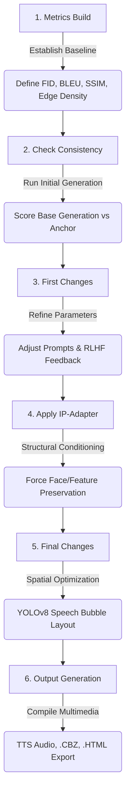

# 🎨 Ultimate AI Indie Comic Generator

A comprehensive, production-ready, local generative AI pipeline designed for academic research and high-fidelity comic generation. This system takes a character and setting, extracts psychological parameters via a local LLM, maps dialogue to facial expressions, generates consistent panels using SDXL and LoRA, dynamically places speech bubbles using YOLOv8 spatial collision detection, evaluates structural integrity using quantitative metrics (FID, BLEU, IoU), and packages the final result with Text-to-Speech (TTS) audio.

> **See the [Root README](../README.md) for the full project documentation** including Story-Weaver, installation, architecture diagrams, and configuration reference.

---

## 🏆 Why This Pipeline is the Best-in-Class Solution

Generic generative AI workflows produce single disjointed images with zero temporal, structural, or narrative cohesion. This pipeline stands as the ultimate, state-of-the-art solution due to the following core advantages:

1. **Deterministic Visual Consistency**: 
   While standard pipelines suffer from "character amnesia," this architecture pairs **IP-Adapter (Image Prompt Adapter)** cross-attention layers with custom SDXL LoRAs. It binds facial contours, hair, clothing, and accessories across complex angles, lighting shifts, and diverse poses.
2. **8-Metric Visual Cohere Engine**: 
   Instead of relying on human eyes alone, we measure consistency mathematically using 8 parallel scoring vectors, including **Structural SSIM**, **Gram Matrix texture matching**, **Canny Edge Density**, and **DINOv2 identity embedding comparison**.
3. **Collision-Free YOLOv8 Layout**:
   Instead of basic static grids or overlaying text on top of critical characters, our **Speech Bubble Optimizer** utilizes YOLOv8 object detection. It scans each panel for characters and faces, computes the collision-free negative space, and places customized dialogue bubbles exactly where they won't interfere.
4. **Closed-Loop RLHF & Optimization**:
   Includes an **Incremental Learner** module that implements a Reinforcement Learning from Human Feedback (RLHF) loop. It tracks ratings, optimizes prompts dynamically, and improves next-generation outputs without manual tuning.
5. **Universal Colab-Local Interoperability**:
   Optimized for low-VRAM deployment, automatically scaling memory and offloading tensors dynamically. Run the entire pipeline on a free Google Colab T4 GPU or locally on a standard consumer laptop.
6. **Rich Multimedia Packaging**:
   Generates interactive HTML comics, archives to standard `.cbz`/`.cbr` formats, compiles production-ready print PDFs, and synthesizes per-panel voice-cast dialogue using localized Text-to-Speech engines.

---


## 🏛️ Experimental Research Flow

The core scientific methodology is built on an iterative experimental loop designed to empirically solve the problem of generative AI temporal inconsistency.



---

## 📁 Detailed Directory Directory & Module Guide

```text
indie_comic_pipeline/
│
│── Core Pipeline ─────────────────────────────────────────────
├── ultimate_comic_pipeline.py      # Master engine: 10 classes, 1000+ lines
│                                   # Contains: ComicConfig, StyleManager, NarrativeMemory,
│                                   # EmotionValidator, SpeechBubbleOptimizer, QualityMetrics,
│                                   # ModelEnsemble, PanelGenerator, PageGenerator, UltimateComicGenerator
├── run_10_panel_pipeline.py        # Production 10-panel sequential generator
├── generate_doodle_panels.py       # Quick 8-panel test generator (T4 optimized)
├── compile_comic_pdf.py            # Assembles page grids into final PDF
├── comic_exporter.py               # Export to CBZ / CBR / HTML web comic
├── audio_integration.py            # TTS audio dialogue via gTTS with guard for local systems
├── model_comparator.py             # A/B model testing (FID, CLIP, timing)
├── incremental_learner.py          # RLHF feedback collection & prompt learning
│
│── Environment & Config ──────────────────────────────────────
├── colab_setup.py                  # Universal Colab/Jupyter bootstrap helper
├── install_all.py                  # One-click dependency installer
├── generate_research_notebooks.py  # Generates the unified research notebook with Colab checks
├── requirements.txt                # Full pinned dependencies
├── requirements_colab.txt          # Slim Colab-compatible dependencies
├── config/
│   ├── settings.yaml               # All pipeline settings
│   └── model_paths.yaml            # HuggingFace model paths
│
│── LangChain Code ────────────────────────────────────────────
├── langchain_code/
│   ├── story_weaver_enricher.py    # Reference-free cast enrichment (Mode 0)
│   ├── character_extractor.py      # Character personality parser (Mode 1)
│   ├── story_extractor.py          # Story setting parser (Mode 1)
│   ├── fusion_engine.py            # Crossover storyboard builder (Mode 1)
│   ├── emotion_recognition_engine.py  # Per-panel expression mapper
│   └── run_full_pipeline.py        # Sequential LangChain runner
│
│── Render Backends ───────────────────────────────────────────
├── sdxl_code/                      # SDXL Base (1024×1024, ~8-10 GB VRAM)
├── lora_code/                      # SDXL + LoRA (1024×1024, best quality)
├── sd15_code/                      # SD 1.5 (512×512, ~4-6 GB VRAM)
│   └── Each contains: generate_character.py, generate_components.py,
│       generate_panels.py, run_*_pipeline.py
│
│── Utilities ─────────────────────────────────────────────────
├── utils/
│   ├── bridge_weaver.py            # Story-Weaver JSON → pipeline converter
│   ├── consistency_checker.py      # 8-metric visual consistency engine
│   ├── config_helper.py            # Settings loader + path resolver
│   ├── image_utils.py              # Strip/grid layout composer
│   └── prompt_optimizer.py         # SD prompt builder & deduplication
│
│── Evaluation & Benchmarking ─────────────────────────────────
├── matrix_evaluation_zone/
│   ├── model_matrix_bench.py       # 5-config benchmark suite
│   └── storyboard_speed_bench.py   # 8-panel speed benchmark
│
│── Web Interface ─────────────────────────────────────────────
├── web_interface/
│   ├── app.py                      # Flask server (port 5000)
│   └── templates/comic_generator.html
│
│── Research Notebook ─────────────────────────────────────────
└── Indie_Comic_Pipeline.ipynb      # Unified end-to-end comic generation pipeline
```

---

## 🔧 Core Pipeline API & Class Specifications

### `ultimate_comic_pipeline.py`

This master orchestration file consolidates the entire generative pipeline. Key classes include:

#### 1. `ComicConfig`
Stores system configuration, generation options, and verification flags:
* `character_name` / `story_world` (str): Define characters and universe contexts.
* `resolution` (Tuple[int, int]): Dimensions of output panels (defaults to T4 sweet spot `(768, 768)`).
* `inference_steps` / `guidance_scale` (float): Diffusion inference dynamics.
* `use_lora` / `model_type` / `style`: Determines rendering engine configuration.
* `consistency_threshold`: The target score for the 8-metric visual consistency check.

#### 2. `StyleManager`
Maintains preset artistic styles with prompt triggers, negative anchors, and optional LoRA paths:
* `manga`: Utilizes manga line art LoRA, flat colors, clean outlines.
* `western_comic`: Bold inks, classic comic style.
* `noir`: High-contrast, dark shadows.
* `watercolor` & `retro`: Soft wash and vintage print patterns.

#### 3. `SpeechBubbleOptimizer`
Optimizes spatial bubble placement by utilizing YOLOv8 object detection paired with negative space layout math:
* Prevents text from overlapping crucial elements (like characters or faces).
* Uses custom text wrapped layout engine, ensuring readable font sizing with automatic fallback to default platform fonts if `Arial` is missing.

#### 4. `QualityMetrics`
Computes key quantitative scores to measure generation success:
* **FID**: Compares feature variance with ground-truth styles.
* **BLEU**: Measures storyboard description alignment.
* **IoU**: Calculates speech bubble layout overlaps to verify collision avoidance.

#### 5. `ModelEnsemble`
Loads and controls the underlying Stable Diffusion components (SDXL, SD1.5, LoRAs, and IP-Adapters). Manages cross-device tensor allocation and features automatic CPU/GPU model offloading to fit within Google Colab’s T4 VRAM.

#### 6. `PanelGenerator`, `PageGenerator`, & `UltimateComicGenerator`
Constructs single-panel visual structures, organizes panels into high-fidelity page grids, and drives the complete end-to-end storyboard compilation.

---

## 🧠 Core Experimental Phases (Indie_Comic_Pipeline.ipynb)

The unified notebook is organized sequentially, allowing you to run the entire pipeline in one go or execute individual cells step-by-step:

* **Phase 0: Story Intake Engine**: Processes raw narrative and emotional user prompts through the Story-Weaver LLM to generate structured story configurations.
* **Phase 1: Narrative Planning Layer**: Orchestrates the Storyboard, Character, Scene, and Layout agents through the shared Memory Blackboard.
* **Phase 2: Reference-Free Anchoring**: Isolates the first generated panel as the primary visual anchor and extracts identity embedding tokens (facial topology, wardrobe features).
* **Phase 3 & 4: In-Generation Consistency & Composable Control**: Runs the unified panel generation loop using model weight blending (CharCom) and Advanced Attention mechanisms.
* **Phase 5: Integrated Text-Image Generation**: Runs the DiffSensei bubble planner, mapping text layout coordinates to avoid subject/facial visual collisions.
* **Phase 6: Quality Validation Layer**: Runs the COMIC Critic Pipeline to check panels against visual, narrative, emotional, aesthetic, and readability thresholds.
* **Phase 7: Layout & Assembly**: Arranges panel matrices dynamically based on story action intensities using the MangaFlow Layout Engine.
* **Phase 8: Export Module & Adaptive RLHF**: Exports pages to PDF/CBZ/HTML and runs the Human Alignment Telemetry Loop with parameter backpropagation optimization.

---

## 🎯 8-Metric Consistency Engine Specifications

Located in `utils/consistency_checker.py`. Runs metrics sequentially to evaluate image pair consistency:

| Metric | Algorithm | Target |
|---|---|---|
| **SSIM** | Structural Similarity Index | Structural layout validation |
| **Gram Matrix** | Feature Map Gramian Correlation | Artistic style & texture consistency |
| **Edge Density** | Canny Edge Detection Comparison | Ink weights & line consistency |
| **Aesthetic Score** | Contrast, Laplacian, & Color Variance | Outlier and quality check |
| **Thumbnail Corr.** | Pearson Correlation | Grid composition & layout flow |
| **HSV Color** | Color Histogram Intersection | Palette uniformity (optional) |
| **CLIP Semantic** | CLIP Embeddings Cosine Distance | High-level concept consistency (VRAM intensive) |
| **DINOv2 Structure** | DINOv2 Pooling Cosine Distance | Identity preservation (VRAM intensive) |

---

## 🚀 Execution & Command-Line Interfaces

### One-Click Dependency Installer
```bash
python install_all.py
```
This utility auto-detects CUDA availability and installs matching PyTorch, Diffusers, and accessory libraries.

### Production Pipeline
```bash
# Run the complete 10-panel comic generation cycle
python run_10_panel_pipeline.py

# Run a faster 8-panel test using doodle generations (great for low VRAM or testing pipelines)
python generate_doodle_panels.py

# Compile generated outputs into a unified multi-page PDF
python compile_comic_pdf.py
```

### Benchmarks & Evaluation
```bash
# Compare visual quality across 5 distinct pipeline configurations
python matrix_evaluation_zone/model_matrix_bench.py

# Benchmark rendering speed of storyboard iterations
python matrix_evaluation_zone/storyboard_speed_bench.py
```

### Web UI
To spin up the interactive Flask visual generator:
```bash
python web_interface/app.py
```
Once initialized, navigate to `http://localhost:5000` to configure panels, view generations, and export comics directly from your browser.

---

## 🛠️ Troubleshooting & Support

* **Out of Memory (OOM) on Colab/Local GPU**:
  * Set `resolution` to `(512, 512)` or use the SD1.5 rendering backend (`sd15_code/`).
  * Disable CLIP and DINOv2 metrics in `config/settings.yaml` to save VRAM.
  * Enable memory offloading in the pipeline config (`enable_memory_management: true`).
* **Fonts Missing (Arial / TrueType)**:
  * On Linux/Colab, the system automatically catches `arial.ttf` missing errors and falls back to PIL's internal monospace font.
* **TTS Package Missing (`gTTS`)**:
  * The audio integration module wraps `gtts` imports in safety try/except blocks. If not installed, it outputs warning logs instead of crashing the pipeline.
