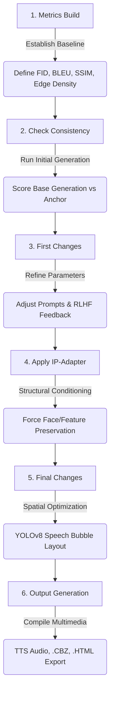

# 🎨 Ultimate AI Indie Comic Generator: A Multi-Modal, Emotion-Aware Pipeline

A comprehensive, production-ready, local generative AI pipeline designed for academic research and high-fidelity comic generation. This system takes a character and setting, extracts psychological parameters via a local LLM, maps dialogue to facial expressions, generates consistent panels using SDXL and LoRA, dynamically places speech bubbles using YOLOv8 spatial collision detection, evaluates structural integrity using quantitative metrics (FID, BLEU, IoU), and packages the final result with Text-to-Speech (TTS) audio.

---

## 🏛️ Experimental Research Flow (System Architecture)

The core scientific methodology of this pipeline is built on an iterative experimental loop designed to empirically solve the problem of generative AI temporal inconsistency.



---

## 🧠 Core Experimental Phases

The pipeline has been rigorously architected to follow the exact experimental flow outlined above, supporting objective academic evaluation.

### Phase 1: Metrics Build
Before rendering begins, the pipeline establishes a strict quantitative evaluation suite to benchmark success:
* **Fréchet Inception Distance (FID):** Uses `torchmetrics` to evaluate the variance between generated features against ground-truth style references. 
* **BLEU Score (Bilingual Evaluation Understudy):** Measures how closely the generated visual prompt matches the ideal storyboard instruction.
* **Mathematical Consistency Suite:** Incorporates Structural Similarity Index (SSIM), Art Style Gram Matrix evaluations, and Canny Edge Density parameters.

### Phase 2: Check Consistency
* **Baseline Execution:** The pipeline executes an initial visual pass using the `UltimateComicGenerator` without advanced structural locks.
* **EmotionValidator:** Uses a local LLM (Llama 3.2 via Ollama) to analyze the generated visual prompt and cross-reference it with the dialogue text.
* **Evaluation:** The generated panels are pushed through the consistency checker to mathematically prove structural deviations or "emotion amnesia".

### Phase 3: Initial Changes
* **Feedback Loop (`IncrementalLearner`):** Based on the consistency failures identified in Phase 2, the pipeline adjusts prompt weighting. It dynamically refines negative prompts or shifts LoRA weights to attempt software-level correction based on aggregated human/metric preferences.

### Phase 4: Apply IP-Adapter
* **Structural Lock-In:** To mathematically resolve the inconsistency identified in Phase 2, the pipeline introduces the **IP-Adapter** (Image Prompt Adapter). 
* **Reference Conditioning:** A high-quality anchor image of the protagonist is passed through the IP-Adapter's Cross-Attention layers. This physically forces the SDXL diffusion process to preserve facial contours, identity, and clothing cues across wildly different poses and expressions.

### Phase 5: Final Changes & Spatial Layout
* **Collision Detection (`SpeechBubbleOptimizer`):** With the character's facial consistency now mathematically locked by the IP-Adapter, the pipeline resolves spatial occlusion.
* **YOLOv8 Integration:** Identifies bounding boxes for `person` and `face`. It computes the negative space and mathematically determines the optimal $X, Y$ coordinates to render the speech bubble. If an overlap occurs, the optimizer shifts the text outwards until Intersection over Union (IoU) equals zero.

### Phase 6: Final Output & Export
* **Text-to-Speech (TTS):** Parses the generated dialogue and utilizes `gTTS` to generate localized MP3 audio files.
* **CBZ Archiving & HTML:** Standardizes the output by compressing generated panels and layout grids into universally readable `.cbz` archives and interactive HTML web comic formats.

---

## 🔬 Research Paper Execution Workflow (Google Colab / Jupyter)

To execute the pipeline and gather empirical data for your research paper, the repository provides 6 chronologically ordered Jupyter Notebooks that explicitly mirror the 6-step experimental flow. Ensure your runtime is set to **T4 GPU**.

### Notebook 1: `01_Metrics_Build_and_Setup.ipynb`
* **Purpose:** Prepares the environment and establishes the baseline evaluation parameters.
* **Academic Focus:** Executes **Phase 1 (Metrics Build)** by initializing FID, BLEU, SSIM, and Edge Density calculations.

### Notebook 2: `02_Initial_Generation_and_Consistency_Check.ipynb`
* **Purpose:** Runs the initial SDXL generation without structural locks.
* **Academic Focus:** Executes **Phase 2 (Check Consistency)**. Demonstrates how to mathematically evaluate the uncontrolled generation for structural deviation and "emotion amnesia".

### Notebook 3: `03_First_Changes_and_Refinement.ipynb`
* **Purpose:** Acts on the consistency failures identified in Notebook 2.
* **Academic Focus:** Executes **Phase 3 (First Changes)** by logging simulated RLHF human evaluation feedback via the `IncrementalLearner` and refining text prompts.

### Notebook 4: `04_Apply_IP_Adapter.ipynb`
* **Purpose:** Introduces structural anchors to the generation process.
* **Academic Focus:** Executes **Phase 4 (Apply IP-Adapter)** to demonstrate how Cross-Attention conditioning mathematically forces facial and structural preservation, solving the failures from Phase 2.

### Notebook 5: `05_Final_Changes_and_Spatial_Layout.ipynb`
* **Purpose:** Isolates the spatial layout engine to finalize the image composition.
* **Academic Focus:** Executes **Phase 5 (Final Changes)** by showcasing the YOLOv8 object detector avoiding occlusions. Extracts coordinate data to prove speech bubble placement successfully shifts to avoid overlapping the face.

### Notebook 6: `06_Multimedia_Output_and_Export.ipynb`
* **Purpose:** Wraps the entire experiment into digestible artifacts.
* **Academic Focus:** Executes **Phase 6 (Output Generation)** by demonstrating multi-modal expansion via TTS audio generation and `.cbz` / `.html` interactive formats.

*(Note: When running these sequentially in Google Colab, ensure you persist your `outputs/` directory between sessions by mounting Google Drive or manually downloading the generated JSONs).*

---

## 🚀 Execution Guide (Local Setup)

If you are running the pipeline locally on a dedicated NVIDIA GPU (RTX 3090/4090):

### 1. Flask Web Interface (Interactive Mode)
We provide a beautiful, fully-featured web application to generate comics visually.
```bash
pip install -r requirements.txt
python web_interface/app.py
```
*Navigate to `http://localhost:5000` to access the interactive Comic Studio.*

### 2. Jupyter Step-by-Step Execution
Open your terminal in the `indie_comic_pipeline` directory and launch Jupyter:
```bash
jupyter notebook
```
Open `01_Metrics_Build_and_Setup.ipynb` and proceed sequentially through the 6 notebooks to gather your research data.
