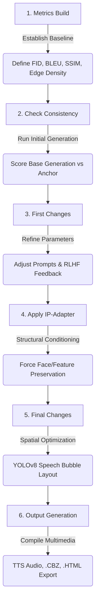

# 🎨 Ultimate AI Indie Comic Generator

A comprehensive, production-ready, local generative AI pipeline designed for academic research and high-fidelity comic generation. This system takes a character and setting, extracts psychological parameters via a local LLM, maps dialogue to facial expressions, generates consistent panels using SDXL and LoRA, dynamically places speech bubbles using YOLOv8 spatial collision detection, evaluates structural integrity using quantitative metrics (FID, BLEU, IoU), and packages the final result with Text-to-Speech (TTS) audio.

> **See the [Root README](../README.md) for the full project documentation** including Story-Weaver, installation, architecture diagrams, and configuration reference.

---

## 🏛️ Experimental Research Flow

The core scientific methodology is built on an iterative experimental loop designed to empirically solve the problem of generative AI temporal inconsistency.



---

## 📁 Directory Structure

```text
indie_comic_pipeline/
│
│── Core Pipeline ─────────────────────────────────────────────
├── ultimate_comic_pipeline.py      # Master engine: 10 classes, 700+ lines
│                                   #   ComicConfig, StyleManager, NarrativeMemory,
│                                   #   EmotionValidator, SpeechBubbleOptimizer,
│                                   #   QualityMetrics, ModelEnsemble, PanelGenerator,
│                                   #   PageGenerator, UltimateComicGenerator
├── run_10_panel_pipeline.py        # Production 10-panel sequential generator
├── generate_doodle_panels.py       # Quick 8-panel test generator (T4 optimized)
├── compile_comic_pdf.py            # Assembles page grids into final PDF
├── comic_exporter.py               # Export to CBZ / CBR / HTML web comic
├── audio_integration.py            # TTS audio dialogue via gTTS
├── model_comparator.py             # A/B model testing (FID, CLIP, timing)
├── incremental_learner.py          # RLHF feedback collection & prompt learning
│
│── Environment & Config ──────────────────────────────────────
├── colab_setup.py                  # Universal Colab/Jupyter bootstrap
├── install_all.py                  # One-click dependency installer
├── generate_research_notebooks.py  # Generates 6 research notebooks
├── requirements.txt                # Full pinned dependencies
├── requirements_colab.txt          # Slim Colab-compatible dependencies
├── config/
│   ├── settings.yaml               # All pipeline settings
│   └── model_paths.yaml            # HuggingFace model paths
│
│── LangChain Code ────────────────────────────────────────────
├── langchain_code/
│   ├── story_weaver_enricher.py    # Reference-free cast enrichment (Mode 0)
│   ├── character_extractor.py      # Character personality parser (Mode 1)
│   ├── story_extractor.py          # Story setting parser (Mode 1)
│   ├── fusion_engine.py            # Crossover storyboard builder (Mode 1)
│   ├── emotion_recognition_engine.py  # Per-panel expression mapper
│   └── run_full_pipeline.py        # Sequential LangChain runner
│
│── Render Backends ───────────────────────────────────────────
├── sdxl_code/                      # SDXL Base (1024×1024, ~8-10 GB VRAM)
├── lora_code/                      # SDXL + LoRA (1024×1024, best quality)
├── sd15_code/                      # SD 1.5 (512×512, ~4-6 GB VRAM)
│   └── Each contains: generate_character.py, generate_components.py,
│       generate_panels.py, run_*_pipeline.py
│
│── Utilities ─────────────────────────────────────────────────
├── utils/
│   ├── bridge_weaver.py            # Story-Weaver JSON → pipeline converter
│   ├── consistency_checker.py      # 8-metric visual consistency engine
│   ├── config_helper.py            # Settings loader + path resolver
│   ├── image_utils.py              # Strip/grid layout composer
│   └── prompt_optimizer.py         # SD prompt builder & deduplication
│
│── Evaluation & Benchmarking ─────────────────────────────────
├── matrix_evaluation_zone/
│   ├── model_matrix_bench.py       # 5-config benchmark suite
│   └── storyboard_speed_bench.py   # 8-panel speed benchmark
│
│── Web Interface ─────────────────────────────────────────────
├── web_interface/
│   ├── app.py                      # Flask server (port 5000)
│   └── templates/comic_generator.html
│
│── Research Notebooks ────────────────────────────────────────
├── 01_Metrics_Build_and_Setup.ipynb
├── 02_Initial_Generation_and_Consistency_Check.ipynb
├── 03_First_Changes_and_Refinement.ipynb
├── 04_Apply_IP_Adapter.ipynb
├── 05_Final_Changes_and_Spatial_Layout.ipynb
├── 06_Multimedia_Output_and_Export.ipynb
│
│── Output ────────────────────────────────────────────────────
└── outputs/
    ├── fusion/          # Generated JSON storyboards
    ├── characters/      # Character reference sheets
    ├── comics/          # Panels, strips, grids, PDFs
    ├── exports/         # CBZ / CBR / HTML exports
    ├── audio/           # TTS dialogue MP3 files
    ├── production_run/  # 10-panel production output
    └── comparison/      # Model A/B test reports
```

---

## 🧠 Core Experimental Phases

### Phase 1: Metrics Build
Establishes a strict quantitative evaluation suite to benchmark success:
* **Fréchet Inception Distance (FID):** Uses `torchmetrics` to evaluate the variance between generated features against ground-truth style references.
* **BLEU Score:** Measures how closely the generated visual prompt matches the ideal storyboard instruction.
* **Mathematical Consistency Suite:** SSIM, Art Style Gram Matrix evaluations, and Canny Edge Density parameters.

### Phase 2: Check Consistency
* **Baseline Execution:** The pipeline executes an initial visual pass using the `UltimateComicGenerator` without advanced structural locks.
* **EmotionValidator:** Uses a local LLM (Llama 3.2 via Ollama) to cross-reference generated visuals with dialogue text.
* **Evaluation:** Generated panels are pushed through the 8-metric consistency checker to mathematically prove structural deviations or "emotion amnesia".

### Phase 3: Initial Changes
* **Feedback Loop (`IncrementalLearner`):** Based on consistency failures from Phase 2, the pipeline adjusts prompt weighting. Dynamically refines negative prompts or shifts LoRA weights based on aggregated human/metric preferences.
* **Prompt Refinement:** Uses `log_feedback()` to record ratings and extract patterns from high-rated outputs.

### Phase 4: Apply IP-Adapter
* **Structural Lock-In:** Introduces the **IP-Adapter** (Image Prompt Adapter) to resolve inconsistency.
* **Reference Conditioning:** A high-quality anchor image is passed through IP-Adapter's Cross-Attention layers to force facial contour, identity, and clothing preservation across different poses and expressions.

### Phase 5: Final Changes & Spatial Layout
* **Collision Detection (`SpeechBubbleOptimizer`):** Resolves spatial occlusion with the character's facial consistency now locked.
* **YOLOv8 Integration:** Identifies bounding boxes for `person` and `face`, computes negative space, and determines optimal speech bubble coordinates. Shifts text outwards until IoU equals zero.

### Phase 6: Final Output & Export
* **Text-to-Speech (TTS):** Parses dialogue and generates localized MP3 audio files via `gTTS` with per-character voice profiles.
* **CBZ Archiving & HTML:** Compresses panels into `.cbz` archives and interactive HTML web comic formats.
* **PDF Compilation:** Assembles page grids into multi-page PDFs.

---

## 📓 Research Notebooks

Six Jupyter notebooks mirror the 6-step experimental flow. Each includes a **universal setup cell** that works on both Google Colab and local Jupyter.

| Notebook | Phase | What It Does |
|----------|-------|-------------|
| `01_Metrics_Build_and_Setup` | Baseline | Initializes `ModelComparator` and `QualityMetrics` |
| `02_Initial_Generation_and_Consistency_Check` | Generation | Runs SDXL generation (T4 GPU required), evaluates emotion detection |
| `03_First_Changes_and_Refinement` | Feedback | `IncrementalLearner` logs feedback and refines prompts |
| `04_Apply_IP_Adapter` | Structural Fix | Demonstrates IP-Adapter cross-attention conditioning |
| `05_Final_Changes_and_Spatial_Layout` | Layout | YOLOv8 `SpeechBubbleOptimizer` for collision-free text |
| `06_Multimedia_Output_and_Export` | Export | TTS audio generation + CBZ/HTML export |

### Running on Google Colab

1. Upload any notebook to Google Colab
2. Set runtime to **T4 GPU**: `Runtime → Change runtime type → T4 GPU`
3. Run the first cell — it clones the repo and installs dependencies automatically
4. Persist `outputs/` between sessions by mounting Google Drive

### Running Locally

```bash
cd indie_comic_pipeline
jupyter notebook
# Open 01_Metrics_Build_and_Setup.ipynb and proceed sequentially
```

---

## 🎯 8-Metric Consistency Engine

`utils/consistency_checker.py` measures visual coherence across panels:

| Metric | Method | Checks | Default |
|--------|--------|--------|---------|
| **HSV Color** | Histogram comparison | Same color palette | Off |
| **SSIM** | Structural Similarity | Pixel-level structure | On |
| **Gram Matrix** | 5-channel spatial features | Artistic style/texture | On |
| **Edge Density** | Canny edge detection | Line weight/density | On |
| **CLIP Semantic** | CLIP embeddings (cosine) | Content similarity | Off (saves VRAM) |
| **DINOv2 Structure** | DINOv2 pooler output | Identity consistency | Off (saves VRAM) |
| **Aesthetic Score** | Laplacian + contrast + color | Visual quality | On |
| **Thumbnail Corr.** | Pearson correlation | Global composition | On |

**Threshold:** Combined weighted score above **0.55** = consistent (configurable in `settings.yaml`).

---

## 🚀 Quick Start

### Interactive Web Interface
```bash
pip install -r requirements.txt
python web_interface/app.py
# → http://localhost:5000
```

### Production Pipeline
```bash
# Generate panels from fusion JSONs
python run_10_panel_pipeline.py

# Quick test with doodle panels
python generate_doodle_panels.py

# Compile final PDF
python compile_comic_pdf.py
```

### Export Formats
```bash
# CBZ archive
python -c "from comic_exporter import ComicExporter; e = ComicExporter(); ..."

# TTS audio
python -c "from audio_integration import AudioIntegrator; a = AudioIntegrator(); ..."
```

---

## 📋 Dependencies

### Full Install (Local)
```bash
pip install -r requirements.txt --extra-index-url https://download.pytorch.org/whl/cu121
```

### Colab Install (Auto)
```bash
# Handled automatically by colab_setup.py using requirements_colab.txt
# No manual install needed — just run the first notebook cell
```

### Key Dependencies
| Package | Version | Purpose |
|---------|---------|---------|
| `torch` | ≥ 2.0 | Core ML framework |
| `diffusers` | ≥ 0.28 | SDXL / SD 1.5 pipelines |
| `transformers` | ≥ 4.40 | CLIP, DINOv2 models |
| `accelerate` | ≥ 0.30 | GPU memory optimization |
| `ultralytics` | ≥ 8.0 | YOLOv8 (speech bubble placement) |
| `scikit-image` | ≥ 0.20 | SSIM computation |
| `langchain` | latest | LLM orchestration |
| `gTTS` | ≥ 2.3 | Text-to-Speech audio |
| `flask` | ≥ 2.0 | Web interface |

---

*Built with Ollama · LangChain · Diffusers · SDXL · LoRA · CLIP · DINOv2 · YOLOv8 · gTTS · Flask · Python*
