# MDCP & Composable Indie Comic Pipeline: System Methodology

This document outlines the detailed system architecture, processing pipeline phases, mathematical formulations, and software implementations for the training-free **Multi-Level Diffusion Consistency Prior (MDCP)** and the 8-phase comic generation pipeline.

---

## 1. Pipeline Execution Flow Diagram

```mermaid
flowchart TD
    %% Define styles
    classDef input fill:#e1f5fe,stroke:#0288d1,stroke-width:2px;
    classDef process fill:#fff3e0,stroke:#f57c00,stroke-width:2px;
    classDef decision fill:#ede7f6,stroke:#5e35b1,stroke-width:2px;
    classDef output fill:#e8f5e9,stroke:#388e3c,stroke-width:2px;
    classDef error fill:#ffebee,stroke:#c62828,stroke-width:2px;

    subgraph Inputs ["User Prompt & Settings"]
        A["User Input: Story Prompt / Emotion / Characteristics"]:::input
        ModeSwitch{"story_mode Switch"}:::decision
    end

    subgraph Phase0 ["Phase 0: Intelligent Story Intake (story_intake.py)"]
        Intake["StoryIntakeEngine"]:::process
        OllamaLLM["Local Ollama (llama3.2)\nJSON-structured LLM Chain"]:::process
        FallbackGen["_generate_fallback()\nTemplate configurations"]:::process
        StoryConfig["story_config (In-Memory JSON)"]:::output
    end

    A --> ModeSwitch
    ModeSwitch -- "literal (Default)" --> Intake
    ModeSwitch -- "mood_arc (Legacy)" --> Intake
    Intake --> OllamaLLM
    OllamaLLM -- "Timeout/Error Fallback" --> FallbackGen
    OllamaLLM -- "Success" --> StoryConfig
    FallbackGen --> StoryConfig

    subgraph Phase1 ["Phase 1: Narrative Swarm Planning (agent_coordinator.py)"]
        Coord["AgentCoordinator"]:::process
        subgraph Swarm ["Swarm Agents (Blackboard Pattern)"]
            DirStory["StoryDirector\nRegisters characters & sequences"]:::process
            DirAction["ActionDirector\nExaggeration Map & Action Intensity Scores"]:::process
            WriterDialogue["DialogueWriter\nDialogue texts, tones, bubble category"]:::process
            DirPose["PoseDirector\nBody posture mapping"]:::process
            DirEmotion["EmotionDirector\nGranular facial expressions"]:::process
            DirCamera["CameraDirector\nFraming & camera angles"]:::process
        end
        Blackboard["StorySectionMemory Blackboard"]:::output
    end

    StoryConfig --> Coord
    Coord --> Swarm
    Swarm --> Blackboard

    subgraph Phase2 ["Phase 2: Self-Referential Visual Anchoring (anchoring.py)"]
        AnchorGen["Generate Panel 1 (Anchor) from text"]:::process
        AnchorImg["Panel 1 Raw Image"]:::output
        Extractor["IdentityEmbeddingExtractor"]:::process
        Sig["Identity Signature Tokens:\n- RGB Color Histogram\n- Canny Edge Density\n- Gram-Matrix Feature Map"]:::output
    end

    Blackboard --> AnchorGen
    AnchorGen --> AnchorImg
    AnchorImg --> Extractor
    Extractor --> Sig
    Sig -->|"Cache signature"| Blackboard

    subgraph Phase3_4 ["Phase 3 & 4: Composable Control & Generation (panel_engine.py)"]
        ParallelLoop{"Parallel Panel Loop\n(Panels 2..N)"}:::decision
        Compositor["CharComCompositor\nBlends LoRA scale, steps, and guidance per panel"]:::process
        subgraph MDCP ["MDCP Prior Stack (advanced_attention.py)"]
            T1["L1 Physics Latent Smoothing\nGaussian blur subtraction\nto suppress high-frequency noise"]:::process
            T2["L2 Cross-Attention Cache\nAsynchronously streams cached K/V anchor\nattention maps to lock identity"]:::process
            T3["L3 Spatiotemporal Alignment\nAligns mean/variance statistics\ntoward anchor layout signature"]:::process
        end
        RawPanel["Raw Generated Panel Image"]:::output
    end

    Blackboard --> ParallelLoop
    ParallelLoop --> Compositor
    Compositor --> MDCP
    MDCP --> RawPanel

    subgraph Phase6 ["Phase 6: Quality Validation Gate (quality_critic.py)"]
        Critic["QualityCritic.evaluate()"]:::process
        EqScore["Evaluate visual consistency, aesthetics, narrative,\nemotional alignment, and readability"]:::process
        GateCheck{"Score ≥ Threshold?"}:::decision
        RetryCheck{"Retry Count ≤ Max Retries?"}:::decision
        AdjustParams["Adjust parameters:\nIncrease guidance scale & step count"]:::process
        GateFail["Raise QualityGateFailure"]:::error
        ApprovedPanel["Approved Raw Panel Image"]:::output
    end

    RawPanel --> Critic
    Critic --> EqScore
    EqScore --> GateCheck
    GateCheck -- "No" --> RetryCheck
    RetryCheck -- "Yes" --> AdjustParams
    AdjustParams -->|Regenerate| Compositor
    RetryCheck -- "No" --> GateFail
    GateCheck -- "Yes" --> ApprovedPanel

    subgraph Phase7 ["Phase 7: MangaFlow Layout Page Assembly (layout_engine.py)"]
        LayoutEng["MangaFlowLayoutEngine"]:::process
        HeightCalc["Calculate panel heights proportional to action intensity"]:::process
        PageAssembly["Arrange panels and draw gutters/borders"]:::process
        CompletedPage["Assembled Comic Page Image"]:::output
    end

    ApprovedPanel --> LayoutEng
    LayoutEng --> HeightCalc
    HeightCalc --> PageAssembly
    PageAssembly --> CompletedPage

    subgraph Phase8 ["Phase 8: Export Harness & Feedback Optimization"]
        Export["ComicExporter"]:::process
        Formats["Generate CBZ, PDF, and HTML Scrollbook"]:::output
        Ratings["Gather user ratings & logs"]:::process
        Tuner["HeuristicFeedbackTuner\nMutates settings.yaml config"]:::process
    end

    CompletedPage --> Export
    Export --> Formats
    Formats --> Ratings
    Ratings --> Tuner
    Tuner -->|"Update defaults"| A
```

---

## 2. Technical Component Breakdown

### Phase 0: Intelligent Story Intake (Writer's Room)
- **File:** [story_intake.py](file:///c:/Users/Dell/Downloads/drid/indie_comic_pipeline/core/story_intake.py) (`StoryIntakeEngine`)
- **Mechanism:** Takes user prompts (characters, world, settings) and coordinates with local LLMs (default: `llama3.2` via Ollama) to output a JSON-structured story configuration.
- **Story Modes:** Controlled via the `story_mode` parameter:
  - `literal` (Default): Evaluates and divides the user's specific plot into sequential moments (preserving story beats). The emotion beats shade prompt keywords (e.g. lighting, environment) rather than overwriting structural actions.
  - `mood_arc` (Legacy): Generates panel-level prompts directly from a pre-defined emotional progression trajectory, passing the user script as background context.

### Phase 1: Multi-Agent Planning Layer
- **File:** [agent_coordinator.py](file:///c:/Users/Dell/Downloads/drid/indie_comic_pipeline/core/agents/agent_coordinator.py) (`AgentCoordinator`)
- **Architecture:** Coordinates a decentralized blackboard architecture comprising six specialized director agents:
  - `StoryDirector`: Builds the layout structure, total page allotments, and basic sequential beats.
  - `ActionDirector`: Translates plain verbs into hyper-expressive poses using a *Cinematic Exaggeration Map* and calculates **Action Intensity Scores** (used for dynamic layouts in Phase 7).
  - `DialogueWriter`: Dictates narrative text and dialogues.
  - `PoseDirector` / `EmotionDirector` / `CameraDirector`: Enrich prompts with joint rotation constraints, expressions, facial geometry, framing, and camera positions.

### Phase 2: Self-Referential Visual Anchoring
- **File:** [anchoring.py](file:///c:/Users/Dell/Downloads/drid/indie_comic_pipeline/core/anchoring.py) (`IdentityEmbeddingExtractor`)
- **Mechanism:** Isolates Panel 1 to act as the primary visual anchor. Instead of training custom model checkpoints or feeding reference image files, the anchor panel is synthesized directly from text. It extracts a visual identity signature using three non-learned classical descriptors:
  - **RGB Color Histogram**: Channel-wise pixel color distributions.
  - **Canny Edge Density**: High-frequency geometric boundary contours.
  - **Gram-Matrix Feature Maps**: Computes Gram matrices over intermediate texture layers to summarize stylistic texture:
    $$G_{i,j} = \sum_k F_{i,k}F_{j,k}$$
- **Extracted Tokens**: The signature parameters are cached into the blackboard [memory.py](file:///c:/Users/Dell/Downloads/drid/indie_comic_pipeline/core/memory.py) (`StorySectionMemory`) to guide subsequent generations.

### Phase 3 & 4: In-Generation Consistency & Composable Control (MDCP)
- **Files:** [panel_engine.py](file:///c:/Users/Dell/Downloads/drid/indie_comic_pipeline/core/panel_engine.py) (`PanelEngine`), [compositor.py](file:///c:/Users/Dell/Downloads/drid/indie_comic_pipeline/core/compositor.py) (`CharComCompositor`), and [advanced_attention.py](file:///c:/Users/Dell/Downloads/drid/indie_comic_pipeline/core/advanced_attention.py) (`AdvancedAttentionManager`)
- **CharCom Compositor:** Blends base prompts with character-specific LoRA weights, guidance, seeds, and steps at runtime:
  $$W_{\text{total}} = W_{\text{base}} + \sum (\alpha_i \cdot W_i)$$
- **Multi-Level Diffusion Consistency Prior (MDCP):** An analytical, gradient-free inference-time optimizer that reduces latent consistency energy $\mathcal{E}_{\text{cons}}(z)$:
  $$\mathcal{E}_{\text{cons}}(z) = w_{\text{HF}}\cdot\phi_{\text{HF}}(z) + w_{\text{sem}}\cdot\phi_{\text{sem}}(z) + w_{\text{str}}\cdot\phi_{\text{str}}(z)$$
  This energy is minimized via a sequential operator-splitting composition at each denoising step ($\mathcal{T}_{\text{MDCP}} = \mathcal{T}_3 \circ \mathcal{T}_2 \circ \mathcal{T}_1$):
  1. **Level 1 (L1) Physics-Informed Latent Smoothing ($\mathcal{T}_1$):** Approximates the heat-equation Laplacian during denoising steps $t/T \in [0.20, 0.80]$ using a normalized 2D Gaussian kernel ($G_\sigma, \sigma=\text{size}/3$) to suppress high-frequency noise accumulation:
     $$u(t+1) = u(t) + \alpha_{\text{eff}}(t)\cdot\big(u * G_\sigma - u(t)\big)$$
     $$\alpha_{\text{eff}}(t) = \alpha\cdot\frac{t-0.20}{0.80-0.20}, \quad \alpha = 0.03$$
  2. **Level 2 (L2) Shared Cross-Attention Key/Value Caching ($\mathcal{T}_2$):** Binds semantic traits (face, hair, attire) by caching projected Key and Value tensors from the anchor panel's primary four cross-attention blocks. 
     $$\text{output} = (1-\beta)\cdot\text{Softmax}\left(\frac{Q_{\text{cur}}K_{\text{cur}}^T}{\sqrt{d}}\right)V_{\text{cur}} + \beta\cdot\text{Softmax}\left(\frac{Q_{\text{cur}}K_{\text{anchor}}^T}{\sqrt{d}}\right)V_{\text{anchor}}, \quad \beta = 0.15$$
     - *Pinned Memory Streaming:* Caches are stored in page-locked host CPU memory and prefetched asynchronously to GPU CUDA device memory (`non_blocking=True`) concurrently with self-attention computation, maintaining a strict $O(1)$ memory complexity of ~150 MB VRAM overhead regardless of the panel sequence length $N$.
  3. **Level 3 (L3) Spatiotemporal Channel-Statistic Alignment ($\mathcal{T}_3$):** Aligns target latent statistics to the anchor distribution during the structural formation window $t/T \in [0.30, 0.60]$ to stabilize contrast, lighting, and global layouts under camera cuts:
     $$z_{\text{final},c} = z_c\cdot\big(1+\text{blend}_w\cdot(\text{std\_ratio}_c-1)\big) + \text{blend}_w\cdot\gamma\cdot(\mu_{\text{anchor},c}-\mu_{\text{current},c})$$
     $$\text{std\_ratio}_c = \text{clamp}(\sigma_{\text{anchor},c}/\sigma_{\text{current},c},\,0.80,\,1.20), \quad \text{blend}_w(t) = \gamma\cdot\frac{t-0.30}{0.60-0.30}, \quad \gamma = 0.08$$

### Phase 6: Automated Quality Validation Loop
- **File:** [quality_critic.py](file:///c:/Users/Dell/Downloads/drid/indie_comic_pipeline/core/quality_critic.py) (`QualityCritic`)
- **Mechanism:** Automatically intercepts raw panel raster outputs and runs evaluation metrics across five distinct quality dimensions:
  $$\text{Score} = 0.30\,S_{\text{cons}} + 0.25\,S_{\text{aes}} + 0.20\,S_{\text{narr}} + 0.15\,S_{\text{emo}} + 0.10\,S_{\text{read}}$$
  - **Visual Consistency ($S_{\text{cons}}$):** Evaluates re-identification distance against the anchor image using SSIM, edge correlation, color statistics, and style metrics.
  - **Aesthetic Quality ($S_{\text{aes}}$):** Computes local sharpness (Laplacian variance), contrast, and colorfulness opponent-space metrics.
  - **Narrative Coherence ($S_{\text{narr}}$):** Checks theme and prompt adherence using semantic text/image comparisons.
  - **Emotional Engagement ($S_{\text{emo}}$):** Evaluates text-to-image emotion label alignment.
  - **Readability ($S_{\text{read}}$):** Validates visual readability and margins.
- **Reject & Regenerate:** If the composite score falls below the threshold (default: `0.55`, strict: `0.70`), the engine updates generation parameters (e.g. increments guidance scale, steps, or alters prompt weights) and triggers a retry loop (up to `2` retries).

### Phase 7: MangaFlow Layout Assembly Engine
- **File:** [layout_engine.py](file:///c:/Users/Dell/Downloads/drid/indie_comic_pipeline/core/layout_engine.py) (`MangaFlowLayoutEngine`)
- **Mechanism:** Assembles panels onto pages dynamically based on Action Intensity Scores ($\mathcal{I}_i$) computed in Phase 1:
  $$h_i = H_{\text{page}}\cdot\frac{\mathcal{I}_i}{\sum_{j=1}^N \mathcal{I}_j}$$
  High-intensity action sequences are allocated larger panel heights, while quiet scenes are scaled down.

### Phase 8: Multi-Format Export & Adaptive Parameter Tuning
- **Files:** [comic_exporter.py](file:///c:/Users/Dell/Downloads/drid/indie_comic_pipeline/comic_exporter.py) (`ComicExporter`), [feedback.py](file:///c:/Users/Dell/Downloads/drid/indie_comic_pipeline/core/feedback.py) (`RLHFFeedbackLoop`), and [feedback_tuner.py](file:///c:/Users/Dell/Downloads/drid/indie_comic_pipeline/core/feedback_tuner.py) (`HeuristicFeedbackTuner`)
- **Export Formats:** Assembles layout streams into three standard reader formats:
  - **CBZ:** Zip archive containing sequential PNG assets.
  - **PDF:** Document packaging page raster outputs.
  - **HTML Scrollbook:** Responsive scrollable layout with dynamic web formatting.
- **Telemetry Loop:** Gathers user interface feedback ratings. If a sequence receives low consistency ratings, `HeuristicFeedbackTuner` mutates the master settings YAML configuration (e.g. updates default guidance, steps, quality thresholds, or adds positive/negative style terms to prompts) to guide future iterations.

---

## 3. Predefined Configurations & Hardcoded Fallbacks

This section documents the static parameters, predefined dictionary mappings, and fallback templates hardcoded into the pipeline modules to ensure system robustness.

### 3.1 Mood-Arc & Emotion Beat Configurations
Defined in [story_intake.py](file:///c:/Users/Dell/Downloads/drid/indie_comic_pipeline/core/story_intake.py) (`MOOD_ARCS`), these rules govern the visual journey mappings and sequence beats for the eight primary user-specified emotions:

| Emotion Key | Journey Type | Description | Sequential Mood Arc Beats |
| :--- | :--- | :--- | :--- |
| `sad` | uplifting | From heaviness toward genuine small warmth | heaviness $\to$ stillness $\to$ faint_warmth $\to$ tentative_light $\to$ soft_openness $\to$ quiet_hope |
| `angry` | calming | From contained fire toward stillness | contained_fire $\to$ fracture $\to$ exhale $\to$ cooling $\to$ ground $\to$ stillness |
| `anxious` | grounding | From spiral toward root | spiral $\to$ peak_noise $\to$ pause $\to$ breath $\to$ root $\to$ present |
| `tired` | relaxing | From bone-deep drag toward rest | drag $\to$ surrender $\to$ softness $\to$ drift $\to$ quiet_rest $\to$ renewal |
| `happy` | elation | From spark of joy toward luminous transcendence | spark $\to$ expansion $\to$ overflow $\to$ radiance $\to$ luminous_still $\to$ transcendence |
| `grief` | tender continuance | From the shape of absence toward carrying | absence $\to$ ache $\to$ memory $\to$ held $\to$ continuance $\to$ carried_forward |
| `determined` | heroic rise | From doubt toward resolute action | doubt $\to$ challenge $\to$ resistance $\to$ breakthrough $\to$ momentum $\to$ triumph |
| `love` | deepening | From spark toward enduring warmth | spark $\to$ recognition $\to$ vulnerability $\to$ trust $\to$ embrace $\to$ unity |

*Fallback Default Arc:* If the emotion is not recognized, the system defaults to the `reflective` journey with beats: `["acknowledgment", "presence", "shift", "openness"]` (`DEFAULT_ARC`).

### 3.2 Visual Generation Fallbacks
If calls to the local Ollama LLM timeout, fail, or are disabled, [story_intake.py](file:///c:/Users/Dell/Downloads/drid/indie_comic_pipeline/core/story_intake.py) invokes `_generate_fallback(...)` to produce a template-based story config using hardcoded maps:
- **Visual Motif Fallbacks:** e.g., `sad` $\to$ "A solitary paper boat floating in a dark puddle", `angry` $\to$ "Cracks spreading across a concrete wall", `grief` $\to$ "An empty chair at a kitchen table".
- **Camera Configurations:** Maps specific emotional beats to camera angles to ensure visual dynamism (e.g., `contained_fire` $\to$ "Low-angle medium shot, slow upward tilt", `fracture` $\to$ "Dutch tilt close-up, handheld shake", `triumph` $\to$ "Wide shot, slow pull-back reveal").
- **Environment Context:** Pre-baked prompt fragments tailored to `story_world` (e.g., `contained_fire` $\to$ "cramped rooftop of {story_world}, deep night, dominant palette crimson and charcoal, single sodium lamp").
- **Default Pose Constraints:** Specific structural positions based on emotional beats (e.g., `contained_fire` $\to$ `{"body": "standing rigid, fists clenched at sides", "head": "jaw tight, chin slightly lowered", ...}`).
- **Default Dialogue Templates:** e.g., `contained_fire` $\to$ `"Not yet."`, `fracture` $\to$ `"That's enough."`, `drift` $\to$ `"Just for a moment."`.

### 3.3 Quality Validation Constants
The quality scoring weights and regeneration conditions are hardcoded in [quality_critic.py](file:///c:/Users/Dell/Downloads/drid/indie_comic_pipeline/core/quality_critic.py):
- **Weights (Must sum to 1.0):**
  - Visual Consistency: `0.30`
  - Aesthetic Quality: `0.25`
  - Narrative Coherence: `0.20`
  - Emotional Engagement: `0.15`
  - Readability: `0.10`
- **Rejection Thresholds:**
  - Standard Acceptance: $\ge 0.55$
  - Strict Acceptance: $\ge 0.70$
- **Retry Controls:** Max retries = `2`. For each retry, the system increases guidance scale (+0.5 to +1.0) and step counts (+5) to attempt quality enhancement.

### 3.4 Layout Engine Dimensions
The canvas geometry parameters are hardcoded in [layout_engine.py](file:///c:/Users/Dell/Downloads/drid/indie_comic_pipeline/core/layout_engine.py):
- Page Canvas Size: $1000 \times 1500$ pixels.
- Margin Padding: $40$ pixels.
- Panel Gutter Width: $12$ pixels.
- Page Background: `"white"` (default).
