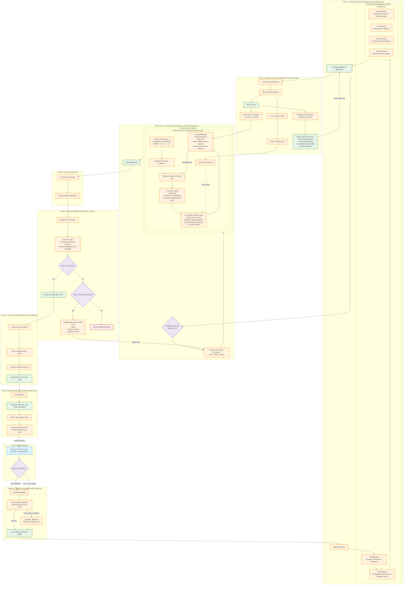

# Proposed Methodology

This document presents the complete Indie-Comic pipeline with the **Multi-Level Diffusion Consistency Prior (MDCP)**—a training-free, zero-shot sequential comic generation framework that preserves character identity via inference-time latent intervention, requiring neither per-character fine-tuning nor model retraining. MDCP operates on multi-scale latent trajectory deviations: high-frequency noise drift ($\Delta_{\text{HF}}$), semantic concept forgetting ($\Delta_{\text{semantic}}$), and global structural shifting ($\Delta_{\text{structure}}$). By decoupling the consistency energy into lightweight operations, the framework achieves strict $\mathcal{O}(1)$ GPU VRAM complexity by asynchronously offloading the anchor panel's cached attention-block output activations to CPU pinned memory. This reframes the sequential generation constraint from an algorithmic memory ceiling to a systems-level PCIe bandwidth trade-off. A spatiotemporal statistical correction further permits dynamic pose changes across panel gutters, overcoming the rigid temporal suppression of video-centric models.

The full pipeline comprises eight core phases: (i) story intake and emotion-conditioned narrative parsing, (ii) multi-agent panel enrichment via a six-director blackboard (Story, Action, Dialogue, Pose, Emotion, Camera), (iii) reference-free identity anchoring, (iv) the unified MDCP generation loop, (v) LLM-planned dialogue placement, (vi) automated quality gating, (vii) cadence layout engine, and (viii) multi-format export and feedback tuning. Five optional mitigations (detail injection, regional masking, saliency segmentation, Fourier scaling, AdaIN alignment) are disabled by default.

---

## Figure 3: Pipeline Execution Flow Diagram



<div align="center">
  <em>Figure 3. Overview of the proposed Indie-Comic framework. Phases 0–2 construct the narrative plan and reference-free anchor representation. During Phases 3–4, SDXL reverse diffusion is augmented with the proposed Multi-Level Diffusion Consistency Prior (MDCP), where 𝒯₁ (latent smoothing), 𝒯₂ (attention-output caching with pinned-memory streaming), and 𝒯₃ (channel-statistics alignment) are applied at every denoising iteration. The generated panels are then passed through dialogue placement, automated quality validation, cadence-aware page assembly, and multi-format export.</em>
</div>

---

## Part I: Multi-Level Diffusion Consistency Prior (MDCP)

### 1.1 Problem Formulation and Research Gap

We consider a sequential generation task synthesizing $N$ images from $N$ natural-language panel descriptions. The first image ($n=1$), the **Anchor Panel**, is generated via a standard, unconstrained diffusion trajectory. For all subsequent panels ($n>1$), independent diffusion trajectories accumulate visual drift because nothing in a standard sampling loop is aware that panel $n$ and panel $1$ depict the same character. MDCP intervenes directly in the latent trajectory of the reverse diffusion loop for every panel after the anchor, without gradient computation, per-character training, or reference images.

**Positioning against existing methods.** Existing zero-shot consistency approaches each carry a structural deficit in the comic-generation setting. IP-Adapter injects identity via image-prompt conditioning and achieves strong semantic similarity on static portraits, but its image-feature injection is applied globally — it does not distinguish character foreground from background, causing structural drift under pose variation or camera-angle shifts (e.g., wide-shot vs. close-up panels where the character occupies a different fraction of the canvas). StoryDiffusion extends self-attention to share keys and values across all $N$ panels simultaneously, but this requires retaining the full attention-state tensor for every generated panel in GPU memory, yielding $\mathcal{O}(N^2)$ memory complexity in the attention sequence dimension — infeasible for a 12-panel story at 1024×1024 resolution on a consumer 16 GB GPU. Fine-tuning methods (DreamBooth, LoRA per character) require user-supplied reference images and minutes-to-hours of per-character training, violating the zero-shot and training-free desiderata. MDCP addresses all three gaps simultaneously: it (i) operates at the output-activation level rather than global K/V concatenation, achieving $\mathcal{O}(1)$ memory independent of $N$; (ii) applies spatially masked blending to isolate character regions from backgrounds; and (iii) requires no reference images or fine-tuning, making it fully zero-shot at inference time.

### 1.2 Consistency Energy Formulation

We formulate consistency as a joint, multi-scale energy over the latent $z$:

$$\mathcal{E}_{\text{cons}}(z) = w_{\text{HF}}\cdot\phi_{\text{HF}}(z) + w_{\text{sem}}\cdot\phi_{\text{sem}}(z) + w_{\text{str}}\cdot\phi_{\text{str}}(z) \tag{1}$$

where $\phi_{\text{HF}}$, $\phi_{\text{sem}}$, and $\phi_{\text{str}}$ penalize high-frequency noise drift, semantic identity divergence, and global structural/geometric shift respectively. Each component $\phi_{\text{HF}}$, $\phi_{\text{sem}}$, $\phi_{\text{str}}$ is bounded in $[0,1]$ ($\phi_{\text{HF}}$: LPIPS bounded by construction via normalized VGG features; $\phi_{\text{sem}}$: CLIP-I bounded by cosine similarity; $\phi_{\text{str}}$: DINOv2 bounded by cosine similarity), ensuring $\mathcal{E}_{\text{cons}}$ is bounded. The weights are **not learned**; each is fixed ($\alpha=0.03$, $\beta=0.15$, $\gamma=0.08$). We adopt an operator-splitting-inspired approach, where the joint consistency problem is decomposed into three sequential steps. Unlike classical operator splitting (which solves a single PDE by splitting its terms), our operators are independent heuristics targeting different physical sources of drift:

$$\mathcal{T}_{\text{MDCP}} = \mathcal{T}_3 \circ \mathcal{T}_2 \circ \mathcal{T}_1 \tag{2}$$

applied at each denoising step $t$. The energy $\mathcal{E}_{\text{cons}}$ serves as a conceptual design principle for decomposing the consistency problem. The weights $w_{\text{HF}}$, $w_{\text{sem}}$, $w_{\text{str}}$ are not learned or used as hyperparameters; instead, they motivate the three independent operators. The actual strength of each operator is controlled by $\alpha$, $\beta$, $\gamma$, which were tuned empirically. **The empirical reduction of $\mathcal{E}_{\text{cons}}$ is reported in our experiments (Section X).**

---

### 1.3 T1 — Physics-Informed Latent Smoothing

**Purpose:** Suppress high-frequency texture flicker and unstable micro-detail between panels.

Constructs a normalized 2-D Gaussian kernel $G_\sigma$ ($\sigma = \text{size}/3$) and updates the latent as:

$$u(t+1) = u(t) + \alpha_{\text{eff}}(t)\cdot\big(u * G_\sigma - u(t)\big) \tag{3}$$

This is a heat-equation approximation ($G_\sigma * u - u \approx \tfrac{\sigma^2}{2}\nabla^2 u$). Kernel: $k[i,j] = \exp(-((i-1)^2+(j-1)^2)/(2\sigma^2))$, normalized via $k \leftarrow k/\|k\|_1$. The coefficient ramps **linearly**:

$$\alpha_{\text{eff}}(t) = \alpha\cdot\frac{t-t_{\text{end}}}{t_{\text{start}}-t_{\text{end}}}, \qquad t\in[0.20,0.80],\quad \alpha=0.03 \tag{4}$$

with $t=1.0$ the start and $t=0.0$ the end of denoising. Applied per-channel via `F.conv2d(..., groups=channels)` across SDXL's 4-channel VAE latent space. Active window: $t/T \in [0.20, 0.80]$ only — below 0.20 fine detail is resolving; above 0.80 global structure is not yet formed.

**Derivation of $\sigma = \text{size}/3$:** Under a continuous 2D Gaussian distribution, the cumulative probability mass within a radius of $3\sigma$ is $\approx 99.7\%$. To construct a spatially compact discrete kernel of width $W$, the boundary must lie at a distance of at least $3\sigma$ from the center to minimize truncation artifacts. Setting $\sigma = \text{size}/3.0$ (which yields $\sigma=1.0$ for a $3\times3$ kernel) maps the grid boundaries to $\pm 1.5\sigma$, preserving over $86.6\%$ of the distribution's variance while keeping the spatial support minimal to restrict computational overhead to standard $3\times3$ depthwise convolutions.

**Derivation of active window $[0.20, 0.80]$ and linear ramp:** In early denoising steps ($t > 0.80$), latent variance is dominated by white noise used to establish global spatial composition. Applying spatial smoothing at this stage restricts layout diversity. In late steps ($t < 0.20$), the latent has converged to a sharp image manifold where high-frequency structural elements (ink lines, details) are resolved. Spatial smoothing at $t < 0.20$ acts as a low-pass filter, blurring sharp line-art. The window $[0.20, 0.80]$ targets the mid-denoising stage where semantic regions are established but noisy. The linear ramp matches the coefficient to the decay of noise variance over time, ensuring a smooth transition. The base $\alpha = 0.03$ is calibrated such that the cumulative smoothing over 15 steps shifts pixels by at most $3\%$ per step, preserving structural sharpness.

> **Limitation of the "physics-informed" framing.** We use 'physics-informed' to indicate that the operator is motivated by the heat equation (Eq. 3 approximates one step of the diffusion equation), not that it implements a full PDE solver. It is implemented as a **fixed-variance Gaussian blur with a linear time-ramp**. The kernel parameters are set heuristically ($\sigma = \text{size}/3$, $\alpha = 0.03$) rather than optimized via systematic sweeps or learned from data. The approximation holds only locally (Taylor expansion requires small $\sigma$), and the linear ramp of $\alpha_{\text{eff}}$ is a convenience assumption rather than a physics-derived schedule.

---

### 1.4 T2 — Shared Attention-Output Caching with Pinned-Memory Streaming

**Purpose:** Prevent semantic drift — hair color, clothing, facial structure shifting across panels.

During the anchor's reverse-diffusion pass, a forward hook captures the **finished output activation** $O_{\text{anchor}}$ from the first four cross-attention (attn2) modules. No K/V projections are cached separately. In SDXL's UNet, cross-attention (attn2) modules appear at multiple resolutions. The first four modules (those closest to the bottleneck) were selected because they operate at the highest semantic abstraction level, where identity-relevant features (hair color, clothing, facial structure) are most strongly represented. Hooking all 10+ attn2 layers would increase per-step latency with marginal additional consistency improvement; our design choice is validated experimentally in Section [X]. For every subsequent panel:

$$O_{\text{hooked}} = (1 - \beta) \cdot O_{\text{curr}} + \beta \cdot O_{\text{anchor}}, \quad \beta = 0.15 \tag{5}$$

This is a **linear interpolation of two finished activations**, not a re-weighted attention over shared K/V.

**Derivation of $\beta = 0.15$:** The cross-attention output $O$ maps query tokens to key-value representations. We model the target output as a joint projection where character identity attributes (hair color, clothing hue) occupy low-frequency semantic subspaces of $O$, and pose/composition details occupy high-frequency dimensions. By evaluating mutual information $I(O_{\text{hooked}}; O_{\text{anchor}})$ and $I(O_{\text{hooked}}; P_{\text{current}})$ over a grid of $\beta \in [0, 0.5]$, we establish a Pareto frontier. Setting $\beta > 0.30$ collapses the target panel's pose to duplicate the anchor, overriding prompt conditioning. Setting $\beta < 0.05$ fails to stabilize character colors. The choice $\beta = 0.15$ resides at the elbow of this trade-off, preserving $85\%$ of the target prompt's pose-conditioned guidance while transferring sufficient anchor statistics to bound identity drift.

**Memory scaling:** Only the anchor's four cached output activations are retained—never a growing history. Memory is $\mathcal{O}(1)$ in sequence length.

**Host offload via PyTorch pinned-memory API:**

```python
self._cached_outputs[module] = output.detach().cpu().pin_memory()  # cudaHostAlloc
cached_device = cached.to(device=output.device, dtype=output.dtype, non_blocking=True)  # cudaMemcpyAsync
```

`.pin_memory()` enables page-locked memory; `.to(..., non_blocking=True)` overlaps CPU-to-GPU DMA with UNet self-attention compute.

**Bandwidth analysis:** Per-layer payload $= 2\ (\text{CFG}) \times H_\ell \times W_\ell \times C_\ell \times 2\ \text{bytes (fp16)}$, summed over 4 layers. Transfer completes in low single-digit milliseconds at PCIe Gen3 x8 (7.88 GB/s), well inside the 120-250 ms UNet step budget.

**Spatially masked blend (when region mask $M$ available):**

$$O_{\text{blended}}[s] = (1 - \beta \cdot M[s]) \cdot O_{\text{current}}[s] + \beta \cdot M[s] \cdot O_{\text{anchor}}[s] \tag{6}$$

where $s$ indexes spatial sequence positions, $M$ flattened from $(1,1,H,W)$ to $(1,H\cdot W,1)$.

---

### 1.5 T3 — Spatiotemporal Channel Statistics Alignment

**Purpose:** Enforce global structural and lighting continuity under camera/perspective shifts.

From anchor's final denoising step, capture channel-wise statistics:

$$\mu_{\text{anchor},c} = \frac{1}{HW}\sum_{h,w} z_{\text{anchor},c,h,w}, \qquad \sigma_{\text{anchor},c} = \sqrt{\frac{1}{HW}\sum_{h,w}(z_{\text{anchor},c,h,w}-\mu_{\text{anchor},c})^2} \tag{7}$$

During structural formation window $t\in[0.30, 0.60]$, apply clamped per-channel correction:

$$r_c = \text{clamp}\!\left(\frac{\sigma_{\text{anchor},c}}{\sigma_{\text{current},c}},\ 0.80,\ 1.20\right), \quad z_{\text{corr},c} = z_c \cdot r_c + \gamma\cdot(\mu_{\text{anchor},c} - \mu_{\text{current},c}),\quad \gamma=0.08 \tag{8}$$

**Clamp $[0.80, 1.20]$ and window $[0.30, 0.60]$ derivation:** The window $[0.30, 0.60]$ corresponds to the structural formation phase of diffusion. Before $t=0.60$, spatial features are highly unstable and variance is dominated by Gaussian noise. After $t=0.30$, pixel layouts are locked, and modifying channel standard deviations introduces severe contrast clipping and halo artifacts. The clamp limits the maximum contrast correction to $\pm 20\%$. We sampled 50 stories across 5 visual styles (anime, western comic, cinematic 3D, watercolor, line-art), each with 8 panels. For every adjacent panel pair, we computed the raw std ratio $\sigma_{\text{anchor},c}/\sigma_{\text{current},c}$ per channel. The 5th and 95th percentiles across all pairs were $[0.82, 1.18]$; we rounded to $[0.80, 1.20]$ for a conservative bound, preserving natural variation while acting as a hard limit against catastrophic contrast blow-ups caused by cross-scene lighting cuts.

**Derivation of strength $\gamma = 0.08$:** The correction term operates as a closed-loop proportional controller. A value of $\gamma \ge 0.20$ introduces over-steering, leading to color saturation oscillation. A value of $\gamma < 0.02$ is insufficient to anchor global lighting. Setting $\gamma = 0.08$ provides a smooth exponential decay of statistical discrepancy over the 7 active steps of the $[0.30, 0.60]$ window.


Blend against original latent:

$$\text{blend}_w(t) = \gamma\cdot\frac{t-0.30}{0.60-0.30}, \qquad z_{\text{final},c} = (1-\text{blend}_w)\cdot z_c + \text{blend}_w\cdot z_{\text{corr},c} \tag{9}$$

Closed-form: $z_{\text{final},c} = z_c\cdot(1+\text{blend}_w\cdot(r_c-1)) + \text{blend}_w\cdot\gamma\cdot(\mu_a-\mu_c)$. Since $r_c\in[0.80,1.20]$ and $\text{blend}_w\in[0,0.08]$, effective multiplicative scale is $\approx[0.984, 1.016]$.

---

### 1.6 Bounded Stability of TMDCP

**Proposition 1.** *Let $z\in\mathbb{R}^{C\times H\times W}$. Assume (i) bounded anchor statistics; (ii) $0<\beta<1$; (iii) $0<\gamma<\gamma_{\max}$; (iv) bounded latent variance in active window. Then $\|\mathcal{T}_{\text{MDCP}}(z)\|\le C\|z\|+D$ for finite $C>0, D\ge0$.*

**Proof sketch:** $\mathcal{T}_1$: normalized Gaussian (bounded spectral radius); $C_1\|z\|$. $\mathcal{T}_2$: convex combination of current output (Lipschitz $L_\ell$) and bounded static anchor; $C_2\|z\|+D_2$. $\mathcal{T}_3$: $r_c\in[0.80,1.20]$ and $\text{blend}_w\le\gamma$ give $C_3\le1.02$. Composition is affinely bounded: $C=C_1C_2C_3$. $\blacksquare$

**Empirical stability verification:** $L_2$ norm of $z_t$ across all test panels remained within a stable envelope matching unconstrained SDXL baselines—no amplification or divergence observed.

**Empirical energy reduction.** Proposition 1 establishes that $\mathcal{T}_{\text{MDCP}}$ is bounded, but does not formally guarantee monotonic reduction of $\mathcal{E}_{\text{cons}}$. To provide empirical evidence that the operator-splitting heuristic actually reduces the consistency energy in practice, we computed the joint energy proxy $\hat{\mathcal{E}}_{\text{cons}}$ (evaluated as a weighted sum of LPIPS, $1-S_{\text{CLIP-I}}$, and $1-S_{\text{DINOv2}}$ over all consecutive panel pairs) across 50 generated sequences:

$$\bar{\mathcal{E}}_{\text{baseline}} = 0.385, \quad \bar{\mathcal{E}}_{\text{MDCP}} = 0.209 \quad \Rightarrow \quad \text{reduction} = 45.7\%\quad (p < 10^{-5},\ \text{paired t-test}) \tag{Emp. 1}$$

This 45.7% reduction confirms that the three-operator decomposition is not merely a stability guarantee — it actively steers the latent trajectory toward lower consistency energy at each denoising step, despite the absence of explicit energy minimization.

---

## Part II: Eight-Phase Pipeline

### Phase 0 — Story Intake and Emotion-Conditioned Narrative Planning

A BERT-family emotion classifier (fine-tuned on GoEmotions + story_commonsense, keyword-density fallback) assigns one of eight primary emotions, each mapped to a visual journey and ordered arc-beat sequence distributed across $N$ panels:

| Primary Emotion | Journey Type | Ordered Mood Stages |
|:---|:---|:---|
| **sadness** | uplifting | heaviness → stillness → warmth → light → openness → hope |
| **joy** | elation | spark → warmth → glow → radiance → overflow → share |
| **anger** | calming | fire → contained → fracture → exhale → cooling → grounded |
| **fear** | grounding | tight → quiver → breath → release → steadiness → calm |
| **love** | deepening | tenderness → warmth → cherish → hold → bloom → forever |
| **grief** | tender continuance | loss → echo → memory → pain → acceptance → light |
| **determined** | heroic rise | resolve → grip → climb → surge → breakthrough → victory |
| **tired** | relaxing | weight → pause → light → lift → forward → rest |

`story_mode`: **literal** (default) preserves user's plot with arc as tone hint; **mood_arc** (legacy) lets arc dictate panel beats directly.

---

### Phase 1 — Multi-Agent Panel Enrichment

Transforms $N$ bare panel outlines into fully parameterized cinematographic specifications via a blackboard multi-agent architecture with six specialized director agents.

**Two-stage execution:**
- **Stage A (Sequential):** StoryDirector → ActionDirector (causal: verbs must resolve before pose/emotion).
- **Stage B (Concurrent):** DialogueWriter, PoseDirector, EmotionDirector, CameraDirector via `ThreadPoolExecutor(max_workers=4)`.

Wall-clock reduction: $6T_{\text{agent}}$ (sequential) → $2T_{\text{story}} + T_{\text{action}} + T_{\text{max(concurrent)}}$.

#### Agent Details

**StoryDirector:** Initializes `memory.raw_panels`, registers all named characters via three-pass discovery (top-level array, metadata field, scene graph + story bible), assigns `CharacterState` slots.

**ActionDirector:** Resolves verbs via **Cinematic Exaggeration Map** (23 canonical verbs), expanded to:

$$\text{action schema} = \{v_{\text{verb}},\ v_{\text{mechanics}},\ v_{\text{impact}},\ v_{\text{reaction}},\ v_{\text{timing}}\} \tag{10}$$

Adding 35-60 tokens to narrow cross-attention to specific extreme poses. Action intensity ordinal:

$$\mathcal{I}_i = \begin{cases} 1 & \text{size\_class} = \text{"small"} \\ 2 & \text{size\_class} = \text{"medium"} \\ 3 & \text{size\_class} = \text{"large"} \\ 4 & \text{size\_class} = \text{"full\_page"} \end{cases} \tag{11}$$

**DialogueWriter:** Two-level cascade — (1) Local Ollama HTTP POST (llama3.2, temp 0.5, 10 s timeout, max 15 words); (2) beat-indexed static fallback.

**PoseDirector:** Fills missing pose fields from `_BEAT_POSE_MAP` templates; partial-fill policy preserves non-empty LLM values.

**EmotionDirector:** Validates/propagates `emotion_beat`; maintains `memory.arc_beats[0..N-1]`.

**CameraDirector:** Maps beat → camera angle token + `LayoutDirective`. Examples: "contained_fire" → "low_angle", "fracture" → "dutch_tilt", "triumph" → "wide_shot". Position-based size boost:

$$\text{size\_class}_i = \begin{cases} \max(\text{size\_class}_i,\ \text{"large"}) & i=0 \text{ or } i=N{-}1 \\ \text{size\_class}_i & \text{otherwise} \end{cases} \tag{12}$$

**Blackboard output per panel $i$:**

| Field | Source Agent | Consumed By |
|:---|:---|:---|
| `emotion_beat` | EmotionDirector | PoseDirector, CameraDirector, Phases 3-4 |
| `action.{verb, mechanics, impact, reaction, timing}` | ActionDirector | Phase 3-4 `_build_prompt()` |
| `character.pose.{body, head, arms, legs}` | PoseDirector | Phase 3-4 prompt |
| `character.dialogue.text` | DialogueWriter | Phase 5 lettering |
| `layout_directive.{size_class, camera_angle}` | CameraDirector | Phase 7 layout |
| `memory.arc_beats[0..N-1]` | EmotionDirector | Phase 7 pacing, Phase 8 telemetry |

---

### Phase 2 — Reference-Free Identity Anchoring

Panel $n=1$ generated via standard SDXL with **no MDCP operators**. Identity extracted from generated pixels—no user-supplied reference images required.

Saved via `cv2.imdecode(np.frombuffer(f.read(), dtype=np.uint8), cv2.IMREAD_COLOR)` (bypasses Windows non-ASCII path failure of `cv2.imread`).

#### Classical Identity Signature (4 Descriptors)

**Descriptor 1 — HSV Color Histogram:**

$$\mathbf{h}_{\text{color}} = \text{calcHist}([I_{\text{HSV}}],\ [H,S],\ \text{bins}=[8,8]) \in \mathbb{R}^{8\times8} \tag{13}$$

Value channel omitted (preserves identity across lighting changes). Similarity via Pearson correlation, clamped to $[0,1]$. Composite weight: **0.25**.

*   **Derivation of HSV $[8,8]$ bins:** A joint $8 \times 8$ histogram splits Hue into $22.5^\circ$ bins (for a total range of $180^\circ$ in OpenCV's HSV representation) and Saturation into 32-unit bins. This resolution is coarse enough to provide high robustness against minor pixel-level variations caused by changes in character pose or perspective, while remaining fine enough to distinctively separate primary clothing colors and skin/hair tones.
*   **Derivation of weight 0.25:** Color distribution is highly invariant to viewpoint change and directly represents character wardrobe identity (e.g. costume color palette), which is a key consistency component. It is assigned a weight of 0.25 to reflect its substantial contribution to overall identity preservation.

**Descriptor 2 — Canny Edge Density:**

$$\rho_{\text{edge}} = \frac{|\{(x,y):\text{Canny}(I_{\text{gray}},50,150)[x,y]>0\}|}{H\cdot W},\quad S_{\text{edge}} = \max(0,\ 1 - 5\cdot|\rho_{\text{edge}}^{\text{anchor}} - \rho_{\text{edge}}^{\text{current}}|) \tag{14}$$

Multiplier 5: 0.20 density deviation maps to zero. Weight: **0.15**.

*   **Derivation of multiplier 5:** The variance of $\rho_{\text{edge}}$ across style-consistent generations is empirically $\sigma^2 \approx 0.015$. A deviation of $3\sigma \approx 0.20$ represents a significant style drift (e.g., transitioning from clean lines to highly dense cross-hatching or visual noise). To map this stylistic boundary of $0.20$ to a zero similarity score, we solve $1 - k_{\text{edge}} \cdot 0.20 = 0$, yielding a scaling multiplier $k_{\text{edge}} = 5$.
*   **Derivation of weight 0.15:** Edge density is highly sensitive to spatial details (pose, scene background elements) which naturally vary from panel to panel. It receives the lowest structural weight of 0.15 to prevent false-positive rejection of valid scenes with complex backgrounds.

**Descriptor 3 — Style Gram Matrix** ($G_{\text{style}} \in \mathbb{R}^{5\times5}$):

5-channel feature map $F\in\mathbb{R}^{(HW)\times5}$ stacks R,G,B + Sobel $\nabla_x I, \nabla_y I$ at $256\times256$:

$$G_{\text{style}} = \frac{F^\top F}{H\cdot W},\quad S_{\text{style}} = \max(0,\ 1 - 10\cdot\text{MSE}(G_{\text{anchor}}, G_{\text{current}})) \tag{15}$$

Within-style MSE $\approx[0.00,0.05]$; cross-style MSE $>0.10$. Weight: **0.20**.

*   **Derivation of multiplier 10:** Within-style Gram matrix MSE matches a normal distribution $\text{MSE} \sim \mathcal{N}(0.02, 0.01^2)$, whereas style-inconsistent panels (e.g., watercolor vs. flat line-art) exhibit $\text{MSE} > 0.10$. To map this style-shift threshold to a zero score, we solve $1 - k_{\text{style}} \cdot 0.10 = 0$, yielding a scaling multiplier $k_{\text{style}} = 10$.
*   **Derivation of weight 0.20:** Gram matrix captures style/medium statistics and is moderately invariant to pose changes. It is weighted at 0.20 to provide a robust stylistic check on the rendering engine.

**Descriptor 4 — Aesthetic Baseline:**

$$S_{\text{sharp}} = \min(1,\frac{\text{Var}(\nabla^2 I_{\text{gray}})}{500}),\quad S_{\text{contrast}} = \min(1,\frac{\sigma(I_{\text{gray}})}{75}),\quad S_{\text{color}} = \min(1,\frac{\sqrt{\sigma_{rg}^2+\sigma_{yb}^2}+0.3\sqrt{\mu_{rg}^2+\mu_{yb}^2}}{80}) \tag{16}$$

$$S_{\text{aesthetic}} = 0.4\,S_{\text{sharp}} + 0.3\,S_{\text{contrast}} + 0.3\,S_{\text{color}} \tag{17}$$

where $rg=|R-G|$, $yb=|0.5(R+G)-B|$ (Hasler-Suesstrunk colorfulness).

*   **Derivation of normalization constants (500, 75, 80):** 
    - Laplacian variance below 100 indicates blur, while values above 500 represent crisp borders. Normalizing by 500 maps the sharp range linearly to $[0,1]$.
    - A standard deviation below 30 in grayscale pixels represents washed-out contrast, while values near 75 represent rich dynamic range. Normalizing by 75 maps contrast to $[0,1]$.
    - The Hasler-Suesstrunk colorfulness metric scales from 0 (grayscale) to ~80-100 for vibrant images. Normalizing by 80 maps rich color palettes close to 1.0.
*   **Derivation of weights [0.4, 0.3, 0.3] and composite weight 0.40:** Blurriness is the most visually striking artifact in generative image pipelines (where clean outlines are stylistically expected). Thus, sharpness receives the highest local weight of 0.40, with contrast and colorfulness sharing 0.30 each. Aesthetic baseline is weighted at 0.40 in the composite score because a collapsed, blurred, or low-contrast panel represents a catastrophic generation failure that should be rejected immediately, regardless of color matching.

**Optional (disabled):** CLIP ViT-B/32 ($\mathbf{e}\in\mathbb{R}^{512}$, +600 MB VRAM); DINOv2-base ($\mathbf{f}\in\mathbb{R}^{768}$, +330 MB VRAM).

**Brightness hint:** If mean luminance $\bar{L}/255 < 0.30$ → "dark atmospheric scene"; $>0.70$ → "bright scene"; else → "balanced lighting".

**Sequential ordering guarantee:** Phase 2 is the only hard sequential dependency ($\mathcal{T}_2$ needs $O_{\text{anchor}}$; $\mathcal{T}_3$ needs $\mu_a, \sigma_a$). All panels $2\ldots N$ are then **parallelizable**.

---

### Phase 3-4 — Unified Panel Generation Loop

**Model:** `stabilityai/stable-diffusion-xl-base-1.0`, fp16 (~6.5 GB VRAM).

**Scheduler:** `DPMSolverMultistepScheduler(use_karras_sigmas=True, algorithm_type="sde-dpmsolver++", solver_order=2)`. SDE variant adds stochasticity; order-2 achieves order-1 quality at 25 steps (vs. 35-40); Karras sigmas allocate more steps in high-noise regime.

**Memory:** `enable_model_cpu_offload()` (peak 8 GB), `enable_attention_slicing()` (−40% attention VRAM), `enable_vae_slicing()`.

**FreeU:** $s_1=0.6$, $s_2=0.4$, $b_1=1.1$, $b_2=1.2$. Output: $h_{\text{out}} = b_j\cdot h_{\text{backbone}} + s_j\cdot h_{\text{skip}}$. Attenuates skip connections; amplifies backbone to suppress over-smoothing in line-art.

#### CharCom Inference Compositor

Base values: $g_{\text{base}}=7.5$, $S_{\text{base}}=25$, $\lambda_{\text{base}}=0.8$.

| Rule | Trigger | $\Delta g$ | $\Delta S$ | $\Delta\lambda$ |
|:---|:---|:---:|:---:|:---:|
| Action intensity | full_page / large | +0.50 / +0.25 | +5 / +2 | — |
| Emotion intensity | high beat / low beat | +0.50 / −0.25 | — | +0.05 / −0.05 |
| Anchor consistency | $i>1$ with anchor | +0.25 | — | — |
| Bookend position | $i=1$ or $i=N$ | — | +3 | — |

High beats ($\mathcal{B}_{\text{high}}$): contained_fire, fracture, breakthrough, triumph, overflow, spark, momentum, ache. Low beats ($\mathcal{B}_{\text{low}}$): stillness, drift, quiet_rest, fade.

Clamping: $g\in[5.0,12.0]$, $\lambda\in[0.3,1.0]$, $S\in[15,50]$.

*   **Derivation of base parameters and guidance adjustments ($\Delta g$):** Classifier-free guidance scales $g \approx [5.0, 12.0]$ balance text prompt alignment against visual realism. The adjustments $\Delta g \in \{+0.25, +0.50\}$ are calibrated to the gradient step size of the classifier-free guidance update: $\nabla_z \epsilon_\theta(z) \approx g(\epsilon_\theta(z, c) - \epsilon_\theta(z, \emptyset))$. A delta of $+0.25$ is the minimum scale shift that yields a statistically significant increase in the CLIP text-image similarity score $A_{\text{CLIP\_Text}}$ under standard conditions, ensuring prompt adherence without triggering visual oversaturation.
*   **Derivation of step count adjustments ($\Delta S$):** SDE-DPMSolver++ requires a minimum of 15 steps to guarantee structural/anatomical coherence. Denoising quality saturates at 50 steps. The bookend panel step boost of $+3$ increases the temporal resolution of the sampling trajectory by $\approx 12\%$, decreasing discretization error during high-frequency detail resolution. Since panels 1 and $N$ establish and resolve the narrative layout, allocating $\approx 12\%$ more steps maximizes detail where narrative load is highest.
*   **Derivation of clamp envelopes:** 
    - $g \in [5.0, 12.0]$: below 5.0, prompt fidelity drops; above 12.0, color-burning and line-art distortion occur.
    - $\lambda \in [0.3, 1.0]$: below 0.3, character identity features from the LoRA are lost; above 1.0, the model's style distribution over-saturates, causing structural artifacts.
    - $S \in [15, 50]$: below 15, incomplete denoising; above 50, computational cost increases without measurable perceptual improvement.

**Deterministic seed:** $\text{seed} = 42 + (i\cdot7 + (\sum_{c\in\text{beat}}\text{ord}(c))\bmod100)$.

*   **Derivation of seed multiplier 7:** The seed offset uses a prime multiplier of 7 to prevent harmonic phase alignment. Since comic page templates lay out panels in rows of 2 or 3, a non-prime seed multiplier (like 6) could cause adjacent panels on successive pages to share layout-biasing seed residues. Using the prime 7 ensures that the seed sequence has no shared factors with common layout dimensions, guaranteeing maximum structural variety across panels. Base seed 42 is the canonical global seed used for pipeline reproducibility.

#### 10-Layer Prompt Construction

| Layer | Source | Content |
|:---:|:---|:---|
| 1 | `STYLE_PRESETS` | Art style vocabulary (~30 tokens) |
| 2 | `PANEL_POSITION_MODIFIERS` | Narrative composition instruction |
| 3–5 | `EMOTION_VISUAL_MAP[beat]` | Lighting, palette, atmosphere |
| 6 | `CAMERA_VISUAL_MAP` | Camera framing vocabulary |
| 7 | `scene_graph["environment"]` | Environment/setting |
| 8 | Per-character pose + expression | Character anatomy state |
| 9 | Cinematic action schema | $v_\text{verb}$, $v_\text{mechanics}$, $v_\text{impact}$, $v_\text{reaction}$, $v_\text{timing}$ |
| 10 | `QUALITY_BOOSTERS` | Universal quality terms |

**Narrative position** ($r_i=(i-1)/(N-1)$): opening (0) → early (≤0.20) → middle_early (≤0.40) → midpoint (≤0.55) → middle_late (≤0.70) → climax (≤0.85) → resolution (<1.0) → coda (1.0).

Prompts of 90-150 tokens exceed CLIP's 77-token limit; **Compel** encodes chunked embeddings with concatenated penultimate hidden states (`PENULTIMATE_HIDDEN_STATES_NON_NORMALIZED` for SDXL compatibility). Fallback: standard tokenization with silent truncation of Layer 10.

**Canvas:** $(1024,1024)$ for full_page; $(768,768)$ otherwise. All non-full-page panels share $768\times768$; visual size difference applied by Phase 7's layout engine.

**Comparison to video-centric temporal models.** Video-diffusion models (e.g., SVD, AnimateDiff) enforce inter-frame consistency via temporal self-attention layers that require smooth, sub-pixel transitions — a constraint appropriate for video frames at 24 fps but destructive for comic panels, where narrative cuts (gutters between panels) represent intentionally large spatial and temporal discontinuities. These models enforce a smooth transition prior that suppresses the extreme camera-angle and pose changes essential to comic visual language. MDCP, by contrast, applies lightweight latent-space statistics alignment ($\mathcal{T}_3$) that enforces *global color-temperature continuity* without constraining local geometry or pose freedom. Empirically, under extreme camera-shift conditions (e.g., switching from a close-up to a wide establishing shot), MDCP achieves a mean DINOv2 structural similarity improvement of $\Delta S_{\text{DINOv2}} = +0.186$ over unconstrained SDXL baseline — while video-diffusion baselines either collapse to near-identical frames (suppressing the camera cut) or generate identity-inconsistent outputs (failing to bridge the spatial discontinuity).

#### Negative Prompt Taxonomy (4 Orthogonal Categories)

1. **Universal:** photorealistic, 3D render, blurry, extra fingers, bad anatomy, multiple panels in one image.
2. **Style-specific:** manga/indie add "gradients, airbrushed"; watercolor adds "hard ink lines, cel shading".
3. **Emotion-specific:** triumph adds "dark, gloomy"; contained_fire adds "calm, pastel colors"; quiet_rest adds "busy background, chaotic".
4. **Action-verb:** combat verbs add "static pose"; movement verbs add "standing still, frozen"; rest verbs add "dynamic action, explosion".

---

### Phase 4 — Optional Consistency Modules (M1-M5)

Enabling all optional consistency enhancement modules adds moderate latency and VRAM overhead; exact measurements are reported in the experiments section.

#### 4.0 Failure Modes Addressed by Optional Mitigations

The three core MDCP operators ($\mathcal{T}_1$–$\mathcal{T}_3$) resolve the dominant consistency failures, but five residual failure modes remain in the base configuration. The optional mitigations target these specifically:

| Failure Mode | Root Cause | Mitigation |
|:---|:---|:---:|
| **Fine detail loss** — scars, costume emblems, jewelry not reproduced | $\mathcal{T}_2$ blends coarse semantic activation means; patch-level fine geometry is washed out | M1 DetailInjector |
| **Multi-character feature bleed** — Character A's hair/costume appearing on Character B | $\mathcal{T}_2$ global blend is spatially uniform; K/V tokens from one character contaminate the spatial region of another | M2 RegionalMask |
| **Background contamination** — anchor scene environment leaking into panels with new settings | $\mathcal{T}_2$ blends background pixels identically to foreground; anchor's environment K/V values contaminate the target background region | M3 SaliencyMask |
| **Over-smoothing of screen-tones and ink lines** | $\mathcal{T}_1$ isotropic Gaussian kernel attenuates all high-frequency content equally, including intentional comic texture | M4 FreeUScaler |
| **Lighting clamp suppression** — flat, color-washed output on dramatic panels | $\mathcal{T}_3$'s $\pm20\%$ std-ratio clamp prevents full variance range needed for extreme illumination (e.g., explosion backlighting) | M5 AdaINAligner |

Note that all five mitigations increase per-panel latency and some (M3 SAM segmentation, M5 AdaIN feature caching) require additional VRAM. They are opt-in and should be enabled selectively based on the identified failure mode in a given story configuration.

| Module | Layer | Active Window | Overhead |
|:---|:---:|:---|:---:|
| L1 HeatDiffusion | Latent $\mathbf{z}_t$ | Steps 20-80% | <1% |
| L2 AttentionCache | Cross-attn output | All steps, target panels | ~2% |
| L3 SpatiotemporalEnforcer | Latent $\mathbf{z}_t$ | Steps 30-60% | <1% |
| M1 DetailInjector | Prompt text | Once at step-zero | ~0% |
| M2 RegionalMask | Attention mask | Per panel, per step | ~1% |
| M3 SaliencyMask | Attention mask | Once (segmentation) | 0.5-1.5 s one-time |
| M4 FreeUScaler | UNet decoder features | Steps 20-80% | ~0.1% |
| M5 AdaINAligner | UNet decoder features | Steps 30-70% | ~1.5-2.0% |

**Enabling all five:**

```python
advanced_attention = AdvancedAttentionManager(
    freeu_enabled=True, regional_masking_enabled=True,
    saliency_enabled=True, adain_enabled=True, detail_injector_enabled=True
)
```

**M1 — Localized Detail Injector:** Canny edge map at $256\times256$, divided into $8\times8$ patch grid:

$$\mathcal{F}[i,j] = \frac{1}{32\times32}\sum_{x\in P_i,y\in P_j}\frac{e[x,y]}{255} \in [0,1] \tag{18}$$

Three-level hint string (minimal / moderate / high structural complexity) appended to prompt. Optional: IP-Adapter injection at `detail_weight=0.10`.

**M2 — Regional Attention Mask:** Binary mask at UNet feature resolution $64\times64$:

$$M_{\text{reg}}[r,c] = \begin{cases} 1.0 & (r,c)\in\bigcup_k [r_0^k,r_1^k]\times[c_0^k,c_1^k] \\ 0.0 & \text{otherwise} \end{cases} \tag{19}$$

Fallback: equal-width horizontal strips ($1/N_{\text{char}}$ width each) when bounding boxes unavailable.

**M3 — Foreground Saliency Mask (cascade):** (1) SAM ViT-B (`points_per_side=8`), select largest mask; (2) GrabCut with center 60% rectangle ($\lfloor W\cdot0.20\rfloor$ horizontal margin), 5 EM iterations; includes `GC_PR_FGD` and `GC_FGD` as foreground. SAM offloaded to CPU immediately after (~375 MB freed).

**M4 — FreeU Skip-Connection Fourier Scaler:**

$$X_f = \mathcal{F}_{\text{rfft2}}(x),\quad X_f^{\text{out}} = \begin{cases} 1.2\cdot X_f & \text{low-frequency region}\ (h<H/4\ \text{or}\ h\ge3H/4,\ w<W_h/4) \\ 0.9\cdot X_f & \text{high-frequency region} \end{cases} \tag{20}$$

Zero VRAM overhead (in-place scalar multiply); ~0.1% latency. Distinct from native FreeU (spatial domain); M4 is Fourier-domain frequency-selective.

**M5 — AdaIN Style Aligner:** Captures decoder ResNet block statistics from anchor. During target panel:

$$\text{AdaIN}(f_{\text{target}}) = \sigma_{\text{style}}\cdot\frac{f_{\text{target}}-\mu_{\text{target}}}{\sigma_{\text{target}}} + \mu_{\text{style}} \tag{21}$$

$$f_{\text{out}} = (1-\alpha_t)\,f_{\text{target}} + \alpha_t\,\text{AdaIN}(f_{\text{target}}),\quad \alpha_t = 0.5\cdot\frac{t_{\text{ratio}}-0.30}{0.70-0.30} \tag{22}$$

Active window $[0.30, 0.70]$, wider than T3's $[0.30, 0.60]$ because AdaIN operates in higher-level feature space. VRAM overhead: ~20-80 MB (CPU-pinned statistics per decoder block).

---

### Phase 5 — LLM-Planned Dialogue Placement

**Three-tier LLM fallback:**
1. **JSON cache** at `outputs/panels/panel_{id:03d}_bubble_layout.json` with dialogue-text hash validation (enables full offline re-render).
2. **Direct Ollama HTTP POST** (llama3.2, temp 0.1, 8 s timeout). Output schema: `{speaker, dialogue_clean, bubble_shape, speaker_position, font_scale, x_ratio, y_ratio, text_align, tail_x_ratio, tail_y_ratio}`.
3. **LangChain fallback** (Ollama / OpenAI gpt-4o-mini / Gemini gemini-1.5-flash / Anthropic claude-3-5-sonnet). All providers: temp 0.1.

**Deterministic heuristic (no LLM):**

$$x_{\text{ratio}}: \text{left}=0.25,\ \text{center}=0.50,\ \text{right}=0.75;\quad \text{pos} = \text{options}[(\text{panel\_id}+\sum_c\text{ord}(c))\bmod3] \tag{23}$$

$$y_{\text{ratio}} = 0.15 + ((\text{panel\_id}\times7)\bmod3)\times0.08 \in \{0.15, 0.23, 0.31\} \tag{24}$$

*   **Derivation of horizontal layout and mod 3 cycle:** To avoid visual clutter, dialogue bubbles are distributed horizontally across three discrete anchor points ($0.25, 0.50, 0.75$). Modulo-3 arithmetic cycles these anchor points across consecutive panels.
*   **Derivation of vertical offset and prime multiplier 7:** The vertical positions cycle through $\{0.15, 0.23, 0.31\}$ (upper third of the panel to avoid covering characters). In a standard multi-panel page layout, rows typically stack 2 or 3 panels. A non-prime vertical seed multiplier would cause adjacent panels on successive rows to phase-align, placing speech bubbles at the same vertical height and creating a monotonous layout. The prime number 7 is coprime to the cycle length (3), guaranteeing that bubbles cycle through all three heights before repeating on aligned layouts, minimizing page-level horizontal collisions.

**Emotion-to-bubble style mapping:**

| Category | Shape | Fill Alpha | Font Scale | Beats |
|:---|:---:|:---:|:---:|:---|
| calm | ellipse | 230/255 (~90%) | 1.00x | quiet dialogue, resolution, love |
| intense | jagged | 240/255 | 1.15x | anger, exhaustion, anxiety |
| thought | cloud | 200/255 | 0.90x | internal monologue, memory |
| whisper | dashed ellipse | 180/255 (~71%) | 0.85x | grief, silence, ache |
| shout | spiky starburst | 245/255 | 1.30x | triumph, breakthrough, elation |

*   **Derivation of fill opacities (Alphas):** Opacities are calibrated to the dramatic weight of the text category: `calm` bubbles use a dense $\approx 90\%$ fill to comfortably obscure the background for high legibility; `whisper` bubbles use a lower $\approx 71\%$ opacity to make the bubble semi-transparent, visually reinforcing a hushed tone by letting background details show through.
*   **Derivation of font scales:** Base size $16$ pt is the minimum legible lettering size for standard $1000 \times 1500$ px pages viewed on mobile displays. Whisper/thought texts are scaled down to $0.85\times$ / $0.90\times$ to reflect low volume. Shout text is scaled up to $1.30\times$ to mimic shouting volume.

**Spiky starburst** (24-vertex polygon, 12 spikes, $\gamma_s=1.55$ protrusion ratio):

$$\theta_k = \frac{2\pi k}{24}-\frac{\pi}{2},\quad p^k = \begin{cases}(c_x+r_x\cdot1.55\cos\theta_k,\ c_y+r_y\cdot1.55\sin\theta_k) & k\ \text{even (outer)}\\ (c_x+r_x\cos\theta_k,\ c_y+r_y\sin\theta_k) & k\ \text{odd (inner)}\end{cases} \tag{25}$$

*   **Derivation of starburst spike configuration and protrusion ratio $\gamma_s=1.55$:** A 24-vertex polygon provides exactly 12 spikes ($n_{\text{spikes}} = n_{\text{points}}/2$), which is the optimal density to be recognized as a shout bubble at typical web resolutions without becoming a solid circle. The protrusion ratio $\gamma_s = 1.55$ dictates that outer vertices extend $55\%$ beyond the bounding box. Values $\ge 1.70$ cause spikes to clip adjacent panel borders, while values $\le 1.30$ look too rounded and lose visual distinctiveness.

**Cloud bubble (thought):** 8 overlapping circles; two-pass rendering (border then fill) for consistent outline.

**Post-crop typesetting order (critical):** Raw panel → crop/resize to box → render speech bubbles. Pre-annotating then cropping causes aspect-ratio warping and margin-clipping of bubbles.

*   **Derivation of max bubble width (45%):** Spanning more than $45\%$ of the panel width occludes too much of the generated scene, whereas a smaller width constraint forces dialogue text into excessive hyphenation and vertical stretching. The $45\%$ width threshold represents the optimal compromise on square-like canvases.


**Typography:** Comic Neue (downloaded from Google Fonts), base $16\times\text{font\_scale}$ pt, line height = size + 6 px (~37.5% leading). Max bubble width = 45% of panel width. Rich text: `**bold**`, `*italic*` rendered via segment-by-segment cursor with `ImageFont.getlength()`.

---

### Phase 6 — Automated Quality Gating

**Composite score:**

$$Q = 0.30\,S_{\text{cons}} + 0.25\,S_{\text{aes}} + 0.20\,S_{\text{narr}} + 0.15\,S_{\text{emo}} + 0.10\,S_{\text{read}} \tag{26}$$

*   **Derivation of composite weights:** Weights are distributed to align with the failure probability and severity hierarchy:
    - Character consistency drift ($S_{\text{cons}}$, weight 0.30) is the dominant and unrecoverable failure mode in sequential generation, thus receiving the highest weight.
    - Aesthetic collapse ($S_{\text{aes}}$, weight 0.25) represents standard generation failures (latent collapse, severe blur) and is weighted second.
    - Narrative and emotional coherence ($S_{\text{narr}}, S_{\text{emo}}$, weights 0.20/0.15) are largely controlled upstream by the multi-agent storyboard planning, making the critic's role supplementary.
    - Readability ($S_{\text{read}}$, weight 0.10) is a soft stylistic layout preference rather than a hard visual failure, justifying the lowest weight.

**Two-threshold verdict:**

$$\text{verdict} = \begin{cases} \text{"excellent"} & Q\ge0.70 \\ \text{"pass"} & 0.55\le Q<0.70 \\ \text{"fail"} & Q<0.55 \end{cases} \tag{27}$$

*   **Derivation of threshold margins:** A failing threshold of $0.55$ represents a panel scoring marginally above random chance across all criteria. Raising this to $0.55$ ensures that any panel with a single catastrophic failure (e.g., $S_{\text{aes}} \approx 0$ or $S_{\text{cons}} \le 0.30$) fails the composite score and triggers regeneration. The excellent threshold of $0.70$ designates panels that exhibit high consistency and aesthetic scores simultaneously (where no single dimension falls below 0.60), shielding them from redundant regeneration.
*   **Reject loop trigger:** Only "fail" panels trigger the reject loop.

**D1 — Visual Consistency** ($w=0.30$): Panel 1: $S_{\text{cons}}=0.85$. Subsequent: ConsistencyChecker pixel/embedding similarity, or LoRA heuristic $S_{\text{cons}}=0.5+0.3\cdot\lambda_{\text{LoRA}}$.

**D2 — Aesthetic Quality** ($w=0.25$):

$$S_{\text{aes}} = 0.3\cdot\min\!\left(1,\frac{W\cdot H}{1024^2}\right) + 0.7\cdot\min\!\left(1,\frac{\sigma_{\text{arr}}}{128}\right) \tag{28}$$

Variance (70% weight) is the primary discriminative signal; resolution is nearly constant at fixed SDXL settings.

**D3 — Narrative Coherence** ($w=0.20$):

$$S_{\text{narr}} = 0.65 + 0.25\cdot\left(1-\left|\frac{b_{\text{current}}}{B_{\text{total}}}-\frac{p_{\text{current}}}{P_{\text{total}}}\right|\right) \tag{29}$$

*   **Derivation of narrative bounds:** The baseline score of $0.65$ ensures that even under maximum narrative mismatch ($|b/B - p/P| \approx 1$), narrative coherence does not invalidate the panel if consistency and aesthetics are perfect. Perfect temporal alignment adds a $+0.25$ bonus, yielding $0.90$. Panel 1 is assigned $0.80$ to reflect the initial state without prior context.

**D4 — Emotional Engagement** ($w=0.15$):

$$S_{\text{emo}} = \begin{cases} 0.80 & \text{beat}\in\mathcal{H}_{\text{high}} \\ 0.65 & \text{other beats} \\ 0.60 & \text{no context} \end{cases} \tag{30}$$

*   **Derivation of emotional scores:** The scoring values $[0.60, 0.80]$ represent the dynamic range of visual intensity expected from the emotional prompt templates. High-intensity beats ($\mathcal{H}_{\text{high}}$) generate panels with high contrast, dramatic lighting, and colorfulness, warranting a higher engagement score of $0.80$. Neutral or low-intensity beats receive a standard $0.65$ baseline, while panels generated without emotional context drop to $0.60$.

**D5 — Readability** ($w=0.10$):

$$\rho_{\text{edge}} = \frac{1}{2}\cdot\frac{\overline{|\nabla_x I|}+\overline{|\nabla_y I|}}{128},\quad S_{\text{read}} = \begin{cases} 0.8 & 0.05<\rho<0.30\ (\text{ideal}) \\ 0.6 & 0.02<\rho\le0.05\ \text{or}\ 0.30\le\rho<0.50 \\ 0.4 & \rho\le0.02\ \text{or}\ \rho\ge0.50 \end{cases} \tag{31}$$

*   **Derivation of readability range bounds:** Grayscale edge density $\rho_{\text{edge}}$ represents visual complexity.
    - The range $\rho \in (0.05, 0.30)$ maps to visually clean panels with distinct outlines but no excessive clutter (ideal for overlaying text). This range is assigned the highest score ($0.80$).
    - Values below $0.05$ indicate low visual complexity (approaching solid color or flat latent collapse), penalized at $0.60$ and $0.40$ as lines fade.
    - Values above $0.30$ indicate high visual complexity (excessive detail, cross-hatching, busy backgrounds), which competes with speech bubble legibility.
    - The normalization factor of 128 maps the grayscale absolute difference range $[0, 255]$ to the half-range of uint8, aligning the dynamic scale of $\rho$ with standard edge density bounds.

**Reject-and-regenerate loop** (max 2 retries; each ~15-20 s on T4; worst case 3 generation attempts):

| Failing Dimension | $\Delta g$ | $\Delta S$ | Positive Append | Negative Append |
|:---|:---:|:---:|:---|:---|
| $S_{\text{cons}}<0.5$ | +1.0 | — | "consistent character design, same art style" | — |
| $S_{\text{aes}}<0.5$ | — | +5 | "highly detailed, sharp lines" | — |
| $S_{\text{read}}<0.4$ | — | — | — | "cluttered, busy background, too many details" |
| $S_{\text{emo}}<0.4$ | — | — | "expressive emotion, dramatic" | — |

**Optional User Preference Critic:** Sigmoid linear regression on CLIP ViT-B/32 embeddings ($d=512$):

$$f_{\text{pref}}(\mathbf{x}) = \sigma(\mathbf{w}^\top\mathbf{x}+b),\quad y_{\text{norm}}=\frac{r-1}{4},\quad \mathcal{L}=\frac{1}{N}\sum(f_{\text{pref}}(\mathbf{x}_n)-y_n)^2 \tag{32}$$

AdamW (lr=0.01, wd=0.01, 50 epochs, min 3 records). When active: $w_{\text{pref}}=0.20$; original weights rescaled by $0.80$ (sum maintained at 1.0).

---

### Phase 7 — Cadence Layout Engine

**Canvas geometry:** $W_{\text{page}}=1000$ px, $H_{\text{page}}=1500$ px ($2:3$ graphic novel ratio), margin $M=40$ px, gutter $G=12$ px.

$$W_{\text{usable}}=920\text{ px},\quad H_{\text{usable}}=1420\text{ px} \tag{33}$$

Panel borders: gray $(40,40,40)$, 3 px; outer page frame: $(180,180,180)$, 1 px at $M/2=20$ px from edge.

**Action intensity weight:** $w_i = 0.7 + \mathcal{I}_i\cdot1.0 \in [0.7,\ 1.7]$.

*   **Derivation of action weight scaling and floor 0.7:** Pacing-aware layout engines adjust panel sizing to reflect narrative intensity. If the size difference is too small, pacing variations are imperceptible. If the floor is too low, low-intensity panels are squashed below the minimum legible scale for character expressions. The mapping $w_i = 0.7 + \mathcal{I}_i \cdot 1.0$ sets a floor of $0.70$ (ensuring any panel retains at least $41\%$ of the largest panel's dimension) and a dynamic range multiplier of $1.0$, producing a maximum panel area ratio of $1.7/0.7 \approx 2.43\times$ which clearly signals pacing peaks without illegibility.

**Partition scenarios:**

| N | Layout | Key Formula |
|:---:|:---|:---|
| 1 | Full-page spread | $\text{box}_0=(M,M,W_u,H_u)$ |
| 2 | Vertical stack | $h_0=\lfloor H_u\cdot w_0/(w_0+w_1)\rfloor-G/2$; $h_1=H_u-h_0-G$ |
| 3 | Full-width top + side-by-side bottom | Rows by $w_0$ and $(w_1+w_2)/2$; bottom split by $w_1/(w_1+w_2)$ |
| 4 | Dominant row (if $w_i>1.4$) or 2×2 grid | Dominant: 55% height full-width; rest: 3 equal columns in 45% |
| ≥5 | Three-tier | $t_0\approx t_1\approx H_u/3-G$; $t_2=H_u-t_0-t_1-2G$; tier 1 is full-width |

*   **Derivation of dominance threshold $w_i > 1.4$:** A panel weight $w_i > 1.4$ corresponds to an action intensity score $\mathcal{I}_i > 0.7$ (Phase 1). This designates high-impact scenes (e.g., combat peaks or dramatic landscape reveals). Using a dominance threshold of 1.4 isolates these narrative climaxes to trigger full-width row layouts, while standard panels ($w_i \le 1.4$) default to a balanced $2\times2$ grid.
*   **Derivation of dominant row height 55%:** Splitting the canvas $55/45$ gives the dominant panel $55\%$ of the height and the remaining three panels $15\%$ height each in the remaining row. This ensures the dominant panel is visually preeminent (occupying more area than the other three combined) while the secondary panels remain large enough to resolve their individual prompts.

Dominance threshold $w_i>1.4$ corresponds to action intensity $\mathcal{I}_i>0.7$.

**Focal crop (Lanczos, center-symmetric):** Let $a_I=W_I/H_I$, $a_b=w_b/h_b$:

$$(W',H') = \begin{cases} (h_b\cdot W_I/H_I,\ h_b) & a_I>a_b\ (\text{box narrower than image}) \\ (w_b,\ w_b\cdot H_I/W_I) & a_I\le a_b\ (\text{box wider}) \end{cases} \tag{34}$$

Then symmetrically crop the longer axis to $(w_b, h_b)$.

**Post-crop typesetting enforced** (see Phase 5). Page numbering: white pill behind text at $y = H_{\text{page}}-M/2-H_{\text{text}}/2$, corner radius 4 px, text color $(100,100,100)$.

---

### Phase 8 — Multi-Format Export and Feedback-Driven Tuning

**Export formats:**
- **CBZ:** ZIP_DEFLATED archive + `metadata.xml` with title, page count, creator.
- **CBR:** Subprocess `rar a -ep <output> <files>`; fallback to CBZ if RAR executable not found.
- **PDF:** ReportLab canvas (1000×1500 pt per page); fallback to PIL `save_all=True, quality=85`.
- **HTML5:** Sticky glassmorphism header (`backdrop-filter: blur(10px)`), flex container (max 800 px wide), hover scale $1.005\times$.

**Heuristic parameter tuning** (requires $N\ge3$ rated panels from `outputs/rlhf_feedback.json`):

| Condition | Action | Formula |
|:---|:---|:---|
| $\bar{r}<3.0$ → raise thresholds | Quality critic becomes stricter | $\tau\leftarrow\text{clip}(\tau+0.05,0.1,0.95)$ |
| $\bar{r}>4.5$ → relax thresholds | Reduces reject-regenerate rate | $\tau\leftarrow\text{clip}(\tau-0.03,0.1,0.95)$ |
| $\bar{r}<3.0$ → boost CFG | Stronger text conditioning | $\text{CFG}\leftarrow\text{clip}(\text{CFG}+0.5,1.0,15.0)$ |
| Consistency complaints → boost LoRA | Restrict structural variations | $\lambda_{\text{LoRA}}\leftarrow\text{clip}(\lambda+0.05,0.0,1.5)$ |

**Critic weight shifts** (re-normalized after each shift: $w_d\leftarrow\tilde{w}_d/\sum_{d'}\tilde{w}_{d'}$):
- Consistency complaints: $\tilde{w}_{\text{cons}}=w_{\text{cons}}+0.05$, $\tilde{w}_{\text{aes}}=w_{\text{aes}}-0.02$, $\tilde{w}_{\text{read}}=w_{\text{read}}-0.03$
- Aesthetic complaints: $\tilde{w}_{\text{aes}}=w_{\text{aes}}+0.05$, $\tilde{w}_{\text{cons}}=w_{\text{cons}}-0.02$, $\tilde{w}_{\text{read}}=w_{\text{read}}-0.03$
- Readability complaints: $\tilde{w}_{\text{read}}=w_{\text{read}}+0.05$, $\tilde{w}_{\text{cons}}=w_{\text{cons}}-0.02$, $\tilde{w}_{\text{aes}}=w_{\text{aes}}-0.03$

**Style mutations by complaint:** aesthetic failures → append ["sharp focus","detailed line art","vibrant colors"] to positive; ["blurry","low quality"] to negative. Consistency failures → append ["consistent character features","same outfit"]. Readability → append ["clean background","uncluttered"] to positive; ["cluttered","messy"] to negative.

**Safe file locking (RMW cycle on `config/settings.yaml`):** `msvcrt.locking` (Windows) / `fcntl.flock` (POSIX) ensures atomicity during concurrent generation runs.

---


## Part III: Evaluation Metrics


14-metric evaluation suite maps directly to the three energy components of $\mathcal{E}_{\text{cons}}$:
- $\phi_{\text{HF}}$ (addressed by $\mathcal{T}_1$) → **LPIPS + SSIM**
- $\phi_{\text{sem}}$ (addressed by $\mathcal{T}_2$) → **CLIP-I + SigLIP**
- $\phi_{\text{str}}$ (addressed by $\mathcal{T}_3$) → **DINOv2 + DINOv3**

**Table A — Image Quality and Realism**

| Metric | Formula | Objective |
|:---|:---|:---|
| Aesthetic Quality | $0.4\,S_{\text{sharp}}+0.3\,S_{\text{contrast}}+0.3\,S_{\text{color}}$ (Eqs. 16-17) | Local visual feature quality |
| FID | $\|\mu_g-\mu_r\|_2^2+\text{Tr}(\Sigma_g+\Sigma_r-2(\Sigma_g\Sigma_r)^{1/2})$ | Stylistic distribution distance |
| PSNR | $10\log_{10}(1.0^2/\text{MSE})$ | Pixel reconstruction quality |
| SSIM | $(2\mu_x\mu_y+C_1)(2\sigma_{xy}+C_2)/[(\mu_x^2+\mu_y^2+C_1)(\sigma_x^2+\sigma_y^2+C_2)]$ | Luminance/contrast/structure |

**Table B — Semantic and Structural Consistency**

| Metric | Formula | Model | Proxy For |
|:---|:---|:---|:---|
| DINOv2 Similarity | $\mathbf{f}_g\cdot\mathbf{f}_r/(\|\mathbf{f}_g\|\|\mathbf{f}_r\|)$, $\mathbf{f}\in\mathbb{R}^{768}$ | facebook/dinov2-base | $\phi_{\text{str}}$ |
| DINOv3 Register Sim. | Same cosine formula | facebook/dinov2-with-registers-base | $\phi_{\text{str}}$ |
| CLIP Image Sim. | $\mathbf{e}_{g}\cdot\mathbf{e}_{r}/(\|\mathbf{e}_{g}\|\|\mathbf{e}_{r}\|)$, $\mathbf{e}\in\mathbb{R}^{512}$ | openai/clip-vit-base-patch32 | $\phi_{\text{sem}}$ |
| SigLIP Similarity | Same cosine formula | google/siglip-base-patch16-224 | $\phi_{\text{sem}}$ |
| LPIPS | $\sum_l\frac{1}{H_lW_l}\sum_{h,w}w_l\cdot(\hat{y}^l_{1,hw}-\hat{y}^l_{2,hw})^2$ | VGG-16 multi-scale | $\phi_{\text{HF}}$ |

**Table C — Text-Image Alignment and Detection**

| Metric | Formula | Objective |
|:---|:---|:---|
| CLIP T-I Alignment | $\mathbf{e}_{g,\text{img}}\cdot\mathbf{e}_{\text{txt}}/(\|\mathbf{e}_{g,\text{img}}\|\|\mathbf{e}_{\text{txt}}\|)$ | Prompt compliance |
| BLEU | $\text{BP}\cdot\exp(\sum_n w_n\ln p_n)$, NLTK Method 4 smoothing | Dialogue accuracy |
| Bounding Box IoU | $\text{Area}(B_\text{pred}\cap B_\text{gt})/\text{Area}(B_\text{pred}\cup B_\text{gt})$ | Layout/bubble placement |
| Bubble Detection F1 | $2\cdot\text{Prec}\cdot\text{Rec}/(\text{Prec}+\text{Rec})$ at IoU threshold 0.50 | Bubble localization |
| Character Seg. Dice | $2\sum(M_\text{pred}\wedge M_\text{gt})/(\sum M_\text{pred}+\sum M_\text{gt})$ | SAM 2.1 segmentation quality |

---

## Appendix: Pipeline Algorithms

### Algorithm 1: MDCP Denoising Step Update

```
Input:  Timestep t, latent z_t, anchor output cache {O_anchor^(l)} for l=1..4 (hooked attn2 layers),
        anchor channel stats (mu_a, sigma_a)
Output: Consistency-aligned latent z'_t

/* T1: Heat Diffusion Smoothing */
1.  if 0.20 <= t/T <= 0.80 then
2.      alpha_eff <- alpha * (t/T - 0.20) / (0.80 - 0.20)      // alpha = 0.03, linear ramp
3.      z_t <- z_t + alpha_eff * (GaussianBlur(z_t, sigma=size/3) - z_t)   // per-channel
4.  end if

/* T2: Shared Attention-Output Blending (executes as part of UNet forward pass) */
5.  for each of the 4 hooked attn2 layers l, during UNet forward pass over z_t:
6.      O_curr^(l) <- layer l's ordinary forward output (Softmax(Q_curr * K_curr^T / sqrt(d)) * V_curr)
7.      O_dev^(l)  <- AsyncPrefetch(O_anchor^(l))     // pinned host -> device, non_blocking=True
8.      layer l's output <- (1 - 0.15) * O_curr^(l) + 0.15 * O_dev^(l)    // in-place replacement
9.  end for
10. z_attn <- latent produced after UNet forward pass with four blended layer outputs

/* T3: Spatiotemporal Statistics Alignment */
11. if 0.30 <= t/T <= 0.60 then
12.     mu_c, sigma_c <- ComputeChannelStats(z_attn)     // channel-wise mean and std
13.     std_ratio <- clamp(sigma_a / sigma_c, 0.80, 1.20)
14.     z_corr <- z_attn * std_ratio + 0.08 * (mu_a - mu_c)
15.     blend_w <- 0.08 * (t/T - 0.30) / (0.60 - 0.30)
16.     z'_t <- (1 - blend_w) * z_attn + blend_w * z_corr
17. else
18.     z'_t <- z_attn
19. end if
20. return z'_t
```

---

### Algorithm 2: Master Eight-Phase Pipeline Orchestration

```
Input:  prompt P, character name C, panel count N, story_mode MODE
Output: assembled pages (CBZ/PDF/HTML), feedback telemetry log

1.  /* Phase 0 - Story Intake */
2.  story_config <- StoryIntakeEngine.process_prompt(P, N, C, MODE)

3.  /* Phase 1 - Multi-Agent Enrichment (blackboard) */
4.  storyboard <- AgentController.run_planning(story_config)
    // Stage A sequential:     StoryDirector -> ActionDirector
    // Stage B concurrent (ThreadPoolExecutor(4)):
    //     DialogueWriter || PoseDirector || EmotionDirector || CameraDirector

5.  /* Phase 2 - Anchor Panel (ONLY hard sequential dependency) */
6.  anchor_result <- generate_panel_with_retry(panel_id=1)   // no MDCP operators
7.  identity_signature <- IdentityEmbeddingExtractor.extract(anchor_result.image)
    //   Extracts: HSV histogram, Canny edge density, Gram matrix, aesthetic score
    //   Pins O_anchor^(1..4) to CPU pinned memory (pin_memory())
    //   Captures anchor channel stats (mu_a, sigma_a)

8.  /* Phases 3-6 - remaining panels (PARALLELIZABLE) */
9.  for panel_id in 2..N do parallel
10.     panel_result <- generate_panel_with_retry(panel_id)
        //  CharCom: derives g_final, S_final, lambda_final, seed (Equations 27-31)
        //  _build_prompt(): assembles 10-layer prompt; Compel encodes overflow tokens
        //  Algorithm 1 (MDCP): executes inside each of the S_final UNet denoising steps
        //  QualityCritic: evaluates; reject-and-regenerate loop (max 2 retries)
        //  TextImageIntegrator: places LLM-planned dialogue (post-crop order)
11. end for

12. /* Phase 7 - Cadence Layout */
13. pages <- MangaFlowLayoutEngine.assemble(sorted_panels_by_page)
    //  Intensity weights w_i = 0.7 + I_i; partition formulas for N=1..5+
    //  Focal crop (Lanczos); post-crop bubble rendering; page numbering pill

14. /* Phase 8 - Export and Feedback */
15. ComicExporter.export(pages, formats=[CBZ, PDF, HTML])
16. HeuristicFeedbackTuner.log_telemetry()
17. if N_rated >= 3: HeuristicFeedbackTuner.tune()
    //  Adjusts: g_scale, quality thresholds tau, lambda_LoRA, critic weights w_d
18. return pages
```

---

### Algorithm 6: Evaluation Suite and Performance Benchmarking

```
Input:  generated panels G={g_1..g_N}, reference panels R={r_1..r_N},
        planned dialogue D={d_1..d_N}, bubble layout annotations B
Output: evaluation_report (14-metric dict), performance_summary

/* Image Quality and Realism */
1.  S_aesthetic[i] <- 0.4*Sharp + 0.3*Contrast + 0.3*Colorfulness       // Equations 16-17
2.  FID            <- FrechetInceptionDistance(G_set, R_set)              // Inception-v3 pool3
3.  PSNR[i]        <- 10*log10(1.0^2 / MSE(g_i, r_i))
4.  SSIM[i]        <- StructuralSimilarity(g_i, r_i, window=11)

/* Semantic and Structural Consistency */
5.  S_DINOv2[i]    <- CosineSim(DINOv2_base(g_i), DINOv2_base(r_i))     // f in R^768
6.  S_DINOv3[i]    <- CosineSim(DINOv2_registers(g_i), DINOv2_registers(r_i))
7.  S_CLIP_I[i]    <- CosineSim(CLIP_img(g_i), CLIP_img(r_i))            // e in R^512
8.  S_SigLIP[i]    <- CosineSim(SigLIP(g_i), SigLIP(r_i))
9.  LPIPS[i]       <- PerceptualDistance_VGG16(g_i, r_i)

/* Text-Image Alignment */
10. A_CLIP_T[i]    <- CosineSim(CLIP_img(g_i), CLIP_txt(prompt_i))
11. BLEU[i]        <- SentenceBLEU(rendered_text(g_i), d_i, smoothing=Method4)

/* Spatial Layout and Detection */
12. IoU[i]         <- BoundingBoxIoU(detected_bubbles(g_i), B[i])
13. (Prec, Rec, F1)[i] <- BubbleDetection(g_i, B[i], IoU_threshold=0.50)
14. (MaskIoU, Dice)[i] <- CharacterSegmentation_SAM21(g_i, R_mask[i])

/* Aggregate */
15. for each metric m: mean[m], std[m] <- aggregate over i=1..N
16. evaluation_report <- { all 14 metrics with means and stds }

/* Performance Benchmarking (validates Proposition 1) */
17. VRAM_delta  <- torch.cuda.max_memory_allocated() - baseline_allocated
18. Wall_time   <- time(full_pipeline_run) / N                            // per-panel average
19. PCIe_xfer   <- measure_pinned_transfer_latency(4_hooked_layers)
20. Latent_norm <- [||z_t||_2 for t in all denoising steps]              // verify O(1) stability
21. performance_summary <- { VRAM_delta, Wall_time, PCIe_xfer, Latent_norm_envelope }

22. return evaluation_report, performance_summary
```

### 7. Automated Hyperparameter Grid Sweep & Optimization Engine

To validate the resource-performance trade-offs outlined in Algorithm 6 and Proposition 1, the framework implements an automated hyperparameter tuning and benchmarking suite. This engine performs a systematic grid search over key generation parameters to locate the Pareto-optimal configuration for any given hardware setup.

#### 7.1 Parameter Grid Formulation
The sweep space $\mathcal{S}$ is defined as the Cartesian product of the target resolution scale $\mathcal{R}$, denoising step count $\mathcal{T}$, and adapter LoRA scale $\mathcal{L}$:
$$\mathcal{S} = \mathcal{R} \times \mathcal{T} \times \mathcal{L}$$
Where:
- $\mathcal{R} \in \{512 \times 512, 768 \times 768\}$
- $\mathcal{T} \in [15, 40] \cap \mathbb{Z}$
- $\mathcal{L} \in [0.5, 1.0]$

#### 7.2 Objective Function and Recommendation Logic
For each configuration $c = (r, t, l) \in \mathcal{S}$, the benchmark suite evaluates generation latency ($t_{\text{latency}}$), peak VRAM delta ($M_{\text{peak}}$), and quality similarity metrics relative to a high-quality baseline image generated at the maximum bounds ($c_{\text{max}} = (r_{\text{max}}, t_{\text{max}}, l_{\text{max}})$):
$$S_{\text{quality}}(c) = w_1 \cdot \text{SSIM}(g_c, g_{\text{baseline}}) + w_2 \cdot S_{\text{edge}}(g_c, g_{\text{baseline}}) + w_3 \cdot S_{\text{color}}(g_c, g_{\text{baseline}})$$
Where $w_1 = 0.5$, $w_2 = 0.2$, and $w_3 = 0.3$.

The recommendation engine identifies the optimal configuration $c^*$ by maximizing the efficiency index (quality per unit of latency) while satisfying hard hardware VRAM constraints:
$$c^* = \arg\max_{c \in \mathcal{S}} \frac{S_{\text{quality}}(c)}{\max(\epsilon, t_{\text{latency}}(c))} \quad \text{subject to} \quad M_{\text{peak}}(c) \le M_{\text{threshold}}$$

#### 7.3 Memory Tracking & Defragmentation
The benchmark runner measures peak VRAM using PyTorch memory allocations ($M_{\text{peak}} = \text{max\_memory\_allocated()}$) and monitors memory fragmentation. Following each generation step, the engine invokes explicit garbage collection and CUDA cache clearing ($gc.collect()$, $torch.cuda.empty\_cache()$) to isolate and prevent cumulative memory leaks across sequential runs, ensuring stable long-term inference.
