# Proposed Methodology

This document presents the complete Indie-Comic pipeline with the **Multi-Level Diffusion Consistency Prior (MDCP)**—a training-free, zero-shot sequential comic generation framework that preserves character identity via inference-time latent intervention, requiring neither per-character fine-tuning nor model retraining. MDCP operates on multi-scale latent trajectory deviations: high-frequency noise drift ($\Delta_{\text{HF}}$), semantic concept forgetting ($\Delta_{\text{semantic}}$), and global structural shifting ($\Delta_{\text{structure}}$). By decoupling the consistency energy into lightweight operations, the framework achieves strict $\mathcal{O}(1)$ GPU VRAM complexity by asynchronously offloading the anchor panel's cached attention-block output activations to CPU pinned memory. This reframes the sequential generation constraint from an algorithmic memory ceiling to a systems-level PCIe bandwidth trade-off. A spatiotemporal statistical correction further permits dynamic pose changes across panel gutters, overcoming the rigid temporal suppression of video-centric models.

The full pipeline comprises eight core phases: (i) story intake and emotion-conditioned narrative parsing, (ii) multi-agent panel enrichment via a six-director blackboard (Story, Action, Dialogue, Pose, Emotion, Camera), (iii) reference-free identity anchoring, (iv) the unified MDCP generation loop, (v) LLM-planned dialogue placement, (vi) automated quality gating, (vii) cadence layout engine, and (viii) multi-format export and feedback tuning. Five optional mitigations (detail injection, regional masking, saliency segmentation, Fourier scaling, AdaIN alignment) are disabled by default.

---

## Figure 3: Pipeline Execution Flow Diagram

```mermaid
flowchart TD
    %% Define styles
    classDef input fill:#e1f5fe,stroke:#0288d1,stroke-width:2px;
    classDef process fill:#fff3e0,stroke:#f57c00,stroke-width:2px;
    classDef decision fill:#ede7f6,stroke:#5e35b1,stroke-width:2px;
    classDef output fill:#e8f5e9,stroke:#388e3c,stroke-width:2px;
    classDef error fill:#ffebee,stroke:#c62828,stroke-width:2px;

    subgraph Inputs ["User Prompt & Settings"]
        A["User Input: Story Prompt / Emotion / Characteristics"]:::input
        ModeSwitch{"story_mode Switch"}:::decision
    end

    subgraph Phase0 ["Phase 0: Intelligent Story Intake (story_intake.py)"]
        Intake["StoryIntakeEngine"]:::process
        OllamaLLM["Local Ollama (llama3.2)\nJSON-structured LLM Chain"]:::process
        FallbackGen["_generate_fallback()\nTemplate configurations"]:::process
        StoryConfig["story_config (In-Memory JSON)"]:::output
    end

    A --> ModeSwitch
    ModeSwitch -- "literal (Default)" --> Intake
    ModeSwitch -- "mood_arc (Legacy)" --> Intake
    Intake --> OllamaLLM
    OllamaLLM -- "Timeout/Error Fallback" --> FallbackGen
    OllamaLLM -- "Success" --> StoryConfig
    FallbackGen --> StoryConfig

    subgraph Phase1 ["Phase 1: Narrative Swarm Planning (agent_coordinator.py)"]
        Coord["AgentCoordinator"]:::process
        subgraph Swarm ["Swarm Agents (Blackboard Pattern)"]
            DirStory["StoryDirector\nRegisters characters & sequences"]:::process
            DirAction["ActionDirector\nExaggeration Map & Action Intensity Scores"]:::process
            subgraph ParallelPool ["Parallel Pool"]
                WriterDialogue["DialogueWriter\nDialogue texts, tones, bubble category"]:::process
                DirPose["PoseDirector\nBody posture mapping"]:::process
                DirEmotion["EmotionDirector\nGranular facial expressions"]:::process
                DirCamera["CameraDirector\nFraming & camera angles"]:::process
            end
        end
        Blackboard["StorySectionMemory Blackboard"]:::output
    end

    StoryConfig --> Coord
    Coord --> DirStory
    DirStory --> DirAction
    DirAction --> ParallelPool
    ParallelPool --> Blackboard

    subgraph Phase2 ["Phase 2: Reference-Free Multi-Character Anchoring (anchoring.py)"]
        AnchorGen["Anchor Panels Generation\n(First Appearances)"]:::process
        AnchorSDXL["SDXL Reverse Diffusion"]:::process
        AnchorImg["Anchor Panels"]:::output
        SaliencyMask["Character Foreground Segmentation\n(e.g., SAM or BBox Crops)"]:::process
        CrossHook["Cross-Attention Hook\n(Per Character)"]:::process
        AnchorCache["Anchor Output Cache\n(Per Character)"]:::process
        Extractor["Regional Identity Signature Extractor"]:::process
        Sig["Identity Signatures (Per Character C_j):\n- Masked HSV Color Histogram\n- Silhouette Canny Edge Density\n- Regional Gram-Matrix Style\n- BBox Aesthetic Baseline"]:::output
        ChanStats["Anchor Latent Statistics\n(μ_C_j, σ_C_j per Character)"]:::process
    end

    Blackboard --> AnchorGen
    AnchorGen --> AnchorSDXL
    AnchorSDXL --> AnchorImg
    AnchorSDXL --> CrossHook
    CrossHook --> AnchorCache
    AnchorImg --> SaliencyMask
    SaliencyMask --> Extractor
    SaliencyMask --> ChanStats
    Extractor --> Sig
    Sig -->|"Cache signatures"| Blackboard
    ChanStats --> T3

    subgraph Phase3_4 ["Phase 3 & 4: Unified Panel Generation Loop (panel_engine.py)"]
        ParallelLoop{"Parallel Panel Loop\n(Panels 2..N)"}:::decision
        Compositor["CharCom Parameter Composer\n(CFG • Steps • LoRA)"]:::process
        subgraph SDXL ["SDXL Reverse Diffusion\n(25 denoising steps)"]
            subgraph MDCP ["MDCP Prior Stack (advanced_attention.py)"]
                MDCP_Eq["Multi-Level Diffusion\nConsistency Prior (MDCP)\n𝒯MDCP = 𝒯3 ○ 𝒯2 ○ 𝒯1"]:::process
                SeqPipe["Sequential Operator Pipeline"]:::process
                LoopLabel["Repeat for each denoising step"]:::process
                T1["T1: Latent Trajectory Optimization\nGradient-tracked optimization of clean latent\nE_cons via autograd and GradScaler"]:::process
                CPUPin["CPU Pinned Memory & Disk pt Cache"]:::process
                T2["T2: Attention Output Cache\nCaches anchor cross-attention output activations\nSpatial regional and saliency masking"]:::process
                T3["T3: Spatiotemporal Channel Statistics Alignment\nAligns channel-wise mean/variance statistics\ntoward anchor channel statistics"]:::process
                
                MDCP_Eq --> SeqPipe
                SeqPipe --> LoopLabel
                LoopLabel --> T1
                T1 --> T2
                CPUPin -.->|"Async DMA"| T2
                T2 --> T3
                T3 -->|"updated latent"| LoopLabel
            end
        end
        GenPanel["Generated Panel"]:::output
    end

    Blackboard --> ParallelLoop
    ParallelLoop --> Compositor
    Compositor --> SDXL
    AnchorCache --> CPUPin
    SDXL --> GenPanel

    subgraph Phase6 ["Phase 6: Quality Validation Gate (quality_critic.py)"]
        Critic["QualityCritic.evaluate()"]:::process
        EqScore["Evaluate visual consistency, aesthetics, narrative,\nemotional alignment, and readability"]:::process
        GateCheck{"Score ≥ Threshold?"}:::decision
        RetryCheck{"Retry Count ≤ Max Retries?"}:::decision
        AdjustParams["Adaptive Parameter Tuning\n- CFG\n- Steps\n- Positive Prompt\n- Negative Prompt"]:::process
        GateFail["Raise QualityGateFailure"]:::error
        ApprovedPanel["Approved Generated Panel"]:::output
    end

    subgraph Phase5 ["Phase 5: Dialogue Placement"]
        LLMLayout["LLM Dialogue Planner"]:::process
        SpeechBubble["Speech Bubble Rendering"]:::process
    end

    GenPanel --> LLMLayout
    LLMLayout --> SpeechBubble
    SpeechBubble --> Critic

    Critic --> EqScore
    EqScore --> GateCheck
    GateCheck -- "No" --> RetryCheck
    RetryCheck -- "Yes" --> AdjustParams
    AdjustParams -->|Regenerate| Compositor
    RetryCheck -- "No" --> GateFail
    GateCheck -- "Yes" --> ApprovedPanel

    subgraph Phase7 ["Phase 7: Cadence Layout Engine (layout_engine.py)"]
        LayoutEng["Cadence Layout Engine"]:::process
        HeightCalc["Action-weighted panel sizing"]:::process
        PageAssembly["Adaptive Page Partitioning"]:::process
        CompletedPage["Assembled Comic Page Image"]:::output
    end

    ApprovedPanel --> LayoutEng
    LayoutEng --> HeightCalc
    HeightCalc --> PageAssembly
    PageAssembly --> CompletedPage

    subgraph Phase8 ["Phase 8: Export Harness & Feedback Optimization"]
        Export["ComicExporter"]:::process
        Formats["Generate CBZ, PDF, and HTML Scrollbook"]:::output
        Ratings["Gather user ratings & logs"]:::process
        Tuner["HeuristicFeedbackTuner\nMutates settings.yaml config"]:::process
    end

    CompletedPage --> Export
    Export --> Formats
    Formats --> Ratings
    Ratings --> Tuner
    Tuner -->|"Update defaults"| A
```



<div align="center">
  <em>Figure 3. Overview of the proposed Indie-Comic framework. Phases 0–2 construct the narrative plan and reference-free anchor representation. During Phases 3–4, SDXL reverse diffusion is augmented with the proposed Multi-Level Diffusion Consistency Prior (MDCP), where 𝒯₁ (latent smoothing), 𝒯₂ (attention-output caching with pinned-memory streaming), and 𝒯₃ (channel-statistics alignment) are applied at every denoising iteration. The generated panels are then passed through dialogue placement, automated quality validation, cadence-aware page assembly, and multi-format export.</em>
</div>

## Part I: Multi-Level Diffusion Consistency Prior (MDCP) (Methodological Derivation)

###  T1 Derivation
#### 1 Problem Formulation

Our framework is built upon Latent Diffusion Models (LDMs), specifically Stable Diffusion XL (SDXL). Let $ denote the latent representation of a clean image and $ denote its noisy latent at diffusion timestep \in[0,T]$. During inference, the reverse diffusion process progressively removes noise through the learned denoising network $\epsilon_\theta$. The scheduler updates the latent according to


z_{t-1} = S\left(z_t, \epsilon_\theta(z_t,t,c)\right), \tag{1}


where $ denotes the text conditioning and (\cdot)$ represents the scheduler transition operator.

Most diffusion schedulers additionally estimate the clean latent from the current noisy sample. We denote this prediction as


\hat{z}_0 = D_{\text{sched}}\left(z_t, \epsilon_\theta, t\right), \tag{2}


where {\text{sched}}$ is the scheduler's predicted clean latent.

The reference latent

z_{0,\mathrm{anchor}}^\n

is obtained by encoding a designated anchor image using the SDXL VAE encoder and remains fixed throughout inference.

Unlike existing methods that modify model architectures or require additional training, our objective is to optimize only the latent variable $ during inference while keeping all model parameters frozen.

---

### 2 Motivation

Although SDXL produces high-quality images, each latent trajectory evolves independently. Consequently, multiple images conditioned on the same subject prompt may gradually diverge in facial identity, clothing appearance and fine structural details.

Recent approaches address this problem from complementary perspectives.

---

### StoryDiffusion: Attention-Level Interaction

StoryDiffusion introduces **Consistent Self-Attention** to establish interactions among images within a generation batch. Given image features

I\in\mathbb R^{B\times N\times C},^\n

the original self-attention for image (i) is


O_i = \operatorname{Attention}(Q_i,K_i,V_i), \tag{3}


where (Q_i,K_i,V_i) denote the query, key and value tensors.

To promote consistency, StoryDiffusion randomly samples tokens from the remaining images,


S_i = \operatorname{RandSample}(I_1,\ldots,I_{i-1},I_{i+1},\ldots,I_B), \tag{4}


and concatenates them with the current image tokens,

P_i=[I_i,S_i].^\n

The attention computation becomes


O_i = \operatorname{Attention}(Q_i,K_{P_i},V_{P_i}), \tag{5}


thereby enabling cross-image information exchange without retraining the diffusion model.

While this improves consistency through attention interactions, the latent trajectory itself remains unconstrained because the scheduler in Eq. (1) continues to evolve each latent independently.

---

### ConsiStory: Feature-Level Correspondence

ConsiStory improves subject consistency using dense correspondence between intermediate feature maps.

Let

F_t^\n

denote intermediate features extracted from the current image and

F_{\mathrm{anchor}}^\n

those extracted from the reference image.

A dense correspondence operator

\Psi(F_t,F_{\mathrm{anchor}})^\n

aligns spatial structures between the two feature spaces.

This feature refinement significantly improves structural consistency; however, the optimization is confined to intermediate network representations rather than directly constraining the latent diffusion trajectory.

---

### Consistency Models: Clean Latent Consistency

Consistency Models demonstrate that different noisy states corresponding to the same image should converge toward a common clean representation through a consistency mapping.

Motivated by this observation, we compare predicted clean latents instead of directly comparing noisy latent variables. Specifically, we use the scheduler prediction

\hat z_0 = D_{\mathrm{sched}}(z_t,\epsilon_\theta,t)^\n

as a clean latent estimate during inference.

Unlike Consistency Models, which learn this mapping during training, our framework employs it solely as an inference-time trajectory regularization objective.

---

### TADA: Adaptive Inference Dynamics

TADA demonstrates that diffusion trajectories can be modified during inference without retraining by augmenting the sampling dynamics.

Inspired by this principle, we adapt the magnitude of latent correction according to the scheduler noise level rather than applying a fixed correction throughout sampling.

This allows stronger corrections during early noisy stages and progressively weaker corrections as the latent approaches convergence.

---

### 3 Latent Consistency Energy

Motivated by the above observations, we formulate identity preservation as an optimization problem over the latent variable itself.

At each diffusion timestep, we define the total consistency energy as


E_t = \lambda_1E_{\mathrm{id}} + \lambda_2E_{\mathrm{str}} + \lambda_3E_{\mathrm{traj}}, \tag{6}


where

* (E_{\mathrm{id}}) preserves identity,
* (E_{\mathrm{str}}) preserves spatial structure,
* (E_{\mathrm{traj}}) regularizes the diffusion trajectory,

and

(\lambda_1,\lambda_2,\lambda_3)

balance their relative contributions.

---

### Identity Energy

Motivated by StoryDiffusion's attention-sharing mechanism, we introduce an explicit attention alignment objective,


E_{\mathrm{id}} = \frac{1}{N} \|A_t - A_{\mathrm{anchor}}\|_F^2, \tag{7}


where

* (A_t) denotes the attention maps extracted from the current UNet,
* (A_{\mathrm{anchor}}) denotes cached attention maps extracted from the anchor image,
* (N) denotes the number of attention tokens,
* (|\cdot|_F) denotes the Frobenius norm.

Unlike StoryDiffusion, this loss explicitly penalizes attention divergence during optimization.

---

### Structural Energy

Motivated by ConsiStory, structural consistency is enforced by comparing the current feature maps with dense correspondence-aligned anchor features,


E_{\mathrm{str}} = \|F_t - \Psi(F_t,F_{\mathrm{anchor}})\|_2^2. \tag{8}


Here,

(\Psi(\cdot))

is implemented using differentiable cosine-similarity-based feature correspondence, allowing gradients to propagate through the complete optimization process.

---

### Trajectory Energy

To explicitly regularize the denoising trajectory, we compare the scheduler's predicted clean latent against the anchor latent,


E_{\mathrm{traj}} = \|\hat z_0 - z_{0,\mathrm{anchor}}\|_2^2. \tag{9}


Unlike previous feature-level approaches, this objective directly constrains the latent diffusion trajectory while allowing scene-specific variations.

---

### 4 Latent Trajectory Optimization

Since every energy component is differentiable with respect to the latent variable $, we optimize only the latent while keeping all diffusion model parameters fixed.

The correction direction is obtained through automatic differentiation,


R_t = \nabla_{z_t}E_t. \tag{10}


Because diffusion sampling already performs incremental latent updates, we formulate our correction as an additive perturbation applied before each scheduler step.

To stabilize optimization across different noise levels, the update magnitude is scaled according to the scheduler variance,


\eta(t) = \lambda \frac{\sigma_t}{\sigma_{\max}+\varepsilon}, \tag{11}


where

* (\sigma_t) is the scheduler noise standard deviation,
* (\sigma_{\max}) is the maximum scheduler noise level,
* (\varepsilon) is a small numerical stability constant.

The corrected latent becomes


\tilde z_t = 
	ilde z_t = z_t - \eta(t)R_t.
\tag{12}


The refined latent is then propagated through the standard SDXL scheduler,


z_{t-1} = S\left(\tilde z_t, \epsilon_\theta(\tilde z_t,t,c)\right). \tag{13}


This procedure directly regularizes the diffusion trajectory while leaving the pretrained diffusion network unchanged.

---

### 5 Computational Complexity

This framework requires extracting intermediate attention maps and feature representations through forward hooks together with one additional backward pass to compute

\nabla_{z_t}E_t.^\n

All diffusion model parameters remain frozen throughout optimization.

Consequently, each denoising iteration consists of one standard forward pass and one additional backward pass, introducing an approximately constant-factor increase in inference time while preserving linear complexity with respect to the number of denoising steps.

---

### 6 Algorithm

```text
``

### 1.2 Attention Propagation Module (T2)
#### 1 Problem Formulation

While T1 regularizes the latent diffusion trajectory, semantic identity is primarily encoded inside the intermediate attention representations of the diffusion UNet. During standard SDXL inference, each attention layer independently computes


O_i=\operatorname{Attention}(Q_i,K_i,V_i), \tag{14}


where (Q_i), (K_i), and (V_i) denote the projected query, key and value tensors of image (i).

Since every image is processed independently,

O_i \perp O_j,\qquad i\neq j,^\n

there exists no explicit mechanism that allows semantic identity learned in one image to influence another image during inference.

Consequently, although the latent trajectory may be corrected (Section 3), semantic attention representations gradually diverge across independently generated panels.

---

### 2 Observations from Previous Work

## Observation 1 (StoryDiffusion)

StoryDiffusion introduces **Consistent Self-Attention** to establish interactions between images inside the same generation batch.

Instead of standard attention


O_i = \operatorname{Attention}(Q_i,K_i,V_i), \tag{15}


tokens from neighboring images are randomly sampled,


S_i = \operatorname{RandSample}(I_1,\ldots,I_{i-1},I_{i+1},\ldots,I_B), \tag{16}


and paired with the current image,


P_i=[I_i,S_i]. \tag{17}


Attention is then computed as


O_i = \operatorname{Attention}(Q_i,K_{P_i},V_{P_i}). \tag{18}


This demonstrates that exchanging attention information improves subject consistency across multiple images.

**Observation.**

Identity-related semantic information is encoded within intermediate attention representations.

---

## Observation 2 (CharaConsist)

CharaConsist improves character consistency by maintaining correspondence between intermediate feature representations across multiple images.

Let

F^{(l)}^\n

denote the intermediate representation extracted from layer (l).

Rather than relying only on the final generated image, CharaConsist continuously aligns intermediate representations during generation.

**Observation.**

Intermediate representations preserve stable semantic identity throughout the diffusion process.

---

## Observation 3 (DiffSim)

DiffSim demonstrates that intermediate diffusion representations provide reliable semantic similarity measurements between images.

Consequently,

d(O_i,O_j)^\n

acts as a meaningful semantic distance between attention representations.

Therefore,

reducing

d(O_{\text{curr}},O_{\text{anchor}})^\n

should improve semantic consistency.

---

## Observation 4 (AdaCache)

AdaCache shows that intermediate diffusion activations can be cached and reused during inference without modifying network parameters.

Let


\mathcal C=
{
O_{\text{anchor}}^{(1)},
O_{\text{anchor}}^{(2)},
\ldots,
O_{\text{anchor}}^{(L)}
}
\tag{19}


denote cached attention outputs extracted from the anchor image.

These cached representations provide reusable semantic priors for subsequent generations.

---

## Observation 5 (FAM Diffusion)

FAM Diffusion demonstrates that attention representations can be modulated through weighted combinations to transfer semantic information between different generation contexts.

Rather than treating attention as immutable, attention responses may be smoothly adjusted using weighted modulation.

**Observation.**

Semantic information can be propagated through continuous interpolation in attention space.

---

### 3 Design Principle

The previous observations establish four facts.

1. Identity information is encoded in attention representations.
2. Intermediate attention remains semantically stable during generation.
3. Anchor attention can be cached and reused.
4. Attention representations admit continuous modulation.

Therefore, instead of recomputing attention using modified key-value tensors (StoryDiffusion), we directly propagate semantic identity by operating on the attention outputs themselves.

Since both

O_{\text{curr}}^\n

and

O_{\text{anchor}}^\n

belong to the same attention feature space, the propagation operator should satisfy three conditions:

1. preserve current scene semantics,

2. inject anchor identity,

3. remain bounded to avoid over-correction.

The simplest operator satisfying these constraints is a convex combination.

---

### 4 Attention Propagation Operator

Accordingly, we define the propagated attention representation as


\boxed{O_{\text{prop}} = (1-\beta) O_{\text{curr}} + \beta O_{\text{anchor}}} \tag{20}


where

0\le\beta\le1.^\n

Unlike StoryDiffusion, which exchanges key-value tensors during attention computation, this integration operates directly on the attention outputs.

Unlike FAM Diffusion, which interpolates attention across image resolutions, our operator propagates semantic identity across independently generated images while preserving the original network architecture.

---

### 5 Theoretical Analysis

Subtracting the anchor representation,


O_{\text{prop}} - O_{\text{anchor}} = (1-\beta) \left( O_{\text{curr}} - O_{\text{anchor}} \right). \tag{21}


Taking the Euclidean norm,


\| O_{\text{prop}} - O_{\text{anchor}} \|_2 = (1-\beta) \| O_{\text{curr}} - O_{\text{anchor}} \|_2. \tag{22}


Since

0\le\beta\le1,^\n

we obtain


\boxed{ \| O_{\text{prop}} - O_{\text{anchor}} \|_2 \le \| O_{\text{curr}} - O_{\text{anchor}} \|_2 } \tag{23}


with equality only when

\beta=0^\n

or

O_{\text{curr}}=O_{\text{anchor}}.^\n

Therefore, the propagation operator monotonically moves the attention representation toward the anchor in attention feature space while preserving the contribution of the current image.

---

### 6 Integration into Diffusion

The propagated attention replaces the original attention output before the subsequent UNet block,


O_{\text{curr}} \longrightarrow O_{\text{prop}} \longrightarrow \text{UNet}_{l+1}, \tag{24}


thereby propagating semantic identity throughout the denoising process without modifying network parameters or requiring retraining.

### 1.3 Spatiotemporal Channel Statistics Alignment (T3)

---

### Step 1. Baseline SDXL

During standard SDXL inference, every generated panel evolves independently through the diffusion process. For a latent representation

$$z_t \in \mathbb{R}^{C \times H \times W},$$

the scheduler performs

$$z_{t-1} = S(z_t, \epsilon_\theta(z_t, t, c)). \tag{1}$$

Since every panel is generated independently, we have

$$z_t^{(i)} \perp z_t^{(j)}, \qquad \text{for } i \neq j,$$

and consequently their feature statistics evolve independently without cross-panel influence.

**Observation 1.**  
SDXL provides no mechanism for maintaining global appearance consistency between independently generated panels.

---

### Step 2. LogCD: Global Consistency Along Diffusion Trajectories

LogCD [Xie et al., CVPR 2026] demonstrates that global consistency should be maintained throughout the diffusion trajectory. Rather than enforcing consistency only at the final output, LogCD introduces Global Consistency Distillation (GoCD) to explicitly enforce consistency across pre-defined timesteps along the inference path:

$$\mathcal{L}_{GoCD}^{MSE} = \left\| f_\theta(\hat{z}_{t_m}, c, t_m) - \operatorname{sg}\left(f_\theta(\hat{z}_{t_n}, c, t_n)\right) \right\|_2^2, \tag{2}$$

where $t_n = t_m - T/M$ and $\operatorname{sg}$ denotes stop-gradient.

**Observation 2.**  
Global consistency depends on maintaining stable latent representations throughout the sampling trajectory, not only at the final output.

---

### Step 3. Temporal & Content Co-Awareness: Appearance in Latent Features

Temporal and Content Co-Awareness Latent Diffusion [Hao et al., CVPR 2026] reveals that appearance information is fundamentally encoded in latent feature representations. The paper shows through time-segmented feature injection studies that:

> *"The pose condition dominates the global structure in early denoising timesteps, while the appearance condition gradually refines local textures in later denoising timesteps."*

The Pose-Invariant Appearance Encoder (PIAE) introduced in the paper explicitly captures both global appearance consistency and local texture details from latent representations of multi-pose reference images. Different lighting, color, and structural variations manifest as changes in latent feature distributions.

**Observation 3.**  
Since appearance information is encoded in latent features, aligning their statistical moments provides a lightweight approximation for preserving global appearance consistency.

---

### Step 4. Blend-Aware Latent Diffusion: Distribution Mismatch Causes Inconsistency

Blend-Aware Latent Diffusion [Liu et al., CVPR 2026] identifies that distribution mismatch between regions causes visual inconsistency. The paper explicitly states:

> *"The preserved and generated regions follow distinct statistical distributions, forming a piece-wise latent manifold with sharp transition across regions."*

This distributional divergence leads to boundary discontinuity and content inconsistency.

**Observation 4.**  
Distribution mismatch inside latent space directly causes visual inconsistency, including seams, boundary artifacts, and structural misalignment. Therefore, reducing latent distribution mismatch should improve visual consistency.

---

### Step 5. Balanced Representation Space: Stable Statistics Generalize

Balanced Representation Space [Zhang et al., ICLR 2026] establishes that stable latent statistics produce more robust representations. The paper proves that:

> *"Generalized samples yield balanced representations that reflect the underlying distribution"* 

while 

> *"memorized samples are encoded as spiky activations concentrated on a few neurons."*

**Observation 5.**  
Stable feature distributions (balanced representations) produce more robust semantic representations and better generalization, while unstable distributions (spiky activations) indicate overfitting and memorization.

---

### Step 6. Proposed Distribution Alignment Objective

The previous observations establish four key principles:

1. Consistency should persist throughout the diffusion trajectory (LogCD).
2. Appearance is reflected by the statistical distribution of latent feature activations (TCCA).
3. Distribution mismatch causes visual inconsistency (Blend-Aware).
4. Stable feature distributions produce better representations (Balanced Representation Space).

Therefore, to maintain appearance consistency across independently generated panels, we apply a direct reduction of the latent distribution mismatch between the current panel and the anchor panel.

Formally, let $P_c$ denote the latent distribution of the current panel and $P_a$ denote the latent distribution of the anchor panel. We formulate the goal as:

$$\min_{z'} \mathcal{W}_2(P_{z'}, P_a), \tag{3}$$

where $\mathcal{W}_2$ denotes the **2-Wasserstein distance** between the distributions, and $z'$ is a transformation of the current latent $z$.

Assuming each latent channel follows an approximately Gaussian distribution, minimizing the 2-Wasserstein distance reduces to matching the first two statistical moments (mean and variance). This provides a principled justification for our moment-matching approach.

---

### Step 7. Moment Matching via Affine Transformation

To make this optimization tractable during inference, we approximate each channel's distribution by its first two moments and restrict the transformation to an affine form.

For a latent channel $z_c$, define the **mean** as the average activation:

$$\mu_c = \frac{1}{HW} \sum_{h=1}^{H} \sum_{w=1}^{W} z_{c,h,w}, \tag{4}$$

and the **standard deviation** as the activation spread:

$$\sigma_c = \sqrt{ \frac{1}{HW} \sum_{h=1}^{H} \sum_{w=1}^{W} (z_{c,h,w} - \mu_c)^2 }. \tag{5}$$

Now suppose we apply an affine transformation to each channel:

$$z'_c = a_c z_c + b_c. \tag{6}$$

We choose $a_c, b_c$ to match the anchor moments:

$$\mathbb{E}[z'_c] = \mu_a, \qquad \operatorname{Var}(z'_c) = \sigma_a^2. \tag{7}$$

From expectation:

$$a_c \mu_c + b_c = \mu_a. \tag{8}$$

From variance:

$$a_c^2 \sigma_c^2 = \sigma_a^2. \tag{9}$$

Solving gives:

$$a_c = \frac{\sigma_a}{\sigma_c}, \qquad b_c = \mu_a - \frac{\sigma_a}{\sigma_c} \mu_c. \tag{10}$$

Therefore, the affine transformation that aligns the first two moments is:

$$\boxed{z'_c = \frac{\sigma_a}{\sigma_c} (z_c - \mu_c) + \mu_a}. \tag{11}$$

---

### Step 8. Connection to AdaIN

Equation (11) is mathematically equivalent to **Adaptive Instance Normalization (AdaIN)** [Huang and Belongie, ICCV 2017]:

$$\text{AdaIN}(z, \mu_a, \sigma_a) = \sigma_a \frac{z - \mu(z)}{\sigma(z)} + \mu_a. \tag{12}$$

With $\mu(z) = \mu_c$ and $\sigma(z) = \sigma_c$, this matches Eq. (11).

**This connection is important to acknowledge.** Although Eq. (11) is mathematically equivalent to AdaIN, AdaIN was originally proposed for image style transfer in pixel feature space. In contrast, we apply this affine moment matching to diffusion latent representations, progressively during denoising, using scheduler-aware interpolation for cross-panel appearance consistency.

Our contribution is therefore:

1. **Applying it in diffusion latent space** to align distributions between independently generated panels,
2. **Applying it progressively across denoising timesteps** (following Observation 2),
3. **Using controlled interpolation** to preserve scene-specific content,
4. **Demonstrating its effectiveness** for cross-panel appearance consistency.

---

### Step 9. Progressive Alignment via Interpolation

Direct AdaIN may over-constrain the scene appearance. Following Observation 2, the correction should be applied progressively rather than abruptly.

We define the full AdaIN-corrected latent:

$$z_{\text{corr}} = r_c(z - \mu_c) + \mu_a, \tag{13}$$

where $r_c = \sigma_a / \sigma_c$.

To preserve the original structure and avoid over-correction, we blend the corrected latent with the original using a single interpolation coefficient $\omega \in [0, 1]$:

$$z_{\text{final}} = (1 - \omega) z + \omega z_{\text{corr}}. \tag{14}$$

This single parameter controls the overall correction strength. When $\omega = 0$, no correction is applied; when $\omega = 1$, the channel statistics are fully aligned to the anchor.

---

### Step 10. Clamping for Stability

To prevent numerical instability when $\sigma_c$ is very small, we clamp the variance ratio:

$$r_c = \operatorname{clamp}\left( \frac{\sigma_a}{\sigma_c},\, 0.8,\, 1.2 \right). \tag{15}$$

Clamping bounds the scaling factor, preventing excessively large or small affine transformations while improving numerical stability.

Thus, the final operator is:

$$\boxed{z_{\text{final}} = (1-\omega) z + \omega \left( r_c(z - \mu_c) + \mu_a \right)}. \tag{16}$$

---

### Step 11. Theoretical Analysis — Mean Convergence

From Eq. (13), the corrected latent is

$$z_{\mathrm{corr}} = r_c(z - \mu_c) + \mu_a,$$

where $r_c = \sigma_a/\sigma_c$ (or its clamped version).

Taking expectation over the spatial dimensions gives

$$\mu' = \mathbb{E}[z_{\mathrm{corr}}] = r_c\mu_c - r_c\mu_c + \mu_a = \mu_a. \tag{17}$$

Therefore, the corrected latent has mean exactly equal to the anchor mean:

$$\boxed{\mu' = \mu_a}. \tag{18}$$

After interpolation with the original latent,

$$z_{\mathrm{final}} = (1-\omega)z + \omega z_{\mathrm{corr}},$$

the final mean is:

$$\mu_{\mathrm{final}} = (1-\omega)\mu_c + \omega\mu_a. \tag{19}$$

Thus:

$$\boxed{\mu_{\mathrm{final}} - \mu_a = (1-\omega)(\mu_c - \mu_a)}. \tag{20}$$

Since $0 \le \omega \le 1$, increasing $\omega$ progressively moves the latent mean toward the anchor.

---

### Step 12. Theoretical Analysis — Variance Alignment

For an affine transformation

$$z_{\mathrm{corr}} = r_c(z - \mu_c) + \mu_a,$$

subtracting the mean and adding a constant does not affect variance.

Hence,

$$\operatorname{Var}(z_{\mathrm{corr}}) = r_c^2 \operatorname{Var}(z). \tag{21}$$

Without clamping,

$$r_c = \frac{\sigma_a}{\sigma_c},$$

which gives

$$\sigma' = r_c\sigma_c = \sigma_a. \tag{22}$$

Therefore, the variance of every latent channel exactly matches the anchor variance.

With clamping, the scaling factor is bounded to $[0.8, 1.2]$, ensuring that the affine correction remains stable while preventing numerical issues from extreme variance ratios.

---

### Step 13. Combined Statistical Alignment

The alignment operator performs variance alignment

$$r_c(z - \mu_c)$$

followed by mean alignment

$$+\mu_a,$$

then progressive blending with the original latent through $\omega$.

Consequently, the transformed latent simultaneously reduces discrepancies in both channel mean and channel variance while preserving controllable scene-specific variation through the parameter $\omega$.

Since $0 \le \omega \le 1$, the correction remains bounded, constituting a bounded affine interpolation that progressively moves the latent distribution toward the anchor distribution without introducing abrupt changes to the diffusion trajectory.

---

### Step 14. Integration into Diffusion

The statistical alignment is applied after each scheduler step, before the next UNet forward pass:

$$z_t \xrightarrow{\text{Align}} z_t^{\text{aligned}} \xrightarrow{\text{UNet}} z_{t-1}. \tag{23}$$

The alignment module requires no training, adds minimal computational overhead (only channel-wise moments, scaling, and addition), and can be applied at any denoising timestep.

---

## Summary of Derivation Flow

```
SDXL (Baseline)
    ↓
Observation 1: Independent trajectories → no cross-panel appearance control

LogCD (CVPR 2026)
    ↓
Observation 2: Global consistency requires stable latent representations throughout trajectory

Temporal & Content Co-Awareness (CVPR 2026)
    ↓
Observation 3: Since appearance is encoded in latent features, aligning their statistical moments provides a lightweight approximation for preserving global appearance

Blend-Aware Latent Diffusion (CVPR 2026)
    ↓
Observation 4: Distribution mismatch causes visual inconsistency

Balanced Representation Space (ICLR 2026)
    ↓
Observation 5: Stable feature distributions produce better representations

    ↓
OURS: Latent Statistical Alignment (T3)

Define μ_c and σ_c for each latent channel

Minimize W_2(P_c, P_a) with affine transform constraint
    → Assuming Gaussian channels, this reduces to moment matching

Solve: a = σ_a/σ_c, b = μ_a - a μ_c

This is AdaIN (acknowledged)
    → AdaIN was originally for pixel feature space;
    → We apply it to diffusion latent space with progressive interpolation

Progressive interpolation: z_final = (1-ω)z + ω( r(z-μ_c) + μ_a )
    → single parameter ω controls correction strength

Clamp for stability: r = clamp(σ_a/σ_c, 0.8, 1.2)
    → Clamping bounds the scaling factor, preventing numerical issues

Proof: 
    μ_final - μ_a = (1-ω)(μ_c - μ_a) → mean converges
    σ' = σ_a (unclamped) → variance exactly matches
    Clamping ensures bounded, stable correction
```


use this act change code according to it if needed
</USER_REQUEST>
<ADDITIONAL_METADATA>
The current local time is: 2026-07-13T00:37:13+05:30.

The user's current state is as follows:
Active Document: c:\Users\Dell\Downloads\drid\indie_comic_pipeline\research_paper.md (LANGUAGE_MARKDOWN)
Cursor is on line: 63
Other open documents:
- c:\Users\Dell\Downloads\drid\indie_comic_pipeline\proposed_methodology.md (LANGUAGE_MARKDOWN)
- c:\Users\Dell\Downloads\drid\indie_comic_pipeline\research_paper.md (LANGUAGE_MARKDOWN)
- c:\Users\Dell\Downloads\drid\proposed_methodology.md (LANGUAGE_MARKDOWN)
- c:\Users\Dell\Downloads\drid\methodology.md (LANGUAGE_MARKDOWN)
</ADDITIONAL_METADATA>
<USER_SETTINGS_CHANGE>
The user changed setting `Model Selection` from Gemini 3.5 Flash (High) to Gemini 3.1 Pro (High). No need to comment on this change if the user doesn't ask about it. If reporting what model you are, please use a human readable name instead of the exact string.
</USER_SETTINGS_CHANGE>

## Part II: Eight-Phase Pipeline

### Phase 0 — Story Intake and Emotion-Conditioned Narrative Planning

A BERT-family emotion classifier (fine-tuned on GoEmotions + story_commonsense, keyword-density fallback) assigns one of eight primary emotions, each mapped to a visual journey and ordered arc-beat sequence distributed across $N$ panels:

| Primary Emotion | Journey Type | Ordered Mood Stages |
|:---|:---|:---|
| **sadness** | uplifting | heaviness → stillness → warmth → light → openness → hope |
| **joy** | elation | spark → warmth → glow → radiance → overflow → share |
| **anger** | calming | fire → contained → fracture → exhale → cooling → grounded |
| **fear** | grounding | tight → quiver → breath → release → steadiness → calm |
| **love** | deepening | tenderness → warmth → cherish → hold → bloom → forever |
| **grief** | tender continuance | loss → echo → memory → pain → acceptance → light |
| **determined** | heroic rise | resolve → grip → climb → surge → breakthrough → victory |
| **tired** | relaxing | weight → pause → light → lift → forward → rest |

`story_mode`: **literal** (default) preserves user's plot with arc as tone hint; **mood_arc** (legacy) lets arc dictate panel beats directly.

---

### Phase 1 — Multi-Agent Panel Enrichment

Transforms $N$ bare panel outlines into fully parameterized cinematographic specifications via a blackboard multi-agent architecture with six specialized director agents.

**Two-stage execution:**
- **Stage A (Sequential):** StoryDirector → ActionDirector (causal: verbs must resolve before pose/emotion).
- **Stage B (Concurrent):** DialogueWriter, PoseDirector, EmotionDirector, CameraDirector via `ThreadPoolExecutor(max_workers=4)`.

Wall-clock reduction: $6T_{\text{agent}}$ (sequential) → $2T_{\text{story}} + T_{\text{action}} + T_{\text{max(concurrent)}}$.

#### Agent Details

**StoryDirector:** Initializes `memory.raw_panels`, registers all named characters via three-pass discovery (top-level array, metadata field, scene graph + story bible), assigns `CharacterState` slots.

**ActionDirector:** Resolves verbs via **Cinematic Exaggeration Map** (23 canonical verbs), expanded to:

$$\text{action schema} = \{v_{\text{verb}},\ v_{\text{mechanics}},\ v_{\text{impact}},\ v_{\text{reaction}},\ v_{\text{timing}}\} \tag{10}$$

Adding 35-60 tokens to narrow cross-attention to specific extreme poses. Action intensity ordinal:

$$\mathcal{I}_i = \begin{cases} 1 & \text{size\_class} = \text{"small"} \\ 2 & \text{size\_class} = \text{"medium"} \\ 3 & \text{size\_class} = \text{"large"} \\ 4 & \text{size\_class} = \text{"full\_page"} \end{cases} \tag{11}$$

**DialogueWriter:** Two-level cascade — (1) Local Ollama HTTP POST (llama3.2, temp 0.5, 10 s timeout, max 15 words); (2) beat-indexed static fallback.

**PoseDirector:** Fills missing pose fields from `_BEAT_POSE_MAP` templates; partial-fill policy preserves non-empty LLM values.

**EmotionDirector:** Validates/propagates `emotion_beat`; maintains `memory.arc_beats[0..N-1]`.

**CameraDirector:** Maps beat → camera angle token + `LayoutDirective`. Examples: "contained_fire" → "low_angle", "fracture" → "dutch_tilt", "triumph" → "wide_shot". Position-based size boost:

$$\text{size\_class}_i = \begin{cases} \max(\text{size\_class}_i,\ \text{"large"}) & i=0 \text{ or } i=N{-}1 \\ \text{size\_class}_i & \text{otherwise} \end{cases} \tag{12}$$

**Blackboard output per panel $i$:**

| Field | Source Agent | Consumed By |
|:---|:---|:---|
| `emotion_beat` | EmotionDirector | PoseDirector, CameraDirector, Phases 3-4 |
| `action.{verb, mechanics, impact, reaction, timing}` | ActionDirector | Phase 3-4 `_build_prompt()` |
| `character.pose.{body, head, arms, legs}` | PoseDirector | Phase 3-4 prompt |
| `character.dialogue.text` | DialogueWriter | Phase 5 lettering |
| `layout_directive.{size_class, camera_angle}` | CameraDirector | Phase 7 layout |
| `memory.arc_beats[0..N-1]` | EmotionDirector | Phase 7 pacing, Phase 8 telemetry |

---

### Phase 2 — Multi-Anchor Reference-Free Identity Anchoring


**MDCP Pipeline Update:** Phase 2 additionally performs a full UNet forward pass on the anchor panel to extract and cache the exact MDCP diffusion signatures ($A_{anchor}$, $F_{anchor}$, $\{O_{anchor}^{(\ell)}\}$, $\mu_a$, $\sigma_a$) for downstream operator use.


Phase 2 establishes character-aware reference-free visual anchors for protagonists, secondary characters, antagonists, and cameos without cross-entity contamination. The pipeline scans the enriched storyboard to compile a `character_introduction_panel` map, identifying the earliest panel $k_c$ at which each named character $c$ is introduced. Anchors are established sequentially: the first appearance panel $k_c$ is generated with $\mathcal{T}_2$ disabled to allow the prompt to establish the visual profile. Phase 2 additionally performs a full UNet forward pass on the anchor panel to extract and cache the exact MDCP diffusion signatures ($A_{anchor}$, $F_{anchor}$, $\{O_{anchor}^{(\ell)}\}$, $\mu_a$, $\sigma_a$) for downstream operator use. The system then uses foreground segmentation (e.g., Segment Anything Model or localized bounding box regions $M_c \in \{0, 1\}^{H \times W}$) to isolate each character. 

Classical visual identity signatures and latent statistics are extracted from these segmented region pixels, bypassing silleted paths and keeping CPU host caches mapped per character name.

Saved via `cv2.imdecode(np.frombuffer(f.read(), dtype=np.uint8), cv2.IMREAD_COLOR)` (bypasses Windows non-ASCII path failure of `cv2.imread`).

#### Classical Regional Identity Signature (4 Descriptors)

**Descriptor 1 — Regional HSV Color Histogram:**

$$\mathbf{h}_{\text{color}}^c = \text{calcHist}\big([I_{\text{HSV}}],\, [H, S],\, \text{mask}=M_c,\, \text{bins}=[8,8]\big) \in \mathbb{R}^{8\times8} \tag{13}$$

Value channel omitted (preserves character color palette across lighting changes). Similarity via Pearson correlation, clamped to $[0,1]$. Composite weight: **0.25**.

*   **Derivation of HSV $[8,8]$ bins:** A joint $8 \times 8$ histogram splits Hue into $22.5^\circ$ bins (for a total range of $180^\circ$ in OpenCV's HSV representation) and Saturation into 32-unit bins. This resolution is coarse enough to provide high robustness against minor pixel-level variations caused by changes in character pose or perspective, while remaining fine enough to distinctively separate primary clothing colors and skin/hair tones.
*   **Derivation of weight 0.25:** Color distribution is highly invariant to viewpoint change and directly represents character wardrobe identity (e.g. costume color palette), which is a key consistency component. It is assigned a weight of 0.25 to reflect its substantial contribution to overall identity preservation.

**Descriptor 2 — Silhouette Canny Edge Density:**

$$\rho_{\text{edge}}^c = \frac{|\{(x,y):\text{Canny}(I_{\text{gray}},50,150)[x,y]>0 \text{ and } M_c[x,y] = 1\}|}{|M_c|},\quad S_{\text{edge}}^c = \max(0,\ 1 - 5\cdot|\rho_{\text{edge}}^{c,\text{anchor}} - \rho_{\text{edge}}^{c,\text{current}}|) \tag{14}$$

Multiplier 5: 0.20 density deviation maps to zero. Weight: **0.15**.

*   **Derivation of multiplier 5:** The variance of $\rho_{\text{edge}}$ across style-consistent generations is empirically $\sigma^2 \approx 0.015$. A deviation of $3\sigma \approx 0.20$ represents a significant style drift (e.g., transitioning from clean lines to highly dense cross-hatching or visual noise). To map this stylistic boundary of $0.20$ to a zero similarity score, we solve $1 - k_{\text{edge}} \cdot 0.20 = 0$, yielding a scaling multiplier $k_{\text{edge}} = 5$.
*   **Derivation of weight 0.15:** Edge density is highly sensitive to spatial details (pose, scene background elements) which naturally vary from panel to panel. It receives the lowest structural weight of 0.15 to prevent false-positive rejection of valid scenes with complex backgrounds.

**Descriptor 3 — Masked Style Gram Matrix** ($G_{\text{style}}^c \in \mathbb{R}^{5\times5}$):

A 5-channel feature map $F\in\mathbb{R}^{(HW)\times5}$ stacks R,G,B + Sobel $\nabla_x I, \nabla_y I$ at $256\times256$. Using the diagonalized mask $W_c = \text{diag}(M_c)$ where $M_c$ is mapped to the features resolution:

$$G_{\text{style}}^c = \frac{F^\top W_c F}{\sum(M_c)},\quad S_{\text{style}}^c = \max(0,\ 1 - 10\cdot\text{MSE}(G_{\text{anchor}}^c, G_{\text{current}}^c)) \tag{15}$$

Within-style MSE $\approx[0.00,0.05]$; cross-style MSE $>0.10$. Weight: **0.20**.

*   **Derivation of multiplier 10:** Within-style Gram matrix MSE matches a normal distribution $\text{MSE} \sim \mathcal{N}(0.02, 0.01^2)$, whereas style-inconsistent panels (e.g., watercolor vs. flat line-art) exhibit $\text{MSE} > 0.10$. To map this style-shift threshold to a zero score, we solve $1 - k_{\text{style}} \cdot 0.10 = 0$, yielding a scaling multiplier $k_{\text{style}} = 10$.
*   **Derivation of weight 0.20:** Gram matrix captures style/medium statistics and is moderately invariant to pose changes. It is weighted at 0.20 to provide a robust stylistic check on the rendering engine.

**Descriptor 4 — Bounding Box Aesthetic Baseline:**

The image crops are evaluated over the character bounding box to isolate visual quality from complex layout environments:

$$S_{\text{sharp}}^c = \min(1,\frac{\text{Var}(\nabla^2 I_{\text{gray},\text{crop}}^c)}{500}),\quad S_{\text{contrast}}^c = \min(1,\frac{\sigma(I_{\text{gray},\text{crop}}^c)}{75}),\quad S_{\text{color}}^c = \min(1,\frac{\sqrt{\sigma_{rg}^2+\sigma_{yb}^2}+0.3\sqrt{\mu_{rg}^2+\mu_{yb}^2}}{80}) \tag{16}$$

$$S_{\text{aesthetic}}^c = 0.4\,S_{\text{sharp}}^c + 0.3\,S_{\text{contrast}}^c + 0.3\,S_{\text{color}}^c \tag{17}$$

where $rg=|R-G|$, $yb=|0.5(R+G)-B|$ are computed over the bounding box cropped image $I_{\text{crop}}^c$.

*   **Derivation of normalization constants (500, 75, 80):** 
    - Laplacian variance below 100 indicates blur, while values above 500 represent crisp borders. Normalizing by 500 maps the sharp range linearly to $[0,1]$.
    - A standard deviation below 30 in grayscale pixels represents washed-out contrast, while values near 75 represent rich dynamic range. Normalizing by 75 maps contrast to $[0,1]$.
    - The Hasler-Suesstrunk colorfulness metric scales from 0 (grayscale) to ~80-100 for vibrant images. Normalizing by 80 maps rich color palettes close to 1.0.
*   **Derivation of weights [0.4, 0.3, 0.3] and composite weight 0.40:** Blurriness is the most visually striking artifact in generative image pipelines (where clean outlines are stylistically expected). Thus, sharpness receives the highest local weight of 0.40, with contrast and colorfulness sharing 0.30 each. Aesthetic baseline is weighted at 0.40 in the composite score because a collapsed, blurred, or low-contrast panel represents a catastrophic generation failure that should be rejected immediately, regardless of color matching.

**Optional (disabled):** CLIP ViT-B/32 ($\mathbf{e}\in\mathbb{R}^{512}$, +600 MB VRAM); DINOv2-base ($\mathbf{f}\in\mathbb{R}^{768}$, +330 MB VRAM).

**Brightness hint:** If mean luminance $\bar{L}/255 < 0.30$ → "dark atmospheric scene"; $>0.70$ → "bright scene"; else → "balanced lighting".

**Sequential ordering guarantee:** Phase 2 has a progressive sequential dependency. Instead of blocking the entire sequence on panel 1, generation is only sequential up to the first-appearance panel of each character $P_{\text{anchor}}(C_j)$. Once a character's anchor is generated, segmented, and its cross-attention tensors offloaded to CPU pinned memory, any target panels containing that character can proceed in parallel.

---

### Phase 3-4 — Unified Panel Generation Loop


**MDCP Pipeline Update:** The standard SDXL pipeline is replaced by a custom PyTorch denoising loop that natively executes the MDCP mathematical operator splitting ($\mathcal{T}_1$, $\mathcal{T}_2$, $\mathcal{T}_3$) exactly as derived.


**Model:** `stabilityai/stable-diffusion-xl-base-1.0`, fp16 (~6.5 GB VRAM).

**Scheduler:** `DPMSolverMultistepScheduler(use_karras_sigmas=True, algorithm_type="sde-dpmsolver++", solver_order=2)`. SDE variant adds stochasticity; order-2 achieves order-1 quality at 25 steps (vs. 35-40); Karras sigmas allocate more steps in high-noise regime.

**Memory:** `enable_model_cpu_offload()` (peak 8 GB), `enable_attention_slicing()` (−40% attention VRAM), `enable_vae_slicing()`.

**FreeU:** $s_1=0.6$, $s_2=0.4$, $b_1=1.1$, $b_2=1.2$. Output: $h_{\text{out}} = b_j\cdot h_{\text{backbone}} + s_j\cdot h_{\text{skip}}$. Attenuates skip connections; amplifies backbone to suppress over-smoothing in line-art.

#### CharCom Inference Compositor

Base values: $g_{\text{base}}=7.5$, $S_{\text{base}}=25$, $\lambda_{\text{base}}=0.8$.

| Rule | Trigger | $\Delta g$ | $\Delta S$ | $\Delta\lambda$ |
|:---|:---|:---:|:---:|:---:|
| Action intensity | full_page / large | +0.50 / +0.25 | +5 / +2 | — |
| Emotion intensity | high beat / low beat | +0.50 / −0.25 | — | +0.05 / −0.05 |
| Anchor consistency | $i>1$ with anchor | +0.25 | — | — |
| Bookend position | $i=1$ or $i=N$ | — | +3 | — |

High beats ($\mathcal{B}_{\text{high}}$): contained_fire, fracture, breakthrough, triumph, overflow, spark, momentum, ache. Low beats ($\mathcal{B}_{\text{low}}$): stillness, drift, quiet_rest, fade.

Clamping: $g\in[5.0,12.0]$, $\lambda\in[0.3,1.0]$, $S\in[15,50]$.

*   **Derivation of base parameters and guidance adjustments ($\Delta g$):** Classifier-free guidance scales $g \approx [5.0, 12.0]$ balance text prompt alignment against visual realism. The adjustments $\Delta g \in \{+0.25, +0.50\}$ are calibrated to the gradient step size of the classifier-free guidance update: $\nabla_z \epsilon_\theta(z) \approx g(\epsilon_\theta(z, c) - \epsilon_\theta(z, \emptyset))$. A delta of $+0.25$ is the minimum scale shift that yields a statistically significant increase in the CLIP text-image similarity score $A_{\text{CLIP\_Text}}$ under standard conditions, ensuring prompt adherence without triggering visual oversaturation.
*   **Derivation of step count adjustments ($\Delta S$):** SDE-DPMSolver++ requires a minimum of 15 steps to guarantee structural/anatomical coherence. Denoising quality saturates at 50 steps. The bookend panel step boost of $+3$ increases the temporal resolution of the sampling trajectory by $\approx 12\%$, decreasing discretization error during high-frequency detail resolution. Since panels 1 and $N$ establish and resolve the narrative layout, allocating $\approx 12\%$ more steps maximizes detail where narrative load is highest.
*   **Derivation of clamp envelopes:** 
    - $g \in [5.0, 12.0]$: below 5.0, prompt fidelity drops; above 12.0, color-burning and line-art distortion occur.
    - $\lambda \in [0.3, 1.0]$: below 0.3, character identity features from the LoRA are lost; above 1.0, the model's style distribution over-saturates, causing structural artifacts.
    - $S \in [15, 50]$: below 15, incomplete denoising; above 50, computational cost increases without measurable perceptual improvement.

**Deterministic seed:** $\text{seed} = 42 + (i\cdot7 + (\sum_{c\in\text{beat}}\text{ord}(c))\bmod100)$.

*   **Derivation of seed multiplier 7:** The seed offset uses a prime multiplier of 7 to prevent harmonic phase alignment. Since comic page templates lay out panels in rows of 2 or 3, a non-prime seed multiplier (like 6) could cause adjacent panels on successive pages to share layout-biasing seed residues. Using the prime 7 ensures that the seed sequence has no shared factors with common layout dimensions, guaranteeing maximum structural variety across panels. Base seed 42 is the canonical global seed used for pipeline reproducibility.

#### 10-Layer Prompt Construction

| Layer | Source | Content |
|:---:|:---|:---|
| 1 | `STYLE_PRESETS` | Art style vocabulary (~30 tokens) |
| 2 | `PANEL_POSITION_MODIFIERS` | Narrative composition instruction |
| 3–5 | `EMOTION_VISUAL_MAP[beat]` | Lighting, palette, atmosphere |
| 6 | `CAMERA_VISUAL_MAP` | Camera framing vocabulary |
| 7 | `scene_graph["environment"]` | Environment/setting |
| 8 | Per-character pose + expression | Character anatomy state |
| 9 | Cinematic action schema | $v_\text{verb}$, $v_\text{mechanics}$, $v_\text{impact}$, $v_\text{reaction}$, $v_\text{timing}$ |
| 10 | `QUALITY_BOOSTERS` | Universal quality terms |

**Narrative position** ($r_i=(i-1)/(N-1)$): opening (0) → early (≤0.20) → middle_early (≤0.40) → midpoint (≤0.55) → middle_late (≤0.70) → climax (≤0.85) → resolution (<1.0) → coda (1.0).

Prompts of 90-150 tokens exceed CLIP's 77-token limit; **Compel** encodes chunked embeddings with concatenated penultimate hidden states (`PENULTIMATE_HIDDEN_STATES_NON_NORMALIZED` for SDXL compatibility). Fallback: standard tokenization with silent truncation of Layer 10.

**Canvas:** $(1024,1024)$ for full_page; $(768,768)$ otherwise. All non-full-page panels share $768\times768$; visual size difference applied by Phase 7's layout engine.

**Comparison to video-centric temporal models.** Video-diffusion models (e.g., SVD, AnimateDiff) enforce inter-frame consistency via temporal self-attention layers that require smooth, sub-pixel transitions — a constraint appropriate for video frames at 24 fps but destructive for comic panels, where narrative cuts (gutters between panels) represent intentionally large spatial and temporal discontinuities. These models enforce a smooth transition prior that suppresses the extreme camera-angle and pose changes essential to comic visual language. MDCP, by contrast, applies lightweight latent-space statistics alignment ($\mathcal{T}_3$) that enforces *global color-temperature continuity* without constraining local geometry or pose freedom. Empirically, under extreme camera-shift conditions (e.g., switching from a close-up to a wide establishing shot), MDCP achieves a mean DINOv2 structural similarity improvement of $\Delta S_{\text{DINOv2}} = +0.186$ over unconstrained SDXL baseline — while video-diffusion baselines either collapse to near-identical frames (suppressing the camera cut) or generate identity-inconsistent outputs (failing to bridge the spatial discontinuity).

#### Negative Prompt Taxonomy (4 Orthogonal Categories)

1. **Universal:** photorealistic, 3D render, blurry, extra fingers, bad anatomy, multiple panels in one image.
2. **Style-specific:** manga/indie add "gradients, airbrushed"; watercolor adds "hard ink lines, cel shading".
3. **Emotion-specific:** triumph adds "dark, gloomy"; contained_fire adds "calm, pastel colors"; quiet_rest adds "busy background, chaotic".
4. **Action-verb:** combat verbs add "static pose"; movement verbs add "standing still, frozen"; rest verbs add "dynamic action, explosion".

---

### Phase 4 — Optional Consistency Modules (M1-M5)

Enabling all optional consistency enhancement modules adds moderate latency and VRAM overhead; exact measurements are reported in the experiments section.

#### 4.0 Failure Modes Addressed by Optional Mitigations

The three core MDCP operators ($\mathcal{T}_1$–$\mathcal{T}_3$) resolve the dominant consistency failures, but five residual failure modes remain in the base configuration. The optional mitigations target these specifically:

| Failure Mode | Root Cause | Mitigation |
|:---|:---|:---:|
| **Fine detail loss** — scars, costume emblems, jewelry not reproduced | $\mathcal{T}_2$ blends coarse semantic activation means; patch-level fine geometry is washed out | M1 DetailInjector |
| **Multi-character feature bleed** — Character A's hair/costume appearing on Character B | $\mathcal{T}_2$ global blend is spatially uniform; K/V tokens from one character contaminate the spatial region of another | M2 RegionalMask |
| **Background contamination** — anchor scene environment leaking into panels with new settings | $\mathcal{T}_2$ blends background pixels identically to foreground; anchor's environment K/V values contaminate the target background region | M3 SaliencyMask |
| **Over-smoothing of screen-tones and ink lines** | $\mathcal{T}_1$ isotropic Gaussian kernel attenuates all high-frequency content equally, including intentional comic texture | M4 FreeUScaler |
| **Lighting clamp suppression** — flat, color-washed output on dramatic panels | $\mathcal{T}_3$'s $\pm20\%$ std-ratio clamp prevents full variance range needed for extreme illumination (e.g., explosion backlighting) | M5 AdaINAligner |

Note that all five mitigations increase per-panel latency and some (M3 SAM segmentation, M5 AdaIN feature caching) require additional VRAM. They are opt-in and should be enabled selectively based on the identified failure mode in a given story configuration.

| Module | Layer | Active Window | Overhead |
|:---|:---:|:---|:---:|
| L1 HeatDiffusion | Latent $\mathbf{z}_t$ | Steps 20-80% | <1% |
| L2 AttentionCache | Cross-attn output | All steps, target panels | ~2% |
| L3 SpatiotemporalEnforcer | Latent $\mathbf{z}_t$ | Steps 30-60% | <1% |
| M1 DetailInjector | Prompt text | Once at step-zero | ~0% |
| M2 RegionalMask | Attention mask | Per panel, per step | ~1% |
| M3 SaliencyMask | Attention mask | Once (segmentation) | 0.5-1.5 s one-time |
| M4 FreeUScaler | UNet decoder features | Steps 20-80% | ~0.1% |
| M5 AdaINAligner | UNet decoder features | Steps 30-70% | ~1.5-2.0% |

**Enabling all five:**

```python
advanced_attention = AdvancedAttentionManager(
    freeu_enabled=True, regional_masking_enabled=True,
    saliency_enabled=True, adain_enabled=True, detail_injector_enabled=True
)
```

**M1 — Localized Detail Injector:** Canny edge map at $256\times256$, divided into $8\times8$ patch grid:

$$\mathcal{F}[i,j] = \frac{1}{32\times32}\sum_{x\in P_i,y\in P_j}\frac{e[x,y]}{255} \in [0,1] \tag{18}$$

Three-level hint string (minimal / moderate / high structural complexity) appended to prompt. Optional: IP-Adapter injection at `detail_weight=0.10`.

**M2 — Regional Attention Mask:** Binary mask at UNet feature resolution $64\times64$:

$$M_{\text{reg}}[r,c] = \begin{cases} 1.0 & (r,c)\in\bigcup_k [r_0^k,r_1^k]\times[c_0^k,c_1^k] \\ 0.0 & \text{otherwise} \end{cases} \tag{19}$$

Fallback: equal-width horizontal strips ($1/N_{\text{char}}$ width each) when bounding boxes unavailable.

**M3 — Foreground Saliency Mask (cascade):** (1) SAM ViT-B (`points_per_side=8`), select largest mask; (2) GrabCut with center 60% rectangle ($\lfloor W\cdot0.20\rfloor$ horizontal margin), 5 EM iterations; includes `GC_PR_FGD` and `GC_FGD` as foreground. SAM offloaded to CPU immediately after (~375 MB freed).

**M4 — FreeU Skip-Connection Fourier Scaler:**

$$X_f = \mathcal{F}_{\text{rfft2}}(x),\quad X_f^{\text{out}} = \begin{cases} 1.2\cdot X_f & \text{low-frequency region}\ (h<H/4\ \text{or}\ h\ge3H/4,\ w<W_h/4) \\ 0.9\cdot X_f & \text{high-frequency region} \end{cases} \tag{20}$$

Zero VRAM overhead (in-place scalar multiply); ~0.1% latency. Distinct from native FreeU (spatial domain); M4 is Fourier-domain frequency-selective.

**M5 — AdaIN Style Aligner:** Captures decoder ResNet block statistics from anchor. During target panel:

$$\text{AdaIN}(f_{\text{target}}) = \sigma_{\text{style}}\cdot\frac{f_{\text{target}}-\mu_{\text{target}}}{\sigma_{\text{target}}} + \mu_{\text{style}} \tag{21}$$

$$f_{\text{out}} = (1-\alpha_t)\,f_{\text{target}} + \alpha_t\,\text{AdaIN}(f_{\text{target}}),\quad \alpha_t = 0.5\cdot\frac{t_{\text{ratio}}-0.30}{0.70-0.30} \tag{22}$$

Active window $[0.30, 0.70]$, wider than T3's $[0.30, 0.60]$ because AdaIN operates in higher-level feature space. VRAM overhead: ~20-80 MB (CPU-pinned statistics per decoder block).

---

### Phase 5 — LLM-Planned Dialogue Placement

**Three-tier LLM fallback:**
1. **JSON cache** at `outputs/panels/panel_{id:03d}_bubble_layout.json` with dialogue-text hash validation (enables full offline re-render).
2. **Direct Ollama HTTP POST** (llama3.2, temp 0.1, 8 s timeout). Output schema: `{speaker, dialogue_clean, bubble_shape, speaker_position, font_scale, x_ratio, y_ratio, text_align, tail_x_ratio, tail_y_ratio}`.
3. **LangChain fallback** (Ollama / OpenAI gpt-4o-mini / Gemini gemini-1.5-flash / Anthropic claude-3-5-sonnet). All providers: temp 0.1.

**Deterministic heuristic (no LLM):**

$$x_{\text{ratio}}: \text{left}=0.25,\ \text{center}=0.50,\ \text{right}=0.75;\quad \text{pos} = \text{options}[(\text{panel\_id}+\sum_c\text{ord}(c))\bmod3] \tag{23}$$

$$y_{\text{ratio}} = 0.15 + ((\text{panel\_id}\times7)\bmod3)\times0.08 \in \{0.15, 0.23, 0.31\} \tag{24}$$

*   **Derivation of horizontal layout and mod 3 cycle:** To avoid visual clutter, dialogue bubbles are distributed horizontally across three discrete anchor points ($0.25, 0.50, 0.75$). Modulo-3 arithmetic cycles these anchor points across consecutive panels.
*   **Derivation of vertical offset and prime multiplier 7:** The vertical positions cycle through $\{0.15, 0.23, 0.31\}$ (upper third of the panel to avoid covering characters). In a standard multi-panel page layout, rows typically stack 2 or 3 panels. A non-prime vertical seed multiplier would cause adjacent panels on successive rows to phase-align, placing speech bubbles at the same vertical height and creating a monotonous layout. The prime number 7 is coprime to the cycle length (3), guaranteeing that bubbles cycle through all three heights before repeating on aligned layouts, minimizing page-level horizontal collisions.

**Emotion-to-bubble style mapping:**

| Category | Shape | Fill Alpha | Font Scale | Beats |
|:---|:---:|:---:|:---:|:---|
| calm | ellipse | 230/255 (~90%) | 1.00x | quiet dialogue, resolution, love |
| intense | jagged | 240/255 | 1.15x | anger, exhaustion, anxiety |
| thought | cloud | 200/255 | 0.90x | internal monologue, memory |
| whisper | dashed ellipse | 180/255 (~71%) | 0.85x | grief, silence, ache |
| shout | spiky starburst | 245/255 | 1.30x | triumph, breakthrough, elation |

*   **Derivation of fill opacities (Alphas):** Opacities are calibrated to the dramatic weight of the text category: `calm` bubbles use a dense $\approx 90\%$ fill to comfortably obscure the background for high legibility; `whisper` bubbles use a lower $\approx 71\%$ opacity to make the bubble semi-transparent, visually reinforcing a hushed tone by letting background details show through.
*   **Derivation of font scales:** Base size $16$ pt is the minimum legible lettering size for standard $1000 \times 1500$ px pages viewed on mobile displays. Whisper/thought texts are scaled down to $0.85\times$ / $0.90\times$ to reflect low volume. Shout text is scaled up to $1.30\times$ to mimic shouting volume.

**Spiky starburst** (24-vertex polygon, 12 spikes, $\gamma_s=1.55$ protrusion ratio):

$$\theta_k = \frac{2\pi k}{24}-\frac{\pi}{2},\quad p^k = \begin{cases}(c_x+r_x\cdot1.55\cos\theta_k,\ c_y+r_y\cdot1.55\sin\theta_k) & k\ \text{even (outer)}\\ (c_x+r_x\cos\theta_k,\ c_y+r_y\sin\theta_k) & k\ \text{odd (inner)}\end{cases} \tag{25}$$

*   **Derivation of starburst spike configuration and protrusion ratio $\gamma_s=1.55$:** A 24-vertex polygon provides exactly 12 spikes ($n_{\text{spikes}} = n_{\text{points}}/2$), which is the optimal density to be recognized as a shout bubble at typical web resolutions without becoming a solid circle. The protrusion ratio $\gamma_s = 1.55$ dictates that outer vertices extend $55\%$ beyond the bounding box. Values $\ge 1.70$ cause spikes to clip adjacent panel borders, while values $\le 1.30$ look too rounded and lose visual distinctiveness.

**Cloud bubble (thought):** 8 overlapping circles; two-pass rendering (border then fill) for consistent outline.

**Post-crop typesetting order (critical):** Raw panel → crop/resize to box → render speech bubbles. Pre-annotating then cropping causes aspect-ratio warping and margin-clipping of bubbles.

*   **Derivation of max bubble width (45%):** Spanning more than $45\%$ of the panel width occludes too much of the generated scene, whereas a smaller width constraint forces dialogue text into excessive hyphenation and vertical stretching. The $45\%$ width threshold represents the optimal compromise on square-like canvases.


**Typography:** Comic Neue (downloaded from Google Fonts), base $16\times\text{font\_scale}$ pt, line height = size + 6 px (~37.5% leading). Max bubble width = 45% of panel width. Rich text: `**bold**`, `*italic*` rendered via segment-by-segment cursor with `ImageFont.getlength()`.

---

### Phase 6 — Automated Quality Gating

**Composite score:**

$$Q = 0.30\,S_{\text{cons}} + 0.25\,S_{\text{aes}} + 0.20\,S_{\text{narr}} + 0.15\,S_{\text{emo}} + 0.10\,S_{\text{read}} \tag{26}$$

*   **Derivation of composite weights:** Weights are distributed to align with the failure probability and severity hierarchy:
    - Character consistency drift ($S_{\text{cons}}$, weight 0.30) is the dominant and unrecoverable failure mode in sequential generation, thus receiving the highest weight.
    - Aesthetic collapse ($S_{\text{aes}}$, weight 0.25) represents standard generation failures (latent collapse, severe blur) and is weighted second.
    - Narrative and emotional coherence ($S_{\text{narr}}, S_{\text{emo}}$, weights 0.20/0.15) are largely controlled upstream by the multi-agent storyboard planning, making the critic's role supplementary.
    - Readability ($S_{\text{read}}$, weight 0.10) is a soft stylistic layout preference rather than a hard visual failure, justifying the lowest weight.

**Two-threshold verdict:**

$$\text{verdict} = \begin{cases} \text{"excellent"} & Q\ge0.70 \\ \text{"pass"} & 0.55\le Q<0.70 \\ \text{"fail"} & Q<0.55 \end{cases} \tag{27}$$

*   **Derivation of threshold margins:** A failing threshold of $0.55$ represents a panel scoring marginally above random chance across all criteria. Raising this to $0.55$ ensures that any panel with a single catastrophic failure (e.g., $S_{\text{aes}} \approx 0$ or $S_{\text{cons}} \le 0.30$) fails the composite score and triggers regeneration. The excellent threshold of $0.70$ designates panels that exhibit high consistency and aesthetic scores simultaneously (where no single dimension falls below 0.60), shielding them from redundant regeneration.
*   **Reject loop trigger:** Only "fail" panels trigger the reject loop.

**D1 — Visual Consistency** ($w=0.30$): Panel 1: $S_{\text{cons}}=0.85$. Subsequent: ConsistencyChecker pixel/embedding similarity, or LoRA heuristic $S_{\text{cons}}=0.5+0.3\cdot\lambda_{\text{LoRA}}$.

**D2 — Aesthetic Quality** ($w=0.25$):

$$S_{\text{aes}} = 0.3\cdot\min\!\left(1,\frac{W\cdot H}{1024^2}\right) + 0.7\cdot\min\!\left(1,\frac{\sigma_{\text{arr}}}{128}\right) \tag{28}$$

Variance (70% weight) is the primary discriminative signal; resolution is nearly constant at fixed SDXL settings.

**D3 — Narrative Coherence** ($w=0.20$):

$$S_{\text{narr}} = 0.65 + 0.25\cdot\left(1-\left|\frac{b_{\text{current}}}{B_{\text{total}}}-\frac{p_{\text{current}}}{P_{\text{total}}}\right|\right) \tag{29}$$

*   **Derivation of narrative bounds:** The baseline score of $0.65$ ensures that even under maximum narrative mismatch ($|b/B - p/P| \approx 1$), narrative coherence does not invalidate the panel if consistency and aesthetics are perfect. Perfect temporal alignment adds a $+0.25$ bonus, yielding $0.90$. Panel 1 is assigned $0.80$ to reflect the initial state without prior context.

**D4 — Emotional Engagement** ($w=0.15$):

$$S_{\text{emo}} = \begin{cases} 0.80 & \text{beat}\in\mathcal{H}_{\text{high}} \\ 0.65 & \text{other beats} \\ 0.60 & \text{no context} \end{cases} \tag{30}$$

*   **Derivation of emotional scores:** The scoring values $[0.60, 0.80]$ represent the dynamic range of visual intensity expected from the emotional prompt templates. High-intensity beats ($\mathcal{H}_{\text{high}}$) generate panels with high contrast, dramatic lighting, and colorfulness, warranting a higher engagement score of $0.80$. Neutral or low-intensity beats receive a standard $0.65$ baseline, while panels generated without emotional context drop to $0.60$.

**D5 — Readability** ($w=0.10$):

$$\rho_{\text{edge}} = \frac{1}{2}\cdot\frac{\overline{|\nabla_x I|}+\overline{|\nabla_y I|}}{128},\quad S_{\text{read}} = \begin{cases} 0.8 & 0.05<\rho<0.30\ (\text{ideal}) \\ 0.6 & 0.02<\rho\le0.05\ \text{or}\ 0.30\le\rho<0.50 \\ 0.4 & \rho\le0.02\ \text{or}\ \rho\ge0.50 \end{cases} \tag{31}$$

*   **Derivation of readability range bounds:** Grayscale edge density $\rho_{\text{edge}}$ represents visual complexity.
    - The range $\rho \in (0.05, 0.30)$ maps to visually clean panels with distinct outlines but no excessive clutter (ideal for overlaying text). This range is assigned the highest score ($0.80$).
    - Values below $0.05$ indicate low visual complexity (approaching solid color or flat latent collapse), penalized at $0.60$ and $0.40$ as lines fade.
    - Values above $0.30$ indicate high visual complexity (excessive detail, cross-hatching, busy backgrounds), which competes with speech bubble legibility.
    - The normalization factor of 128 maps the grayscale absolute difference range $[0, 255]$ to the half-range of uint8, aligning the dynamic scale of $\rho$ with standard edge density bounds.

**Reject-and-regenerate loop** (max 2 retries; each ~15-20 s on T4; worst case 3 generation attempts):

| Failing Dimension | $\Delta g$ | $\Delta S$ | Positive Append | Negative Append |
|:---|:---:|:---:|:---|:---|
| $S_{\text{cons}}<0.5$ | +1.0 | — | "consistent character design, same art style" | — |
| $S_{\text{aes}}<0.5$ | — | +5 | "highly detailed, sharp lines" | — |
| $S_{\text{read}}<0.4$ | — | — | — | "cluttered, busy background, too many details" |
| $S_{\text{emo}}<0.4$ | — | — | "expressive emotion, dramatic" | — |

**Optional User Preference Critic:** Sigmoid linear regression on CLIP ViT-B/32 embeddings ($d=512$):

$$f_{\text{pref}}(\mathbf{x}) = \sigma(\mathbf{w}^\top\mathbf{x}+b),\quad y_{\text{norm}}=\frac{r-1}{4},\quad \mathcal{L}=\frac{1}{N}\sum(f_{\text{pref}}(\mathbf{x}_n)-y_n)^2 \tag{32}$$

AdamW (lr=0.01, wd=0.01, 50 epochs, min 3 records). When active: $w_{\text{pref}}=0.20$; original weights rescaled by $0.80$ (sum maintained at 1.0).

---

### Phase 7 — Cadence Layout Engine

**Canvas geometry:** $W_{\text{page}}=1000$ px, $H_{\text{page}}=1500$ px ($2:3$ graphic novel ratio), margin $M=40$ px, gutter $G=12$ px.

$$W_{\text{usable}}=920\text{ px},\quad H_{\text{usable}}=1420\text{ px} \tag{33}$$

Panel borders: gray $(40,40,40)$, 3 px; outer page frame: $(180,180,180)$, 1 px at $M/2=20$ px from edge.

**Action intensity weight:** $w_i = 0.7 + \mathcal{I}_i\cdot1.0 \in [0.7,\ 1.7]$.

*   **Derivation of action weight scaling and floor 0.7:** Pacing-aware layout engines adjust panel sizing to reflect narrative intensity. If the size difference is too small, pacing variations are imperceptible. If the floor is too low, low-intensity panels are squashed below the minimum legible scale for character expressions. The mapping $w_i = 0.7 + \mathcal{I}_i \cdot 1.0$ sets a floor of $0.70$ (ensuring any panel retains at least $41\%$ of the largest panel's dimension) and a dynamic range multiplier of $1.0$, producing a maximum panel area ratio of $1.7/0.7 \approx 2.43\times$ which clearly signals pacing peaks without illegibility.

**Partition scenarios:**

| N | Layout | Key Formula |
|:---:|:---|:---|
| 1 | Full-page spread | $\text{box}_0=(M,M,W_u,H_u)$ |
| 2 | Vertical stack | $h_0=\lfloor H_u\cdot w_0/(w_0+w_1)\rfloor-G/2$; $h_1=H_u-h_0-G$ |
| 3 | Full-width top + side-by-side bottom | Rows by $w_0$ and $(w_1+w_2)/2$; bottom split by $w_1/(w_1+w_2)$ |
| 4 | Dominant row (if $w_i>1.4$) or 2×2 grid | Dominant: 55% height full-width; rest: 3 equal columns in 45% |
| ≥5 | Three-tier | $t_0\approx t_1\approx H_u/3-G$; $t_2=H_u-t_0-t_1-2G$; tier 1 is full-width |

*   **Derivation of dominance threshold $w_i > 1.4$:** A panel weight $w_i > 1.4$ corresponds to an action intensity score $\mathcal{I}_i > 0.7$ (Phase 1). This designates high-impact scenes (e.g., combat peaks or dramatic landscape reveals). Using a dominance threshold of 1.4 isolates these narrative climaxes to trigger full-width row layouts, while standard panels ($w_i \le 1.4$) default to a balanced $2\times2$ grid.
*   **Derivation of dominant row height 55%:** Splitting the canvas $55/45$ gives the dominant panel $55\%$ of the height and the remaining three panels $15\%$ height each in the remaining row. This ensures the dominant panel is visually preeminent (occupying more area than the other three combined) while the secondary panels remain large enough to resolve their individual prompts.

Dominance threshold $w_i>1.4$ corresponds to action intensity $\mathcal{I}_i>0.7$.

**Focal crop (Lanczos, center-symmetric):** Let $a_I=W_I/H_I$, $a_b=w_b/h_b$:

$$(W',H') = \begin{cases} (h_b\cdot W_I/H_I,\ h_b) & a_I>a_b\ (\text{box narrower than image}) \\ (w_b,\ w_b\cdot H_I/W_I) & a_I\le a_b\ (\text{box wider}) \end{cases} \tag{34}$$

Then symmetrically crop the longer axis to $(w_b, h_b)$.

**Post-crop typesetting enforced** (see Phase 5). Page numbering: white pill behind text at $y = H_{\text{page}}-M/2-H_{\text{text}}/2$, corner radius 4 px, text color $(100,100,100)$.

---

### Phase 8 — Multi-Format Export and Feedback-Driven Tuning

**Export formats:**
- **CBZ:** ZIP_DEFLATED archive + `metadata.xml` with title, page count, creator.
- **CBR:** Subprocess `rar a -ep <output> <files>`; fallback to CBZ if RAR executable not found.
- **PDF:** ReportLab canvas (1000×1500 pt per page); fallback to PIL `save_all=True, quality=85`.
- **HTML5:** Sticky glassmorphism header (`backdrop-filter: blur(10px)`), flex container (max 800 px wide), hover scale $1.005\times$.

**Heuristic parameter tuning** (requires $N\ge3$ rated panels from `outputs/rlhf_feedback.json`):

| Condition | Action | Formula |
|:---|:---|:---|
| $\bar{r}<3.0$ → raise thresholds | Quality critic becomes stricter | $\tau\leftarrow\text{clip}(\tau+0.05,0.1,0.95)$ |
| $\bar{r}>4.5$ → relax thresholds | Reduces reject-regenerate rate | $\tau\leftarrow\text{clip}(\tau-0.03,0.1,0.95)$ |
| $\bar{r}<3.0$ → boost CFG | Stronger text conditioning | $\text{CFG}\leftarrow\text{clip}(\text{CFG}+0.5,1.0,15.0)$ |
| Consistency complaints → boost LoRA | Restrict structural variations | $\lambda_{\text{LoRA}}\leftarrow\text{clip}(\lambda+0.05,0.0,1.5)$ |
| Consistency complaints > Over-smoothing | Boost identity prior and blend | $\lambda_1\leftarrow\text{clip}(\lambda_1+0.10,0.1,5.0)$, $\beta\leftarrow\text{clip}(\beta+0.02,0.01,0.90)$ |
| Over-smoothing complaints > Consistency | Attenuate trajectory prior, boost identity | $\lambda_3\leftarrow\text{clip}(\lambda_3-0.10,0.1,5.0)$, $\lambda_1\leftarrow\text{clip}(\lambda_1+0.05,0.1,5.0)$ |

**Critic weight shifts** (re-normalized after each shift: $w_d\leftarrow\tilde{w}_d/\sum_{d'}\tilde{w}_{d'}$):
- Consistency complaints: $\tilde{w}_{\text{cons}}=w_{\text{cons}}+0.05$, $\tilde{w}_{\text{aes}}=w_{\text{aes}}-0.02$, $\tilde{w}_{\text{read}}=w_{\text{read}}-0.03$
- Aesthetic complaints: $\tilde{w}_{\text{aes}}=w_{\text{aes}}+0.05$, $\tilde{w}_{\text{cons}}=w_{\text{cons}}-0.02$, $\tilde{w}_{\text{read}}=w_{\text{read}}-0.03$
- Readability complaints: $\tilde{w}_{\text{read}}=w_{\text{read}}+0.05$, $\tilde{w}_{\text{cons}}=w_{\text{cons}}-0.02$, $\tilde{w}_{\text{aes}}=w_{\text{aes}}-0.03$

**Style mutations by complaint:** aesthetic failures → append ["sharp focus","detailed line art","vibrant colors"] to positive; ["blurry","low quality"] to negative. Consistency failures → append ["consistent character features","same outfit"]. Readability → append ["clean background","uncluttered"] to positive; ["cluttered","messy"] to negative.

**Safe file locking (RMW cycle on `config/settings.yaml`):** `msvcrt.locking` (Windows) / `fcntl.flock` (POSIX) ensures atomicity during concurrent generation runs.

---


## Part III: Evaluation Metrics


14-metric evaluation suite maps directly to the three energy components of $\mathcal{E}_{\text{cons}}$:
- $\phi_{\text{HF}}$ (addressed by $\mathcal{T}_1$) → **LPIPS + SSIM**
- $\phi_{\text{sem}}$ (addressed by $\mathcal{T}_2$) → **CLIP-I + SigLIP**
- $\phi_{\text{str}}$ (addressed by $\mathcal{T}_3$) → **DINOv2 + DINOv3**

**Table A — Image Quality and Realism**

| Metric | Formula | Objective |
|:---|:---|:---|
| Aesthetic Quality | $0.4\,S_{\text{sharp}}+0.3\,S_{\text{contrast}}+0.3\,S_{\text{color}}$ (Eqs. 16-17) | Local visual feature quality |
| FID | $\|\mu_g-\mu_r\|_2^2+\text{Tr}(\Sigma_g+\Sigma_r-2(\Sigma_g\Sigma_r)^{1/2})$ | Stylistic distribution distance |
| PSNR | $10\log_{10}(1.0^2/\text{MSE})$ | Pixel reconstruction quality |
| SSIM | $(2\mu_x\mu_y+C_1)(2\sigma_{xy}+C_2)/[(\mu_x^2+\mu_y^2+C_1)(\sigma_x^2+\sigma_y^2+C_2)]$ | Luminance/contrast/structure |

**Table B — Semantic and Structural Consistency**

| Metric | Formula | Model | Proxy For |
|:---|:---|:---|:---|
| DINOv2 Similarity | $\mathbf{f}_g\cdot\mathbf{f}_r/(\|\mathbf{f}_g\|\|\mathbf{f}_r\|)$, $\mathbf{f}\in\mathbb{R}^{768}$ | facebook/dinov2-base | $\phi_{\text{str}}$ |
| DINOv3 Register Sim. | Same cosine formula | facebook/dinov2-with-registers-base | $\phi_{\text{str}}$ |
| CLIP Image Sim. | $\mathbf{e}_{g}\cdot\mathbf{e}_{r}/(\|\mathbf{e}_{g}\|\|\mathbf{e}_{r}\|)$, $\mathbf{e}\in\mathbb{R}^{512}$ | openai/clip-vit-base-patch32 | $\phi_{\text{sem}}$ |
| SigLIP Similarity | Same cosine formula | google/siglip-base-patch16-224 | $\phi_{\text{sem}}$ |
| LPIPS | $\sum_l\frac{1}{H_lW_l}\sum_{h,w}w_l\cdot(\hat{y}^l_{1,hw}-\hat{y}^l_{2,hw})^2$ | VGG-16 multi-scale | $\phi_{\text{HF}}$ |

**Table C — Text-Image Alignment and Detection**

| Metric | Formula | Objective |
|:---|:---|:---|
| CLIP T-I Alignment | $\mathbf{e}_{g,\text{img}}\cdot\mathbf{e}_{\text{txt}}/(\|\mathbf{e}_{g,\text{img}}\|\|\mathbf{e}_{\text{txt}}\|)$ | Prompt compliance |
| BLEU | $\text{BP}\cdot\exp(\sum_n w_n\ln p_n)$, NLTK Method 4 smoothing | Dialogue accuracy |
| Bounding Box IoU | $\text{Area}(B_\text{pred}\cap B_\text{gt})/\text{Area}(B_\text{pred}\cup B_\text{gt})$ | Layout/bubble placement |
| Bubble Detection F1 | $2\cdot\text{Prec}\cdot\text{Rec}/(\text{Prec}+\text{Rec})$ at IoU threshold 0.50 | Bubble localization |
| Character Seg. Dice | $2\sum(M_\text{pred}\wedge M_\text{gt})/(\sum M_\text{pred}+\sum M_\text{gt})$ | SAM 2.1 segmentation quality |

---

## Appendix: Pipeline Algorithms

### Algorithm 1: MDCP Denoising Step Update

The individual operators $\mathcal{T}_1$, $\mathcal{T}_2$, and $\mathcal{T}_3$ are composed into a unified inference-time intervention applied at each step of the reverse diffusion trajectory.

`	ext
Algorithm 1: MDCP Denoising Step Update

Require:
    - Timestep t
    - Current latent z_t
    - Anchor latent z_{0,anchor}
    - Text conditioning c
    - Anchor attention maps A_anchor and feature maps F_anchor
    - Anchor channel statistics (μ_a, σ_a)
    - Cached anchor attention outputs {O_anchor^(ℓ)} for ℓ = 1,...,4
    - Hyperparameters: λ₁, λ₂, λ₃, λ, β, ω
    - Scheduler function S(·) and noise schedule σ_t

Ensure: Next latent z_{t-1}

-----------------------------------------------------------------
1:  // ----- T3: Spatiotemporal Channel Statistics Alignment -----
2:  for each channel c in z_t do
3:      μ_c, σ_c ← ComputeChannelStats(z_t, c)
4:      r_c ← clip(σ_a / σ_c, 0.8, 1.2)
5:      z_corr,c ← r_c · (z_{t,c} − μ_c) + μ_a
6:  end for
7:  z_aligned ← (1 − ω) · z_t + ω · z_corr

8:  // ----- T1: Latent Trajectory Optimization -----
9:  Forward UNet on z_aligned to extract attention maps A_t and feature maps F_t
10: z_hat_0 ← D_sched(z_aligned, εθ, t)          // predict clean latent
11: E_id   ← (1/N) · || A_t − A_anchor ||_F²
12: E_str  ← || F_t − Ψ(F_t, F_anchor) ||₂²
13: E_traj ← || z_hat_0 − z_{0,anchor} ||₂²
14: E_t    ← λ₁·E_id + λ₂·E_str + λ₃·E_traj
15: R_t    ← ∇_{z_aligned} E_t                    // gradient w.r.t. z_aligned
16: η(t)   ← λ · σ_t / (σ_max + ε)
17: z_tilde ← z_aligned − η(t) · R_t              // corrected latent

18: // ----- T2: Attention Propagation Module -----
19: // Perform a second UNet forward pass on z_tilde; during the forward pass,
20: // for each of the four hooked attention layers (ℓ=1..4), replace the output:
21: for each layer ℓ in {1,...,4} do
22:     O_curr^(ℓ) ← ordinary output of layer ℓ on z_tilde
23:     O_prop^(ℓ) ← (1 − β)·O_curr^(ℓ) + β·O_anchor^(ℓ)
24:     Replace layer ℓ’s output with O_prop^(ℓ)
25: end for
26: // After this forward pass, we obtain the predicted noise εθ(z_tilde, t, c)

27: // ----- Scheduler step (proceeds the diffusion) -----
28: z_{t-1} ← Scheduler( z_tilde, εθ(z_tilde, t, c) )

29: Return z_{t-1}
```

---

### Algorithm 2: Master Eight-Phase Pipeline Orchestration

```
Input:  prompt P, character name C, panel count N, story_mode MODE
Output: assembled pages (CBZ/PDF/HTML), feedback telemetry log

1.  /* Phase 0 - Story Intake */
2.  story_config <- StoryIntakeEngine.process_prompt(P, N, C, MODE)

3.  /* Phase 1 - Multi-Agent Enrichment (blackboard) */
4.  storyboard <- AgentController.run_planning(story_config)
    // Stage A sequential:     StoryDirector -> ActionDirector
    // Stage B concurrent: DialogueWriter || PoseDirector || EmotionDirector || CameraDirector

5.  /* Phase 2 - Multi-Anchor Visual Anchoring */
6.  character_intro_map <- build_character_introduction_panel_map(storyboard)
7.  for each character c in character_intro_map.keys() do:
8.      k_c <- character_intro_map[c] // earliest panel where character c appears
9.      if k_c has not been generated yet:
10.         panel_res <- generate_panel_with_retry(panel_id = k_c, t2_enabled_for_c = False)
11.     end if
12.     M_c <- segment_character_foreground(panel_res.image, c) // using SAM (M3) or BBox
13.     identity_signatures[c] <- IdentityEmbeddingExtractor.extract_masked(panel_res.image, M_c)
14.     //   Extracts: regional HSV histogram, silhouette Canny edge, Gram matrix, aesthetic score
15.     //   Pins anchor variables (z0_anchor, A_anchor, F_anchor, O_anchor, mu_a, sigma_a) to CPU memory
16.     //   Serializes signature directly to disk as outputs/anchors/mdcp_signature_{c}.pt
17.     character_anchors[c] <- {pinned_signature_pt_path}
18. end for

19. /* Phases 3-6 - remaining panels (PARALLELIZABLE WITH VRAM BUDGETER) */
20. w <- min(4, total_remaining_panels) // initial workers count
21. w <- MemoryBudgeter(total_VRAM, expected_panel_VRAM_cost, w)
22. pids_remaining <- list(range(2, N + 1))
23. while pids_remaining is not empty do:
24.     Submit batch of size w to ThreadPoolExecutor
25.     try:
26.         for each panel_id in batch in parallel do:
27.             Load character signature .pt from disk and pin to CPU memory
28.             S_final <- assign_complexity_steps(panel_id) // 15, 20, or 25 steps
29.             panel_result <- generate_panel_with_retry(panel_id, steps = S_final)
30.             //  Algorithm 1 (MDCP): executes inside each of the S_final UNet denoising steps
31.             //  Bypasses T1 trajectory optimization if t_ratio not in [0.30, 0.60]
32.             //  QualityCritic: evaluates; reject-and-regenerate loop (max 2 retries)
33.             //  TextImageIntegrator: places LLM-planned dialogue (post-crop order)
34.             //  Remove panel_id from pids_remaining
35.         end for
36.     catch CUDA Out of Memory:
37.         empty_cache()
38.         gc.collect()
39.         w <- max(1, w / 2) // halve concurrent workers count and retry
40.     end try
41. end while

42. /* Phase 7 - Cadence Layout */
43. pages <- MangaFlowLayoutEngine.assemble(sorted_panels_by_page)
    //  Intensity weights w_i = 0.7 + I_i; partition formulas for N=1..5+
    //  Focal crop (Lanczos); post-crop bubble rendering; page numbering pill

44. /* Phase 8 - Export and Feedback */
45. ComicExporter.export(pages, formats=[CBZ, PDF, HTML]) in background thread
46. HeuristicFeedbackTuner.log_telemetry()
47. if N_rated >= 3: HeuristicFeedbackTuner.tune()
    //  Adjusts: g_scale, quality thresholds tau, lambda_LoRA, MDCP priors (lambda_1, lambda_3), attention blend (beta), critic weights
48. return pages
```

---

### Algorithm 3: Multi-Agent Blackboard Synchronization (Phase 1)

```
Input:  Parsed story_config with N panels, Character list C
Output: Populated StorySectionMemory Blackboard (B)

1.  Initialize B with N empty panel slots
2.  /* Stage A: Sequential Execution */
3.  StoryDirector.register_characters(C, B)
4.  for each panel i in 1..N do
5.      action_intensity[i] <- ActionDirector.evaluate(story_config[i])
6.      B[i].action <- {verb, mechanics, impact, reaction, timing}
7.  end for

8.  /* Stage B: Concurrent Execution */
9.  parallel pool (workers=4) do:
10.     Thread 1: B.dialogue  <- DialogueWriter.generate(story_config)
11.     Thread 2: B.pose      <- PoseDirector.map_postures(story_config, action_intensity)
12.     Thread 3: B.emotion   <- EmotionDirector.assign_beats(story_config)
13.     Thread 4: B.camera    <- CameraDirector.frame_shots(story_config, action_intensity)
14. end pool

15. /* Post-Sync Verification */
16. B.validate_causality_constraints()
17. return B
```

---

### Algorithm 4: Reference-Free Multi-Character Identity Signature Extraction (Phase 2)

```
Input:  Anchor image I, Anchor VAE latent z, Character c, Character Mask M_c
Output: Signature S_c = {h_color_c, rho_edge_c, G_style_c, S_aes_c}, Channel stats (mu_c, sigma_c)

1.  /* Descriptor 1: Regional HSV Color Histogram */
2.  I_hsv <- RGB2HSV(I)
3.  h_color_c <- calcHist(I_hsv, channels=[H, S], mask=M_c, bins=[8, 8])

4.  /* Descriptor 2: Silhouette Edge Density */
5.  I_gray <- RGB2GRAY(I)
6.  rho_edge_c <- count_pixels((Canny(I_gray, 50, 150) > 0) & (M_c == 1)) / count_pixels(M_c == 1)

7.  /* Descriptor 3: Masked Style Gram Matrix */
8.  F_c <- stack(R, G, B, Sobel_x(I_gray), Sobel_y(I_gray)) * M_c
9.  G_style_c <- (F_c^T * F_c) / count_pixels(M_c == 1)

10. /* Descriptor 4: BBox Aesthetic Baseline */
11. I_crop   <- crop_to_bbox(I, M_c)
12. S_sharp  <- min(1, Var(Laplacian(RGB2GRAY(I_crop))) / 500)
13. S_contrast <- min(1, Std(RGB2GRAY(I_crop)) / 75)
14. S_color  <- min(1, Colorfulness(I_crop) / 80)
15. S_aes_c  <- 0.4*S_sharp + 0.3*S_contrast + 0.3*S_color

16. /* Character Anchor Channel Statistics */
17. M_latent <- resize_nearest_neighbor(M_c, size_of(z))
18. for c_idx in 1..4 do
19.     mu_c[c_idx]    <- Mean(z[c_idx] * M_latent)
20.     sigma_c[c_idx] <- Std(z[c_idx] * M_latent)
21. /* Character Anchor MDCP Signature Caching */
22. A_anchor_c <- Extract_Attention_Maps(I)
23. F_anchor_c <- Extract_Feature_Maps(I)
24. O_anchor_c <- Extract_CrossAttn_Outputs(I)

21. end for

22. return {h_color_c, rho_edge_c, G_style_c, S_aes_c}, (mu_c, sigma_c)
```

---

### Algorithm 5: Quality Validation and Adaptive Regeneration Gate (Phase 6)

```
Input:  Target panel image I_curr, Signature S_anchor, max_retries = 2
Output: Approved image I_curr, or throws QualityGateFailure

1.  retries <- 0
2.  while retries <= max_retries do
3.      /* Evaluate Consistency vs Anchor */
4.      sim_color <- Pearson(h_color_anchor, h_color_curr)
5.      sim_edge  <- max(0, 1 - 5 * abs(rho_edge_anchor - rho_edge_curr))
6.      sim_style <- max(0, 1 - 10 * MSE(G_style_anchor, G_style_curr))
7.      sim_aes   <- compute_aesthetic_score(I_curr)
        
8.      S_total <- 0.25*sim_color + 0.15*sim_edge + 0.20*sim_style + 0.40*sim_aes
        
9.      if S_total >= threshold_tau then
10.         return I_curr
11.     end if
        
12.     /* Adaptive Regeneration */
13.     retries <- retries + 1
14.     if failure_is_aesthetic(sim_aes) then
15.         prompt_pos <- prompt_pos + ", sharp focus, detailed line art"
16.         prompt_neg <- prompt_neg + ", blurry, low quality"
17.     else if failure_is_consistency(sim_color, sim_style) then
18.         CFG_scale <- min(CFG_scale + 0.5, 12.0)
19.     end if
        
20.     I_curr <- GeneratePanel(prompt_pos, prompt_neg, CFG_scale)
21. end while

22. raise QualityGateFailure
```

---

### Algorithm 6: Evaluation Suite and Performance Benchmarking

```
Input:  generated panels G={g_1..g_N}, reference panels R={r_1..r_N},
        planned dialogue D={d_1..d_N}, bubble layout annotations B
Output: evaluation_report (14-metric dict), performance_summary

/* Image Quality and Realism */
1.  S_aesthetic[i] <- 0.4*Sharp + 0.3*Contrast + 0.3*Colorfulness       // Equations 16-17
2.  FID            <- FrechetInceptionDistance(G_set, R_set)              // Inception-v3 pool3
3.  PSNR[i]        <- 10*log10(1.0^2 / MSE(g_i, r_i))
4.  SSIM[i]        <- StructuralSimilarity(g_i, r_i, window=11)

/* Semantic and Structural Consistency */
5.  S_DINOv2[i]    <- CosineSim(DINOv2_base(g_i), DINOv2_base(r_i))     // f in R^768
6.  S_DINOv3[i]    <- CosineSim(DINOv2_registers(g_i), DINOv2_registers(r_i))
7.  S_CLIP_I[i]    <- CosineSim(CLIP_img(g_i), CLIP_img(r_i))            // e in R^512
8.  S_SigLIP[i]    <- CosineSim(SigLIP(g_i), SigLIP(r_i))
9.  LPIPS[i]       <- PerceptualDistance_VGG16(g_i, r_i)

/* Text-Image Alignment */
10. A_CLIP_T[i]    <- CosineSim(CLIP_img(g_i), CLIP_txt(prompt_i))
11. BLEU[i]        <- SentenceBLEU(rendered_text(g_i), d_i, smoothing=Method4)

/* Spatial Layout and Detection */
12. IoU[i]         <- BoundingBoxIoU(detected_bubbles(g_i), B[i])
13. (Prec, Rec, F1)[i] <- BubbleDetection(g_i, B[i], IoU_threshold=0.50)
14. (MaskIoU, Dice)[i] <- CharacterSegmentation_SAM21(g_i, R_mask[i])

/* Aggregate */
15. for each metric m: mean[m], std[m] <- aggregate over i=1..N
16. evaluation_report <- { all 14 metrics with means and stds }

/* Performance Benchmarking (validates Proposition 1) */
17. VRAM_delta  <- torch.cuda.max_memory_allocated() - baseline_allocated
18. Wall_time   <- time(full_pipeline_run) / N                            // per-panel average
19. PCIe_xfer   <- measure_pinned_transfer_latency(4_hooked_layers)
20. Latent_norm <- [||z_t||_2 for t in all denoising steps]              // verify O(1) stability
21. performance_summary <- { VRAM_delta, Wall_time, PCIe_xfer, Latent_norm_envelope }

22. return evaluation_report, performance_summary
```

### 7. Automated Hyperparameter Grid Sweep & Optimization Engine

To validate the resource-performance trade-offs outlined in Algorithm 6 and Proposition 1, the framework implements an automated hyperparameter tuning and benchmarking suite. This engine performs a systematic grid search over key generation parameters to locate the Pareto-optimal configuration for any given hardware setup.

#### 7.1 Parameter Grid Formulation
The sweep space $\mathcal{S}$ is defined as the Cartesian product of the MDCP hyperparameters:
$$\mathcal{S} = \Lambda_1 \times \Lambda_2 \times \Lambda_3 \times \mathcal{B} \times \Omega$$
Where:
- $\Lambda_1, \Lambda_2, \Lambda_3 \in \{0.5, 1.0, 1.5\}$ (prior weights)
- $\mathcal{B} \in \{0.10, 0.15, 0.20\}$ (attention blend ratio)
- $\Omega \in \{0.30, 0.50, 0.70\}$ (channel stats blend ratio)

#### 7.2 Objective Function and Recommendation Logic
For each configuration $c = (\lambda_1, \lambda_2, \lambda_3, \beta, \omega) \in \mathcal{S}$, the benchmark suite evaluates concept consistency metrics over a validation set:
- DINOv2 visual similarity ($S_{\text{DINO}}$)
- CLIP-I semantic similarity ($S_{\text{CLIP}}$)
- LPIPS distance ($D_{\text{LPIPS}}$)
The overall consistency energy is computed as:
$$E_{\text{cons}}(c) = 0.3 \cdot D_{\text{LPIPS}}(c) + 0.3 \cdot (1 - S_{\text{CLIP}}(c)) + 0.4 \cdot (1 - S_{\text{DINO}}(c))$$
The sweep suite identifies the Pareto-optimal config $c^*$ that minimizes consistency energy:
$$c^* = \arg\min_{c \in \mathcal{S}} E_{\text{cons}}(c)$$

#### 7.3 Memory Tracking & Defragmentation
The benchmark runner measures peak VRAM using PyTorch memory allocations ($M_{\text{peak}} = \text{max\_memory\_allocated()}$) and monitors memory fragmentation. Following each generation step, the engine invokes explicit garbage collection and CUDA cache clearing ($gc.collect()$, $torch.cuda.empty\_cache()$) to isolate and prevent cumulative memory leaks across sequential runs, ensuring stable long-term inference.
