# MDCP & Composable Indie Comic Pipeline: System Methodology

This document outlines the detailed system architecture, processing pipeline phases, mathematical formulations, and software implementations for the training-free **Multi-Level Diffusion Consistency Prior (MDCP)** and the 8-phase comic generation pipeline.

---

## 1. Pipeline Execution Flow Diagram

```mermaid
flowchart TD
    %% Define styles
    classDef input fill:#e1f5fe,stroke:#0288d1,stroke-width:2px;
    classDef process fill:#fff3e0,stroke:#f57c00,stroke-width:2px;
    classDef decision fill:#ede7f6,stroke:#5e35b1,stroke-width:2px;
    classDef output fill:#e8f5e9,stroke:#388e3c,stroke-width:2px;
    classDef error fill:#ffebee,stroke:#c62828,stroke-width:2px;

    subgraph Inputs ["User Prompt & Settings"]
        A["User Input: Story Prompt / Emotion / Characteristics"]:::input
        ModeSwitch{"story_mode Switch"}:::decision
    end

    subgraph Phase0 ["Phase 0: Intelligent Story Intake (story_intake.py)"]
        Intake["StoryIntakeEngine"]:::process
        OllamaLLM["Local Ollama (llama3.2)\nJSON-structured LLM Chain"]:::process
        FallbackGen["_generate_fallback()\nTemplate configurations"]:::process
        StoryConfig["story_config (In-Memory JSON)"]:::output
    end

    A --> ModeSwitch
    ModeSwitch -- "literal (Default)" --> Intake
    ModeSwitch -- "mood_arc (Legacy)" --> Intake
    Intake --> OllamaLLM
    OllamaLLM -- "Timeout/Error Fallback" --> FallbackGen
    OllamaLLM -- "Success" --> StoryConfig
    FallbackGen --> StoryConfig

    subgraph Phase1 ["Phase 1: Narrative Swarm Planning (agent_coordinator.py)"]
        Coord["AgentCoordinator"]:::process
        subgraph Swarm ["Swarm Agents (Blackboard Pattern)"]
            DirStory["StoryDirector\nRegisters characters & sequences"]:::process
            DirAction["ActionDirector\nExaggeration Map & Action Intensity Scores"]:::process
            WriterDialogue["DialogueWriter\nDialogue texts, tones, bubble category"]:::process
            DirPose["PoseDirector\nBody posture mapping"]:::process
            DirEmotion["EmotionDirector\nGranular facial expressions"]:::process
            DirCamera["CameraDirector\nFraming & camera angles"]:::process
        end
        Blackboard["StorySectionMemory Blackboard"]:::output
    end

    StoryConfig --> Coord
    Coord --> Swarm
    Swarm --> Blackboard

    subgraph Phase2 ["Phase 2: Multi-Anchor Visual Anchoring (anchoring.py)"]
        CharMap["Build character_introduction_panel map\n(first panel index per character)"]:::process
        AnchorLoop{"For each character c"}:::decision
        AnchorGen["Generate first panel of c (T2 disabled)"]:::process
        AnchorImg["Character Anchor Image"]:::output
        Extractor["IdentityEmbeddingExtractor"]:::process
        Sig["Per-character cache entry:\n(O_anchor, μ_c, σ_c) keyed by name"]:::output
    end

    Blackboard ---> CharMap
    CharMap ---> AnchorLoop
    AnchorLoop ---> AnchorGen
    AnchorGen ---> AnchorImg
    AnchorImg ---> Extractor
    Extractor ---> Sig
    Sig ---->|"character_anchors dict"| Blackboard

    subgraph Phase3_4 ["Phase 3 & 4: Composable Control & Generation (panel_engine.py)"]
        ParallelLoop{"Panel Loop i = 1..N"}:::decision
        CharQuery["Parse characters in panel i\nQuery character_anchors dict"]:::process
        AnchorSelect{"How many known\ncharacters?"}:::decision
        SingleChar["Single character c:\nApply T2 using anchor of c"]:::process
        MultiChar["Multiple characters:\nM2 Regional Masking\nApply T2 per-region per-anchor"]:::process
        NewChar["New / unknown character:\nDisable T2 for this panel\nCache result as new anchor"]:::process
        Compositor["CharComCompositor\nBlends LoRA scale, steps, and guidance per panel"]:::process
        subgraph MDCP ["MDCP Prior Stack (advanced_attention.py)"]
            T1["L1 Physics Latent Smoothing\nGaussian blur subtraction\nto suppress high-frequency noise"]:::process
            T2["L2 Cross-Attention Cache (per-character)\nStreams per-character K/V anchor\ninto spatially masked attention"]:::process
            T3["L3 Spatiotemporal Alignment\nAligns mean/variance statistics\ntoward per-character anchor signature"]:::process
        end
        RawPanel["Raw Generated Panel Image"]:::output
    end

    Blackboard ---> ParallelLoop
    ParallelLoop ---> CharQuery
    CharQuery ---> AnchorSelect
    AnchorSelect -- "1 known" ---> SingleChar
    AnchorSelect -- "≥2 known" ---> MultiChar
    AnchorSelect -- "new" ---> NewChar
    SingleChar ---> Compositor
    MultiChar  ---> Compositor
    NewChar    ---> Compositor
    Compositor ---> MDCP
    MDCP ---> RawPanel

    subgraph Phase6 ["Phase 6: Quality Validation Gate (quality_critic.py)"]
        Critic["QualityCritic.evaluate()"]:::process
        EqScore["Evaluate visual consistency, aesthetics, narrative,\nemotional alignment, and readability"]:::process
        GateCheck{"Score ≥ Threshold?"}:::decision
        RetryCheck{"Retry Count ≤ Max Retries?"}:::decision
        AdjustParams["Adjust parameters:\nIncrease guidance scale & step count"]:::process
        GateFail["Raise QualityGateFailure"]:::error
        ApprovedPanel["Approved Raw Panel Image"]:::output
    end

    RawPanel --> Critic
    Critic --> EqScore
    EqScore --> GateCheck
    GateCheck -- "No" --> RetryCheck
    RetryCheck -- "Yes" --> AdjustParams
    AdjustParams -->|Regenerate| Compositor
    RetryCheck -- "No" --> GateFail
    GateCheck -- "Yes" --> ApprovedPanel

    subgraph Phase7 ["Phase 7: MangaFlow Layout Page Assembly (layout_engine.py)"]
        LayoutEng["MangaFlowLayoutEngine"]:::process
        HeightCalc["Calculate panel heights proportional to action intensity"]:::process
        PageAssembly["Arrange panels and draw gutters/borders"]:::process
        CompletedPage["Assembled Comic Page Image"]:::output
    end

    ApprovedPanel --> LayoutEng
    LayoutEng --> HeightCalc
    HeightCalc --> PageAssembly
    PageAssembly --> CompletedPage

    subgraph Phase8 ["Phase 8: Export Harness & Feedback Optimization"]
        Export["ComicExporter"]:::process
        Formats["Generate CBZ, PDF, and HTML Scrollbook"]:::output
        Ratings["Gather user ratings & logs"]:::process
        Tuner["HeuristicFeedbackTuner\nMutates settings.yaml config"]:::process
    end

    CompletedPage --> Export
    Export --> Formats
    Formats --> Ratings
    Ratings --> Tuner
    Tuner -->|"Update defaults"| A
```



---

## 2. Technical Component Breakdown

### Phase 0: Intelligent Story Intake (Writer's Room)
- **File:** [story_intake.py](file:///c:/Users/Dell/Downloads/drid/indie_comic_pipeline/core/story_intake.py) (`StoryIntakeEngine`)
- **Mechanism:** Takes user prompts (characters, world, settings) and coordinates with local LLMs (default: `llama3.2` via Ollama) to output a JSON-structured story configuration.
- **Story Modes:** Controlled via the `story_mode` parameter:
  - `literal` (Default): Evaluates and divides the user's specific plot into sequential moments (preserving story beats). The emotion beats shade prompt keywords (e.g. lighting, environment) rather than overwriting structural actions.
  - `mood_arc` (Legacy): Generates panel-level prompts directly from a pre-defined emotional progression trajectory, passing the user script as background context.

### Phase 1: Multi-Agent Planning Layer
- **File:** [agent_coordinator.py](file:///c:/Users/Dell/Downloads/drid/indie_comic_pipeline/core/agents/agent_coordinator.py) (`AgentCoordinator`)
- **Architecture:** Coordinates a decentralized blackboard architecture comprising six specialized director agents:
  - `StoryDirector`: Builds the layout structure, total page allotments, and basic sequential beats.
  - `ActionDirector`: Translates plain verbs into hyper-expressive poses using a *Cinematic Exaggeration Map* and calculates **Action Intensity Scores** (used for dynamic layouts in Phase 7).
  - `DialogueWriter`: Dictates narrative text and dialogues.
  - `PoseDirector` / `EmotionDirector` / `CameraDirector`: Enrich prompts with joint rotation constraints, expressions, facial geometry, framing, and camera positions.

### Phase 2: Multi-Anchor Visual Anchoring
- **File:** [anchoring.py](file:///c:/Users/Dell/Downloads/drid/indie_comic_pipeline/core/anchoring.py) (`ReferenceFreeAnchor`, `IdentityEmbeddingExtractor`)
- **Mechanism:** Extends the original single-anchor design to a **character-aware multi-anchor caching system** that handles protagonists, secondary characters, antagonists, and cameos without cross-entity contamination. The pipeline first scans all panel prompts to build a `character_introduction_panel` map—the earliest panel index $k_c$ at which each named character $c$ first appears. It then iterates over distinct characters:
  1. For each character $c$, generate panel $k_c$ with T2 disabled (so no prior anchor contaminates the first appearance).
  2. Run `IdentityEmbeddingExtractor` on that panel to obtain the visual identity signature using three non-learned classical descriptors:
     - **RGB Color Histogram**: Channel-wise pixel colour distributions.
     - **Canny Edge Density**: High-frequency geometric boundary contours.
     - **Gram-Matrix Feature Maps**: Gram matrices over intermediate texture layers:
       $$G_{i,j} = \sum_k F_{i,k}F_{j,k}$$
  3. Cache the cross-attention outputs $O_{\text{anchor}}^{(l)}(c)$ and channel statistics $(\mu_c, \sigma_c)$ in a `character_anchors` dictionary keyed by character name.
- **Memory overhead:** Storing anchors for $\le 5$ characters adds $< 100$ MB of CPU pinned memory, preserving the $\mathcal{O}(1)$ complexity guarantee with respect to $N$ (total panel count).
- **User-supplied references:** If the user provides a reference image for any character, it is used to pre-populate the corresponding entry in `character_anchors` before Phase 2 begins, bypassing anchor generation for that character entirely.

### Phase 3 & 4: In-Generation Consistency & Composable Control (MDCP)
- **Files:** [panel_engine.py](file:///c:/Users/Dell/Downloads/drid/indie_comic_pipeline/core/panel_engine.py) (`PanelEngine`), [compositor.py](file:///c:/Users/Dell/Downloads/drid/indie_comic_pipeline/core/compositor.py) (`CharComCompositor`), and [advanced_attention.py](file:///c:/Users/Dell/Downloads/drid/indie_comic_pipeline/core/advanced_attention.py) (`AdvancedAttentionManager`, `MultiAnchorCache`)
- **CharCom Compositor:** Blends base prompts with character-specific LoRA weights, guidance, seeds, and steps at runtime:
  $$W_{\text{total}} = W_{\text{base}} + \sum (\alpha_i \cdot W_i)$$
- **SDXL Generation Engine:** Implemented in [sdxl_backend.py](file:///c:/Users/Dell/Downloads/drid/indie_comic_pipeline/core/backends/sdxl_backend.py) (`SDXLBackend`), wraps the diffusion pipeline with custom optimization hooks:
  - **Scheduler Configuration:** Uses a DPMSolverMultistepScheduler configured with Karras sigmas (`sde-dpmsolver++`, order 2) for rapid 25-step inference.
  - **Compel Embedding Parser:** Integrates Compel to bypass the standard 77-token limit of the SDXL dual text encoders by producing penultimate hidden states and pooled embeds.
  - **Memory & VRAM Optimizations:** Enables model CPU offloading, attention slicing, and VAE slicing to run inference within a 6.5 GB VRAM ceiling.
  - **FreeU Image Enhancement:** Applies FreeU skip-connection and backbone adjustments ($s_1=0.6$, $s_2=0.4$, $b_1=1.1$, $b_2=1.2$) to reduce texture over-smoothing.
  - **U-Net Feature Adapter:** Exposes U-Net cross-attention modules (`attn2` layers) to allow `AdvancedAttentionManager` to inject the L2 key/value caches at runtime.
- **Multi-Level Diffusion Consistency Prior (MDCP):** An analytical, gradient-free inference-time optimizer that reduces latent consistency energy $\mathcal{E}_{\text{cons}}(z)$:
  $$\mathcal{E}_{\text{cons}}(z) = w_{\text{HF}}\cdot\phi_{\text{HF}}(z) + w_{\text{sem}}\cdot\phi_{\text{sem}}(z) + w_{\text{str}}\cdot\phi_{\text{str}}(z)$$
  This energy is minimized via a sequential operator-splitting composition at each denoising step ($\mathcal{T}_{\text{MDCP}} = \mathcal{T}_3 \circ \mathcal{T}_2 \circ \mathcal{T}_1$):
  1. **Level 1 (L1) Physics-Informed Latent Smoothing ($\mathcal{T}_1$):** Approximates the heat-equation Laplacian during denoising steps $t/T \in [0.20, 0.80]$ using a normalized 2D Gaussian kernel ($G_\sigma, \sigma=\text{size}/3$) to suppress high-frequency noise accumulation:
     $$u(t+1) = u(t) + \alpha_{\text{eff}}(t)\cdot\big(u * G_\sigma - u(t)\big)$$
     $$\alpha_{\text{eff}}(t) = \alpha\cdot\frac{t-0.20}{0.80-0.20}, \quad \alpha = 0.03$$
  2. **Level 2 (L2) Character-Aware Cross-Attention Caching ($\mathcal{T}_2$):** Binds semantic traits (face, hair, attire) per character by streaming the *character-specific* cached Key/Value tensors into the relevant spatial region of each panel via `MultiAnchorCache`.
     - *Single-character panel:* the full global blend is applied using the anchor of character $c$:
       $$\text{output} = (1-\beta)\cdot\text{Softmax}\left(\frac{Q_{\text{cur}}K_{\text{cur}}^T}{\sqrt{d}}\right)V_{\text{cur}} + \beta\cdot\text{Softmax}\left(\frac{Q_{\text{cur}}K_{\text{anchor}}^T}{\sqrt{d}}\right)V_{\text{anchor}}, \quad \beta = 0.15$$
     - *Multi-character panel:* M2 (Regional Masking) spatially gates the blend so character $c_j$'s anchor only influences bounding-box region $R_j$:
       $$O_{\text{blended}}[s] = \left(1 - \beta M_{c_j}[s]\right)O_{\text{curr}}[s] + \beta M_{c_j}[s]\,O_{\text{anchor}}^{(c_j)}[s]$$
     - *New character (not in cache):* T2 is disabled ($\beta=0$) for that character's region; the generated panel is then cached as the new anchor for that character.
     - *Pinned Memory Streaming:* Each per-character cache entry is stored in page-locked host CPU memory and prefetched asynchronously to GPU (`non_blocking=True`). Total overhead is $\mathcal{O}(1)$ with respect to $N$ because the number of distinct characters is bounded by a small constant ($\le 5$).
  3. **Level 3 (L3) Spatiotemporal Channel-Statistic Alignment ($\mathcal{T}_3$):** Aligns target latent statistics to the anchor distribution during the structural formation window $t/T \in [0.30, 0.60]$ to stabilize contrast, lighting, and global layouts under camera cuts:
     $$z_{\text{final},c} = z_c\cdot\big(1+\text{blend}_w\cdot(\text{std\_ratio}_c-1)\big) + \text{blend}_w\cdot\gamma\cdot(\mu_{\text{anchor},c}-\mu_{\text{current},c})$$
     $$\text{std\_ratio}_c = \text{clamp}(\sigma_{\text{anchor},c}/\sigma_{\text{current},c},\,0.80,\,1.20), \quad \text{blend}_w(t) = \gamma\cdot\frac{t-0.30}{0.60-0.30}, \quad \gamma = 0.08$$

### Phase 6: Automated Quality Validation Loop
- **File:** [quality_critic.py](file:///c:/Users/Dell/Downloads/drid/indie_comic_pipeline/core/quality_critic.py) (`QualityCritic`)
- **Mechanism:** Automatically intercepts raw panel raster outputs and runs evaluation metrics across five distinct quality dimensions:
  $$\text{Score} = 0.30\,S_{\text{cons}} + 0.25\,S_{\text{aes}} + 0.20\,S_{\text{narr}} + 0.15\,S_{\text{emo}} + 0.10\,S_{\text{read}}$$
  - **Visual Consistency ($S_{\text{cons}}$):** Evaluates re-identification distance against the anchor image using SSIM, edge correlation, color statistics, and style metrics.
  - **Aesthetic Quality ($S_{\text{aes}}$):** Computes local sharpness (Laplacian variance), contrast, and colorfulness opponent-space metrics.
  - **Narrative Coherence ($S_{\text{narr}}$):** Checks theme and prompt adherence using semantic text/image comparisons.
  - **Emotional Engagement ($S_{\text{emo}}$):** Evaluates text-to-image emotion label alignment.
  - **Readability ($S_{\text{read}}$):** Validates visual readability and margins.
- **Reject & Regenerate:** If the composite score falls below the threshold (default: `0.55`, strict: `0.70`), the engine updates generation parameters (e.g. increments guidance scale, steps, or alters prompt weights) and triggers a retry loop (up to `2` retries).

### Phase 7: MangaFlow Layout Assembly Engine
- **File:** [layout_engine.py](file:///c:/Users/Dell/Downloads/drid/indie_comic_pipeline/core/layout_engine.py) (`MangaFlowLayoutEngine`)
- **Mechanism:** Assembles panels onto pages dynamically based on Action Intensity Scores ($\mathcal{I}_i$) computed in Phase 1:
  $$h_i = H_{\text{page}}\cdot\frac{\mathcal{I}_i}{\sum_{j=1}^N \mathcal{I}_j}$$
  High-intensity action sequences are allocated larger panel heights, while quiet scenes are scaled down.


### Phase 8: Multi-Format Export & Adaptive Parameter Tuning
- **Files:** [comic_exporter.py](file:///c:/Users/Dell/Downloads/drid/indie_comic_pipeline/comic_exporter.py) (`ComicExporter`), [feedback.py](file:///c:/Users/Dell/Downloads/drid/indie_comic_pipeline/core/feedback.py) (`RLHFFeedbackLoop`), and [feedback_tuner.py](file:///c:/Users/Dell/Downloads/drid/indie_comic_pipeline/core/feedback_tuner.py) (`HeuristicFeedbackTuner`)
- **Export Formats:** Assembles layout streams into three standard reader formats:
  - **CBZ:** Zip archive containing sequential PNG assets.
  - **PDF:** Document packaging page raster outputs.
  - **HTML Scrollbook:** Responsive scrollable layout with dynamic web formatting.
- **Telemetry Loop:** Gathers user interface feedback ratings. If a sequence receives low consistency ratings, `HeuristicFeedbackTuner` mutates the master settings YAML configuration (e.g. updates default guidance, steps, quality thresholds, or adds positive/negative style terms to prompts) to guide future iterations.

---

## 3. Multi-Character Extension: Strategy Details & Algorithm Pseudocode

The base MDCP formulation assumes a single protagonist whose identity is captured once and reused for all panels. Comics routinely introduce secondary characters, antagonists, and cameos later in the story. Applying T2 uniformly with the original protagonist's cached outputs to a panel featuring a *new* character would contaminate that character's appearance—forcing them to inherit the anchor's hair, clothing, or facial structure. This section formalises the three viable strategies and the concrete algorithmic changes, none of which alter the core MDCP mathematics or violate Proposition 1 (bounded stability).

### 3.1 Strategy A — Character-Aware Multi-Anchor Caching (Recommended)

**Idea:** Cache one anchor per distinct character at the moment of their first introduction. This is the strategy implemented in the pipeline.

**Modified Phase 2 Algorithm:**

```
Phase 2 (multi-anchor):
Input : panel prompts P_1..P_N, storyboard from Phase 1
Output: character_anchors  — dict {character_name: (O_anchor, μ_c, σ_c)}

1.  character_anchors = {}
2.  For each panel i = 1..N:
3.      chars = extract_character_names(P_i)          # from StoryDirector registry
4.      For each character c in chars:
5.          If c not in character_anchors:
6.              # First appearance — generate without T2 to get a clean reference
7.              img_c = generate_panel(P_i, t2_enabled=False)
8.              O_c, μ_c, σ_c = extract_attention_and_stats(img_c)
9.              character_anchors[c] = (O_c, μ_c, σ_c)
10. Return character_anchors
```

**Modified Phase 3–4 Generation Loop (with place-change + multi-character):**

```
For panel i = 1..N:
    chars    = extract_character_names(P_i)
    location = extract_environment(P_i)       # from Phase 1 storyboard

    # ── Step 1: Character anchor selection ──────────────────────────────
    known = [c for c in chars if c in character_anchors]
    new   = [c for c in chars if c not in character_anchors]

    if len(new) > 0:
        # New character: disable T2 for new-char regions, cache after gen
        generate_panel(P_i, t2_enabled_for={known}, regional_masks=True)
        for c_new in new:
            character_anchors[c_new] = cache_from_new_char_region(panel_i, c_new)

    # ── Step 2: Place-change handling ─────────────────────────────────
    elif location != prev_location:
        if scene_anchor_exists(location):         # Strategy B
            swap_to_scene_anchor(location)
            apply T2 + T3 with base β/γ
        elif M3_enabled:
            M_fg = segment_foreground(P_i)        # Strategy A
            apply T2 only within M_fg
            apply T3 with gamma_prime = 0.5 * gamma
        else:
            apply T2 with beta_prime  = 0.05      # Strategy C
            apply T3 with gamma_prime = 0.03

    # ── Step 3: Steady-state (same place, known characters) ─────────────
    elif len(known) == 1:
        anchor = character_anchors[known[0]]
        apply T2 globally using anchor

    else:
        for c_j, bbox_j in zip(known, bounding_boxes(P_i)):
            apply T2 within spatial region R_j using character_anchors[c_j]

    prev_location = location
```

**Memory analysis:** Each per-character entry stores 4 CPU-pinned attention tensors ($\approx 20$–$30$ MB each) plus a scalar mean/std pair. For $\le 5$ characters: $< 150$ MB total, fully $\mathcal{O}(1)$ with respect to $N$. The bottleneck is PCIe bandwidth on the cache prefetch, not memory capacity.

**Proposition 1 invariance:** The operator composition $\mathcal{T}_{\text{MDCP}} = \mathcal{T}_3 \circ \mathcal{T}_2 \circ \mathcal{T}_1$ is unchanged. Only the source tensor fed into $\mathcal{T}_2$ varies by character; the contraction bounds derived in Proposition 1 apply identically to each per-character anchor.

---

### 3.2 Strategy B — Selective T2 Deactivation (Simpler, Conservative)

**Idea:** Treat the identity anchor as optional per panel. If a new character appears, disable T2 entirely for that panel ($\beta = 0$).

**Implementation detail in [advanced_attention.py](file:///c:/Users/Dell/Downloads/drid/indie_comic_pipeline/core/advanced_attention.py):** Set `SharedAttentionCache.blend_ratio = 0` for flagged panels by calling `attn_cache.stop()` before generation. T1 (noise suppression) and T3 (global lighting continuity) continue to apply, preserving visual coherence.

**Limitation:** The new character is generated in isolation. If they reappear in a later panel, T2 will still blend the *original* protagonist's identity into them, causing drift. The fix requires updating the anchor cache after introduction—which converges to Strategy A.

---

### 3.3 Strategy C — Prompt-Guided Negative Blending via M3 Foreground Mask

**Idea:** When a new character appears alongside the anchor character, apply the foreground saliency mask (M3) to restrict T2 to the *anchor character's pixel region* only, leaving the new character's region unblended.

**Masked T2 blend equation:**
$$O_{\text{blended}}[s] = \bigl(1 - \beta M_{\text{anchor}}[s]\bigr)\,O_{\text{curr}}[s] + \beta M_{\text{anchor}}[s]\,O_{\text{anchor}}[s]$$

This is directly exposed through the existing `ForegroundSaliencyMask` (M3) and `RegionalAttentionMask` (M2) classes in [advanced_attention.py](file:///c:/Users/Dell/Downloads/drid/indie_comic_pipeline/core/advanced_attention.py). If Phase 1's `PoseDirector` bounding boxes are available, M2 splits the total foreground mask $M_{\text{total}}$ into $M_{\text{anchor}}$ and $M_{\text{new}}$. If those modules are disabled, Strategy C falls back to Strategy B.

---

### 3.4 Decision Table

| Panel Scenario | Characters Present | Action |
|:---|:---|:---|
| Only anchor character | `{anchor}` | Apply T2 globally using anchor's cached outputs. |
| Only a new character (first appearance) | `{new}` | Disable T2 ($\beta=0$); cache this panel as the new character's anchor. |
| Anchor + new character together | `{anchor, new}` | M2 regional mask: apply T2 in anchor's bbox $R_{\text{anchor}}$ only; leave $R_{\text{new}}$ unblended; optionally cache $R_{\text{new}}$ crop as new anchor. |
| Multiple previously-seen characters | `{c1, c2, …}` | M2 regional masking: apply per-character T2 within each character's bbox using the respective cached anchor. |
| User-supplied reference image | any | Pre-populate `character_anchors[c]` from the reference image before Phase 2; skip anchor generation for that character. |

---

## 4. Place-Change Extension: Strategy Details & Algorithm Pseudocode

When the narrative transitions to a new location (e.g., castle interior → forest, city street → spaceship), the base MDCP operator chain produces two distinct artefacts that must be explicitly suppressed:

| Artefact | Cause | Visual Effect |
|:---|:---|:---|
| **Background contamination** | T2 blends K/V tensors from the anchor panel's environment | Old location's textures and colours leak into the new scene |
| **Lighting clamp** | T3 aligns channel stats toward the anchor's global palette | New scene's brightness/temperature is dragged toward the old location's luminance |

> [!NOTE]
> T1 (Gaussian latent smoothing) is environment-agnostic and requires no adjustment during place changes.

### 4.1 MDCP Artefact Analysis

Let $\text{env}(i)$ denote the environment identifier of panel $i$ (extracted from the Phase 1 `environment` field). A place change is detected when:
$$\text{scene\_change}(i) = \mathbf{1}\left[\text{env}(i) \ne \text{env}(i-1)\right]$$

When $\text{scene\_change}(i) = 1$:

- **T2 contamination:** The cached $O_{\text{anchor}}^{(l)}$ tensors encode the old environment's semantic tokens. The blend $\beta\,O_{\text{anchor}}^{(l)} + (1-\beta)\,O_{\text{curr}}^{(l)}$ imports these tokens into the new panel's cross-attention context even when the prompt describes an entirely different place.
- **T3 luminance clamping:** The affine correction $z_{\text{final},c} = z_c(1 + \text{blend}_w(\text{std\_ratio}_c - 1)) + \text{blend}_w\cdot\gamma(\mu_{\text{anchor},c} - \mu_{\text{current},c})$ shifts the new panel's channel statistics toward the anchor distribution, suppressing genuine lighting diversity between locations.

### 4.2 Strategy A — Foreground-Only Blending (Recommended)

**Idea:** Apply T2 *only to the character(s)* in the panel. Leave the background completely free to be generated according to the new prompt. This fully decouples character identity from place.

**Implementation:** Use the existing M3 (`ForegroundSaliencyMask`) to compute a binary mask $M_{\text{fg}}$ and the existing M2 (`RegionalAttentionMask`) to gate T2 spatially:
$$O_{\text{blended}}[s] = \begin{cases}(1-\beta)\,O_{\text{curr}}[s] + \beta\,O_{\text{anchor}}[s] & s \in M_{\text{fg}} \\ O_{\text{curr}}[s] & \text{otherwise}\end{cases}$$
T3 strength is simultaneously halved: $\gamma' = 0.5\gamma = 0.04$, allowing the new environment's unique lighting to emerge while retaining coarse stylistic continuity.

**Implementation class:** `PlaceChangeHandler.configure()` in [advanced_attention.py](file:///c:/Users/Dell/Downloads/drid/indie_comic_pipeline/core/advanced_attention.py) selects Strategy A when a `saliency_mask_tensor` is available (from `ForegroundSaliencyMask.mask_tensor`). The manager exposes `configure_for_place_change(location, saliency_mask_tensor)` as a single call site before `on_panel_start()`.

**Overhead:** SAM/GrabCut segmentation adds 0.5–1.5 s once per place-change panel. Since place changes are infrequent (typically 2–5 per story), this is negligible.

### 4.3 Strategy B — Location-Specific Scene Anchors

**Idea:** Treat each distinct location as a separate T2/T3 anchor, analogous to the per-character `MultiAnchorCache`. Cache the attention outputs and channel statistics of the *first panel* at each location.

**Implementation:**
- `PlaceChangeHandler.register_scene_anchor(location_id, attn_outputs, mean, std)` stores a scene anchor in the `_scene_cache` dict.
- `PlaceChangeHandler.configure()` detects the cached anchor and swaps it into `SharedAttentionCache._cached_outputs` and `SpatiotemporalConsistencyEnforcer._anchor_mean/_anchor_std` before generation, restoring full $\beta/\gamma$ values since the cached context is now location-correct.

**When to use:** Effective when the same location appears in multiple panels (e.g., a recurring laboratory). For one-off locations, there is no benefit to caching.

### 4.4 Strategy C — Adaptive Parameter Scheduling (Fallback)

**Idea:** Detect a place change and dynamically reduce $\beta$ and $\gamma$ for the first panel of the new location. No segmentation or extra generation required.

$$\beta' = 0.05 \quad (\text{vs. base }\beta = 0.15), \qquad \gamma' = 0.03 \quad (\text{vs. base }\gamma = 0.08)$$

**Implementation:** `PlaceChangeHandler` class constants `BETA_REDUCED = 0.05` and `GAMMA_REDUCED = 0.03`. Applied automatically in `configure()` when neither a scene anchor (Strategy B) nor a saliency mask (Strategy A) is available. On subsequent panels in the *same* location, base values are restored.

**Theoretical effect:** Reducing $\beta$ and $\gamma$ only tightens the Lipschitz constants of $\mathcal{T}_2$ and $\mathcal{T}_3$, making the operators *more* contractive. Proposition 1 (bounded stability) therefore still holds — the reduced parameters correspond to a smaller contraction factor, preserving convergence.

### 4.5 Unified Generation Loop

The complete Phase 3–4 loop — integrating both multi-character handling (§3) and place-change handling (§4) — is reproduced here for reference. See the pseudocode in §3.1 above.

### 4.6 Decision Table

| Panel Scenario | Characters | Place Change? | Recommended Action | Modules |
|:---|:---|:---|:---|:---|
| Same place, single known char | `{anchor}` | No | Apply T2/T3 normally with base $\beta=0.15$, $\gamma=0.08$. | — |
| Same place, multiple known chars | `{c1, c2, …}` | No | M2 regional masking, per-character T2. | M2 |
| New character introduced | `{anchor, new}` | No | Disable T2 for new-char region; cache new anchor. | M2 |
| Place change, character present, M3 available | any | Yes | Strategy A: T2 within $M_{\text{fg}}$ only; $\gamma' = 0.5\gamma$. | M3, M2 |
| Place change, character present, no M3 | any | Yes | Strategy C: $\beta'=0.05$, $\gamma'=0.03$. | — |
| Place change, no character (pure scenery panel) | — | Yes | Disable T2 entirely ($\beta=0$); $\gamma'=0.03$. | — |
| Same location appears repeatedly | any | Yes (first time) | Strategy B: register scene anchor; swap on return visits. | Phase 1 ext. |
| User-supplied background reference | any | Yes | Pre-populate scene anchor via `register_scene_anchor()`. | — |

---

## 5. Predefined Configurations & Hardcoded Fallbacks

This section documents the static parameters, predefined dictionary mappings, and fallback templates hardcoded into the pipeline modules to ensure system robustness.

### 3.1 Mood-Arc & Emotion Beat Configurations
Defined in [story_intake.py](file:///c:/Users/Dell/Downloads/drid/indie_comic_pipeline/core/story_intake.py) (`MOOD_ARCS`), these rules govern the visual journey mappings and sequence beats for the eight primary user-specified emotions:

| Emotion Key | Journey Type | Description | Sequential Mood Arc Beats |
| :--- | :--- | :--- | :--- |
| `sad` | uplifting | From heaviness toward genuine small warmth | heaviness $\to$ stillness $\to$ faint_warmth $\to$ tentative_light $\to$ soft_openness $\to$ quiet_hope |
| `angry` | calming | From contained fire toward stillness | contained_fire $\to$ fracture $\to$ exhale $\to$ cooling $\to$ ground $\to$ stillness |
| `anxious` | grounding | From spiral toward root | spiral $\to$ peak_noise $\to$ pause $\to$ breath $\to$ root $\to$ present |
| `tired` | relaxing | From bone-deep drag toward rest | drag $\to$ surrender $\to$ softness $\to$ drift $\to$ quiet_rest $\to$ renewal |
| `happy` | elation | From spark of joy toward luminous transcendence | spark $\to$ expansion $\to$ overflow $\to$ radiance $\to$ luminous_still $\to$ transcendence |
| `grief` | tender continuance | From the shape of absence toward carrying | absence $\to$ ache $\to$ memory $\to$ held $\to$ continuance $\to$ carried_forward |
| `determined` | heroic rise | From doubt toward resolute action | doubt $\to$ challenge $\to$ resistance $\to$ breakthrough $\to$ momentum $\to$ triumph |
| `love` | deepening | From spark toward enduring warmth | spark $\to$ recognition $\to$ vulnerability $\to$ trust $\to$ embrace $\to$ unity |

*Fallback Default Arc:* If the emotion is not recognized, the system defaults to the `reflective` journey with beats: `["acknowledgment", "presence", "shift", "openness"]` (`DEFAULT_ARC`).

### 3.2 Visual Generation Fallbacks
If calls to the local Ollama LLM timeout, fail, or are disabled, [story_intake.py](file:///c:/Users/Dell/Downloads/drid/indie_comic_pipeline/core/story_intake.py) invokes `_generate_fallback(...)` to produce a template-based story config using hardcoded maps:
- **Visual Motif Fallbacks:** e.g., `sad` $\to$ "A solitary paper boat floating in a dark puddle", `angry` $\to$ "Cracks spreading across a concrete wall", `grief` $\to$ "An empty chair at a kitchen table".
- **Camera Configurations:** Maps specific emotional beats to camera angles to ensure visual dynamism (e.g., `contained_fire` $\to$ "Low-angle medium shot, slow upward tilt", `fracture` $\to$ "Dutch tilt close-up, handheld shake", `triumph` $\to$ "Wide shot, slow pull-back reveal").
- **Environment Context:** Pre-baked prompt fragments tailored to `story_world` (e.g., `contained_fire` $\to$ "cramped rooftop of {story_world}, deep night, dominant palette crimson and charcoal, single sodium lamp").
- **Default Pose Constraints:** Specific structural positions based on emotional beats (e.g., `contained_fire` $\to$ `{"body": "standing rigid, fists clenched at sides", "head": "jaw tight, chin slightly lowered", ...}`).
- **Default Dialogue Templates:** e.g., `contained_fire` $\to$ `"Not yet."`, `fracture` $\to$ `"That's enough."`, `drift` $\to$ `"Just for a moment."`.

### 3.3 Quality Validation Constants
The quality scoring weights and regeneration conditions are hardcoded in [quality_critic.py](file:///c:/Users/Dell/Downloads/drid/indie_comic_pipeline/core/quality_critic.py):
- **Weights (Must sum to 1.0):**
  - Visual Consistency: `0.30`
  - Aesthetic Quality: `0.25`
  - Narrative Coherence: `0.20`
  - Emotional Engagement: `0.15`
  - Readability: `0.10`
- **Rejection Thresholds:**
  - Standard Acceptance: $\ge 0.55$
  - Strict Acceptance: $\ge 0.70$
- **Retry Controls:** Max retries = `2`. For each retry, the system increases guidance scale (+0.5 to +1.0) and step counts (+5) to attempt quality enhancement.

### 3.4 Layout Engine Dimensions
The canvas geometry parameters are hardcoded in [layout_engine.py](file:///c:/Users/Dell/Downloads/drid/indie_comic_pipeline/core/layout_engine.py):
- Page Canvas Size: $1000 \times 1500$ pixels.
- Margin Padding: $40$ pixels.
- Panel Gutter Width: $12$ pixels.
- Page Background: `"white"` (default).

---

## 6. Narrative Variant Handling

Extending the pipeline from a single-character, single-location story to a full narrative introduces edge cases where the base MDCP operators (T1–T3) either produce artefacts or apply meaningless metrics. This section documents all ten identified edge cases, their failure mode against the MDCP formulation, and the concrete mitigation — either an existing module call or a new extension class in [advanced_attention.py](file:///c:/Users/Dell/Downloads/drid/indie_comic_pipeline/core/advanced_attention.py).

> [!IMPORTANT]
> All mitigations operate at the **parameter-scheduling / application layer**. The core MDCP operator composition $\mathcal{T}_{\text{MDCP}} = \mathcal{T}_3 \circ \mathcal{T}_2 \circ \mathcal{T}_1$ is unchanged, and Proposition 1 (bounded stability) is preserved for all cases below.

### 6.1 Character Appearance Changes (Intentional Drift)

**Scenario:** The story explicitly changes a character's visual state — superhero dons armour, villain removes a disguise, character is visibly injured or aged.

**MDCP failure:** T2 blends the *original* anchor's clothing and hair into the new panel, fighting the prompt and producing an appearance hybrid.

**Mitigation — `StateAwareAnchorCache`** ([advanced_attention.py](file:///c:/Users/Dell/Downloads/drid/indie_comic_pipeline/core/advanced_attention.py)):
- Phase 1 `CharacterState` is extended with a `visual_state` field (e.g. `"casual"`, `"battle_armour"`, `"disguised"`).
- On a *transition panel* (`StateAwareAnchorCache.is_transition()` returns True):
  - Set $\beta = \beta_{\text{transition}} = 0.05$ (prompt dominates).
  - After generation, call `StateAwareAnchorCache.register_anchor(char, new_state, …)` to cache the new appearance.
- On subsequent panels with the same state, load the per-state anchor via `StateAwareAnchorCache.get_anchor(char, state)`.
- On state reversal, the original `"default"` state anchor is restored automatically.

| Parameter | Value |
|:---|:---|
| `BETA_TRANSITION` | 0.05 |
| Fallback | Default-state anchor if new state not yet cached |

### 6.2 Overlapping / Interacting Characters (Compositional Bleed)

**Scenario:** Two characters are physically touching, hugging, fighting, or overlapping. Their PoseDirector bounding boxes overlap.

**MDCP failure:** Per-region T2 (M2) contaminates each character's spatial region with the other's identity features.

**Mitigation (priority-based or saliency-driven):**
- **If M3 (SAM) is enabled:** Use per-pixel instance segmentation to assign each pixel to exactly one character. Apply T2 only within each character's segmented mask — no overlap ambiguity.
- **If M3 is disabled (priority heuristic):** The character with the higher action intensity $\mathcal{I}_i$ (from Phase 1) or higher narrative weight (protagonist) receives its full $\beta$. The secondary character receives $\beta' = 0.5\beta$ in the overlapping zone, or $\beta' = 0$ if the zone is small (< 10% of either bbox area).
- Both paths use the existing `RegionalAttentionMask` (M2) and `ForegroundSaliencyMask` (M3); no new classes are required.

### 6.3 Significant Props / Objects

**Scenario:** A specific object must remain visually consistent across panels (glowing sword, distinctive car, animal companion).

**MDCP failure:** T2 anchors only *character* cross-attention. The object's design may drift or inherit features from the character anchor.

**Mitigation (optional prop anchoring):**
- Extend Phase 1's `ActionDirector` to tag *significant props* from the prompt using a keyword list (`sword`, `staff`, `vehicle`, `pet`, …).
- For the first panel where a prop appears, run a CLIP-based embedding of the prop's M3-segmented region and store it separately from the character anchor.
- For subsequent panels, append the prop's CLIP embedding as an additional prompt token to bias cross-attention.
- **Lightweight fallback:** T2's whole-scene blend implicitly carries prop features if the prop is adjacent to or held by the character. This is usually sufficient for non-weapon props.
- No MDCP operator change is required.

### 6.4 Extreme Perspective / Scale Shifts

**Scenario:** Anchor is a full-body shot; target panel is an extreme close-up (face only) or extreme wide shot (character occupies < 5% of canvas).

**MDCP failure:** T2 blends the *full* anchor output activation $O_{\text{anchor}}^{(l)}$ spatially. A full-body face activation is small and offset; blending it into a close-up (face dominant, central) misaligns identity features.

**Mitigation (region-normalised blending):**
1. In Phase 2, alongside caching $O_{\text{anchor}}^{(l)}$, also cache the **crop of $O_{\text{anchor}}^{(l)}$ aligned to the character bounding box** (from PoseDirector).
2. During T2 for a target panel, obtain the target's character bounding box.
3. **Bilinearly resize** the anchor crop to match the target bbox dimensions.
4. Apply T2 only within the target bbox, using the resized crop.
5. For **wide shots** (character tiny): increase $\beta$ to $0.20$ — small spatial regions are less sensitive to over-blending and benefit from stronger anchoring.

| Shot type | Recommended β |
|:---|:---|
| Full-body (anchor match) | 0.15 (base) |
| Close-up | 0.15 with bbox-aligned crop |
| Wide shot (char < 10% canvas) | 0.20 |

### 6.5 Stylistic Shifts (Mid-Story Style Changes)

**Scenario:** The user prompt requests a deliberate artistic style change mid-story (watercolour → ink line-art, cinematic 3D → anime).

**MDCP failure:** T1 (latent smoothing) and T3 (statistics alignment) actively enforce continuity, blocking the intended style shift and producing a muted hybrid.

**Mitigation — `StyleChangeHandler`** ([advanced_attention.py](file:///c:/Users/Dell/Downloads/drid/indie_comic_pipeline/core/advanced_attention.py)):
- Phase 1 `STYLE_PRESETS` already provides a style token per panel. When the token changes:
  - Call `AdvancedAttentionManager.configure_for_style_change(style_token)` before `on_panel_start()`.
  - This sets $\beta = \beta_{\text{reset}} = 0.02$, collapses T1's active window to empty, and collapses T3's active window to empty — all three operators become near-no-ops for this panel.
  - After generation completes, call `restore_after_style_change()` to re-enable T1/T3.
  - The style-transition panel is then cached as the new anchor for the remainder of the sequence.

| Parameter | Value |
|:---|:---|
| `BETA_STYLE_RESET` | 0.02 |
| T1 active window on transition | $[0, 0]$ (disabled) |
| T3 active window on transition | $[0, 0]$ (disabled) |

### 6.6 Occlusion (Character Partially Hidden)

**Scenario:** A character is partially hidden behind a prop, another character, or in shadow. Only a fraction of their body is visible.

**MDCP failure:** T2 blends anchor features into *occluded* pixels, hallucinating appearance (e.g. painting a face onto the back of a head).

**Mitigation:**
- Use M3 (`ForegroundSaliencyMask`) on the *target* panel to determine the visible character region.
- In the masked T2 blend (Eq. $\ref{eq:t2_masked}$), set $M[s] = 0$ for pixels that are not in the visible foreground. T2 is applied only to visible character pixels; occluded pixels are generated freely by the diffusion model, which naturally produces correct occluded structures from the prompt.
- No new classes required — this is the existing M3 + M2 path, with the mask derived from the *current* panel rather than the anchor.

### 6.7 Characters in Motion / Extreme Action Poses

**Scenario:** Anchor is a neutral standing pose; target panels show extreme dynamic poses (punching, flipping, running at speed).

**MDCP status:** *Already partially handled.*
- T3 (channel-statistic alignment) does not constrain spatial geometry, so extreme poses are not blocked.
- `ActionDirector` adds 35–60 exaggerated pose tokens and increases CFG scale for high-$\mathcal{I}_i$ panels.

**Recommended parameter adjustment:**

$$\beta_{\text{action}} = 0.08 \quad \text{for panels with } \mathcal{I}_i > 0.75$$

This loosens T2's identity pull, giving the prompt more influence over dynamic pose geometry while retaining sufficient identity anchoring. No new module is required — set `attn_cache.blend_ratio = 0.08` before `on_panel_start()` for high-action panels.

### 6.8 Non-Human Characters (Animals, Monsters, Robots)

**Scenario:** The story includes a dog, dragon, robot, or other non-humanoid entity alongside human characters.

**MDCP status:** *No change required.*
- T2 operates on cross-attention outputs of any semantic subject — human or not. The four hooked `attn2` layers capture generic texture, shape, and colour features.
- T3 aligns channel statistics globally; this is equally valid for any subject class.
- PoseDirector bounding boxes apply to any named entity in the prompt.
- `MultiAnchorCache` keys are name strings — they work for `"dragon"` identically to `"Alice"`.

### 6.9 Panel Count Changes / Variable Length

**Scenario:** The layout engine (Phase 7) splits $N$ panels across pages with 1–4 panels each, based on action intensity.

**MDCP status:** *Already handled by Phase 7.*
- Panel partition into pages is handled by `MangaFlowLayoutEngine`'s partition scenarios (Table 4). MDCP operates panel-by-panel in sequence regardless of page assignment.
- No MDCP change is required.

### 6.10 Quality Gate Failures for Non-Character Panels

**Scenario:** A pure scenery panel (no characters) is scored against the character anchor via $S_{\text{cons}}$, producing an artificially low composite score and a false rejection.

**MDCP failure:** The quality gate is not semantically meaningful when there is no character to compare against.

**Mitigation — `panel_type`-aware weight exclusion** ([quality_critic.py](file:///c:/Users/Dell/Downloads/drid/indie_comic_pipeline/core/quality_critic.py)):
- `PanelEngine` sets `panel_result["panel_type"] = "scenery"` or `"no_character"` for character-free panels.
- `QualityCritic.evaluate()` detects this flag and:
  1. Removes `visual_consistency` from `current_weights`.
  2. Re-normalises the remaining four weights to sum to 1.0.
  3. The composite score is computed on the four remaining dimensions only.
- If the **entire story** has no characters, the system defaults to `"scenery"` mode for all panels.
- The `panel_type` key is included in the returned evaluation dict for downstream telemetry.

**Re-normalised weights for scenery panels:**

| Dimension | Base Weight | Scenery Weight (re-normalised) |
|:---|:---|:---|
| Visual Consistency ($S_{\text{cons}}$) | 0.30 | **excluded** |
| Aesthetic Quality ($S_{\text{aes}}$) | 0.25 | 0.357 |
| Narrative Coherence ($S_{\text{narr}}$) | 0.20 | 0.286 |
| Emotional Engagement ($S_{\text{emo}}$) | 0.15 | 0.214 |
| Readability ($S_{\text{read}}$) | 0.10 | 0.143 |

---

### 6.11 Summary Table

| # | Edge Case | MDCP Failure Mode | Mitigation | New Code | β/γ Change |
|:---|:---|:---|:---|:---|:---|
| 1 | Costume / state change | T2 blends old appearance | `StateAwareAnchorCache` | ✓ | $\beta = 0.05$ transition |
| 2 | Overlapping characters | M2 bbox ambiguity → bleed | M3 instance seg or priority heuristic | — | $\beta' = 0.5\beta$ overlap zone |
| 3 | Significant props | No prop anchor in T2 | CLIP prop embedding + prompt enrichment | — | None |
| 4 | Extreme perspective shift | Spatial misalignment in T2 | Bbox-aligned anchor crop + bilinear resize | — | $\beta = 0.20$ wide shot |
| 5 | Mid-story style change | T1/T3 suppress new style | `StyleChangeHandler` | ✓ | $\beta = 0.02$, T1/T3 disabled |
| 6 | Occlusion | T2 hallucinates hidden regions | M3 visibility mask on target panel | — | None |
| 7 | Extreme action poses | T2 static pull vs. dynamic pose | $\beta = 0.08$ for $\mathcal{I}_i > 0.75$ | — | $\beta = 0.08$ |
| 8 | Non-human characters | — | No change required | — | None |
| 9 | Panel count / variable length | — | Already handled by Phase 7 | — | None |
| 10 | Quality gate for scenery panels | $S_{\text{cons}}$ on no-char panel | `panel_type` weight exclusion in `QualityCritic` | ✓ | Re-normalised weights |