# Proposed Methodology: Multi-Level Diffusion Consistency Prior (MDCP) & Composable Indie Comic Pipeline

This document presents the formal system architecture, pipeline phases, mathematical formulations, and algorithmic extensions for the training-free **Multi-Level Diffusion Consistency Prior (MDCP)** and the eight-phase automated comic generation pipeline.

---

## 1. Pipeline Execution Flow

```mermaid
flowchart TD
    classDef input   fill:#e1f5fe,stroke:#0288d1,stroke-width:2px;
    classDef process fill:#fff3e0,stroke:#f57c00,stroke-width:2px;
    classDef decision fill:#ede7f6,stroke:#5e35b1,stroke-width:2px;
    classDef output  fill:#e8f5e9,stroke:#388e3c,stroke-width:2px;
    classDef error   fill:#ffebee,stroke:#c62828,stroke-width:2px;

    subgraph Inputs ["User Prompt & Settings"]
        A["User Input: Story Prompt / Emotion / Characteristics"]:::input
        ModeSwitch{"story_mode Switch"}:::decision
    end

    subgraph Phase0 ["Phase 0: Intelligent Story Intake (story_intake.py)"]
        Intake["StoryIntakeEngine"]:::process
        OllamaLLM["Local Ollama (llama3.2)\nJSON-structured LLM Chain"]:::process
        FallbackGen["_generate_fallback()\nTemplate configurations"]:::process
        StoryConfig["story_config (In-Memory JSON)"]:::output
    end

    A --> ModeSwitch
    ModeSwitch -- "literal (Default)" --> Intake
    ModeSwitch -- "mood_arc (Legacy)" --> Intake
    Intake --> OllamaLLM
    OllamaLLM -- "Timeout/Error Fallback" --> FallbackGen
    OllamaLLM -- "Success" --> StoryConfig
    FallbackGen --> StoryConfig

    subgraph Phase1 ["Phase 1: Narrative Swarm Planning (agent_coordinator.py)"]
        Coord["AgentCoordinator"]:::process
        subgraph Swarm ["Swarm Agents (Blackboard Pattern)"]
            DirStory["StoryDirector\nRegisters characters & sequences"]:::process
            DirAction["ActionDirector\nExaggeration Map & Action Intensity Scores"]:::process
            WriterDialogue["DialogueWriter\nDialogue texts, tones, bubble category"]:::process
            DirPose["PoseDirector\nBody posture mapping"]:::process
            DirEmotion["EmotionDirector\nGranular facial expressions"]:::process
            DirCamera["CameraDirector\nFraming & camera angles"]:::process
        end
        Blackboard["StorySectionMemory Blackboard"]:::output
    end

    StoryConfig --> Coord
    Coord --> Swarm
    Swarm --> Blackboard

    subgraph Phase2 ["Phase 2: Multi-Anchor Visual Anchoring (anchoring.py)"]
        CharMap["Build character_introduction_panel map\n(first panel index per character)"]:::process
        AnchorLoop{"For each character c"}:::decision
        AnchorGen["Generate first panel of c (T2 disabled)"]:::process
        AnchorImg["Character Anchor Image"]:::output
        Extractor["IdentityEmbeddingExtractor"]:::process
        Sig["Per-character cache entry:\n(O_anchor, μ_c, σ_c) keyed by name"]:::output
    end

    Blackboard ---> CharMap
    CharMap ---> AnchorLoop
    AnchorLoop ---> AnchorGen
    AnchorGen ---> AnchorImg
    AnchorImg ---> Extractor
    Extractor ---> Sig
    Sig ----->|"character_anchors dict"| Blackboard

    subgraph Phase3_4 ["Phase 3 & 4: Composable Control & Generation (panel_engine.py)"]
        ParallelLoop{"Panel Loop i = 1..N"}:::decision
        CharQuery["Parse characters in panel i\nQuery character_anchors dict"]:::process
        AnchorSelect{"How many known\ncharacters?"}:::decision
        SingleChar["Single character c:\nApply T2 using anchor of c"]:::process
        MultiChar["Multiple characters:\nM2 Regional Masking\nApply T2 per-region per-anchor"]:::process
        NewChar["New / unknown character:\nDisable T2 for this panel\nCache result as new anchor"]:::process
        Compositor["CharComCompositor\nBlends LoRA scale, steps, and guidance per panel"]:::process
        subgraph MDCP ["MDCP Prior Stack (advanced_attention.py)"]
            T1["L1 Physics Latent Smoothing\nGaussian blur subtraction\nto suppress high-frequency noise"]:::process
            T2["L2 Cross-Attention Cache (per-character)\nStreams per-character K/V anchor\ninto spatially masked attention"]:::process
            T3["L3 Spatiotemporal Alignment\nAligns mean/variance statistics\ntoward per-character anchor signature"]:::process
        end
        RawPanel["Raw Generated Panel Image"]:::output
    end

    Blackboard ---> ParallelLoop
    ParallelLoop ---> CharQuery
    CharQuery ---> AnchorSelect
    AnchorSelect -- "1 known" ---> SingleChar
    AnchorSelect -- "≥2 known" ---> MultiChar
    AnchorSelect -- "new" ---> NewChar
    SingleChar ---> Compositor
    MultiChar  ---> Compositor
    NewChar    ---> Compositor
    Compositor ---> MDCP
    MDCP ---> RawPanel

    subgraph Phase6 ["Phase 6: Quality Validation Gate (quality_critic.py)"]
        Critic["QualityCritic.evaluate()"]:::process
        EqScore["Evaluate visual consistency, aesthetics, narrative,\nemotional alignment, and readability"]:::process
        GateCheck{"Score ≥ Threshold?"}:::decision
        RetryCheck{"Retry Count ≤ Max Retries?"}:::decision
        AdjustParams["Adjust parameters:\nIncrease guidance scale & step count"]:::process
        GateFail["Raise QualityGateFailure"]:::error
        ApprovedPanel["Approved Raw Panel Image"]:::output
    end

    RawPanel --> Critic
    Critic --> EqScore
    EqScore --> GateCheck
    GateCheck -- "No" --> RetryCheck
    RetryCheck -- "Yes" --> AdjustParams
    AdjustParams -->|Regenerate| Compositor
    RetryCheck -- "No" --> GateFail
    GateCheck -- "Yes" --> ApprovedPanel

    subgraph Phase7 ["Phase 7: MangaFlow Layout Page Assembly (layout_engine.py)"]
        LayoutEng["MangaFlowLayoutEngine"]:::process
        HeightCalc["Calculate panel heights proportional to action intensity"]:::process
        PageAssembly["Arrange panels and draw gutters/borders"]:::process
        CompletedPage["Assembled Comic Page Image"]:::output
    end

    ApprovedPanel --> LayoutEng
    LayoutEng --> HeightCalc
    HeightCalc --> PageAssembly
    PageAssembly --> CompletedPage

    subgraph Phase8 ["Phase 8: Export Harness & Feedback Optimization"]
        Export["ComicExporter"]:::process
        Formats["Generate CBZ, PDF, and HTML Scrollbook"]:::output
        Ratings["Gather user ratings & logs"]:::process
        Tuner["HeuristicFeedbackTuner\nMutates settings.yaml config"]:::process
    end

    CompletedPage --> Export
    Export --> Formats
    Formats --> Ratings
    Ratings --> Tuner
    Tuner -->|"Update defaults"| A
```



---

## 2. Technical Component Breakdown

### Phase 0: Intelligent Story Intake (Writer's Room)
- **File:** [story_intake.py](file:///c:/Users/Dell/Downloads/drid/indie_comic_pipeline/core/story_intake.py) (`StoryIntakeEngine`)
- **Mechanism:** Takes user prompts (characters, world, settings) and coordinates with local LLMs (default: `llama3.2` via Ollama) to output a JSON-structured story configuration.
- **Story Modes:** Controlled via the `story_mode` parameter:
  - `literal` (Default): Evaluates and divides the user's specific plot into sequential moments (preserving story beats). The emotion beats shade prompt keywords (e.g. lighting, environment) rather than overwriting structural actions.
  - `mood_arc` (Legacy): Generates panel-level prompts directly from a pre-defined emotional progression trajectory, passing the user script as background context.

### Phase 1: Multi-Agent Planning Layer
- **File:** [agent_coordinator.py](file:///c:/Users/Dell/Downloads/drid/indie_comic_pipeline/core/agents/agent_coordinator.py) (`AgentCoordinator`)
- **Architecture:** Coordinates a decentralized blackboard architecture comprising six specialized director agents:
  - `StoryDirector`: Builds the layout structure, total page allotments, and basic sequential beats.
  - `ActionDirector`: Translates plain verbs into hyper-expressive poses using a *Cinematic Exaggeration Map* and calculates **Action Intensity Scores** $\mathcal{I}_i \in [0, 1]$ used for dynamic layouts in Phase 7.
  - `DialogueWriter`: Dictates narrative text and dialogues.
  - `PoseDirector` / `EmotionDirector` / `CameraDirector`: Enrich prompts with joint rotation constraints, expressions, facial geometry, framing, and camera positions.

### Phase 2: Multi-Anchor Visual Anchoring
- **File:** [anchoring.py](file:///c:/Users/Dell/Downloads/drid/indie_comic_pipeline/core/anchoring.py) (`ReferenceFreeAnchor`, `IdentityEmbeddingExtractor`)
- **Mechanism:** Extends the original single-anchor design to a **character-aware multi-anchor caching system** that handles protagonists, secondary characters, antagonists, and cameos without cross-entity contamination. The pipeline first scans all panel prompts to build a `character_introduction_panel` map — the earliest panel index $k_c$ at which each named character $c$ first appears. It then iterates over distinct characters:
  1. Generate panel $k_c$ with T2 disabled (no prior anchor contaminates the first appearance).
  2. Run `IdentityEmbeddingExtractor` on that panel to obtain the visual identity signature using three non-learned classical descriptors:
     - **RGB Color Histogram:** Channel-wise pixel colour distributions.
     - **Canny Edge Density:** High-frequency geometric boundary contours.
     - **Gram-Matrix Feature Maps:** $G_{i,j} = \sum_k F_{i,k}F_{j,k}$
  3. Cache the cross-attention outputs $O_{\text{anchor}}^{(l)}(c)$ and channel statistics $(\mu_c, \sigma_c)$ in a `character_anchors` dictionary keyed by character name.
- **Memory scaling:** Each per-character cache entry consists of CPU-pinned attention tensors and simple scalar pairs. Storing these anchors scales at $\mathcal{O}(1)$ with respect to total panels $N$.
- **User-supplied references:** If the user provides a reference image for any character, it pre-populates the corresponding `character_anchors` entry, bypassing anchor generation for that character entirely.

### Phase 3 & 4: In-Generation Consistency & Composable Control (MDCP)
- **Files:** [panel_engine.py](file:///c:/Users/Dell/Downloads/drid/indie_comic_pipeline/core/panel_engine.py), [compositor.py](file:///c:/Users/Dell/Downloads/drid/indie_comic_pipeline/core/compositor.py), [advanced_attention.py](file:///c:/Users/Dell/Downloads/drid/indie_comic_pipeline/core/advanced_attention.py)

**CharCom Compositor** blends base prompts with character-specific LoRA weights, guidance, seeds, and steps at runtime:
$$W_{\text{total}} = W_{\text{base}} + \sum_i (\alpha_i \cdot W_i)$$

**SDXL Generation Engine** ([sdxl_backend.py](file:///c:/Users/Dell/Downloads/drid/indie_comic_pipeline/core/backends/sdxl_backend.py)):
- Scheduler: `DPMSolverMultistepScheduler` with Karras sigmas (`sde-dpmsolver++`, order 2), 25-step inference.
- Compel Embedding Parser bypasses the 77-token SDXL text-encoder limit.
- Memory optimisations: CPU offloading, attention slicing, VAE slicing.
- FreeU enhancement: skip/backbone adjustments ($s_1=0.6$, $s_2=0.4$, $b_1=1.1$, $b_2=1.2$).

**Multi-Level Diffusion Consistency Prior (MDCP):** An analytical, gradient-free inference-time optimizer minimising the latent consistency energy:
$$\mathcal{E}_{\text{cons}}(z) = w_{\text{HF}}\cdot\phi_{\text{HF}}(z) + w_{\text{sem}}\cdot\phi_{\text{sem}}(z) + w_{\text{str}}\cdot\phi_{\text{str}}(z)$$

This energy is minimised via sequential operator-splitting at each denoising step ($\mathcal{T}_{\text{MDCP}} = \mathcal{T}_3 \circ \mathcal{T}_2 \circ \mathcal{T}_1$):

1. **Level 1 (L1) — Physics-Informed Latent Smoothing ($\mathcal{T}_1$):** Approximates the heat-equation Laplacian during denoising steps $t/T \in [0.20, 0.80]$ using a normalised 2D Gaussian kernel to suppress high-frequency noise accumulation:
   $$u(t+1) = u(t) + \alpha_{\text{eff}}(t)\cdot\big(u * G_\sigma - u(t)\big)$$
   $$\alpha_{\text{eff}}(t) = \alpha\cdot\frac{t-0.20}{0.80-0.20}, \quad \alpha = 0.03, \quad \sigma = \text{size}/3$$

2. **Level 2 (L2) — Character-Aware Cross-Attention Caching ($\mathcal{T}_2$):** Binds semantic traits (face, hair, attire) per character by streaming character-specific cached Key/Value tensors into the relevant spatial region of each panel via `MultiAnchorCache`.
   - *Single-character panel:*
     $$\text{output} = (1-\beta)\cdot\text{Softmax}\!\left(\frac{Q_{\text{cur}}K_{\text{cur}}^T}{\sqrt{d}}\right)V_{\text{cur}} + \beta\cdot\text{Softmax}\!\left(\frac{Q_{\text{cur}}K_{\text{anchor}}^T}{\sqrt{d}}\right)V_{\text{anchor}}, \quad \beta = 0.15$$
   - *Multi-character panel (M2 regional masking):*
     $$O_{\text{blended}}[s] = \left(1 - \beta M_{c_j}[s]\right)O_{\text{curr}}[s] + \beta M_{c_j}[s]\,O_{\text{anchor}}^{(c_j)}[s]$$
   - *New character (not in cache):* T2 disabled ($\beta=0$); generated panel is cached as the new anchor.
   - *Pinned memory streaming:* Each cache entry resides in page-locked host memory, prefetched asynchronously to GPU.

3. **Level 3 (L3) — Spatiotemporal Channel-Statistic Alignment ($\mathcal{T}_3$):** Aligns target latent statistics to the anchor distribution during $t/T \in [0.30, 0.60]$:
   $$z_{\text{final},c} = z_c\cdot\big(1+\text{blend}_w\cdot(\text{std\_ratio}_c-1)\big) + \text{blend}_w\cdot\gamma\cdot(\mu_{\text{anchor},c}-\mu_{\text{current},c})$$
   $$\text{std\_ratio}_c = \text{clamp}(\sigma_{\text{anchor},c}/\sigma_{\text{current},c},\,0.80,\,1.20), \quad \text{blend}_w(t) = \gamma\cdot\frac{t-0.30}{0.60-0.30}, \quad \gamma = 0.08$$

### Phase 6: Automated Quality Validation Loop
- **File:** [quality_critic.py](file:///c:/Users/Dell/Downloads/drid/indie_comic_pipeline/core/quality_critic.py) (`QualityCritic`)
- **Composite score:**
  $$\text{Score} = 0.30\,S_{\text{cons}} + 0.25\,S_{\text{aes}} + 0.20\,S_{\text{narr}} + 0.15\,S_{\text{emo}} + 0.10\,S_{\text{read}}$$
  - **$S_{\text{cons}}$** — Visual consistency against the anchor (SSIM, edge correlation, colour statistics, Gram-matrix style).
  - **$S_{\text{aes}}$** — Sharpness (Laplacian variance), contrast, and colorfulness.
  - **$S_{\text{narr}}$** — Narrative coherence and prompt adherence (BERTScore semantic similarity).
  - **$S_{\text{emo}}$** — Text-to-image emotion label alignment.
  - **$S_{\text{read}}$** — Visual readability and margin validation.
- **Reject & Regenerate:** If composite score < 0.55 (standard) or < 0.70 (strict), generation parameters are adjusted (guidance scale +0.5–1.0, steps +5) and a retry loop fires (max 2 retries).
- **Panel-type awareness (§6.10):** For character-free panels (`panel_type ∈ {"scenery", "no_character"}`), $S_{\text{cons}}$ is excluded and remaining weights are re-normalised to 1.0.

### Phase 7: MangaFlow Layout Assembly Engine
- **File:** [layout_engine.py](file:///c:/Users/Dell/Downloads/drid/indie_comic_pipeline/core/layout_engine.py) (`MangaFlowLayoutEngine`)
- Panel heights are scaled proportionally to Action Intensity Scores computed in Phase 1:
  $$h_i = H_{\text{page}}\cdot\frac{\mathcal{I}_i}{\sum_{j=1}^N \mathcal{I}_j}$$
- Canvas: $1000 \times 1500$ px, 40 px margin, 12 px gutter, white background.

### Phase 8: Multi-Format Export & Adaptive Parameter Tuning
- **Files:** [comic_exporter.py](file:///c:/Users/Dell/Downloads/drid/indie_comic_pipeline/comic_exporter.py), [feedback.py](file:///c:/Users/Dell/Downloads/drid/indie_comic_pipeline/core/feedback.py), [feedback_tuner.py](file:///c:/Users/Dell/Downloads/drid/indie_comic_pipeline/core/feedback_tuner.py)
- **Export formats:** CBZ (zip of sequential PNGs), PDF, HTML scrollbook.
- **Telemetry loop:** Low-rated sequences cause `HeuristicFeedbackTuner` to mutate the master YAML configuration (guidance, steps, quality thresholds, prompt modifiers) for future iterations.

---

## 3. Multi-Character Extension

The base MDCP formulation assumes a single protagonist. Comics routinely introduce secondary characters, antagonists, and cameos. This section formalises the extension to a character-aware multi-anchor system.

### 3.1 Strategy A — Character-Aware Multi-Anchor Caching (Implemented)

**Modified Phase 2 Algorithm:**

```
Phase 2 (multi-anchor):
Input : panel prompts P_1..P_N, storyboard from Phase 1
Output: character_anchors  — dict {character_name: (O_anchor, μ_c, σ_c)}

1.  character_anchors = {}
2.  For each panel i = 1..N:
3.      chars = extract_character_names(P_i)
4.      For each character c in chars:
5.          If c not in character_anchors:
6.              img_c = generate_panel(P_i, t2_enabled=False)
7.              O_c, μ_c, σ_c = extract_attention_and_stats(img_c)
8.              character_anchors[c] = (O_c, μ_c, σ_c)
9.  Return character_anchors
```

**Unified Phase 3–4 Generation Loop** (multi-character + place-change + style-change):

```
For panel i = 1..N:
    chars      = extract_character_names(P_i)
    location   = extract_environment(P_i)        # Phase 1 storyboard field
    style      = extract_style_token(P_i)        # Phase 1 STYLE_PRESETS field

    # ── Pre-panel scheduling ─────────────────────────────────────────────
    configure_for_style_change(style)            # §3.5 / §6.5
    configure_for_place_change(location)         # §3.4 / §4

    # ── Step 1: Character anchor selection ───────────────────────────────
    known = [c for c in chars if c in character_anchors]
    new   = [c for c in chars if c not in character_anchors]

    if len(new) > 0:
        # New character: disable T2 for new-char region; cache after gen
        generate_panel(P_i, t2_enabled_for={known}, regional_masks=True)
        for c_new in new:
            character_anchors[c_new] = cache_from_new_char_region(panel_i, c_new)

    # ── Step 2: Place-change (same char path) ────────────────────────────
    elif location != prev_location:
        if scene_anchor_exists(location):        # Strategy B — scene cache
            swap_to_scene_anchor(location)
            apply T2 + T3 with base β/γ
        elif M3_enabled:
            M_fg = segment_foreground(P_i)       # Strategy A — foreground mask
            apply T2 only within M_fg
            apply T3 with gamma_prime = 0.5 * gamma
        else:
            apply T2 with beta_prime  = 0.05     # Strategy C — fallback
            apply T3 with gamma_prime = 0.03

    # ── Step 3: Steady-state ─────────────────────────────────────────────
    elif len(known) == 1:
        anchor = character_anchors[known[0]]
        apply T2 globally using anchor

    else:
        for c_j, bbox_j in zip(known, bounding_boxes(P_i)):
            apply T2 within spatial region R_j using character_anchors[c_j]

    # ── Post-panel housekeeping ──────────────────────────────────────────
    restore_after_style_change()                 # re-enable T1/T3
    prev_location = location
```

**Proposition 1 invariance:** Only the source tensor fed into $\mathcal{T}_2$ varies by character; the Lipschitz bounds apply identically to each per-character anchor.

### 3.2 Strategy B — Selective T2 Deactivation

Set `SharedAttentionCache.blend_ratio = 0` for panels with unknown characters. T1 and T3 continue to apply. Limitation: the new character drifts on reappearance without an anchor. Converges to Strategy A when paired with post-generation caching.

### 3.3 Strategy C — Prompt-Guided Negative Blending (M3 Foreground Mask)

Apply T2 only within the *anchor character's* M3-segmented region, leaving the new character's region unblended:
$$O_{\text{blended}}[s] = \bigl(1 - \beta M_{\text{anchor}}[s]\bigr)\,O_{\text{curr}}[s] + \beta M_{\text{anchor}}[s]\,O_{\text{anchor}}[s]$$

Exposed directly through `ForegroundSaliencyMask` (M3) and `RegionalAttentionMask` (M2) in [advanced_attention.py](file:///c:/Users/Dell/Downloads/drid/indie_comic_pipeline/core/advanced_attention.py). Falls back to Strategy B when M3 is disabled.

### 3.4 Character Scenario Decision Table

| Panel Scenario | Characters Present | Action |
|:---|:---|:---|
| Only anchor character | `{anchor}` | Apply T2 globally using anchor's cached outputs. |
| Only a new character (first appearance) | `{new}` | Disable T2 ($\beta=0$); cache panel as new anchor. |
| Anchor + new character together | `{anchor, new}` | M2 regional mask: T2 in $R_{\text{anchor}}$ only; optionally cache $R_{\text{new}}$ crop. |
| Multiple previously-seen characters | `{c1, c2, …}` | M2 per-character T2 within each bbox using respective anchor. |
| User-supplied reference image | any | Pre-populate `character_anchors[c]` before Phase 2. |

---

## 4. Place-Change Extension

When the narrative transitions to a new location, the base MDCP operator chain produces two distinct artefacts:

| Artefact | Cause | Visual Effect |
|:---|:---|:---|
| **Background contamination** | T2 blends K/V tensors from the anchor panel's environment | Old location's textures leak into the new scene |
| **Lighting clamp** | T3 aligns channel stats toward the anchor's palette | New scene's brightness is dragged toward the old location's luminance |

> [!NOTE]
> T1 (Gaussian latent smoothing) is environment-agnostic and requires no adjustment during place changes.

### 4.1 Artefact Analysis

A place change is detected when:
$$\text{scene\_change}(i) = \mathbf{1}\left[\text{env}(i) \ne \text{env}(i-1)\right]$$

- **T2 contamination:** Cached $O_{\text{anchor}}^{(l)}$ tensors encode the old environment's semantic tokens. The blend $\beta\,O_{\text{anchor}}^{(l)} + (1-\beta)\,O_{\text{curr}}^{(l)}$ imports them into the new panel even when the prompt describes an entirely different place.
- **T3 luminance clamping:** The affine correction $z_{\text{final},c} = z_c(1 + \text{blend}_w(\text{std\_ratio}_c - 1)) + \text{blend}_w\cdot\gamma(\mu_{\text{anchor},c} - \mu_{\text{current},c})$ pulls the new scene's channel statistics toward the anchor distribution.

### 4.2 Strategy A — Foreground-Only Blending (Recommended)

Apply T2 only to the character foreground; the background is free to follow the new prompt:
$$O_{\text{blended}}[s] = \begin{cases}(1-\beta)\,O_{\text{curr}}[s] + \beta\,O_{\text{anchor}}[s] & s \in M_{\text{fg}} \\ O_{\text{curr}}[s] & \text{otherwise}\end{cases}$$
T3 strength is simultaneously halved: $\gamma' = 0.5\gamma = 0.04$.

**Call site:** `AdvancedAttentionManager.configure_for_place_change(location, saliency_mask_tensor)` before `on_panel_start()`.

### 4.3 Strategy B — Location-Specific Scene Anchors

Cache the attention outputs and channel statistics of the *first* panel at each location in `PlaceChangeHandler._scene_cache`. On return visits, swap in the location-correct anchor and restore full $\beta/\gamma$ values. Effective for recurring locations; no benefit for one-off locations.

### 4.4 Strategy C — Adaptive Parameter Scheduling (Fallback)

Reduce $\beta$ and $\gamma$ for the first panel of a new location when neither M3 nor a scene anchor is available:
- **$\beta' = 0.05$ (vs. base $\beta=0.15$):** Reduced blending after scene changes preserves the new environment's structural identity while retaining coarse character anchoring.
- **$\gamma' = 0.03$ (vs. base $\gamma=0.08$):** Weaker statistics alignment prevents lighting and mood from the previous scene bleeding into the new one.

**Theoretical effect:** Reducing $\beta$ and $\gamma$ tightens the Lipschitz constants of $\mathcal{T}_2$ and $\mathcal{T}_3$, making the operators *more* contractive. Proposition 1 (bounded stability) therefore still holds.

### 4.5 Place-Change Decision Table

| Panel Scenario | Characters | Place Change? | Recommended Action | Modules |
|:---|:---|:---|:---|:---|
| Same place, single known char | `{anchor}` | No | Apply T2/T3 with base $\beta=0.15$, $\gamma=0.08$. | — |
| Same place, multiple known chars | `{c1, c2, …}` | No | M2 regional masking, per-character T2. | M2 |
| New character introduced | `{anchor, new}` | No | Disable T2 for new-char region; cache new anchor. | M2 |
| Place change, character present, M3 available | any | Yes | Strategy A: T2 within $M_{\text{fg}}$ only; $\gamma' = 0.5\gamma$. | M3, M2 |
| Place change, character present, no M3 | any | Yes | Strategy C: $\beta'=0.05$, $\gamma'=0.03$. | — |
| Place change, no character (pure scenery) | — | Yes | Disable T2 entirely ($\beta=0$); $\gamma'=0.03$. | — |
| Same location appears repeatedly | any | Yes (first time) | Strategy B: register scene anchor; swap on return visits. | Phase 1 ext. |
| User-supplied background reference | any | Yes | Pre-populate via `register_scene_anchor()`. | — |

---

## 5. Predefined Configurations & Hardcoded Fallbacks

### 5.1 Mood-Arc & Emotion Beat Configurations

Defined in [story_intake.py](file:///c:/Users/Dell/Downloads/drid/indie_comic_pipeline/core/story_intake.py) (`MOOD_ARCS`):

| Emotion Key | Journey Type | Sequential Mood Arc Beats |
| :--- | :--- | :--- |
| `sad` | uplifting | heaviness → stillness → faint_warmth → tentative_light → soft_openness → quiet_hope |
| `angry` | calming | contained_fire → fracture → exhale → cooling → ground → stillness |
| `anxious` | grounding | spiral → peak_noise → pause → breath → root → present |
| `tired` | relaxing | drag → surrender → softness → drift → quiet_rest → renewal |
| `happy` | elation | spark → expansion → overflow → radiance → luminous_still → transcendence |
| `grief` | tender continuance | absence → ache → memory → held → continuance → carried_forward |
| `determined` | heroic rise | doubt → challenge → resistance → breakthrough → momentum → triumph |
| `love` | deepening | spark → recognition → vulnerability → trust → embrace → unity |

*Fallback Default Arc:* `reflective` journey — `["acknowledgment", "presence", "shift", "openness"]` (`DEFAULT_ARC`).

### 5.2 Visual Generation Fallbacks

If Ollama LLM times out or fails, `_generate_fallback()` produces template configurations using hardcoded maps:
- **Visual motif fallbacks** — e.g. `sad` → "A solitary paper boat floating in a dark puddle".
- **Camera configurations** — e.g. `contained_fire` → "Low-angle medium shot, slow upward tilt".
- **Environment context** — pre-baked prompt fragments tailored to `story_world` per emotional beat.
- **Pose constraints** — e.g. `contained_fire` → `{"body": "standing rigid, fists clenched at sides", …}`.
- **Dialogue templates** — e.g. `contained_fire` → `"Not yet."`, `fracture` → `"That's enough."`.

### 5.3 Quality Validation Constants

From [quality_critic.py](file:///c:/Users/Dell/Downloads/drid/indie_comic_pipeline/core/quality_critic.py):

| Parameter | Value |
|:---|:---|
| Weight: Visual Consistency | 0.30 |
| Weight: Aesthetic Quality | 0.25 |
| Weight: Narrative Coherence | 0.20 |
| Weight: Emotional Engagement | 0.15 |
| Weight: Readability | 0.10 |
| Standard Acceptance Threshold | ≥ 0.55 |
| Strict Acceptance Threshold | ≥ 0.70 |
| Max Retries | 2 |
| Guidance Scale Increment (retry) | +0.5 to +1.0 |
| Step Count Increment (retry) | +5 |

### 5.4 Layout Engine Dimensions

From [layout_engine.py](file:///c:/Users/Dell/Downloads/drid/indie_comic_pipeline/core/layout_engine.py):

| Parameter | Value |
|:---|:---|
| Page Canvas | 1000 × 1500 px |
| Margin Padding | 40 px |
| Panel Gutter Width | 12 px |
| Background | white |

---

## 6. Narrative Variant Handling

Extending the pipeline to full narrative complexity introduces edge cases where the base MDCP operators (T1–T3) either produce artefacts or apply meaningless metrics. All mitigations operate at the **parameter-scheduling / application layer** — the core operator composition $\mathcal{T}_{\text{MDCP}} = \mathcal{T}_3 \circ \mathcal{T}_2 \circ \mathcal{T}_1$ is unchanged, and Proposition 1 is preserved for all cases.

### 6.1 Character Appearance Changes (Intentional Drift)

**Scenario:** The story explicitly changes a character's visual state (armour, disguise, injury, ageing).

**MDCP failure:** T2 blends the *original* anchor's clothing and hair into the new panel, producing an appearance hybrid.

**Mitigation — `StateAwareAnchorCache`** ([advanced_attention.py](file:///c:/Users/Dell/Downloads/drid/indie_comic_pipeline/core/advanced_attention.py)):
- Phase 1 `CharacterState` includes a `visual_state` field (e.g. `"casual"`, `"battle_armour"`, `"disguised"`).
- On a *transition panel* (`is_transition()` returns True): set $\beta = 0.05$. **Rationale:** Reduced blending during state changes preserves the new visual appearance requested by the prompt while retaining coarse structural identity.
- After generation, call `register_anchor(char, new_state, …)`. Subsequent panels use `get_anchor(char, state)`; state reversal automatically restores the `"default"` anchor.

### 6.2 Overlapping / Interacting Characters (Compositional Bleed)

**Scenario:** Two characters are physically touching or overlapping; PoseDirector bounding boxes overlap.

**MDCP failure:** Per-region T2 (M2) contaminates each character's region with the other's identity features.

**Mitigation:**
- **M3 enabled:** Per-pixel SAM instance segmentation assigns each pixel to exactly one character; T2 applied within each segmented mask.
- **M3 disabled (priority heuristic):** Higher $\mathcal{I}_i$ or protagonist priority receives full $\beta$; secondary character receives $\beta' = 0.5\beta$ in the overlapping zone (or $\beta' = 0$ if zone < 10% of either bbox).

### 6.3 Significant Props / Objects

**Scenario:** A specific object must remain visually consistent (glowing sword, distinctive vehicle, animal companion).

**MDCP failure:** T2 anchors only character cross-attention; prop design may drift.

**Mitigation:** Tag *significant props* in Phase 1 `ActionDirector`. On first appearance, compute a CLIP embedding of the M3-segmented prop region and append it as an additional prompt token for subsequent panels. **Lightweight fallback:** T2's whole-scene blend implicitly carries prop features when the prop is held by the character — usually sufficient for non-weapon props.

### 6.4 Extreme Perspective / Scale Shifts

**Scenario:** Anchor is a full-body shot; target panel is an extreme close-up or extreme wide shot.

**MDCP failure:** Full anchor activation blended into a close-up produces spatial misalignment of face/torso features.

**Mitigation (region-normalised blending):**
1. In Phase 2, cache a bbox-aligned crop of $O_{\text{anchor}}^{(l)}$ alongside the full activation.
2. For each target panel, bilinearly resize the crop to match the target character bbox.
3. Apply T2 within the target bbox using the resized crop.

**Parameter Adjustment:**
- **$\beta = 0.20$ (Wide shots, char < 10% canvas):** Increased blending compensates for weaker identity cues in distant or wide-angle shots, where the prompt alone often fails to render fine character details.

### 6.5 Stylistic Shifts (Mid-Story Style Changes)

**Scenario:** A deliberate artistic style change (watercolour → ink line-art, cinematic 3D → anime).

**MDCP failure:** T1 and T3 enforce continuity, suppressing the intended style shift.

**Mitigation — `StyleChangeHandler`** ([advanced_attention.py](file:///c:/Users/Dell/Downloads/drid/indie_comic_pipeline/core/advanced_attention.py)):
- Detect style-token change from Phase 1 `STYLE_PRESETS`.
- Call `configure_for_style_change(style_token)` before `on_panel_start()`, which sets **$\beta = 0.02$**. **Rationale:** Nearly disabling identity blending prevents structural artefacts and permits the prompt's intended style transition to dominate the cross-attention field.
- This also collapses T1 and T3 active windows to zero. Call `restore_after_style_change()` after generation.
- Cache the transition panel as the new anchor for the remainder of the sequence.

### 6.6 Occlusion (Character Partially Hidden)

**Scenario:** A character is partially hidden behind a prop, another character, or in shadow.

**MDCP failure:** T2 blends anchor features into occluded pixels, hallucinating appearance.

**Mitigation:** Apply M3 on the *target* panel to compute the visible character region. Set $M[s] = 0$ for occluded pixels; T2 is applied only to visible pixels. Occluded regions are generated freely, producing correct occluded structures from the prompt. Uses the existing M3 + M2 path — no new classes required.

### 6.7 Characters in Motion / Extreme Action Poses

**Scenario:** Target panels show extreme dynamic poses; anchor is a neutral standing pose.

**MDCP status:** *Already partially handled.* T3 does not constrain spatial geometry; `ActionDirector` adds 35–60 exaggerated pose tokens and increases CFG scale for high-$\mathcal{I}_i$ panels.

**Recommended adjustment:**
$$\beta_{\text{action}} = 0.08 \quad \text{for panels with } \mathcal{I}_i > 0.75$$
**Rationale:** Lower blending loosens the T2 identity pull, allowing greater geometric pose deformation from the prompt during high-action scenes, preventing characters from looking artificially stiff. Set `attn_cache.blend_ratio = 0.08` before `on_panel_start()`.

### 6.8 Non-Human Characters (Animals, Monsters, Robots)

**Scenario:** Non-humanoid entities alongside human characters.

**MDCP status:** *No change required.* T2 operates on cross-attention outputs of any semantic subject. T3 aligns channel statistics globally. `MultiAnchorCache` keys are plain name strings — `"dragon"` works identically to `"Alice"`.

### 6.9 Panel Count Changes / Variable Length

**Scenario:** The layout engine splits $N$ panels across pages with 1–4 panels each.

**MDCP status:** *Already handled by Phase 7.* MDCP operates panel-by-panel in sequence regardless of page assignment.

### 6.10 Quality Gate Failures for Non-Character Panels

**Scenario:** A pure scenery panel (no characters) is scored against the character anchor via $S_{\text{cons}}$, producing a false rejection.

**MDCP failure:** $S_{\text{cons}}$ is semantically meaningless when no character anchor exists.

**Mitigation — `panel_type`-aware weight exclusion** ([quality_critic.py](file:///c:/Users/Dell/Downloads/drid/indie_comic_pipeline/core/quality_critic.py)):
- `PanelEngine` sets `panel_result["panel_type"] = "scenery"` or `"no_character"`.
- `QualityCritic.evaluate()` removes `visual_consistency` from `current_weights` and re-normalises remaining weights to 1.0.

**Re-normalised weights for scenery panels:**

| Dimension | Base Weight | Scenery Weight |
|:---|:---|:---|
| Visual Consistency ($S_{\text{cons}}$) | 0.30 | **excluded** |
| Aesthetic Quality ($S_{\text{aes}}$) | 0.25 | 0.357 |
| Narrative Coherence ($S_{\text{narr}}$) | 0.20 | 0.286 |
| Emotional Engagement ($S_{\text{emo}}$) | 0.15 | 0.214 |
| Readability ($S_{\text{read}}$) | 0.10 | 0.143 |

### 6.11 Summary Table

| # | Edge Case | MDCP Failure Mode | Mitigation | New Code | Parameter Rationale |
|:---|:---|:---|:---|:---|:---|
| 1 | Costume / state change | T2 blends old appearance | `StateAwareAnchorCache` | ✓ | $\beta = 0.05$ (allow new appearance) |
| 2 | Overlapping characters | M2 bbox ambiguity → bleed | M3 instance seg or priority heuristic | — | $\beta' = 0.5\beta$ overlap zone |
| 3 | Significant props | No prop anchor in T2 | CLIP prop embedding + prompt enrichment | — | None |
| 4 | Extreme perspective shift | Spatial misalignment in T2 | Bbox-aligned anchor crop + bilinear resize | — | $\beta = 0.20$ (compensate for scale) |
| 5 | Mid-story style change | T1/T3 suppress new style | `StyleChangeHandler` | ✓ | $\beta = 0.02$ (permit new style) |
| 6 | Occlusion | T2 hallucinates hidden regions | M3 visibility mask on target panel | — | None |
| 7 | Extreme action poses | T2 static pull vs. dynamic pose | $\beta = 0.08$ for $\mathcal{I}_i > 0.75$ | — | $\beta = 0.08$ (allow deformation) |
| 8 | Non-human characters | — | No change required | — | None |
| 9 | Panel count / variable length | — | Already handled by Phase 7 | — | None |
| 10 | Quality gate for scenery panels | $S_{\text{cons}}$ on no-char panel | `panel_type` weight exclusion in `QualityCritic` | ✓ | Re-normalised weights |

---

## Appendix: Pipeline Algorithms

### Algorithm 1: MDCP Denoising Step Update

```
Input:  Timestep t, latent z_t, anchor output cache {O_anchor^(l)} for l=1..4 (hooked attn2 layers),
        anchor channel stats (mu_a, sigma_a)
Output: Consistency-aligned latent z'_t

/* T1: Heat Diffusion Smoothing */
1.  if 0.20 <= t/T <= 0.80 then
2.      alpha_eff <- alpha * (t/T - 0.20) / (0.80 - 0.20)      // alpha = 0.03, linear ramp
3.      z_t <- z_t + alpha_eff * (GaussianBlur(z_t, sigma=size/3) - z_t)   // per-channel
4.  end if

/* T2: Shared Attention-Output Blending (executes as part of UNet forward pass) */
5.  for each of the 4 hooked attn2 layers l, during UNet forward pass over z_t:
6.      O_curr^(l) <- layer l's ordinary forward output (Softmax(Q_curr * K_curr^T / sqrt(d)) * V_curr)
7.      O_dev^(l)  <- AsyncPrefetch(O_anchor^(l))     // pinned host -> device, non_blocking=True
8.      layer l's output <- (1 - 0.15) * O_curr^(l) + 0.15 * O_dev^(l)    // in-place replacement
9.  end for
10. z_attn <- latent produced after UNet forward pass with four blended layer outputs

/* T3: Spatiotemporal Statistics Alignment */
11. if 0.30 <= t/T <= 0.60 then
12.     mu_c, sigma_c <- ComputeChannelStats(z_attn)     // channel-wise mean and std
13.     std_ratio <- clamp(sigma_a / sigma_c, 0.80, 1.20)
14.     z_corr <- z_attn * std_ratio + 0.08 * (mu_a - mu_c)
15.     blend_w <- 0.08 * (t/T - 0.30) / (0.60 - 0.30)
16.     z'_t <- (1 - blend_w) * z_attn + blend_w * z_corr
17. else
18.     z'_t <- z_attn
19. end if
20. return z'_t
```

---

### Algorithm 2: Master Eight-Phase Pipeline Orchestration

```
Input:  prompt P, character name C, panel count N, story_mode MODE
Output: assembled pages (CBZ/PDF/HTML), feedback telemetry log

1.  /* Phase 0 - Story Intake */
2.  story_config <- StoryIntakeEngine.process_prompt(P, N, C, MODE)

3.  /* Phase 1 - Multi-Agent Enrichment (blackboard) */
4.  storyboard <- AgentController.run_planning(story_config)
    // Stage A sequential:     StoryDirector -> ActionDirector
    // Stage B concurrent (ThreadPoolExecutor(4)):
    //     DialogueWriter || PoseDirector || EmotionDirector || CameraDirector

5.  /* Phase 2 - Multi-Anchor Visual Anchoring */
6.  character_intro_map <- build_character_introduction_panel_map(storyboard)
7.  for each character c in character_intro_map.keys() do:
8.      k_c <- character_intro_map[c] // earliest panel where character c appears
9.      if k_c has not been generated yet:
10.         panel_res <- generate_panel_with_retry(panel_id = k_c, t2_enabled_for_c = False)
11.     end if
12.     M_c <- segment_character_foreground(panel_res.image, c) // using SAM (M3) or BBox
13.     identity_signatures[c] <- IdentityEmbeddingExtractor.extract_masked(panel_res.image, M_c)
14.     //   Extracts: regional HSV histogram, silhouette Canny edge, masked Gram matrix, local aesthetic score
15.     //   Pins O_anchor^(1..4)(c) to CPU pinned memory (pin_memory())
16.     //   Captures character channel stats (mu_c, sigma_c)
17.     character_anchors[c] <- {O_anchor_c, mu_c, sigma_c}
18. end for

8.  /* Phases 3-6 - remaining panels (PARALLELIZABLE) */
9.  for panel_id in 2..N do parallel
10.     panel_result <- generate_panel_with_retry(panel_id)
        //  CharCom: derives g_final, S_final, lambda_final, seed (Equations 27-31)
        //  _build_prompt(): assembles 10-layer prompt; Compel encodes overflow tokens
        //  Algorithm 1 (MDCP): executes inside each of the S_final UNet denoising steps
        //  QualityCritic: evaluates; reject-and-regenerate loop (max 2 retries)
        //  TextImageIntegrator: places LLM-planned dialogue (post-crop order)
11. end for

12. /* Phase 7 - Cadence Layout */
13. pages <- MangaFlowLayoutEngine.assemble(sorted_panels_by_page)
    //  Intensity weights w_i = 0.7 + I_i; partition formulas for N=1..5+
    //  Focal crop (Lanczos); post-crop bubble rendering; page numbering pill

14. /* Phase 8 - Export and Feedback */
15. ComicExporter.export(pages, formats=[CBZ, PDF, HTML])
16. HeuristicFeedbackTuner.log_telemetry()
17. if N_rated >= 3: HeuristicFeedbackTuner.tune()
    //  Adjusts: g_scale, quality thresholds tau, lambda_LoRA, critic weights w_d
18. return pages
```

---

### Algorithm 3: Multi-Agent Blackboard Synchronization (Phase 1)

```
Input:  Parsed story_config with N panels, Character list C
Output: Populated StorySectionMemory Blackboard (B)

1.  Initialize B with N empty panel slots
2.  /* Stage A: Sequential Execution */
3.  StoryDirector.register_characters(C, B)
4.  for each panel i in 1..N do
5.      action_intensity[i] <- ActionDirector.evaluate(story_config[i])
6.      B[i].action <- {verb, mechanics, impact, reaction, timing}
7.  end for

8.  /* Stage B: Concurrent Execution */
9.  parallel pool (workers=4) do:
10.     Thread 1: B.dialogue  <- DialogueWriter.generate(story_config)
11.     Thread 2: B.pose      <- PoseDirector.map_postures(story_config, action_intensity)
12.     Thread 3: B.emotion   <- EmotionDirector.assign_beats(story_config)
13.     Thread 4: B.camera    <- CameraDirector.frame_shots(story_config, action_intensity)
14. end pool

15. /* Post-Sync Verification */
16. B.validate_causality_constraints()
17. return B
```

---

### Algorithm 4: Reference-Free Multi-Character Identity Signature Extraction (Phase 2)

```
Input:  Anchor image I, Anchor VAE latent z, Character c, Character Mask M_c
Output: Signature S_c = {h_color_c, rho_edge_c, G_style_c, S_aes_c}, Channel stats (mu_c, sigma_c)

1.  /* Descriptor 1: Regional HSV Color Histogram */
2.  I_hsv <- RGB2HSV(I)
3.  h_color_c <- calcHist(I_hsv, channels=[H, S], mask=M_c, bins=[8, 8])

4.  /* Descriptor 2: Silhouette Edge Density */
5.  I_gray <- RGB2GRAY(I)
6.  rho_edge_c <- count_pixels((Canny(I_gray, 50, 150) > 0) & (M_c == 1)) / count_pixels(M_c == 1)

7.  /* Descriptor 3: Masked Style Gram Matrix */
8.  F_c <- stack(R, G, B, Sobel_x(I_gray), Sobel_y(I_gray)) * M_c
9.  G_style_c <- (F_c^T * F_c) / count_pixels(M_c == 1)

10. /* Descriptor 4: BBox Aesthetic Baseline */
11. I_crop   <- crop_to_bbox(I, M_c)
12. S_sharp  <- min(1, Var(Laplacian(RGB2GRAY(I_crop))) / 500)
13. S_contrast <- min(1, Std(RGB2GRAY(I_crop)) / 75)
14. S_color  <- min(1, Colorfulness(I_crop) / 80)
15. S_aes_c  <- 0.4*S_sharp + 0.3*S_contrast + 0.3*S_color

16. /* Character Anchor Channel Statistics */
17. M_latent <- resize_nearest_neighbor(M_c, size_of(z))
18. for c_idx in 1..4 do
19.     mu_c[c_idx]    <- Mean(z[c_idx] * M_latent)
20.     sigma_c[c_idx] <- Std(z[c_idx] * M_latent)
21. end for

22. return {h_color_c, rho_edge_c, G_style_c, S_aes_c}, (mu_c, sigma_c)
```

---

### Algorithm 5: Quality Validation and Adaptive Regeneration Gate (Phase 6)

```
Input:  Target panel image I_curr, Signature S_anchor, max_retries = 2
Output: Approved image I_curr, or throws QualityGateFailure

1.  retries <- 0
2.  while retries <= max_retries do
3.      /* Evaluate Consistency vs Anchor */
4.      sim_color <- Pearson(h_color_anchor, h_color_curr)
5.      sim_edge  <- max(0, 1 - 5 * abs(rho_edge_anchor - rho_edge_curr))
6.      sim_style <- max(0, 1 - 10 * MSE(G_style_anchor, G_style_curr))
7.      sim_aes   <- compute_aesthetic_score(I_curr)
        
8.      S_total <- 0.25*sim_color + 0.15*sim_edge + 0.20*sim_style + 0.40*sim_aes
        
9.      if S_total >= threshold_tau then
10.         return I_curr
11.     end if
        
12.     /* Adaptive Regeneration */
13.     retries <- retries + 1
14.     if failure_is_aesthetic(sim_aes) then
15.         prompt_pos <- prompt_pos + ", sharp focus, detailed line art"
16.         prompt_neg <- prompt_neg + ", blurry, low quality"
17.     else if failure_is_consistency(sim_color, sim_style) then
18.         CFG_scale <- min(CFG_scale + 0.5, 12.0)
19.     end if
        
20.     I_curr <- GeneratePanel(prompt_pos, prompt_neg, CFG_scale)
21. end while

22. raise QualityGateFailure
```

---

### Algorithm 6: Evaluation Suite and Performance Benchmarking

```
Input:  generated panels G={g_1..g_N}, reference panels R={r_1..r_N},
        planned dialogue D={d_1..d_N}, bubble layout annotations B
Output: evaluation_report (14-metric dict), performance_summary

/* Image Quality and Realism */
1.  S_aesthetic[i] <- 0.4*Sharp + 0.3*Contrast + 0.3*Colorfulness       // Equations 16-17
2.  FID            <- FrechetInceptionDistance(G_set, R_set)              // Inception-v3 pool3
3.  PSNR[i]        <- 10*log10(1.0^2 / MSE(g_i, r_i))
4.  SSIM[i]        <- StructuralSimilarity(g_i, r_i, window=11)

/* Semantic and Structural Consistency */
5.  S_DINOv2[i]    <- CosineSim(DINOv2_base(g_i), DINOv2_base(r_i))     // f in R^768
6.  S_DINOv3[i]    <- CosineSim(DINOv2_registers(g_i), DINOv2_registers(r_i))
7.  S_CLIP_I[i]    <- CosineSim(CLIP_img(g_i), CLIP_img(r_i))            // e in R^512
8.  S_SigLIP[i]    <- CosineSim(SigLIP(g_i), SigLIP(r_i))
9.  LPIPS[i]       <- PerceptualDistance_VGG16(g_i, r_i)

/* Text-Image Alignment */
10. A_CLIP_T[i]    <- CosineSim(CLIP_img(g_i), CLIP_txt(prompt_i))
11. BLEU[i]        <- SentenceBLEU(rendered_text(g_i), d_i, smoothing=Method4)

/* Spatial Layout and Detection */
12. IoU[i]         <- BoundingBoxIoU(detected_bubbles(g_i), B[i])
13. (Prec, Rec, F1)[i] <- BubbleDetection(g_i, B[i], IoU_threshold=0.50)
14. (MaskIoU, Dice)[i] <- CharacterSegmentation_SAM21(g_i, R_mask[i])

/* Aggregate */
15. for each metric m: mean[m], std[m] <- aggregate over i=1..N
16. evaluation_report <- { all 14 metrics with means and stds }

/* Performance Benchmarking (validates Proposition 1) */
17. VRAM_delta  <- torch.cuda.max_memory_allocated() - baseline_allocated
18. Wall_time   <- time(full_pipeline_run) / N                            // per-panel average
19. PCIe_xfer   <- measure_pinned_transfer_latency(4_hooked_layers)
20. Latent_norm <- [||z_t||_2 for t in all denoising steps]              // verify O(1) stability
21. performance_summary <- { VRAM_delta, Wall_time, PCIe_xfer, Latent_norm_envelope }

22. return evaluation_report, performance_summary
```

---

### 7. Automated Hyperparameter Grid Sweep & Optimization Engine

To validate the resource-performance trade-offs outlined in Algorithm 6 and Proposition 1, the framework implements an automated hyperparameter tuning and benchmarking suite. This engine performs a systematic grid search over key generation parameters to locate the Pareto-optimal configuration for any given hardware setup.

#### 7.1 Parameter Grid Formulation
The sweep space $\mathcal{S}$ is defined as the Cartesian product of the target resolution scale $\mathcal{R}$, denoising step count $\mathcal{T}$, and adapter LoRA scale $\mathcal{L}$:
$$\mathcal{S} = \mathcal{R} \times \mathcal{T} \times \mathcal{L}$$
Where:
- $\mathcal{R} \in \{512 \times 512, 768 \times 768\}$
- $\mathcal{T} \in [15, 40] \cap \mathbb{Z}$
- $\mathcal{L} \in [0.5, 1.0]$

#### 7.2 Objective Function and Recommendation Logic
For each configuration $c = (r, t, l) \in \mathcal{S}$, the benchmark suite evaluates generation latency ($t_{\text{latency}}$), peak VRAM delta ($M_{\text{peak}}$), and quality similarity metrics relative to a high-quality baseline image generated at the maximum bounds ($c_{\text{max}} = (r_{\text{max}}, t_{\text{max}}, l_{\text{max}})$):
$$S_{\text{quality}}(c) = w_1 \cdot \text{SSIM}(g_c, g_{\text{baseline}}) + w_2 \cdot S_{\text{edge}}(g_c, g_{\text{baseline}}) + w_3 \cdot S_{\text{color}}(g_c, g_{\text{baseline}})$$
Where $w_1 = 0.5$, $w_2 = 0.2$, and $w_3 = 0.3$.

The recommendation engine identifies the optimal configuration $c^*$ by maximizing the efficiency index (quality per unit of latency) while satisfying hard hardware VRAM constraints:
$$c^* = \arg\max_{c \in \mathcal{S}} \frac{S_{\text{quality}}(c)}{\max(\epsilon, t_{\text{latency}}(c))} \quad \text{subject to} \quad M_{\text{peak}}(c) \le M_{\text{threshold}}$$
