# Proposed Methodology: Multi-Level Diffusion Consistency Prior (MDCP) & Composable Indie Comic Pipeline

This document presents the formal system architecture, pipeline phases, mathematical formulations, and algorithmic extensions for the training-free **Multi-Level Diffusion Consistency Prior (MDCP)** and the eight-phase automated comic generation pipeline.

---

## 1. Pipeline Execution Flow

```mermaid
flowchart TD
    classDef input   fill:#e1f5fe,stroke:#0288d1,stroke-width:2px;
    classDef process fill:#fff3e0,stroke:#f57c00,stroke-width:2px;
    classDef decision fill:#ede7f6,stroke:#5e35b1,stroke-width:2px;
    classDef output  fill:#e8f5e9,stroke:#388e3c,stroke-width:2px;
    classDef error   fill:#ffebee,stroke:#c62828,stroke-width:2px;

    subgraph Inputs ["User Prompt & Settings"]
        A["User Input: Story Prompt / Emotion / Characteristics"]:::input
        ModeSwitch{"story_mode Switch"}:::decision
    end

    subgraph Phase0 ["Phase 0: Intelligent Story Intake (story_intake.py)"]
        Intake["StoryIntakeEngine"]:::process
        OllamaLLM["Local Ollama (llama3.2)\nJSON-structured LLM Chain"]:::process
        FallbackGen["_generate_fallback()\nTemplate configurations"]:::process
        StoryConfig["story_config (In-Memory JSON)"]:::output
    end

    A --> ModeSwitch
    ModeSwitch -- "literal (Default)" --> Intake
    ModeSwitch -- "mood_arc (Legacy)" --> Intake
    Intake --> OllamaLLM
    OllamaLLM -- "Timeout/Error Fallback" --> FallbackGen
    OllamaLLM -- "Success" --> StoryConfig
    FallbackGen --> StoryConfig

    subgraph Phase1 ["Phase 1: Narrative Swarm Planning (agent_coordinator.py)"]
        Coord["AgentCoordinator"]:::process
        subgraph Swarm ["Swarm Agents (Blackboard Pattern)"]
            DirStory["StoryDirector\nRegisters characters & sequences"]:::process
            DirAction["ActionDirector\nExaggeration Map & Action Intensity Scores"]:::process
            WriterDialogue["DialogueWriter\nDialogue texts, tones, bubble category"]:::process
            DirPose["PoseDirector\nBody posture mapping"]:::process
            DirEmotion["EmotionDirector\nGranular facial expressions"]:::process
            DirCamera["CameraDirector\nFraming & camera angles"]:::process
        end
        Blackboard["StorySectionMemory Blackboard"]:::output
    end

    StoryConfig --> Coord
    Coord --> Swarm
    Swarm --> Blackboard

    subgraph Phase2 ["Phase 2: Multi-Anchor Visual Anchoring (anchoring.py)"]
        CharMap["Build character_introduction_panel map\n(first panel index per character)"]:::process
        AnchorLoop{"For each character c"}:::decision
        AnchorGen["Generate first panel of c (T2 disabled)"]:::process
        AnchorImg["Character Anchor Image"]:::output
        Extractor["IdentityEmbeddingExtractor"]:::process
        Sig["Per-character cache entry:\n(O_anchor, μ_c, σ_c) keyed by name"]:::output
    end

    Blackboard ---> CharMap
    CharMap ---> AnchorLoop
    AnchorLoop ---> AnchorGen
    AnchorGen ---> AnchorImg
    AnchorImg ---> Extractor
    Extractor ---> Sig
    Sig ----->|"character_anchors dict"| Blackboard

    subgraph Phase3_4 ["Phase 3 & 4: Composable Control & Generation (panel_engine.py)"]
        ParallelLoop{"Panel Loop i = 1..N"}:::decision
        CharQuery["Parse characters in panel i\nQuery character_anchors dict"]:::process
        AnchorSelect{"How many known\ncharacters?"}:::decision
        SingleChar["Single character c:\nApply T2 using anchor of c"]:::process
        MultiChar["Multiple characters:\nM2 Regional Masking\nApply T2 per-region per-anchor"]:::process
        NewChar["New / unknown character:\nDisable T2 for this panel\nCache result as new anchor"]:::process
        Compositor["CharComCompositor\nBlends LoRA scale, steps, and guidance per panel"]:::process
        subgraph MDCP ["MDCP Prior Stack (advanced_attention.py)"]
            T1["L1 Physics Latent Smoothing\nGaussian blur subtraction\nto suppress high-frequency noise"]:::process
            T2["L2 Cross-Attention Cache (per-character)\nStreams per-character K/V anchor\ninto spatially masked attention"]:::process
            T3["L3 Spatiotemporal Alignment\nAligns mean/variance statistics\ntoward per-character anchor signature"]:::process
        end
        RawPanel["Raw Generated Panel Image"]:::output
    end

    Blackboard ---> ParallelLoop
    ParallelLoop ---> CharQuery
    CharQuery ---> AnchorSelect
    AnchorSelect -- "1 known" ---> SingleChar
    AnchorSelect -- "≥2 known" ---> MultiChar
    AnchorSelect -- "new" ---> NewChar
    SingleChar ---> Compositor
    MultiChar  ---> Compositor
    NewChar    ---> Compositor
    Compositor ---> MDCP
    MDCP ---> RawPanel

    subgraph Phase6 ["Phase 6: Quality Validation Gate (quality_critic.py)"]
        Critic["QualityCritic.evaluate()"]:::process
        EqScore["Evaluate visual consistency, aesthetics, narrative,\nemotional alignment, and readability"]:::process
        GateCheck{"Score ≥ Threshold?"}:::decision
        RetryCheck{"Retry Count ≤ Max Retries?"}:::decision
        AdjustParams["Adjust parameters:\nIncrease guidance scale & step count"]:::process
        GateFail["Raise QualityGateFailure"]:::error
        ApprovedPanel["Approved Raw Panel Image"]:::output
    end

    RawPanel --> Critic
    Critic --> EqScore
    EqScore --> GateCheck
    GateCheck -- "No" --> RetryCheck
    RetryCheck -- "Yes" --> AdjustParams
    AdjustParams -->|Regenerate| Compositor
    RetryCheck -- "No" --> GateFail
    GateCheck -- "Yes" --> ApprovedPanel

    subgraph Phase7 ["Phase 7: MangaFlow Layout Page Assembly (layout_engine.py)"]
        LayoutEng["MangaFlowLayoutEngine"]:::process
        HeightCalc["Calculate panel heights proportional to action intensity"]:::process
        PageAssembly["Arrange panels and draw gutters/borders"]:::process
        CompletedPage["Assembled Comic Page Image"]:::output
    end

    ApprovedPanel --> LayoutEng
    LayoutEng --> HeightCalc
    HeightCalc --> PageAssembly
    PageAssembly --> CompletedPage

    subgraph Phase8 ["Phase 8: Export Harness & Feedback Optimization"]
        Export["ComicExporter"]:::process
        Formats["Generate CBZ, PDF, and HTML Scrollbook"]:::output
        Ratings["Gather user ratings & logs"]:::process
        Tuner["HeuristicFeedbackTuner\nMutates settings.yaml config"]:::process
    end

    CompletedPage --> Export
    Export --> Formats
    Formats --> Ratings
    Ratings --> Tuner
    Tuner -->|"Update defaults"| A
```



---

## 2. Technical Component Breakdown

### Phase 0: Intelligent Story Intake (Writer's Room)
- **File:** [story_intake.py](file:///c:/Users/Dell/Downloads/drid/indie_comic_pipeline/core/story_intake.py) (`StoryIntakeEngine`)
- **Mechanism:** Takes user prompts (characters, world, settings) and coordinates with local LLMs (default: `llama3.2` via Ollama) to output a JSON-structured story configuration.
- **Story Modes:** Controlled via the `story_mode` parameter:
  - `literal` (Default): Evaluates and divides the user's specific plot into sequential moments (preserving story beats). The emotion beats shade prompt keywords (e.g. lighting, environment) rather than overwriting structural actions.
  - `mood_arc` (Legacy): Generates panel-level prompts directly from a pre-defined emotional progression trajectory, passing the user script as background context.

### Phase 1: Multi-Agent Planning Layer
- **File:** [agent_coordinator.py](file:///c:/Users/Dell/Downloads/drid/indie_comic_pipeline/core/agents/agent_coordinator.py) (`AgentCoordinator`)
- **Architecture:** Coordinates a decentralized blackboard architecture comprising six specialized director agents:
  - `StoryDirector`: Builds the layout structure, total page allotments, and basic sequential beats.
  - `ActionDirector`: Translates plain verbs into hyper-expressive poses using a *Cinematic Exaggeration Map* and calculates **Action Intensity Scores** $\mathcal{I}_i \in [0, 1]$ used for dynamic layouts in Phase 7.
  - `DialogueWriter`: Dictates narrative text and dialogues.
  - `PoseDirector` / `EmotionDirector` / `CameraDirector`: Enrich prompts with joint rotation constraints, expressions, facial geometry, framing, and camera positions.

### Phase 2 — Multi-Anchor Visual Anchoring
The pipeline extends the single-anchor design to a character-aware multi-anchor caching system. It scans all panel prompts to build a map $k_c$—the earliest panel index where character $c$ appears. For each distinct character, it generates panel $k_c$ with T2 disabled, then extracts cross-attention outputs $O_{\text{anchor}}^{(l)}(c)$ and channel statistics $(\mu_c, \sigma_c)$, storing them keyed by character name. If a user supplies a reference image, it pre-populates the corresponding entry. Memory overhead is $\mathcal{O}(1)$ because the number of distinct characters is bounded (5).

#### Classical Regional Identity Signature (4 Descriptors)
1. **Regional HSV Color Histogram** ($\mathbf{h}_{\text{color}}^c$):
   $$\mathbf{h}_{\text{color}}^c = \text{calcHist}\big([I_{\text{HSV}}],\, [H, S],\, \text{mask}=M_c,\, \text{bins}=[8,8]\big) \in \mathbb{R}^{8\times8} \tag{13}$$
   Value channel omitted (preserves character color palette across lighting changes). Similarity via Pearson correlation, clamped to $[0,1]$. Composite weight: **0.25**.
2. **Silhouette Canny Edge Density** ($\rho_{\text{edge}}^c$):
   $$\rho_{\text{edge}}^c = \frac{|\{(x,y):\text{Canny}(I_{\text{gray}},50,150)[x,y]>0 \text{ and } M_c[x,y] = 1\}|}{|M_c|}$$
   $$S_{\text{edge}}^c = \max(0,\ 1 - 5\cdot|\rho_{\text{edge}}^{c,\text{anchor}} - \rho_{\text{edge}}^{c,\text{current}}|) \tag{14}$$
   Multiplier 5: 0.20 density deviation maps to zero. Weight: **0.15**.
3. **Masked Style Gram Matrix** ($G_{\text{style}}^c \in \mathbb{R}^{5\times5}$):
   A 5-channel feature map $F \in \mathbb{R}^{(HW) \times 5}$ stacks RGB + Sobel gradients. Using the diagonalized mask $W_c = \text{diag}(M_c)$:
   $$G_{\text{style}}^c = \frac{F^\top W_c F}{\sum(M_c)}, \quad S_{\text{style}}^c = \max(0,\ 1 - 10\cdot\text{MSE}(G_{\text{anchor}}^c, G_{\text{current}}^c)) \tag{15}$$
   Within-style MSE $\approx[0.00,0.05]$; cross-style MSE $>0.10$. Weight: **0.20**.
4. **Bounding Box Aesthetic Baseline** ($S_{\text{aesthetic}}^c$):
   Evaluated on the cropped bounding box $I_{\text{crop}}^c = \text{crop}(I, M_c)$ to prevent environment details from influencing character-level quality assessments:
   $$S_{\text{sharp}}^c = \min\left(1,\frac{\text{Var}(\nabla^2 I_{\text{gray},\text{crop}}^c)}{500}\right),\quad S_{\text{contrast}}^c = \min\left(1,\frac{\sigma(I_{\text{gray},\text{crop}}^c)}{75}\right),\quad S_{\text{color}}^c = \min\left(1,\frac{\sqrt{\sigma_{rg}^2+\sigma_{yb}^2}+0.3\sqrt{\mu_{rg}^2+\mu_{yb}^2}}{80}\right) \tag{16}$$
   $$S_{\text{aesthetic}}^c = 0.4\,S_{\text{sharp}}^c + 0.3\,S_{\text{contrast}}^c + 0.3\,S_{\text{color}}^c \tag{17}$$
   Aesthetic baseline is weighted at **0.40** in the composite score.

---

### Phase 3 & 4: In-Generation Consistency & Composable Control (MDCP)
- **Files:** [panel_engine.py](file:///c:/Users/Dell/Downloads/drid/indie_comic_pipeline/core/panel_engine.py), [compositor.py](file:///c:/Users/Dell/Downloads/drid/indie_comic_pipeline/core/compositor.py), [advanced_attention.py](file:///c:/Users/Dell/Downloads/drid/indie_comic_pipeline/core/advanced_attention.py)
- **CharCom Compositor** blends base prompts with character-specific LoRA weights, guidance, seeds, and steps at runtime:
  $$W_{\text{total}} = W_{\text{base}} + \sum_i (\alpha_i \cdot W_i)$$
- **SDXL Generation Engine** ([sdxl_backend.py](file:///c:/Users/Dell/Downloads/drid/indie_comic_pipeline/core/backends/sdxl_backend.py)):
  - Scheduler: `DPMSolverMultistepScheduler` with Karras sigmas (`sde-dpmsolver++`, order 2), 25-step inference.
  - Compel Embedding Parser bypasses the 77-token SDXL text-encoder limit.
  - Memory optimisations: CPU offloading, attention slicing, VAE slicing.
  - FreeU enhancement: skip/backbone adjustments ($s_1=0.6$, $s_2=0.4$, $b_1=1.1$, $b_2=1.2$).

---

### Multi-Level Diffusion Consistency Prior (Methodological Derivation)

#### Problem Formulation
Our framework is built upon Latent Diffusion Models (LDMs), specifically Stable Diffusion XL (SDXL). Let $z_0$ denote the latent representation of a clean image and $z_t$ denote its noisy latent at diffusion timestep $t \in [0, T]$. During inference, the reverse diffusion process progressively removes noise through the learned denoising network $\epsilon_\theta$. The scheduler updates the latent according to:
$$z_{t-1} = S\left(z_t,\, \epsilon_\theta(z_t, t, c)\right) \tag{1}$$
where $c$ denotes the text conditioning and $S(\cdot)$ represents the scheduler transition operator.

Most diffusion schedulers additionally estimate the clean latent from the current noisy sample. We denote this prediction as:
$$\hat{z}_0 = D_{\text{sched}}\left(z_t,\, \epsilon_\theta,\, t\right) \tag{2}$$
where $D_{\text{sched}}$ is the scheduler's predicted clean latent.

The reference latent $z_{0,\mathrm{anchor}}$ is obtained by encoding a designated anchor image using the SDXL VAE encoder and remains fixed throughout inference.

Unlike existing methods that modify model architectures or require additional training, our objective is to optimize only the latent variable $z_t$ during inference while keeping all model parameters frozen.

#### Motivation
Although SDXL produces high-quality images, each latent trajectory evolves independently. Consequently, multiple images conditioned on the same subject prompt may gradually diverge in facial identity, clothing appearance and fine structural details.

Recent approaches address this problem from complementary perspectives.

##### StoryDiffusion: Attention-Level Interaction
StoryDiffusion introduces **Consistent Self-Attention** to establish interactions among images within a generation batch. Given image features $I \in \mathbb{R}^{B \times N \times C}$, the original self-attention for image $i$ is:
$$O_i = \operatorname{Attention}(Q_i, K_i, V_i) \tag{3}$$
where $Q_i, K_i, V_i$ denote the query, key and value tensors.

To promote consistency, StoryDiffusion randomly samples tokens from the remaining images:
$$S_i = \operatorname{RandSample}(I_1, \dots, I_{i-1}, I_{i+1}, \dots, I_B) \tag{4}$$
and concatenates them with the current image tokens to form $P_i = [I_i, S_i]$. The attention computation becomes:
$$O_i = \operatorname{Attention}(Q_i, K_{P_i}, V_{P_i}) \tag{5}$$
thereby enabling cross-image information exchange without retraining the diffusion model.

While this improves consistency through attention interactions, the latent trajectory itself remains unconstrained because the scheduler in Eq. (1) continues to evolve each latent independently.

##### ConsiStory: Feature-Level Correspondence
ConsiStory improves subject consistency using dense correspondence between intermediate feature maps.

Let $F_t$ denote intermediate features extracted from the current image and $F_{\mathrm{anchor}}$ those extracted from the reference image. A dense correspondence operator $\Psi(F_t, F_{\mathrm{anchor}})$ aligns spatial structures between the two feature spaces.

This feature refinement significantly improves structural consistency; however, the optimization is confined to intermediate network representations rather than directly constraining the latent diffusion trajectory.

##### Consistency Models: Clean Latent Consistency
Consistency Models demonstrate that different noisy states corresponding to the same image should converge toward a common clean representation through a consistency mapping.

Motivated by this observation, we compare predicted clean latents instead of directly comparing noisy latent variables. Specifically, we use the scheduler prediction $\hat{z}_0 = D_{\text{sched}}(z_t, \epsilon_\theta, t)$ as a clean latent estimate during inference.

Unlike Consistency Models, which learn this mapping during training, our framework employs it solely as an inference-time trajectory regularization objective.

##### TADA: Adaptive Inference Dynamics
TADA demonstrates that diffusion trajectories can be modified during inference without retraining by augmenting the sampling dynamics.

Inspired by this principle, we adapt the magnitude of latent correction according to the scheduler noise level rather than applying a fixed correction throughout sampling. This allows stronger corrections during early noisy stages and progressively weaker corrections as the latent approaches convergence.

#### Latent Consistency Energy
Motivated by the above observations, we formulate identity preservation as an optimization problem over the latent variable itself.

At each diffusion timestep, we define the total consistency energy as:
$$E_t = \lambda_1 E_{\mathrm{id}} + \lambda_2 E_{\mathrm{str}} + \lambda_3 E_{\mathrm{traj}} \tag{6}$$
where:
* $E_{\mathrm{id}}$ preserves identity,
* $E_{\mathrm{str}}$ preserves spatial structure,
* $E_{\mathrm{traj}}$ regularizes the diffusion trajectory,
and $\lambda_1, \lambda_2, \lambda_3$ balance their relative contributions.

##### Identity Energy
Motivated by StoryDiffusion's attention-sharing mechanism, we introduce an explicit attention alignment objective:
$$E_{\mathrm{id}} = \frac{1}{N} \|A_t - A_{\mathrm{anchor}}\|_F^2 \tag{7}$$
where:
* $A_t$ denotes the attention maps extracted from the current UNet,
* $A_{\mathrm{anchor}}$ denotes cached attention maps extracted from the anchor image,
* $N$ denotes the number of attention tokens,
* $\|\cdot\|_F$ denotes the Frobenius norm.

Unlike StoryDiffusion, this loss explicitly penalizes attention divergence during optimization.

##### Structural Energy
Motivated by ConsiStory, structural consistency is enforced by comparing the current feature maps with dense correspondence-aligned anchor features:
$$E_{\mathrm{str}} = \|F_t - \Psi(F_t, F_{\mathrm{anchor}})\|_2^2 \tag{8}$$
Here, $\Psi(\cdot)$ is implemented using differentiable cosine-similarity-based feature correspondence, allowing gradients to propagate through the complete optimization process.

##### Trajectory Energy
To explicitly regularize the denoising trajectory, we compare the scheduler's predicted clean latent against the anchor latent:
$$E_{\mathrm{traj}} = \|\hat{z}_0 - z_{0,\mathrm{anchor}}\|_2^2 \tag{9}$$
Unlike previous feature-level approaches, this objective directly constrains the latent diffusion trajectory while allowing scene-specific variations.

#### Latent Trajectory Optimization
Since every energy component is differentiable with respect to the latent variable $z_t$, we optimize only the latent while keeping all diffusion model parameters fixed.

The correction direction is obtained through automatic differentiation:
$$R_t = \nabla_{z_t} E_t \tag{10}$$
Because diffusion sampling already performs incremental latent updates, we formulate our correction as an additive perturbation applied before each scheduler step.

To stabilize optimization across different noise levels, the update magnitude is scaled according to the scheduler variance:
$$\eta(t) = \lambda \frac{\sigma_t}{\sigma_{\max} + \varepsilon} \tag{11}$$
where:
* $\sigma_t$ is the scheduler noise standard deviation,
* $\sigma_{\max}$ is the maximum scheduler noise level,
* $\varepsilon$ is a small numerical stability constant.

The corrected latent becomes:
$$\tilde{z}_t = z_t - \eta(t) R_t \tag{12}$$

The refined latent is then propagated through the standard SDXL scheduler:
$$z_{t-1} = S\left(\tilde{z}_t,\, \epsilon_\theta(\tilde{z}_t, t, c)\right) \tag{13}$$
This procedure directly regularizes the diffusion trajectory while leaving the pretrained diffusion network unchanged.

#### Computational Complexity
This framework requires extracting intermediate attention maps and feature representations through forward hooks together with one additional backward pass to compute $\nabla_{z_t} E_t$. All diffusion model parameters remain frozen throughout optimization.

Consequently, each denoising iteration consists of one standard forward pass and one additional backward pass, introducing an approximately constant-factor increase in inference time while preserving linear complexity with respect to the number of denoising steps.

#### Algorithm
```text
Algorithm 1: Latent Trajectory Optimization

Input:
    Initial latent zT
    Text conditioning c
    Anchor latent z0,anchor
    λ1, λ2, λ3

Initialize scheduler statistics

for t = T ... 1 do

    Forward UNet

    Extract attention maps At
    Extract feature maps Ft

    Predict clean latent
        ẑ0 = Dsched(zt)

    Compute
        Eid   = (1/N)||At − Aanchor||²F
        Estr  = ||Ft − Ψ(Ft,Fanchor)||²
        Etraj = ||ẑ0 − z0,anchor||²

    Et = λ1Eid + λ2Estr + λ3Etraj

    Rt = ∇ztEt

    η(t) = λσt/(σmax+ε)

    z̃t = zt − η(t)Rt

    zt−1 = S(z̃t, εθ(z̃t,t,c))

end

Return z0
```

### Attention Propagation Module (T2)

#### Problem Formulation
While T1 regularizes the latent diffusion trajectory, semantic identity is primarily encoded inside the intermediate attention representations of the diffusion UNet. During standard SDXL inference, each attention layer independently computes:
$$O_i = \operatorname{Attention}(Q_i, K_i, V_i) \tag{14}$$
where $Q_i$, $K_i$, and $V_i$ denote the projected query, key and value tensors of image $i$.

Since every image is processed independently:
$$O_i \perp O_j,\qquad i \neq j$$
there exists no explicit mechanism that allows semantic identity learned in one image to influence another image during inference.

Consequently, although the latent trajectory may be corrected (Section 3), semantic attention representations gradually diverge across independently generated panels.

#### Observations from Previous Work

##### Observation 1 (StoryDiffusion)
StoryDiffusion introduces **Consistent Self-Attention** to establish interactions between images inside the same generation batch.

Instead of standard attention:
$$O_i = \operatorname{Attention}(Q_i, K_i, V_i) \tag{15}$$
tokens from neighboring images are randomly sampled:
$$S_i = \operatorname{RandSample}(I_1, \dots, I_{i-1}, I_{i+1}, \dots, I_B) \tag{16}$$
and paired with the current image:
$$P_i = [I_i, S_i] \tag{17}$$
Attention is then computed as:
$$O_i = \operatorname{Attention}(Q_i, K_{P_i}, V_{P_i}) \tag{18}$$
This demonstrates that exchanging attention information improves subject consistency across multiple images.

**Observation.** Identity-related semantic information is encoded within intermediate attention representations.

##### Observation 2 (CharaConsist)
CharaConsist improves character consistency by maintaining correspondence between intermediate feature representations across multiple images.

Let $F^{(l)}$ denote the intermediate representation extracted from layer $l$. Rather than relying only on the final generated image, CharaConsist continuously aligns intermediate representations during generation.

**Observation.** Intermediate representations preserve stable semantic identity throughout the diffusion process.

##### Observation 3 (DiffSim)
DiffSim demonstrates that intermediate diffusion representations provide reliable semantic similarity measurements between images. Consequently, $d(O_i, O_j)$ acts as a meaningful semantic distance between attention representations. Therefore, reducing $d(O_{\text{curr}}, O_{\text{anchor}})$ should improve semantic consistency.

##### Observation 4 (AdaCache)
AdaCache shows that intermediate diffusion activations can be cached and reused during inference without modifying network parameters.

Let:
$$\mathcal{C} = \left\{O_{\text{anchor}}^{(1)},\, O_{\text{anchor}}^{(2)},\, \dots,\, O_{\text{anchor}}^{(L)}\right\} \tag{19}$$
denote cached attention outputs extracted from the anchor image. These cached representations provide reusable semantic priors for subsequent generations.

##### Observation 5 (FAM Diffusion)
FAM Diffusion demonstrates that attention representations can be modulated through weighted combinations to transfer semantic information between different generation contexts. Rather than treating attention as immutable, attention responses may be smoothly adjusted using weighted modulation.

**Observation.** Semantic information can be propagated through continuous interpolation in attention space.

#### Design Principle
The previous observations establish four facts:
1. Identity information is encoded in attention representations.
2. Intermediate attention remains semantically stable during generation.
3. Anchor attention can be cached and reused.
4. Attention responses/representations admit continuous modulation.

Therefore, instead of recomputing attention using modified key-value tensors (StoryDiffusion), we directly propagate semantic identity by operating on the attention outputs themselves.

Since both $O_{\text{curr}}$ and $O_{\text{anchor}}$ belong to the same attention feature space, the propagation operator should satisfy three conditions:
1. preserve current scene semantics,
2. inject anchor identity,
3. remain bounded to avoid over-correction.

The simplest operator satisfying these constraints is a convex combination.

#### Attention Propagation Operator
Accordingly, we define the propagated attention representation as:
$$\boxed{O_{\text{prop}} = (1 - \beta) O_{\text{curr}} + \beta O_{\text{anchor}}} \tag{20}$$
where $0 \le \beta \le 1$.

Unlike StoryDiffusion, which exchanges key-value tensors during attention computation, this integration operates directly on the attention outputs.

Unlike FAM Diffusion, which interpolates attention across image resolutions, our operator propagates semantic identity across independently generated images while preserving the original network architecture.

#### Theoretical Analysis
Subtracting the anchor representation:
$$O_{\text{prop}} - O_{\text{anchor}} = (1 - \beta) \left(O_{\text{curr}} - O_{\text{anchor}}\right) \tag{21}$$
Taking the Euclidean norm:
$$\left\|O_{\text{prop}} - O_{\text{anchor}}\right\|_2 = (1 - \beta) \left\|O_{\text{curr}} - O_{\text{anchor}}\right\|_2 \tag{22}$$
Since $0 \le \beta \le 1$, we obtain:
$$\boxed{\left\|O_{\text{prop}} - O_{\text{anchor}}\right\|_2 \le \left\|O_{\text{curr}} - O_{\text{anchor}}\right\|_2} \tag{23}$$
with equality only when $\beta=0$ or $O_{\text{curr}}=O_{\text{anchor}}$.

Therefore, the propagation operator monotonically moves the attention representation toward the anchor in attention feature space while preserving the contribution of the current image.

#### Integration into Diffusion
The propagated attention replaces the original attention output before the subsequent UNet block:
$$O_i \longrightarrow O_{\text{prop}} \longrightarrow \text{UNet}_{l+1} \tag{24}$$
thereby propagating semantic identity throughout the denoising process without modifying network parameters or requiring retraining.

### Spatiotemporal Channel Statistics Alignment (T3)

#### Problem Formulation

##### Step 1. Baseline SDXL
Let:
$$z_t \in \mathbb{R}^{C \times H \times W}$$
be the latent at diffusion timestep $t$. The reverse diffusion update is:
$$z_{t-1} = S(z_t, \epsilon_\theta(z_t, t, c)) \tag{25}$$
Each panel is generated independently:
$$z_t^{(i)} \perp z_t^{(j)},\qquad i \neq j$$
Consequently, their latent feature distributions evolve independently.

**Observation 1.** Standard SDXL contains *no mechanism to preserve global appearance statistics across multiple generated images.*

---

##### Step 2. LogCD (CVPR 2026)
LogCD introduces **Global Consistency Distillation (GoCD)** to ensure consistency throughout the denoising trajectory rather than only at the final output. The consistency objective is:
$$\mathcal{L}_{\text{GoCD}} = \left\|f_\theta(z_{t_m}) - \operatorname{sg}\left(f_\theta(z_{t_n})\right)\right\|^2 \tag{26}$$
Instead of supervising only the final image, LogCD enforces consistency between latent representations at different timesteps.

**Observation 2.** Global appearance consistency must be maintained *thoughtout the diffusion trajectory*, not only after denoising.

---

##### Step 3. Temporal & Content Co-Awareness (CVPR 2026)
TCCA studies how appearance evolves during denoising. It shows that:
* early timesteps determine global structure,
* later timesteps refine appearance,
* appearance information is encoded inside latent features,
* a Pose-Invariant Appearance Encoder preserves global appearance consistency together with local texture.

The paper further demonstrates that appearance injection strength should vary during denoising.

**Observation 3.** Latent feature distributions encode global appearance, illumination, texture, and semantic identity. Therefore, preserving latent statistics preserves appearance.

---

##### Step 4. Blend-Aware Latent Diffusion (CVPR 2026)
Blend-Aware Latent Diffusion analyzes why seams appear during inpainting. The paper proves that preserved and generated regions follow different latent distributions, forming *a piece-wise latent manifold*. This statistical mismatch causes content inconsistency, boundary discontinuity, and structural artifacts.

**Observation 4.** Distribution mismatch inside latent space directly causes visual inconsistency. Therefore, reducing latent distribution mismatch should improve visual consistency.

---

##### Step 5. Balanced Representation Space (ICLR 2026)
Balanced Representation Space studies diffusion representations. The paper proves:
* generalized samples produce balanced feature representations,
* memorized samples produce spiky feature activations,
* balanced representations better reflect the underlying data distribution.

Although the paper does not explicitly compute channel statistics, balanced representations imply that stable feature distributions correspond to more robust semantic representations.

**Observation 5.** Stable feature distributions produce more robust semantic representations than unstable ones.

---

#### Proposed Statistical Alignment
Observations 2–5 establish that:
1. consistency should persist through denoising (LogCD),
2. appearance is encoded inside latent features (TCCA),
3. distribution mismatch causes inconsistency (Blend-Aware),
4. stable feature distributions improve representation quality (Balanced Representation).

Therefore, instead of modifying the diffusion model, we directly reduce latent distribution mismatch during inference.

---

##### Step 7. Channel Statistics
A compact description of a latent distribution is given by its first two moments. For channel $c$, define:
$$\mu_c = \frac{1}{HW} \sum_{h,w} z_{c,h,w} \tag{27}$$
and:
$$\sigma_c = \sqrt{\frac{1}{HW} \sum_{h,w} (z_{c,h,w} - \mu_c)^2} \tag{28}$$
The anchor panel provides $(\mu_a, \sigma_a)$, while the current panel has $(\mu_c, \sigma_c)$.

---

##### Step 8. Variance Alignment
To reduce the variance discrepancy, compute:
$$r_c = \frac{\sigma_a}{\sigma_c} \tag{29}$$
To prevent excessive correction:
$$r_c = \operatorname{clamp}\left(\frac{\sigma_a}{\sigma_c},\, 0.8,\, 1.2\right) \tag{30}$$

---

##### Step 9. Mean Alignment
After variance correction, the latent is shifted toward the anchor mean:
$$z_{\text{corr}} = r_c z + \gamma (\mu_a - \mu_c) \tag{31}$$
The first term aligns channel variance, and the second aligns channel mean.

---

##### Step 10. Progressive Blending
Following Observation 2, the correction should be applied progressively rather than abruptly. Thus:
$$z_{\text{final}} = (1 - \omega) z + \omega z_{\text{corr}} \tag{32}$$
where $0 \le \omega \le 1$.

---

##### Step 11. Mean Reduction
The corrected mean becomes:
$$\mu' = \mu + \gamma(\mu_a - \mu) \tag{33}$$
Hence:
$$\mu' - \mu_a = (1 - \gamma) (\mu - \mu_a) \tag{34}$$
Therefore:
$$\left|\mu' - \mu_a\right| < \left|\mu - \mu_a\right|,\qquad 0 < \gamma < 1 \tag{35}$$

---

##### Step 12. Variance Reduction
Without clamping, $r_c = \frac{\sigma_a}{\sigma_c}$ gives:
$$\sigma' = \sigma_a \tag{36}$$
With clamping:
$$\left|\sigma' - \sigma_a\right| \le \left|\sigma - \sigma_a\right| \tag{37}$$
Thus, the variance discrepancy cannot increase.

---

##### Step 13. Final Property
Combining the two corrections:
$$\boxed{\left\| \begin{pmatrix} \mu' \\ \sigma' \end{pmatrix} - \begin{pmatrix} \mu_a \\ \sigma_a \end{pmatrix} \right\|_2 \le \left\| \begin{pmatrix} \mu \\ \sigma \end{pmatrix} - \begin{pmatrix} \mu_a \\ \sigma_a \end{pmatrix} \right\|_2} \tag{38}$$
Therefore, the proposed operator reduces latent statistical discrepancy while preserving the original diffusion process.

---

##### Derivation Flow
```
        SDXL
          │
          ▼
Independent latent trajectories
          │
          ▼
        LogCD
          │
          ▼
Consistency persists during denoising
          │
          ▼
Temporal & Content Co-Awareness
          │
          ▼
Appearance encoded in latent features
          │
          ▼
Blend-Aware Latent Diffusion
          │
          ▼
Latent distribution mismatch causes mismatch
          │
          ▼
Balanced Representation Space
          │
          ▼
Stable distributions produce robust representations
          │
          ▼
        OURS
          │
          ▼
Represent each channel by (μ, σ)
          │
          ▼
  Variance Alignment
          │
          ▼
    Mean Alignment
          │
          ▼
 Progressive Blending
          │
          ▼
Reduced Statistical Discrepancy
```

---

### Phase 5 — LLM-Planned Dialogue Placement
Dialogue bubbles and placement are planned dynamically to ensure lettering integrates cleanly into the panel layout. The pipeline employs a three-tier fallback hierarchy:
1. **JSON Cache:** Resolves from `outputs/panels/panel_{id:03d}_bubble_layout.json` with dialogue-text hash validation.
2. **Direct Ollama HTTP POST:** Calls the local LLM (`llama3.2`, temp 0.1, 8 s timeout) requesting a strict JSON schema: `{speaker, dialogue_clean, bubble_shape, speaker_position, font_scale, x_ratio, y_ratio, text_align, tail_x_ratio, tail_y_ratio}`.
3. **LangChain Fallback:** Standard LLM client fallback supporting OpenAI, Gemini, or Anthropic providers.

When LLM-based placement is disabled or fails, the system executes a deterministic heuristic layout:
$$x_{\text{ratio}} \in \{0.25,\, 0.50,\, 0.75\}: \quad \text{pos} = \text{options}\big[(\text{panel\_id} + \sum_c\text{ord}(c))\bmod3\big] \tag{23}$$
$$y_{\text{ratio}} = 0.15 + \big((\text{panel\_id}\times7)\bmod3\big)\times0.08 \in \{0.15,\, 0.23,\, 0.31\} \tag{24}$$

*   **Derivation of horizontal layout and mod 3 cycle:** To avoid visual clutter, dialogue bubbles are distributed horizontally across three discrete anchor points ($0.25, 0.50, 0.75$). Modulo-3 arithmetic cycles these anchor points across consecutive panels.
*   **Derivation of vertical offset and prime multiplier 7:** The vertical positions cycle through $\{0.15, 0.23, 0.31\}$ (upper third of the panel to avoid covering characters). In a standard multi-panel page layout, rows typically stack 2 or 3 panels. A non-prime vertical seed multiplier would cause adjacent panels on successive rows to phase-align, placing speech bubbles at the same vertical height and creating a monotonous layout. The prime number 7 is coprime to the cycle length (3), guaranteeing that bubbles cycle through all three heights before repeating on aligned layouts, minimizing page-level horizontal collisions.

#### Emotion-to-Bubble Style Mapping
The emotion-beat associated with the panel determines the bubble's visual rendering preset:
- **calm** (ellipse, fill alpha $\approx 90\%$, font scale $1.00\times$)
- **intense** (jagged, fill alpha $240/255$, font scale $1.15\times$)
- **thought** (cloud shape, fill alpha $200/255$, font scale $0.90\times$)
- **whisper** (dashed ellipse, fill alpha $\approx 71\%$, font scale $0.85\times$)
- **shout** (spiky starburst, fill alpha $245/255$, font scale $1.30\times$)

*   **Derivation of fill opacities (Alphas):** Opacities are calibrated to the dramatic weight of the text category: `calm` bubbles use a dense $\approx 90\%$ fill to comfortably obscure the background for high legibility; `whisper` bubbles use a lower $\approx 71\%$ opacity to make the bubble semi-transparent, visually reinforcing a hushed tone by letting background details show through.
*   **Derivation of font scales:** Base size $16$ pt is the minimum legible lettering size for standard $1000 \times 1500$ px pages viewed on mobile displays. Whisper/thought texts are scaled down to $0.85\times$ / $0.90\times$ to reflect low volume. Shout text is scaled up to $1.30\times$ to mimic shouting volume.

For shout panels, the spiky starburst is rendered as a 24-vertex polygon with 12 outer spikes using a protrusion ratio $\gamma_s = 1.55$:
$$\theta_k = \frac{2\pi k}{24}-\frac{\pi}{2},\quad p^k = \begin{cases}(c_x+r_x\cdot1.55\cos\theta_k,\ c_y+r_y\cdot1.55\sin\theta_k) & k\ \text{even (outer)}\\ (c_x+r_x\cos\theta_k,\ c_y+r_y\sin\theta_k) & k\ \text{odd (inner)}\end{cases} \tag{25}$$

*   **Derivation of starburst spike configuration and protrusion ratio $\gamma_s=1.55$:** A 24-vertex polygon provides exactly 12 spikes ($n_{\text{spikes}} = n_{\text{points}}/2$), which is the optimal density to be recognized as a shout bubble at typical web resolutions without becoming a solid circle. The protrusion ratio $\gamma_s = 1.55$ dictates that outer vertices extend $55\%$ beyond the bounding box. Values $\ge 1.70$ cause spikes to clip adjacent panel borders, while values $\le 1.30$ look too rounded and lose visual distinctiveness.

Speech bubbles are rendered on cropped and resized panel boxes (**post-crop typesetting**). Pre-annotating before cropping is strictly avoided to prevent aspect-ratio warping and margin-clipping. Max bubble width is capped at $45\%$ of the panel width to prevent visual occlusion of characters while maintaining comfortable text layout.

---

### Phase 6 — Automated Quality Gating
The quality gate evaluates each raw generated panel across five metrics using a composite scoring function:
$$Q = 0.30\,S_{\text{cons}} + 0.25\,S_{\text{aes}} + 0.20\,S_{\text{narr}} + 0.15\,S_{\text{emo}} + 0.10\,S_{\text{read}} \tag{26}$$

*   **Derivation of composite weights:** Weights are distributed to align with the failure probability and severity hierarchy:
    - Character consistency drift ($S_{\text{cons}}$, weight 0.30) is the dominant and unrecoverable failure mode in sequential generation, thus receiving the highest weight.
    - Aesthetic collapse ($S_{\text{aes}}$, weight 0.25) represents standard generation failures (latent collapse, severe blur) and is weighted second.
    - Narrative and emotional coherence ($S_{\text{narr}}, S_{\text{emo}}$, weights 0.20/0.15) are largely controlled upstream by the multi-agent storyboard planning, making the critic's role supplementary.
    - Readability ($S_{\text{read}}$, weight 0.10) is a soft stylistic layout preference rather than a hard visual failure, justifying the lowest weight.

The score yields a two-threshold verdict:
$$\text{verdict} = \begin{cases} \text{"excellent"} & Q\ge0.70 \\ \text{"pass"} & 0.55\le Q<0.70 \\ \text{"fail"} & Q<0.55 \end{cases} \tag{27}$$

*   **Derivation of threshold margins:** A failing threshold of $0.55$ represents a panel scoring marginally above random chance across all criteria. Raising this to $0.55$ ensures that any panel with a single catastrophic failure (e.g., $S_{\text{aes}} \approx 0$ or $S_{\text{cons}} \le 0.30$) fails the composite score and triggers regeneration. The excellent threshold of $0.70$ designates panels that exhibit high consistency and aesthetic scores simultaneously (where no single dimension falls below 0.60), shielding them from redundant regeneration.

#### Metric Definitions
- **Visual Consistency ($S_{\text{cons}}$):** Evaluates re-identification distance using SSIM, edge correlation, color statistics, and style Gram matrices.
- **Aesthetic Quality ($S_{\text{aes}}$):** Combines resolution scale and pixel variance:
  $$S_{\text{aes}} = 0.3\cdot\min\!\left(1,\frac{W\cdot H}{1024^2}\right) + 0.7\cdot\min\!\left(1,\frac{\sigma_{\text{arr}}}{128}\right) \tag{28}$$
- **Narrative Coherence ($S_{\text{narr}}$):** Checks alignment of panel progress with story beat assignments:
  $$S_{\text{narr}} = 0.65 + 0.25\cdot\left(1-\left|\frac{b_{\text{current}}}{B_{\text{total}}}-\frac{p_{\text{current}}}{P_{\text{total}}}\right|\right) \tag{29}$$
- **Emotional Engagement ($S_{\text{emo}}$):** Evaluates mood-arc intensity:
  $$S_{\text{emo}} = \begin{cases} 0.80 & \text{beat}\in\mathcal{H}_{\text{high}} \\ 0.65 & \text{other beats} \\ 0.60 & \text{no context} \end{cases} \tag{30}$$
- **Readability ($S_{\text{read}}$):** Grayscale edge density $\rho_{\text{edge}}$ represents visual complexity:
  $$\rho_{\text{edge}} = \frac{1}{2}\cdot\frac{\overline{|\nabla_x I|}+\overline{|\nabla_y I|}}{128},\quad S_{\text{read}} = \begin{cases} 0.8 & 0.05<\rho<0.30\ (\text{ideal}) \\ 0.6 & 0.02<\rho\le0.05\ \text{or}\ 0.30\le\rho<0.50 \\ 0.4 & \rho\le0.02\ \text{or}\ \rho\ge0.50 \end{cases} \tag{31}$$

If a panel verdict is `"fail"`, it enters the retry loop (max 2 retries). The critic dynamically increments parameters: $\Delta\text{CFG} = +1.0$ for consistency failures, $\Delta\text{Steps} = +5$ for aesthetic failures, and appends quality keywords to positive or negative prompts.

---

### Phase 7 — Cadence Layout Engine
Assembles cropped panels onto pages dynamically based on Action Intensity Scores ($\mathcal{I}_i$) computed in Phase 1. Canvas geometry: $W_{\text{page}}=1000$ px, $H_{\text{page}}=1500$ px ($2:3$ graphic novel ratio), margin $M=40$ px, gutter $G=12$ px.
$$W_{\text{usable}}=920\text{ px},\quad H_{\text{usable}}=1420\text{ px} \tag{33}$$

Panel height weight is calculated as $w_i = 0.7 + \mathcal{I}_i\cdot1.0 \in [0.7,\, 1.7]$.
*   **Derivation of action weight scaling and floor 0.7:** Pacing-aware layout engines adjust panel sizing to reflect narrative intensity. If the size difference is too small, pacing variations are imperceptible. If the floor is too low, low-intensity panels are squashed below the minimum legible scale for character expressions. The mapping $w_i = 0.7 + \mathcal{I}_i \cdot 1.0$ sets a floor of $0.70$ (ensuring any panel retains at least $41\%$ of the largest panel's dimension) and a dynamic range multiplier of $1.0$, producing a maximum panel area ratio of $1.7/0.7 \approx 2.43\times$ which clearly signals pacing peaks without illegibility.

#### Partition Scenarios
- **N=1:** Full-page spread.
- **N=2 (vertical stack):** $h_0 = \lfloor H_u\cdot w_0/(w_0+w_1)\rfloor - G/2$, $h_1 = H_u - h_0 - G$.
- **N=3 (three-tier layout):** Split rows by tiers; bottom split proportionally.
- **N=4 (dominant row vs 2×2 grid):** Triggered when $w_i > 1.4$.
  *   *Derivation of dominance threshold $w_i > 1.4$:* A panel weight $w_i > 1.4$ corresponds to an action intensity score $\mathcal{I}_i > 0.7$ (Phase 1). This designates high-impact scenes. Using a dominance threshold of 1.4 isolates these narrative climaxes to trigger full-width row layouts, while standard panels ($w_i \le 1.4$) default to a balanced $2\times2$ grid.
  *   *Derivation of dominant row height 55%:* Splitting the canvas $55/45$ gives the dominant panel $55\%$ of the height and the remaining three panels $15\%$ height each in the remaining row. This ensures the dominant panel is visually preeminent (occupying more area than the other three combined) while the secondary panels remain large enough to resolve their individual prompts.

#### Focal Crop
Panels are symmetrically cropped to fit the target bounding box. Let $a_I=W_I/H_I$ (image aspect ratio), $a_b=w_b/h_b$ (target box aspect ratio):
$$(W',H') = \begin{cases} (h_b\cdot W_I/H_I,\ h_b) & a_I>a_b\ (\text{box narrower than image}) \\ (w_b,\ w_b\cdot H_I/W_I) & a_I\le a_b\ (\text{box wider}) \end{cases} \tag{34}$$

---

### Phase 8 — Multi-Format Export and Feedback-Driven Tuning
The assembled panels are compiled into three standard formats:
- **CBZ:** Zip archive containing compressed PNGs.
- **PDF:** Document packaging page raster outputs.
- **HTML5 Scrollbook:** Responsive scrollable layout featuring sticky glassmorphism header (`backdrop-filter: blur(10px)`).

#### Heuristic Parameter Tuning
Feedback loops mutate configuration parameters based on panel rating histories:
- If average rating $\bar{r} < 3.0$: strictness increases ($\tau \leftarrow \tau + 0.05$), and text conditioning is boosted ($\text{CFG} \leftarrow \text{CFG} + 0.5$).
- If average rating $\bar{r} > 4.5$: strictness decreases ($\tau \leftarrow \tau - 0.03$) to reduce reject-and-regenerate rates.
- For character consistency failures, the LoRA scale is boosted: $\lambda_{\text{LoRA}} \leftarrow \lambda_{\text{LoRA}} + 0.05$.
- Critic weights are adjusted: consistency failures shift weights $\tilde{w}_{\text{cons}} = w_{\text{cons}} + 0.05$ (with aesthetics and readability rescaled to maintain a sum of 1.0).
- Visual style mutations are appended: append `["sharp focus", "detailed line art"]` for aesthetics and `["consistent character features", "same outfit"]` for consistency.

Safe file locking (utilizing `msvcrt.locking` on Windows and `fcntl.flock` on POSIX) prevents configuration corruption during concurrent pipeline runs.

---

---

## 3. Multi-Character Extension

The base MDCP formulation assumes a single protagonist. Comics routinely introduce secondary characters, antagonists, and cameos. This section formalises the extension to a character-aware multi-anchor system.

### 3.1 Strategy A — Character-Aware Multi-Anchor Caching (Implemented)

**Modified Phase 2 Algorithm:**

```
Phase 2 (multi-anchor):
Input : panel prompts P_1..P_N, storyboard from Phase 1
Output: character_anchors  — dict {character_name: (O_anchor, μ_c, σ_c)}

1.  character_anchors = {}
2.  For each panel i = 1..N:
3.      chars = extract_character_names(P_i)
4.      For each character c in chars:
5.          If c not in character_anchors:
6.              img_c = generate_panel(P_i, t2_enabled=False)
7.              O_c, μ_c, σ_c = extract_attention_and_stats(img_c)
8.              character_anchors[c] = (O_c, μ_c, σ_c)
9.  Return character_anchors
```

**Unified Phase 3–4 Generation Loop** (multi-character + place-change + style-change):

```
For panel i = 1..N:
    chars      = extract_character_names(P_i)
    location   = extract_environment(P_i)        # Phase 1 storyboard field
    style      = extract_style_token(P_i)        # Phase 1 STYLE_PRESETS field

    # ── Pre-panel scheduling ─────────────────────────────────────────────
    configure_for_style_change(style)            # §3.5 / §6.5
    configure_for_place_change(location)         # §3.4 / §4

    # ── Step 1: Character anchor selection ───────────────────────────────
    known = [c for c in chars if c in character_anchors]
    new   = [c for c in chars if c not in character_anchors]

    if len(new) > 0:
        # New character: disable T2 for new-char region; cache after gen
        generate_panel(P_i, t2_enabled_for={known}, regional_masks=True)
        for c_new in new:
            character_anchors[c_new] = cache_from_new_char_region(panel_i, c_new)

    # ── Step 2: Place-change (same char path) ────────────────────────────
    elif location != prev_location:
        if scene_anchor_exists(location):        # Strategy B — scene cache
            swap_to_scene_anchor(location)
            apply T2 + T3 with base β/γ
        elif M3_enabled:
            M_fg = segment_foreground(P_i)       # Strategy A — foreground mask
            apply T2 only within M_fg
            apply T3 with gamma_prime = 0.5 * gamma
        else:
            apply T2 with beta_prime  = 0.05     # Strategy C — fallback
            apply T3 with gamma_prime = 0.03

    # ── Step 3: Steady-state ─────────────────────────────────────────────
    elif len(known) == 1:
        anchor = character_anchors[known[0]]
        apply T2 globally using anchor

    else:
        for c_j, bbox_j in zip(known, bounding_boxes(P_i)):
            apply T2 within spatial region R_j using character_anchors[c_j]

    # ── Post-panel housekeeping ──────────────────────────────────────────
    restore_after_style_change()                 # re-enable T1/T3
    prev_location = location
```

**Proposition 1 invariance:** Only the source tensor fed into $\mathcal{T}_2$ varies by character; the Lipschitz bounds apply identically to each per-character anchor.

### 3.2 Strategy B — Selective T2 Deactivation

Set `SharedAttentionCache.blend_ratio = 0` for panels with unknown characters. T1 and T3 continue to apply. Limitation: the new character drifts on reappearance without an anchor. Converges to Strategy A when paired with post-generation caching.

### 3.3 Strategy C — Prompt-Guided Negative Blending (M3 Foreground Mask)

Apply T2 only within the *anchor character's* M3-segmented region, leaving the new character's region unblended:
$$O_{\text{blended}}[s] = \bigl(1 - \beta M_{\text{anchor}}[s]\bigr)\,O_{\text{curr}}[s] + \beta M_{\text{anchor}}[s]\,O_{\text{anchor}}[s]$$

Exposed directly through `ForegroundSaliencyMask` (M3) and `RegionalAttentionMask` (M2) in [advanced_attention.py](file:///c:/Users/Dell/Downloads/drid/indie_comic_pipeline/core/advanced_attention.py). Falls back to Strategy B when M3 is disabled.

### 3.4 Character Scenario Decision Table

| Panel Scenario | Characters Present | Action |
|:---|:---|:---|
| Only anchor character | `{anchor}` | Apply T2 globally using anchor's cached outputs. |
| Only a new character (first appearance) | `{new}` | Disable T2 ($\beta=0$); cache panel as new anchor. |
| Anchor + new character together | `{anchor, new}` | M2 regional mask: T2 in $R_{\text{anchor}}$ only; optionally cache $R_{\text{new}}$ crop. |
| Multiple previously-seen characters | `{c1, c2, …}` | M2 per-character T2 within each bbox using respective anchor. |
| User-supplied reference image | any | Pre-populate `character_anchors[c]` before Phase 2. |

---

## 4. Place-Change Extension

When the narrative transitions to a new location, the base MDCP operator chain produces two distinct artefacts:

| Artefact | Cause | Visual Effect |
|:---|:---|:---|
| **Background contamination** | T2 blends K/V tensors from the anchor panel's environment | Old location's textures leak into the new scene |
| **Lighting clamp** | T3 aligns channel stats toward the anchor's palette | New scene's brightness is dragged toward the old location's luminance |

> [!NOTE]
> T1 (Gaussian latent smoothing) is environment-agnostic and requires no adjustment during place changes.

### 4.1 Artefact Analysis

A place change is detected when:
$$\text{scene\_change}(i) = \mathbf{1}\left[\text{env}(i) \ne \text{env}(i-1)\right]$$

- **T2 contamination:** Cached $O_{\text{anchor}}^{(l)}$ tensors encode the old environment's semantic tokens. The blend $\beta\,O_{\text{anchor}}^{(l)} + (1-\beta)\,O_{\text{curr}}^{(l)}$ imports them into the new panel even when the prompt describes an entirely different place.
- **T3 luminance clamping:** The affine correction $z_{\text{final},c} = z_c(1 + \text{blend}_w(\text{std\_ratio}_c - 1)) + \text{blend}_w\cdot\gamma(\mu_{\text{anchor},c} - \mu_{\text{current},c})$ pulls the new scene's channel statistics toward the anchor distribution.

### 4.2 Strategy A — Foreground-Only Blending (Recommended)

Apply T2 only to the character foreground; the background is free to follow the new prompt:
$$O_{\text{blended}}[s] = \begin{cases}(1-\beta)\,O_{\text{curr}}[s] + \beta\,O_{\text{anchor}}[s] & s \in M_{\text{fg}} \\ O_{\text{curr}}[s] & \text{otherwise}\end{cases}$$
T3 strength is simultaneously halved: $\gamma' = 0.5\gamma = 0.04$.

**Call site:** `AdvancedAttentionManager.configure_for_place_change(location, saliency_mask_tensor)` before `on_panel_start()`.

### 4.3 Strategy B — Location-Specific Scene Anchors

Cache the attention outputs and channel statistics of the *first* panel at each location in `PlaceChangeHandler._scene_cache`. On return visits, swap in the location-correct anchor and restore full $\beta/\gamma$ values. Effective for recurring locations; no benefit for one-off locations.

### 4.4 Strategy C — Adaptive Parameter Scheduling (Fallback)

Reduce $\beta$ and $\gamma$ for the first panel of a new location when neither M3 nor a scene anchor is available:
- **$\beta' = 0.05$ (vs. base $\beta=0.15$):** Reduced blending after scene changes preserves the new environment's structural identity while retaining coarse character anchoring.
- **$\gamma' = 0.03$ (vs. base $\gamma=0.08$):** Weaker statistics alignment prevents lighting and mood from the previous scene bleeding into the new one.

**Theoretical effect:** Reducing $\beta$ and $\gamma$ tightens the Lipschitz constants of $\mathcal{T}_2$ and $\mathcal{T}_3$, making the operators *more* contractive. Proposition 1 (bounded stability) therefore still holds.

### 4.5 Place-Change Decision Table

| Panel Scenario | Characters | Place Change? | Recommended Action | Modules |
|:---|:---|:---|:---|:---|
| Same place, single known char | `{anchor}` | No | Apply T2/T3 with base $\beta=0.15$, $\gamma=0.08$. | — |
| Same place, multiple known chars | `{c1, c2, …}` | No | M2 regional masking, per-character T2. | M2 |
| New character introduced | `{anchor, new}` | No | Disable T2 for new-char region; cache new anchor. | M2 |
| Place change, character present, M3 available | any | Yes | Strategy A: T2 within $M_{\text{fg}}$ only; $\gamma' = 0.5\gamma$. | M3, M2 |
| Place change, character present, no M3 | any | Yes | Strategy C: $\beta'=0.05$, $\gamma'=0.03$. | — |
| Place change, no character (pure scenery) | — | Yes | Disable T2 entirely ($\beta=0$); $\gamma'=0.03$. | — |
| Same location appears repeatedly | any | Yes (first time) | Strategy B: register scene anchor; swap on return visits. | Phase 1 ext. |
| User-supplied background reference | any | Yes | Pre-populate via `register_scene_anchor()`. | — |

---

## 5. Predefined Configurations & Hardcoded Fallbacks

### 5.1 Mood-Arc & Emotion Beat Configurations

Defined in [story_intake.py](file:///c:/Users/Dell/Downloads/drid/indie_comic_pipeline/core/story_intake.py) (`MOOD_ARCS`):

| Emotion Key | Journey Type | Sequential Mood Arc Beats |
| :--- | :--- | :--- |
| `sad` | uplifting | heaviness → stillness → faint_warmth → tentative_light → soft_openness → quiet_hope |
| `angry` | calming | contained_fire → fracture → exhale → cooling → ground → stillness |
| `anxious` | grounding | spiral → peak_noise → pause → breath → root → present |
| `tired` | relaxing | drag → surrender → softness → drift → quiet_rest → renewal |
| `happy` | elation | spark → expansion → overflow → radiance → luminous_still → transcendence |
| `grief` | tender continuance | absence → ache → memory → held → continuance → carried_forward |
| `determined` | heroic rise | doubt → challenge → resistance → breakthrough → momentum → triumph |
| `love` | deepening | spark → recognition → vulnerability → trust → embrace → unity |

*Fallback Default Arc:* `reflective` journey — `["acknowledgment", "presence", "shift", "openness"]` (`DEFAULT_ARC`).

### 5.2 Visual Generation Fallbacks

If Ollama LLM times out or fails, `_generate_fallback()` produces template configurations using hardcoded maps:
- **Visual motif fallbacks** — e.g. `sad` → "A solitary paper boat floating in a dark puddle".
- **Camera configurations** — e.g. `contained_fire` → "Low-angle medium shot, slow upward tilt".
- **Environment context** — pre-baked prompt fragments tailored to `story_world` per emotional beat.
- **Pose constraints** — e.g. `contained_fire` → `{"body": "standing rigid, fists clenched at sides", …}`.
- **Dialogue templates** — e.g. `contained_fire` → `"Not yet."`, `fracture` → `"That's enough."`.

### 5.3 Quality Validation Constants

From [quality_critic.py](file:///c:/Users/Dell/Downloads/drid/indie_comic_pipeline/core/quality_critic.py):

| Parameter | Value |
|:---|:---|
| Weight: Visual Consistency | 0.30 |
| Weight: Aesthetic Quality | 0.25 |
| Weight: Narrative Coherence | 0.20 |
| Weight: Emotional Engagement | 0.15 |
| Weight: Readability | 0.10 |
| Standard Acceptance Threshold | ≥ 0.55 |
| Strict Acceptance Threshold | ≥ 0.70 |
| Max Retries | 2 |
| Guidance Scale Increment (retry) | +0.5 to +1.0 |
| Step Count Increment (retry) | +5 |

### 5.4 Layout Engine Dimensions

From [layout_engine.py](file:///c:/Users/Dell/Downloads/drid/indie_comic_pipeline/core/layout_engine.py):

| Parameter | Value |
|:---|:---|
| Page Canvas | 1000 × 1500 px |
| Margin Padding | 40 px |
| Panel Gutter Width | 12 px |
| Background | white |

---

## 6. Narrative Variant Handling

Extending the pipeline to full narrative complexity introduces edge cases where the base MDCP operators (T1–T3) either produce artefacts or apply meaningless metrics. All mitigations operate at the **parameter-scheduling / application layer** — the core operator composition $\mathcal{T}_{\text{MDCP}} = \mathcal{T}_3 \circ \mathcal{T}_2 \circ \mathcal{T}_1$ is unchanged, and Proposition 1 is preserved for all cases.

### 6.1 Character Appearance Changes (Intentional Drift)

**Scenario:** The story explicitly changes a character's visual state (armour, disguise, injury, ageing).

**MDCP failure:** T2 blends the *original* anchor's clothing and hair into the new panel, producing an appearance hybrid.

**Mitigation — `StateAwareAnchorCache`** ([advanced_attention.py](file:///c:/Users/Dell/Downloads/drid/indie_comic_pipeline/core/advanced_attention.py)):
- Phase 1 `CharacterState` includes a `visual_state` field (e.g. `"casual"`, `"battle_armour"`, `"disguised"`).
- On a *transition panel* (`is_transition()` returns True): set $\beta = 0.05$. **Rationale:** Reduced blending during state changes preserves the new visual appearance requested by the prompt while retaining coarse structural identity.
- After generation, call `register_anchor(char, new_state, …)`. Subsequent panels use `get_anchor(char, state)`; state reversal automatically restores the `"default"` anchor.

### 6.2 Overlapping / Interacting Characters (Compositional Bleed)

**Scenario:** Two characters are physically touching or overlapping; PoseDirector bounding boxes overlap.

**MDCP failure:** Per-region T2 (M2) contaminates each character's region with the other's identity features.

**Mitigation:**
- **M3 enabled:** Per-pixel SAM instance segmentation assigns each pixel to exactly one character; T2 applied within each segmented mask.
- **M3 disabled (priority heuristic):** Higher $\mathcal{I}_i$ or protagonist priority receives full $\beta$; secondary character receives $\beta' = 0.5\beta$ in the overlapping zone (or $\beta' = 0$ if zone < 10% of either bbox).

### 6.3 Significant Props / Objects

**Scenario:** A specific object must remain visually consistent (glowing sword, distinctive vehicle, animal companion).

**MDCP failure:** T2 anchors only character cross-attention; prop design may drift.

**Mitigation:** Tag *significant props* in Phase 1 `ActionDirector`. On first appearance, compute a CLIP embedding of the M3-segmented prop region and append it as an additional prompt token for subsequent panels. **Lightweight fallback:** T2's whole-scene blend implicitly carries prop features when the prop is held by the character — usually sufficient for non-weapon props.

### 6.4 Extreme Perspective / Scale Shifts

**Scenario:** Anchor is a full-body shot; target panel is an extreme close-up or extreme wide shot.

**MDCP failure:** Full anchor activation blended into a close-up produces spatial misalignment of face/torso features.

**Mitigation (region-normalised blending):**
1. In Phase 2, cache a bbox-aligned crop of $O_{\text{anchor}}^{(l)}$ alongside the full activation.
2. For each target panel, bilinearly resize the crop to match the target character bbox.
3. Apply T2 within the target bbox using the resized crop.

**Parameter Adjustment:**
- **$\beta = 0.20$ (Wide shots, char < 10% canvas):** Increased blending compensates for weaker identity cues in distant or wide-angle shots, where the prompt alone often fails to render fine character details.

### 6.5 Stylistic Shifts (Mid-Story Style Changes)

**Scenario:** A deliberate artistic style change (watercolour → ink line-art, cinematic 3D → anime).

**MDCP failure:** T1 and T3 enforce continuity, suppressing the intended style shift.

**Mitigation — `StyleChangeHandler`** ([advanced_attention.py](file:///c:/Users/Dell/Downloads/drid/indie_comic_pipeline/core/advanced_attention.py)):
- Detect style-token change from Phase 1 `STYLE_PRESETS`.
- Call `configure_for_style_change(style_token)` before `on_panel_start()`, which sets **$\beta = 0.02$**. **Rationale:** Nearly disabling identity blending prevents structural artefacts and permits the prompt's intended style transition to dominate the cross-attention field.
- This also collapses T1 and T3 active windows to zero. Call `restore_after_style_change()` after generation.
- Cache the transition panel as the new anchor for the remainder of the sequence.

### 6.6 Occlusion (Character Partially Hidden)

**Scenario:** A character is partially hidden behind a prop, another character, or in shadow.

**MDCP failure:** T2 blends anchor features into occluded pixels, hallucinating appearance.

**Mitigation:** Apply M3 on the *target* panel to compute the visible character region. Set $M[s] = 0$ for occluded pixels; T2 is applied only to visible pixels. Occluded regions are generated freely, producing correct occluded structures from the prompt. Uses the existing M3 + M2 path — no new classes required.

### 6.7 Characters in Motion / Extreme Action Poses

**Scenario:** Target panels show extreme dynamic poses; anchor is a neutral standing pose.

**MDCP status:** *Already partially handled.* T3 does not constrain spatial geometry; `ActionDirector` adds 35–60 exaggerated pose tokens and increases CFG scale for high-$\mathcal{I}_i$ panels.

**Recommended adjustment:**
$$\beta_{\text{action}} = 0.08 \quad \text{for panels with } \mathcal{I}_i > 0.75$$
**Rationale:** Lower blending loosens the T2 identity pull, allowing greater geometric pose deformation from the prompt during high-action scenes, preventing characters from looking artificially stiff. Set `attn_cache.blend_ratio = 0.08` before `on_panel_start()`.

### 6.8 Non-Human Characters (Animals, Monsters, Robots)

**Scenario:** Non-humanoid entities alongside human characters.

**MDCP status:** *No change required.* T2 operates on cross-attention outputs of any semantic subject. T3 aligns channel statistics globally. `MultiAnchorCache` keys are plain name strings — `"dragon"` works identically to `"Alice"`.

### 6.9 Panel Count Changes / Variable Length

**Scenario:** The layout engine splits $N$ panels across pages with 1–4 panels each.

**MDCP status:** *Already handled by Phase 7.* MDCP operates panel-by-panel in sequence regardless of page assignment.

### 6.10 Quality Gate Failures for Non-Character Panels

**Scenario:** A pure scenery panel (no characters) is scored against the character anchor via $S_{\text{cons}}$, producing a false rejection.

**MDCP failure:** $S_{\text{cons}}$ is semantically meaningless when no character anchor exists.

**Mitigation — `panel_type`-aware weight exclusion** ([quality_critic.py](file:///c:/Users/Dell/Downloads/drid/indie_comic_pipeline/core/quality_critic.py)):
- `PanelEngine` sets `panel_result["panel_type"] = "scenery"` or `"no_character"`.
- `QualityCritic.evaluate()` removes `visual_consistency` from `current_weights` and re-normalises remaining weights to 1.0.

**Re-normalised weights for scenery panels:**

| Dimension | Base Weight | Scenery Weight |
|:---|:---|:---|
| Visual Consistency ($S_{\text{cons}}$) | 0.30 | **excluded** |
| Aesthetic Quality ($S_{\text{aes}}$) | 0.25 | 0.357 |
| Narrative Coherence ($S_{\text{narr}}$) | 0.20 | 0.286 |
| Emotional Engagement ($S_{\text{emo}}$) | 0.15 | 0.214 |
| Readability ($S_{\text{read}}$) | 0.10 | 0.143 |

### 6.11 Summary Table

| # | Edge Case | MDCP Failure Mode | Mitigation | New Code | Parameter Rationale |
|:---|:---|:---|:---|:---|:---|
| 1 | Costume / state change | T2 blends old appearance | `StateAwareAnchorCache` | ✓ | $\beta = 0.05$ (allow new appearance) |
| 2 | Overlapping characters | M2 bbox ambiguity → bleed | M3 instance seg or priority heuristic | — | $\beta' = 0.5\beta$ overlap zone |
| 3 | Significant props | No prop anchor in T2 | CLIP prop embedding + prompt enrichment | — | None |
| 4 | Extreme perspective shift | Spatial misalignment in T2 | Bbox-aligned anchor crop + bilinear resize | — | $\beta = 0.20$ (compensate for scale) |
| 5 | Mid-story style change | T1/T3 suppress new style | `StyleChangeHandler` | ✓ | $\beta = 0.02$ (permit new style) |
| 6 | Occlusion | T2 hallucinates hidden regions | M3 visibility mask on target panel | — | None |
| 7 | Extreme action poses | T2 static pull vs. dynamic pose | $\beta = 0.08$ for $\mathcal{I}_i > 0.75$ | — | $\beta = 0.08$ (allow deformation) |
| 8 | Non-human characters | — | No change required | — | None |
| 9 | Panel count / variable length | — | Already handled by Phase 7 | — | None |
| 10 | Quality gate for scenery panels | $S_{\text{cons}}$ on no-char panel | `panel_type` weight exclusion in `QualityCritic` | ✓ | Re-normalised weights |

---

## Appendix: Pipeline Algorithms

### Algorithm 1: MDCP Denoising Step Update

The individual operators $\mathcal{T}_1$, $\mathcal{T}_2$, and $\mathcal{T}_3$ are composed into a unified inference-time intervention applied at each step of the reverse diffusion trajectory.

`	ext
Algorithm 1: MDCP Denoising Step Update

Input: 
    Timestep t, latent z_t, anchor latent z0_anchor, text conditioning c
    Anchor cache: {O_anchor^(ℓ)} for ℓ=1..4 (hooked attn2 layers), anchor channel stats (μ_a, σ_a), anchor attention maps A_anchor, anchor feature maps F_anchor
    Hyperparameters: λ1, λ2, λ3, λ, β, ω
Output: Consistency-aligned latent z'_t

/* T3: Spatiotemporal Channel Statistics Alignment */
1.  For each channel c in z_t:
2.      μ_c, σ_c ← ComputeChannelStats(z_t, c)
3.      r_c ← clamp(σ_a / σ_c, 0.8, 1.2)
4.      z_corr,c ← r_c(z_t,c - μ_c) + μ_a
5.  End For
6.  z_aligned ← (1 - ω)z_t + ω z_corr

/* T1: Latent Trajectory Optimization */
7.  Forward UNet on z_aligned to extract current attention maps A_t and feature maps F_t
8.  z_hat_0 ← D_sched(z_aligned, ε_θ, t)
9.  E_id ← (1/N)||A_t - A_anchor||_F^2
10. E_str ← ||F_t - Ψ(F_t, F_anchor)||_2^2
11. E_traj ← ||z_hat_0 - z0_anchor||_2^2
12. E_t ← λ1 E_id + λ2 E_str + λ3 E_traj
13. R_t ← ∇_{z_aligned} E_t
14. η(t) ← λ * σ_t / (σ_max + ε)
15. z_tilde ← z_aligned - η(t)R_t

/* T2: Attention Propagation Module (Executes during UNet forward pass on z_tilde) */
16. For each of the 4 hooked attn2 layers ℓ, during UNet forward pass on z_tilde:
17.     O_curr^(ℓ) ← layer ℓ's ordinary forward output
18.     O_prop^(ℓ) ← (1 - β) O_curr^(ℓ) + β O_anchor^(ℓ)
19.     Replace layer ℓ's output with O_prop^(ℓ) in-place
20. End For
21. z'_t ← latent produced after the UNet forward pass completes with T2 propagation

22. Return z'_t
```

---

### Algorithm 2: Master Eight-Phase Pipeline Orchestration

```
Input:  prompt P, character name C, panel count N, story_mode MODE
Output: assembled pages (CBZ/PDF/HTML), feedback telemetry log

1.  /* Phase 0 - Story Intake */
2.  story_config <- StoryIntakeEngine.process_prompt(P, N, C, MODE)

3.  /* Phase 1 - Multi-Agent Enrichment (blackboard) */
4.  storyboard <- AgentController.run_planning(story_config)
    // Stage A sequential:     StoryDirector -> ActionDirector
    // Stage B concurrent (ThreadPoolExecutor(4)):
    //     DialogueWriter || PoseDirector || EmotionDirector || CameraDirector

5.  /* Phase 2 - Multi-Anchor Visual Anchoring */
6.  character_intro_map <- build_character_introduction_panel_map(storyboard)
7.  for each character c in character_intro_map.keys() do:
8.      k_c <- character_intro_map[c] // earliest panel where character c appears
9.      if k_c has not been generated yet:
10.         panel_res <- generate_panel_with_retry(panel_id = k_c, t2_enabled_for_c = False)
11.     end if
12.     M_c <- segment_character_foreground(panel_res.image, c) // using SAM (M3) or BBox
13.     identity_signatures[c] <- IdentityEmbeddingExtractor.extract_masked(panel_res.image, M_c)
14.     //   Extracts: regional HSV histogram, silhouette Canny edge, masked Gram matrix, local aesthetic score
15.     //   Pins O_anchor^(1..4)(c) to CPU pinned memory (pin_memory())
16.     //   Captures character channel stats (mu_c, sigma_c)
17.     character_anchors[c] <- {O_anchor_c, mu_c, sigma_c}
18. end for

8.  /* Phases 3-6 - remaining panels (PARALLELIZABLE) */
9.  for panel_id in 2..N do parallel
10.     panel_result <- generate_panel_with_retry(panel_id)
        //  CharCom: derives g_final, S_final, lambda_final, seed (Equations 27-31)
        //  _build_prompt(): assembles 10-layer prompt; Compel encodes overflow tokens
        //  Algorithm 1 (MDCP): executes inside each of the S_final UNet denoising steps
        //  QualityCritic: evaluates; reject-and-regenerate loop (max 2 retries)
        //  TextImageIntegrator: places LLM-planned dialogue (post-crop order)
11. end for

12. /* Phase 7 - Cadence Layout */
13. pages <- MangaFlowLayoutEngine.assemble(sorted_panels_by_page)
    //  Intensity weights w_i = 0.7 + I_i; partition formulas for N=1..5+
    //  Focal crop (Lanczos); post-crop bubble rendering; page numbering pill

14. /* Phase 8 - Export and Feedback */
15. ComicExporter.export(pages, formats=[CBZ, PDF, HTML])
16. HeuristicFeedbackTuner.log_telemetry()
17. if N_rated >= 3: HeuristicFeedbackTuner.tune()
    //  Adjusts: g_scale, quality thresholds tau, lambda_LoRA, critic weights w_d
18. return pages
```

---

### Algorithm 3: Multi-Agent Blackboard Synchronization (Phase 1)

```
Input:  Parsed story_config with N panels, Character list C
Output: Populated StorySectionMemory Blackboard (B)

1.  Initialize B with N empty panel slots
2.  /* Stage A: Sequential Execution */
3.  StoryDirector.register_characters(C, B)
4.  for each panel i in 1..N do
5.      action_intensity[i] <- ActionDirector.evaluate(story_config[i])
6.      B[i].action <- {verb, mechanics, impact, reaction, timing}
7.  end for

8.  /* Stage B: Concurrent Execution */
9.  parallel pool (workers=4) do:
10.     Thread 1: B.dialogue  <- DialogueWriter.generate(story_config)
11.     Thread 2: B.pose      <- PoseDirector.map_postures(story_config, action_intensity)
12.     Thread 3: B.emotion   <- EmotionDirector.assign_beats(story_config)
13.     Thread 4: B.camera    <- CameraDirector.frame_shots(story_config, action_intensity)
14. end pool

15. /* Post-Sync Verification */
16. B.validate_causality_constraints()
17. return B
```

---

### Algorithm 4: Reference-Free Multi-Character Identity Signature Extraction (Phase 2)

```
Input:  Anchor image I, Anchor VAE latent z, Character c, Character Mask M_c
Output: Signature S_c = {h_color_c, rho_edge_c, G_style_c, S_aes_c}, Channel stats (mu_c, sigma_c)

1.  /* Descriptor 1: Regional HSV Color Histogram */
2.  I_hsv <- RGB2HSV(I)
3.  h_color_c <- calcHist(I_hsv, channels=[H, S], mask=M_c, bins=[8, 8])

4.  /* Descriptor 2: Silhouette Edge Density */
5.  I_gray <- RGB2GRAY(I)
6.  rho_edge_c <- count_pixels((Canny(I_gray, 50, 150) > 0) & (M_c == 1)) / count_pixels(M_c == 1)

7.  /* Descriptor 3: Masked Style Gram Matrix */
8.  F_c <- stack(R, G, B, Sobel_x(I_gray), Sobel_y(I_gray)) * M_c
9.  G_style_c <- (F_c^T * F_c) / count_pixels(M_c == 1)

10. /* Descriptor 4: BBox Aesthetic Baseline */
11. I_crop   <- crop_to_bbox(I, M_c)
12. S_sharp  <- min(1, Var(Laplacian(RGB2GRAY(I_crop))) / 500)
13. S_contrast <- min(1, Std(RGB2GRAY(I_crop)) / 75)
14. S_color  <- min(1, Colorfulness(I_crop) / 80)
15. S_aes_c  <- 0.4*S_sharp + 0.3*S_contrast + 0.3*S_color

16. /* Character Anchor Channel Statistics */
17. M_latent <- resize_nearest_neighbor(M_c, size_of(z))
18. for c_idx in 1..4 do
19.     mu_c[c_idx]    <- Mean(z[c_idx] * M_latent)
20.     sigma_c[c_idx] <- Std(z[c_idx] * M_latent)
21. end for

22. return {h_color_c, rho_edge_c, G_style_c, S_aes_c}, (mu_c, sigma_c)
```

---

### Algorithm 5: Quality Validation and Adaptive Regeneration Gate (Phase 6)

```
Input:  Target panel image I_curr, Signature S_anchor, max_retries = 2
Output: Approved image I_curr, or throws QualityGateFailure

1.  retries <- 0
2.  while retries <= max_retries do
3.      /* Evaluate Consistency vs Anchor */
4.      sim_color <- Pearson(h_color_anchor, h_color_curr)
5.      sim_edge  <- max(0, 1 - 5 * abs(rho_edge_anchor - rho_edge_curr))
6.      sim_style <- max(0, 1 - 10 * MSE(G_style_anchor, G_style_curr))
7.      sim_aes   <- compute_aesthetic_score(I_curr)
        
8.      S_total <- 0.25*sim_color + 0.15*sim_edge + 0.20*sim_style + 0.40*sim_aes
        
9.      if S_total >= threshold_tau then
10.         return I_curr
11.     end if
        
12.     /* Adaptive Regeneration */
13.     retries <- retries + 1
14.     if failure_is_aesthetic(sim_aes) then
15.         prompt_pos <- prompt_pos + ", sharp focus, detailed line art"
16.         prompt_neg <- prompt_neg + ", blurry, low quality"
17.     else if failure_is_consistency(sim_color, sim_style) then
18.         CFG_scale <- min(CFG_scale + 0.5, 12.0)
19.     end if
        
20.     I_curr <- GeneratePanel(prompt_pos, prompt_neg, CFG_scale)
21. end while

22. raise QualityGateFailure
```

---

### Algorithm 6: Evaluation Suite and Performance Benchmarking

```
Input:  generated panels G={g_1..g_N}, reference panels R={r_1..r_N},
        planned dialogue D={d_1..d_N}, bubble layout annotations B
Output: evaluation_report (14-metric dict), performance_summary

/* Image Quality and Realism */
1.  S_aesthetic[i] <- 0.4*Sharp + 0.3*Contrast + 0.3*Colorfulness       // Equations 16-17
2.  FID            <- FrechetInceptionDistance(G_set, R_set)              // Inception-v3 pool3
3.  PSNR[i]        <- 10*log10(1.0^2 / MSE(g_i, r_i))
4.  SSIM[i]        <- StructuralSimilarity(g_i, r_i, window=11)

/* Semantic and Structural Consistency */
5.  S_DINOv2[i]    <- CosineSim(DINOv2_base(g_i), DINOv2_base(r_i))     // f in R^768
6.  S_DINOv3[i]    <- CosineSim(DINOv2_registers(g_i), DINOv2_registers(r_i))
7.  S_CLIP_I[i]    <- CosineSim(CLIP_img(g_i), CLIP_img(r_i))            // e in R^512
8.  S_SigLIP[i]    <- CosineSim(SigLIP(g_i), SigLIP(r_i))
9.  LPIPS[i]       <- PerceptualDistance_VGG16(g_i, r_i)

/* Text-Image Alignment */
10. A_CLIP_T[i]    <- CosineSim(CLIP_img(g_i), CLIP_txt(prompt_i))
11. BLEU[i]        <- SentenceBLEU(rendered_text(g_i), d_i, smoothing=Method4)

/* Spatial Layout and Detection */
12. IoU[i]         <- BoundingBoxIoU(detected_bubbles(g_i), B[i])
13. (Prec, Rec, F1)[i] <- BubbleDetection(g_i, B[i], IoU_threshold=0.50)
14. (MaskIoU, Dice)[i] <- CharacterSegmentation_SAM21(g_i, R_mask[i])

/* Aggregate */
15. for each metric m: mean[m], std[m] <- aggregate over i=1..N
16. evaluation_report <- { all 14 metrics with means and stds }

/* Performance Benchmarking (validates Proposition 1) */
17. VRAM_delta  <- torch.cuda.max_memory_allocated() - baseline_allocated
18. Wall_time   <- time(full_pipeline_run) / N                            // per-panel average
19. PCIe_xfer   <- measure_pinned_transfer_latency(4_hooked_layers)
20. Latent_norm <- [||z_t||_2 for t in all denoising steps]              // verify O(1) stability
21. performance_summary <- { VRAM_delta, Wall_time, PCIe_xfer, Latent_norm_envelope }

22. return evaluation_report, performance_summary
```

---

### 7. Automated Hyperparameter Grid Sweep & Optimization Engine

To validate the resource-performance trade-offs outlined in Algorithm 6 and Proposition 1, the framework implements an automated hyperparameter tuning and benchmarking suite. This engine performs a systematic grid search over key generation parameters to locate the Pareto-optimal configuration for any given hardware setup.

#### 7.1 Parameter Grid Formulation
The sweep space $\mathcal{S}$ is defined as the Cartesian product of the target resolution scale $\mathcal{R}$, denoising step count $\mathcal{T}$, and adapter LoRA scale $\mathcal{L}$:
$$\mathcal{S} = \mathcal{R} \times \mathcal{T} \times \mathcal{L}$$
Where:
- $\mathcal{R} \in \{512 \times 512, 768 \times 768\}$
- $\mathcal{T} \in [15, 40] \cap \mathbb{Z}$
- $\mathcal{L} \in [0.5, 1.0]$

#### 7.2 Objective Function and Recommendation Logic
For each configuration $c = (r, t, l) \in \mathcal{S}$, the benchmark suite evaluates generation latency ($t_{\text{latency}}$), peak VRAM delta ($M_{\text{peak}}$), and quality similarity metrics relative to a high-quality baseline image generated at the maximum bounds ($c_{\text{max}} = (r_{\text{max}}, t_{\text{max}}, l_{\text{max}})$):
$$S_{\text{quality}}(c) = w_1 \cdot \text{SSIM}(g_c, g_{\text{baseline}}) + w_2 \cdot S_{\text{edge}}(g_c, g_{\text{baseline}}) + w_3 \cdot S_{\text{color}}(g_c, g_{\text{baseline}})$$
Where $w_1 = 0.5$, $w_2 = 0.2$, and $w_3 = 0.3$.

The recommendation engine identifies the optimal configuration $c^*$ by maximizing the efficiency index (quality per unit of latency) while satisfying hard hardware VRAM constraints:
$$c^* = \arg\max_{c \in \mathcal{S}} \frac{S_{\text{quality}}(c)}{\max(\epsilon, t_{\text{latency}}(c))} \quad \text{subject to} \quad M_{\text{peak}}(c) \le M_{\text{threshold}}$$
